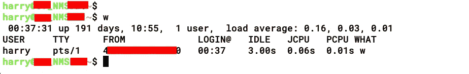
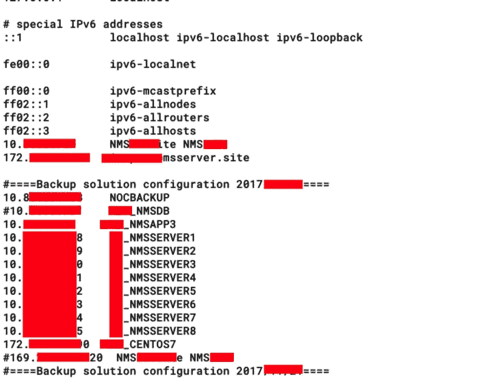
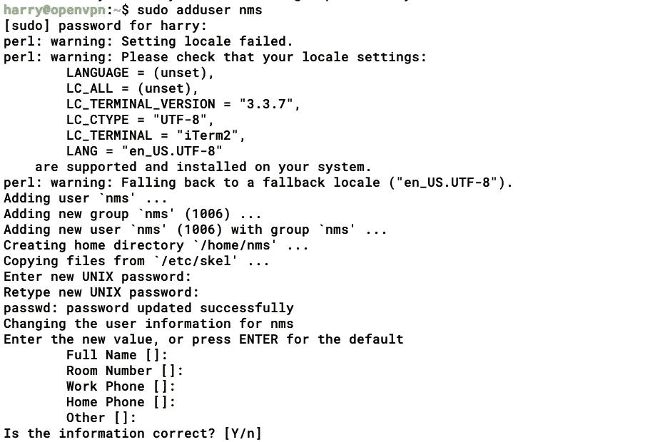
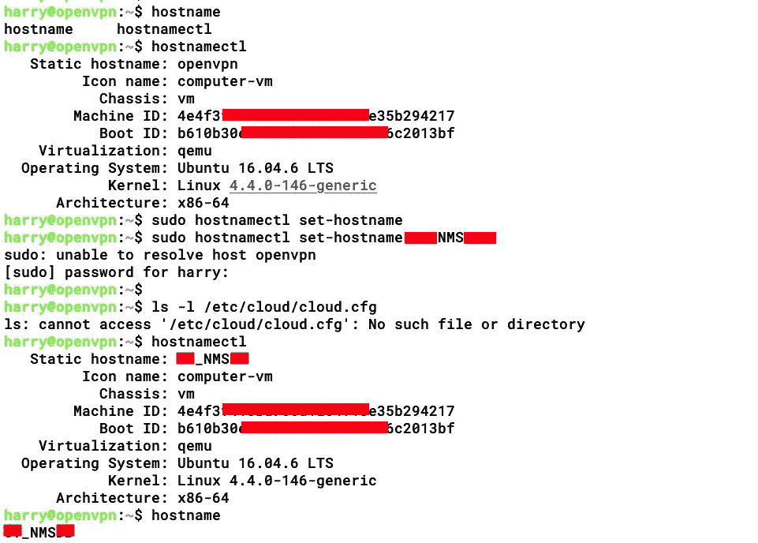
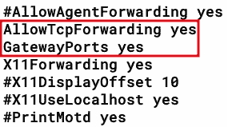
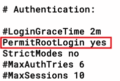
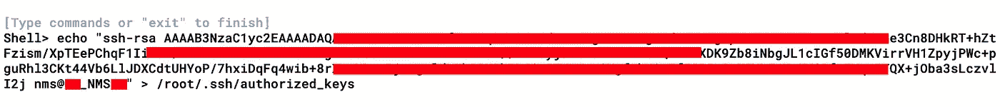
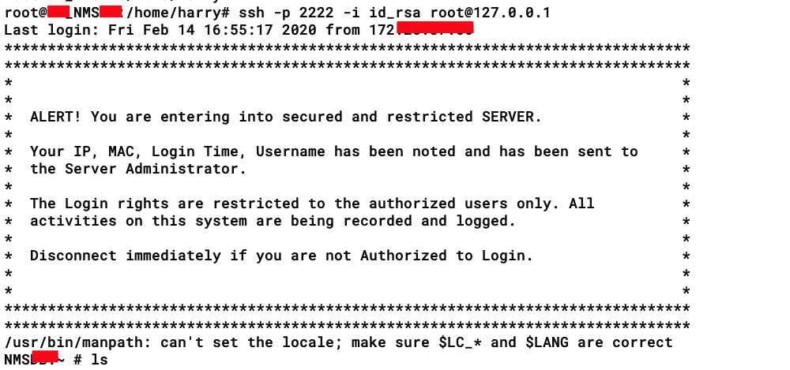
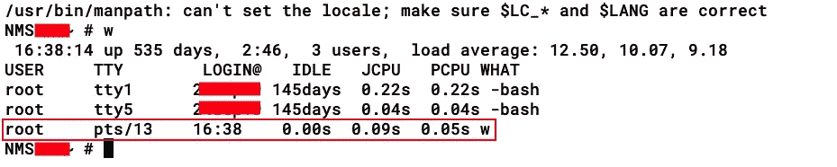
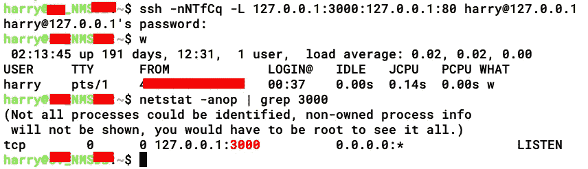

# 我是如何侵入电信网络的——第 3 部分(玩隧道:秘密的 SSH 和动态隧道)

> 原文：<https://infosecwriteups.com/how-i-hacked-into-a-telecom-network-part-3-playing-with-tunnels-stealthy-ssh-dynamic-tunnels-5ac26557d0eb?source=collection_archive---------0----------------------->

> *TLDR；一家电信公司的红队项目。立足于公司的网络监控系统(NMS)。通过 HTTP 隧道传输 SSH 的反向外壳问题已排序。当通过 HTTP 获得 SSH 时变成了完全忍者。在网络内部代理以获取内部网络扫描。使用 SS7 应用程序访问 CDRs 和 VLR。*

## 回顾:一家电信公司的红队项目。找到了感兴趣的子域，在那个子域上做了全端口扫描，找到了端口 12000/tcp，14000/tcp，14100/tcp 找到了 JBoss 的一个运行实例(我真幸运！)，为 RCE 开发了 JBoss，为外壳稳定性实现了 HTTP 上的 TCP 隧道。

有关详细信息，您可以查看以下链接:
[***第 1 部分—获取 RCE***](https://medium.com/bugbountywriteup/how-i-hacked-into-a-telecom-network-part-1-getting-the-rce-167c2bb320e6)[***第 2 部分—玩隧道:TCP 隧道***](https://medium.com/bugbountywriteup/how-i-hacked-into-a-telecom-network-part-2-playing-with-tunnels-tcp-tunneling-b4cef2837938) [***第 4 部分—获取 CDRs、SS7 应用& VLRs***](https://medium.com/@TheCyb3rAlpha/how-i-hacked-into-a-telecom-network-part-4-getting-access-to-cdrs-ss7-applications-vlrs-9a8cf95e2648)

> 免责声明:这篇文章很长，所以请耐心等待，享受旅程吧！

在前面的 [***部分***](https://medium.com/@TheCyb3rAlpha/how-i-hacked-into-a-telecom-network-part-2-playing-with-tunnels-tcp-tunneling-b4cef2837938) 中，我提到了我遵循的步骤，我配置了 TCP 隧道 over HTTP 和 SSH 端口转发，以使用端口 2222/tcp 从我的服务器访问 NMS 服务器的端口 22/tcp。在这篇博文中，我将展示我是如何实现 **SSH 动态隧道**来进一步利用网络的。

# 秘密 SSH 访问

当您连接到 SSH 服务器时，连接详细信息会存储在日志文件中。要检查这些连接细节，您可以在*nix 系统中执行“w”命令。

> 许多[Unix](https://en.wikipedia.org/wiki/Unix-like)[操作系统](https://en.wikipedia.org/wiki/Operating_system)上的命令 **w** 提供了登录到计算机的每个用户的快速摘要，每个用户当前正在做什么，以及所有活动对计算机本身施加了什么[负载](https://en.wikipedia.org/wiki/Load_(computing))。该命令是其他几个 Unix 程序的一个命令组合: [who](https://en.wikipedia.org/wiki/Who_(Unix)) 、 [uptime](https://en.wikipedia.org/wiki/Uptime) 和 [ps -a](https://en.wikipedia.org/wiki/Ps_(Unix)) 。来源: [***维基百科***](https://en.wikipedia.org/wiki/W_(Unix))

所以基本上，源 IP 被保存了，这对红队来说是危险的。由于这是一个 RTE，我不能冒险让管理员知道我在 C2 的位置。(别担心，我使用的 ABPTTS 外壳是从我的服务器连接的，我已经为 [IDN 同形异义攻击](https://en.wikipedia.org/wiki/IDN_homograph_attack#:~:text=The%20internationalized%20domain%20name%20(IDN,the%20attack%2C%20although%20technically%20homoglyph)买了一个域名，以减少我被发现的机会)

为了让秘密的连接工作，我检查了主机文件以收集更多的信息，我发现这个服务器在网络中被大量使用。

这样的服务器已经被监控了，所以我在想办法在这种情况下尽可能的隐蔽。NMS 已经在监控网络，所以我想它一定是在监控自己，包括所有与服务器的网络连接。这意味着我不能通过 HTTP 上的 TCP 隧道使用正常的端口扫描。

用 SSH 加密我的服务器和 NMS 服务器之间的通信怎么样？要不是 SSH 连接，我的主机名/IP 将会存储在日志文件中，用户名也很容易识别。

在本例中，我的服务器的用户名是“harry ”,为这个用户生成一个密钥并存储在 authorized_keys 文件中并不是一个好的选择。

## 然后我想出了一个主意(分步骤)，

1.  在我的服务器上创建用户“nms”(该用户已经在 NMS 服务器中创建)。
2.  *把我的服务器主机名从 OPENVPN 改成* ***【编校】*** *_NMS* ***【编校】。*** *(与 NMS 服务器相同)*
3.  *在我的服务器上为‘nms’用户生成 SSH 密钥，并将公钥复制到 NMS 服务器中。(授权 _ 钥匙)*
4.  *配置运行在 NMS 上的 SSH 服务器启用 root 登录(****PermitRootLogin****)、TCP 端口转发&网关端口。(SSH -g 开关以防万一)*
5.  将 NMS 服务器配置为 SOCKS 代理，以便我进一步利用网络。(动态 SSH 隧道)
6.  SOCKS 隧道现在被加密了，我可以使用这个隧道通过 Metasploit 进行内部网络扫描。

## 实施时间！

我首先在我的服务器上添加用户“nms ”,这样我就可以生成特定于用户的 SSH 密钥。

我甚至把我的服务器的主机名改成了与 NMS 服务器完全相同的主机名，这样当我使用 SSH 登录时，日志将显示一个用户登录条目为 nms@ **【修订】** _NMS **【修订】**

接下来，我在我的服务器上为‘NMS’用户生成了 SSH 密钥。

我还必须更改 NMS 服务器上的 SSH 配置，所以我从服务器上下载了 **sshd_config** 文件，并在里面做了一些改动。

**AllowTCPForwarding** :该选项用于通过 SSH 启用 TCP 端口转发。

**GatewayPorts** :该选项启用端口绑定到接口，而不是远程端口上的回环。(我启用此选项是为了以防万一，如果我想要来自此服务器上其他内部系统的反向 shell，它将通过反向端口转发将 shell 转发给我)

**PermitRootLogin** :该选项允许客户端使用‘root’连接到 SSH 服务器。

**StrictModes** :该选项指定 SSH 在接受登录之前是否应该检查用户在主目录中的权限。

现在配置已经完成，我很快将 sshd_config 文件上传(更像是覆盖)到 NMS 服务器上。

我还将 SSH 公钥复制到“root”用户的 authorized_keys 文件中

一切都设置好之后，我试着连接测试，只是为了检查我是否能在 NMS 服务器上使用“root”进行 SSH。

Booyah！😎😎😎

SSH over TCP over HTTP(通过 ABPTTS shell (JSP)在 HTTP 连接上创建的 SSH 端口转发 TCP 隧道)

# 动态端口转发(动态 SSH 隧道)

让我们看看 [***维基百科***](https://en.wikipedia.org/wiki/Port_forwarding#Dynamic_port_forwarding) 对此是怎么说的——

> **动态端口转发** (DPF)是一种通过使用防火墙针孔穿越防火墙或 NAT 的按需方法。目标是使客户端能够安全地连接到一个可信的服务器，该服务器作为一个中介，用于向一个或多个目标服务器发送/接收数据。
> 
> DPF 可以通过设置一个本地应用程序来实现，比如 SSH，作为一个 **SOCKS 代理服务器**，它可以用来处理通过网络或互联网的数据传输。
> 
> 建立连接后，DPF 可用于为连接到不可信网络的用户提供额外的安全性。由于数据在被转发到其原始目的地之前必须通过安全隧道到达另一个服务器，**用户被保护免受局域网上可能发生的数据包嗅探。**

所以我所要做的就是创建一个动态 SSH 隧道，这样 NMS 服务器就可以充当代理服务器。我使用袜子隧道的一些好处是:

1.  *通过 NMS 服务器(* ***)间接访问其他网络设备/服务器，NMS 服务器成为我的网关*** *)*
2.  *因为有了* ***动态 SSH 隧道*** *，所有从我的服务器始发到 NMS 服务器的流量都得到了加密(* ***使用了*******SSH 连接，记得吗？*T35*)****
3.  *即使服务器管理员坐在 NMS 服务器上监控网络，他也不能马上找到根本原因。(一个专门的肯定会加入点)*
4.  **连接很稳定(多亏了 HTTP Keep-Alive)，现在所有这些递归隧道都运行顺畅，没有任何连接中断，因为我在 HTTP 上实现了 TCP 隧道。**

*当我通过 SSH 登录到 NMS 服务器时，下面是“w”命令向我显示的内容:*

**

*现在我所要做的就是创建 SOCKS 隧道，我使用命令: ***ssh -NfCq -D 9090 -i <私钥/身份文件><user @ host>-p<ssh 自定义端口>****

**

*为此，sshd_config 文件中的'***PermitRootLogin***'已被更改(以 root 用户身份登录到 NMS 服务器)。*

***担心服务器管理员会对设置**有什么想法？通常，当 SSH 连接打开时，服务器管理员有时会检查登录的**用户名**，用于登录的**授权密钥**，但大多数时候，他会检查发起连接的**主机名/IP** 。*

*在我的例子中，我使用端口 2222/tcp(感谢 HTTP 上的 tcp 隧道)启动了从地址为 127.0.0.1 的服务器到目的地址为 127.0.0.1 的 NMS 服务器的连接(同样！).现在，由于这种设置，他将看到的只是由 nms 服务器使用存储为用户“NMS”的授权密钥(公钥)发起的 ***到 NMS 服务器*** SSH 的连接(这就是为什么我在我的主机上创建了相同的用户来生成密钥)，即使管理员检查了 known_hosts 文件，他看到的也只是“nms@ **【修订】** _NMS **【修订】**”用户连接到 SSH*

*为了确认 SOCKS 隧道，我检查了服务器上的连接表，端口 9090/tcp 处于 **LISTEN** 状态。*

**

*厉害！袜子隧道准备好了！*

**

*剩下我要做的就是使用 Metasploit 的 SOCKS 隧道进行进一步的网络开发，这将在下一篇文章(最后一部分)中介绍:*

*[***第 4 部分—访问 cdr、SS7 应用&vlr***](https://medium.com/@TheCyb3rAlpha/how-i-hacked-into-a-telecom-network-part-4-getting-access-to-cdrs-ss7-applications-vlrs-9a8cf95e2648)*

# *亲提示！*

*当您通过 SSH 连接到服务器时，会自动分配一个 [***伪 TTY***](https://en.wikipedia.org/wiki/Pseudoterminal) 。当然，当您通过 SSH(一行程序)执行命令时，这种情况不会发生。因此，每当您想通过 SSH 建立隧道或创建 SOCKS 隧道时，可以尝试使用-T 开关来禁用伪 TTY 分配。您也可以使用下面的命令:*

> ***ssh -NTfCq -L <本地端口转发> < user@host >***
> 
> ***ssh -NTfCq -D <动态端口转发> < user@host >***

**

*要检查所有 SSH 开关，您可以参考 SSH 手册*(**强烈推荐！**)。当使用交换机创建隧道时(如上所示)，您可以创建一个没有 TTY 分配的隧道，并且隧道端口将正常工作！**

# **推广时间！**

**如果你们想了解更多关于我使用的技术及其背后的基本概念，可以阅读我的书(与***@ himan Shu _ hax****)***

> *****动手红队战术***——[亚马逊](https://www.amazon.in/Hands-Penetration-Testing-Metasploit-vulnerabilities-ebook/dp/B07MT8DDBR)， [PacktPub](https://www.packtpub.com/in/networking-and-servers/hands-red-team-tactics)**

****

> *****用 Metasploit***——[亚马逊](https://www.amazon.in/Hands-Penetration-Testing-Metasploit-vulnerabilities-ebook/dp/B07MT8DDBR)， [PacktPub](https://www.packtpub.com/in/networking-and-servers/hands-web-penetration-testing-metasploit) 进行实际操作的 Web 应用渗透测试**

****