# 我是如何侵入电信网络的——第四部分(访问 cdr、SS7 应用程序和 vlr)

> 原文：<https://infosecwriteups.com/how-i-hacked-into-a-telecom-network-part-4-getting-access-to-cdrs-ss7-applications-vlrs-9a8cf95e2648?source=collection_archive---------0----------------------->

> *TLDR；一家电信公司的红队项目。在公司的网络监控系统(NMS)上获得了立足点。通过 HTTP 隧道传输 SSH 的反向外壳问题已排序。当通过 HTTP 获得 SSH 时变成了完全忍者。在网络内部代理以获取内部网络扫描。使用 SS7 应用程序访问 CDRs 和 VLR。*

## 回顾:一家电信公司的红队项目。找到了感兴趣的子域，在那个子域上做了全端口扫描，找到了端口 12000/tcp，14000/tcp，14100/tcp 找到了 JBoss 的一个运行实例(我真幸运！)，为 RCE 开发了 JBoss，为外壳稳定性实现了 HTTP 上的 TCP 隧道。

详细信息可以查看
[***第一部分—获取 RCE***](https://medium.com/bugbountywriteup/how-i-hacked-into-a-telecom-network-part-1-getting-the-rce-167c2bb320e6)[***第二部分—玩转隧道:TCP 隧道***](https://medium.com/bugbountywriteup/how-i-hacked-into-a-telecom-network-part-2-playing-with-tunnels-tcp-tunneling-b4cef2837938) [***第三部分—玩转隧道:隐身 SSH &动态 SSH 隧道***](https://medium.com/bugbountywriteup/how-i-hacked-into-a-telecom-network-part-3-playing-with-tunnels-stealthy-ssh-dynamic-tunnels-5ac26557d0eb)

在前面的 [***部分***](https://medium.com/@TheCyb3rAlpha/how-i-hacked-into-a-telecom-network-part-3-playing-with-tunnels-stealthy-ssh-dynamic-tunnels-5ac26557d0eb)***(***[***玩隧道:隐身 SSH &动态 SSH 隧道***](https://medium.com/bugbountywriteup/how-i-hacked-into-a-telecom-network-part-3-playing-with-tunnels-stealthy-ssh-dynamic-tunnels-5ac26557d0eb)***)***中，我提到了使用端口 2222/tcp 从我的服务器创建具有隐身 SSH 访问的 SSH 隧道的步骤。在这篇博文中，我将展示如何使用 SOCKS 隧道进行内部网络侦察，并利用内部服务器来访问存储在服务器中的 cdr。

# 态势感知(内部网络)

在参与过程中，我能够通过 HTTP 上的 TCP 隧道创建一个动态的 SSH 隧道，相信我，这个 shell 非常棒！

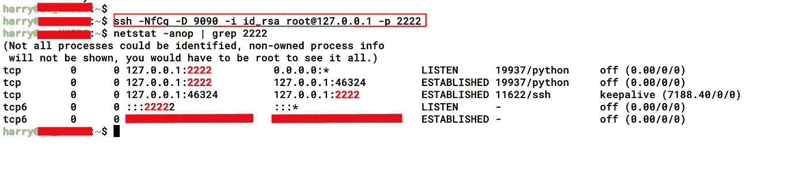

接下来，我通过端口 9090/tcp 配置了 SOCKS 隧道，然后为 NMap 扫描连接了 proxychains。

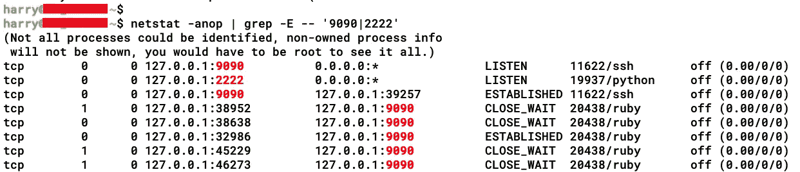

虽然我更喜欢 Metasploit 而不是 NMap，因为它提供了更多的扫描范围，并且我能够使用它轻松地管理内部 IP 扫描。为了使用所有模块的代理，我使用了"**setg Proxies socks 4:127 . 0 . 0 . 1:9090 "**命令(全局设置代理选项)。我寻找内部网络服务器，所以我使用了**辅助/扫描仪/http/http_version** 模块。

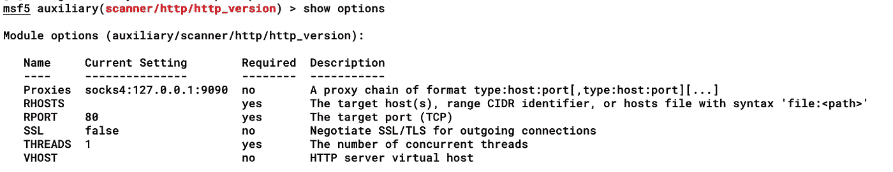

因为 setg，代理选项已经设置好了，现在我需要做的就是给出 IP 子网范围并运行模块。

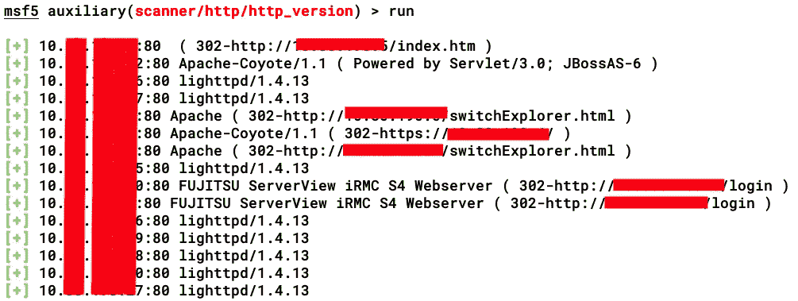

我找到了一些远程管理控制器(iRMC)、一些 SAN 交换机(switchExplorer.html)和一个 JBoss 实例…

还有一个内部使用的 JBoss 实例？🤣

# 利用内部网络服务

因此，在内部 IP 10.x.x.x 上的端口 80/tcp 上运行了另一个 JBoss 实例。因此，我所要做的就是使用 proxychains 并在内部 IP 上再次运行 JexBoss(我也可以在 JexBoss 中使用-P 开关来提供代理地址)。

这对我来说是轻而易举的胜利，因为运行的内部 JBoss 服务器也容易受到攻击，因此，我能够将 RCE 从我的 pivotal 机器(最初的落脚点机器)转移到下一个内部 JBoss 服务器😎

**牛逼！**现在，当我得到 shell 时，我使用下面的命令以结构化的方式列出了/home/ <用户>位置下的所有文件和目录:

***cd /home/ <用户> |查找。-打印| sed-e " s；[^/]*/;|_ _ _ _;g；s；_ _ _ _|;|;g" 2 > & 1***

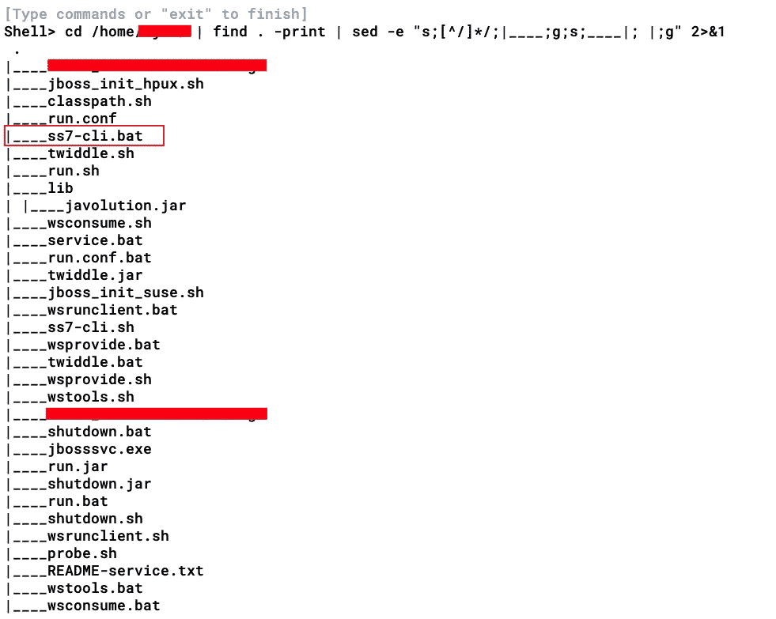

在输出中，我发现了一个有趣的。bat 文件— **ss7-cli.bat** (该脚本配置 ss7 管理外壳引导环境)

在同一内部 JBoss 服务器中，还存储了一个 [**访问者位置寄存器(VLR)**](https://en.wikipedia.org/wiki/Network_switching_subsystem#Visitor_location_register_(VLR)) 控制台客户端应用程序，以从数据库中访问 VLR 信息。

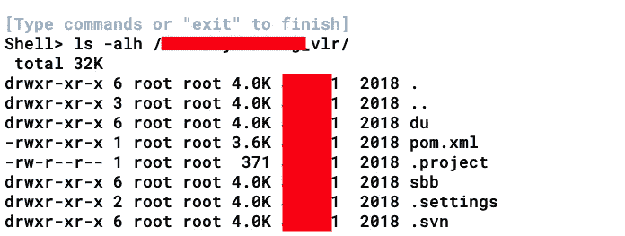

## 什么是 SS7？

> **信令系统№7** ( **SS7** )是 1975 年开发的一套[电话](https://en.wikipedia.org/wiki/Telephony) [信令](https://en.wikipedia.org/wiki/Signaling_(telecommunications))协议，用于在全球[公共交换电话网](https://en.wikipedia.org/wiki/Public_switched_telephone_network) (PSTN)的大部分地区建立和[拆除](https://en.wikipedia.org/wiki/Clearing_(telecommunications))电话呼叫。该协议还执行号码转换、[本地号码可移植性](https://en.wikipedia.org/wiki/Local_number_portability)、预付费计费、[短消息服务](https://en.wikipedia.org/wiki/Short_Message_Service) (SMS)和其他服务。来源:[维基百科](https://en.wikipedia.org/wiki/Signalling_System_No._7)

为了监控 SS7/ISDN 链路，解码协议标准并生成 cdr 用于计费，需要一个控制台客户端与系统交互。

> 你可能会问为什么 JBoss 上运行着 SS7 客户端应用程序？一个词——“移动”

## 流动人口

> Mobicents 是一个用 Java 编写的开源 VoIP 平台，用于帮助创建、部署、管理服务和应用程序，这些服务和应用程序集成了一系列 IP 和传统通信网络中的语音、视频和数据。来源:[维基百科](https://en.wikipedia.org/wiki/Mobicents)
> 
> 移动内容支持服务构建模块(SBB)的组合，例如**呼叫控制、计费、用户供应、管理和在线状态敏感特性**。这使得移动服务器成为电信运营支持系统(OSS)和**网络管理系统(NMS)** 的轻松选择。来源:[design.jboss.org](https://design.jboss.org/mobicents/html/faq.html)

因此，看起来内部 JBoss 服务器正在运行一个 VoIP 网关应用程序( [SIP 服务器](https://en.wikipedia.org/wiki/Session_Initiation_Protocol))，该应用程序使用 **SS7** 与 [**公共交换电话网(PSTN)**](https://en.wikipedia.org/wiki/Public_switched_telephone_network) 进行交互。(在没有任何网络体系结构图的情况下，了解内部网络结构是很累的)

# 超越

当在运行 VoIP 网关的内部 JBoss 应用程序中做更多的调查时，我发现有一些内部网关服务器、CDR 备份数据库、存储 SS7 和 USSD 协议备份配置的 FTP 服务器等。(感谢 **/etc/hosts** )

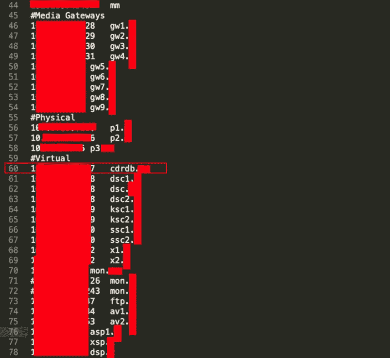

从 hosts 文件中，我发现了许多 FTP 服务器，起初我并不觉得它们很重要，但后来我发现了 CDR-S 和 CDR-L FTP 服务器。这些服务器分别存储着备份的 [**CDR S 记录**](https://downloads.avaya.com/css/P8/documents/100096784) 和 [**CDR** **L 记录**](https://downloads.avaya.com/css/P8/documents/100096784) 。

> 你可以从[这里](https://downloads.avaya.com/css/P8/documents/100096784):**CDR S-Records:Page 157**&**CDR L-Records:Page 168**

使用 Metasploit，我快速扫描了这些 FTP 服务器并检查了它们的认证状态。

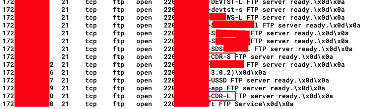

无需任何认证就可以访问 FTP 服务器🤣🤣

也许 FTP 服务器是供 VoIP 应用程序或其他东西内部使用的，但是胜利就是胜利！

因此，我能够获得几乎所有移动用户的以 XLS 格式存储的 **CDR 备份**。(抱歉，我不得不编辑了很多，因为这些信息非常重要)

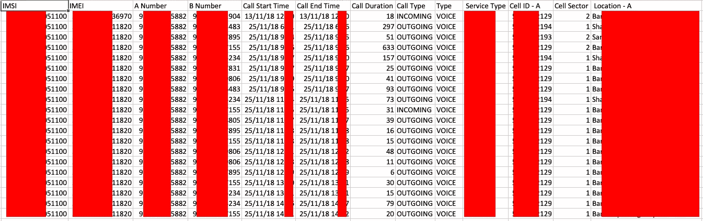

从截图来看， **A 号码**是发起呼叫的地方(呼叫者)，而 **B 号码**是被拨的号码。CDR 记录还包括 **IMSI & IMEI 号码、呼叫开始/结束日期&时间戳、呼叫持续时间、呼叫类型**(呼入或呼出)、**服务类型**(电信服务公司)、**蜂窝 ID-A** (发起呼叫的蜂窝塔)和**位置-A** (呼叫者的位置)

一旦我们的团队通知客户我们可以访问 CDR 备份服务器，客户就要求我们结束在那里的工作。我想他们承受不了🤣

我希望你们喜欢它！

# 推广时间！

如果你们想了解更多关于我使用的技术及其背后的基本概念，可以阅读我的书(与***@ himan Shu _ hax****)*

> ***动手红队战术****——*[*亚马逊*](https://www.amazon.in/Hands-Penetration-Testing-Metasploit-vulnerabilities-ebook/dp/B07MT8DDBR) *，*[*PacktPub*](https://www.packtpub.com/in/networking-and-servers/hands-red-team-tactics)

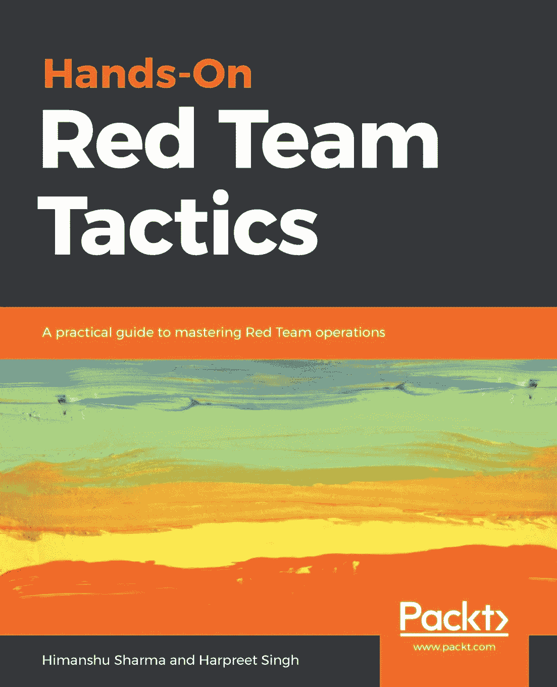

> ***用 Metasploit****—*[*亚马逊*](https://www.amazon.in/Hands-Penetration-Testing-Metasploit-vulnerabilities-ebook/dp/B07MT8DDBR) *、*[*PacktPub*](https://www.packtpub.com/in/networking-and-servers/hands-web-penetration-testing-metasploit)

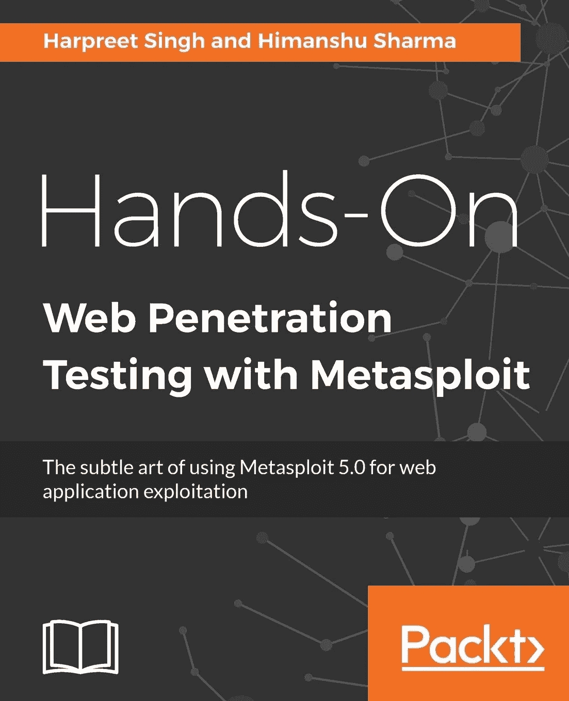