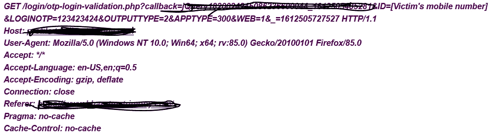

# 我是如何黑进印度最大的婚姻网站并赢得价值 10K 卢比的亚马逊礼品卡的。

> 原文：<https://infosecwriteups.com/how-i-hacked-into-indias-top-matrimonial-website-and-earned-amazon-gift-card-worth-10k-inr-2a0b376219fa?source=collection_archive---------0----------------------->

嘿朋友们，

希望你们都平安无事。

不知道为什么在我结婚后，我的婚姻档案突然收到了更多的请求。我不想删除我的帐户，因为浏览漂亮女孩的个人资料似乎真的很有趣(免责声明:当你的妻子在附近时，不要在家里尝试这一点)。

有一天，下班后我很累(我是做开发的)。像往常一样，我们前一天的 bug 修复发布在我们的应用程序中引入了一些有趣的新 bug，我必须做一些紧急的数据支持来修复它。我决定在睡觉前学习一些新的话题，因为我们的经理要求我获取一些新技术的知识。于是我打开 YouTube，开始学习。直到凌晨 2:30，我才意识到我看了一个名为“嘿！看我的红猫在我的光头上撒尿”。嘘！！我开始看一个科技视频，然后想到我是怎么来到^_^的。

总之，我检查了我的电子邮件，发现了一些婚姻网站的通知。我以前用他们的安卓应用程序查看个人资料，所以忘记了密码。当我点击忘记密码选项时，网站要求我输入我注册的手机号码中收到的 OTP。很好！我是 OTP 暴力破解的忠实粉丝。我决定试一试。我输入了错误的 OTP，并重新发送了 20 多次请求。我注意到尝试无效的 OTP 号码没有限制。于是我打开了打嗝套件，将请求转发给打嗝入侵者。使用 Burp 入侵者，你可以标记一个输入，并提供一组有效载荷。一旦您开始攻击，burp 将通过替换每个请求中标记的输入中的有效负载，向端点发送连续的请求。因为 OTP 是 6 位数，所以我将有效负载设置为 100000 到 999999。我开始攻击，几分钟后，我开始得到以 500(内部服务器服务器)为代码的响应。我暂停打嗝，尝试在浏览器中访问网站。当我看到网站关闭时，我想逃跑。我开始恐慌。我突然关掉笔记本电脑，睡着了。目标没有虫子奖励计划，所以你知道做这种事情是违法的。我打开了他们的 android 应用程序，但也不起作用。我开始想象自己被警察逮捕，每个人都在笑，因为我黑了一个婚姻网站。Sh*t 我应该改黑一些银行网站:(。这就是为什么聪明人说“永远不要跟在漂亮女孩后面”。我决定一旦服务器启动，我就删除我的婚姻账户。我不知怎么睡着了。

当我早上醒来的时候，我首先浏览网站。哇哦。！它现在正在工作。一切恢复正常。目前还没有国际网络罪犯因入侵婚恋网站而被捕的消息。

好吧，我是一个勇敢的人，今天是星期六。所以我决定再次检查攻击。这一次我决定降低请求/秒的速率。我尊重服务器。但是我没有从‘100000’开始有效载荷，而是意外地给了起始有效载荷 0。所以有效载荷范围是从 0 到 999999。当攻击开始时，我发现了一些有趣的事情。OTP 值为 0 的第一个请求给出了一些不同的响应。查看回复时，我很惊讶。响应中包含了一个我的加密密码的链接！！！所以，如果我点击这个链接，我将毫无困难地被重定向到我帐户。我知道我的朋友也在使用同样的应用程序。我在忘记密码请求中输入了他的手机号码和 0 作为 otp。瞧啊。！我收到了他的加密密码链接。所以我可以在不知道密码的情况下黑进任何人的账户。但我需要知道他们的手机号码，对吗？再次检查请求后，我发现我可以在请求中提供手机号码/matrimonyid/电子邮件。请求如下

因此，我可以登录任何帐户，只需在 ID 字段中输入他们的手机号码/matrimonyID/email-address，并在 loginOTP 字段中输入 0。

我立即向他们的客户支持报告了这个问题。我知道没有针对他们的 bug 奖励计划，但是由于这是一个高影响的 bug，我认为应该报告。他们的客户支持团队没有首先理解影响。后来我有机会联系他们的一位技术经理。他们立即修复了 bug。尽管他们没有官方的 bug 奖励计划，但考虑到影响，他们奖励了我价值 10000 卢比的亚马逊礼品卡。