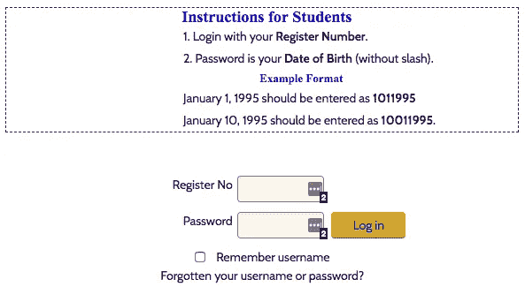
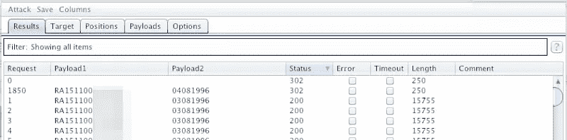
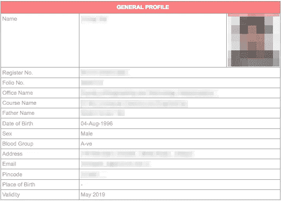

# 我是如何黑进一所大学的数据库的！

> 原文：<https://infosecwriteups.com/how-i-hacked-into-my-colleges-database-64eb5995e49c?source=collection_archive---------0----------------------->

> 本文正在重新发布，最初发布于 2018 年 4 月 13 日。

十几岁的时候，我曾听到电脑虫们自豪地宣称他们是如何侵入大学数据库的。他们是如何获得所有朋友和大学恋人的数据的。我总是感到惊讶，并习惯于向他们寻求指导，告诉他们如何做到这一点，但大多数时候，他们不会对像我这样的青少年做出回应。我从未放弃，并继续阅读和学习各种技术、编程语言、软件和工具，在这里我写这篇博客，讲述我是如何进入一所大学的数据库的。

# 伟大的想法

那么，我最初是怎么有这个想法的呢？大多数学院都有这样的政策，在学院成立之初，他们指定学生的用户名和密码来登录一个在线门户网站，该门户网站上有他们的数据，如他们的姓名、注册号、父母的姓名、电话号码、社会保险号(Aadhaar number)等。

问题是分配给他们的用户名是他们的大学注册号，密码是他们的出生日期，大多数情况下，这些学生根本不会更改他们的登录凭据，一旦他们在注册时从他们的大学获得凭据。

登录门户

# 破解黑客

虽然我很无聊，但我想让我们试试字典攻击。为此，我必须首先检查大学网站是否真的足够弱，允许我对其登录页面进行字典攻击。所以，我打开我的打嗝套件，打开了拦截器。我访问了该学院的登录页面，为了验证这一点，我创建了随机有效载荷，在最后一页给出了总共 1000 个登录凭据的排列，以便检查它是否运行良好。我开始进攻，一分钟后瞧！Burp Suite 突出显示了我的凭据，因为状态显示为 302。

这样我就知道字典攻击没有被学院的 id 或 IP 阻止(怀疑他们甚至有一个)，我想让我们列出所有注册号和这些注册号的所有可能的出生日期。那你是怎么发现的呢？现在假设你的大学给了你一个注册号，试着分解一下。

REG1511080123

*   15 是他们上大学的那一年，这可以告诉我们他们的出生年份大约是+1 或-1 年
*   11 表示他们可能选择了工程、艺术或其他分支
*   08 是他们可能采取的分支，如 cse 或 it 或 swe 等。
*   0123 是该分支机构的唯一标识号

所以现在一旦我知道如何创建字典文件，我就为它的分支编写 C++代码并打印字典文件。请记住，他们可能是您所在大学的特殊情况，例如，他们需要在您的密码中在您的 d.o.b .之前附加他们的大学名称，因此请相应地编写代码，或者编写一个通用代码并将其粘贴到文本编辑器中，然后使用“查找和替换”根据您的需要进行更改。

BurpSuite 终端

所以，现在我已经准备好了我的字典文件，总共有 60 万种排列。在我的打嗝套件专家的帮助下，我花了 5 个小时获得了所有大学生的数据，他们每个学期的分数和成绩，尤其是他们的 SSN。

提取的数据

# 道德的

我马上向官员报告了这件事。由于学生和学校两方面的懒惰，这整个黑客攻击是可能的。学生们没有更改他们的默认密码，学校也没有安装一个合适的防火墙，在我尝试了大约 100 次后，这个防火墙应该可以阻止我。

> 我很幸运，但我的确黑进了一所大学的数据库！

如果你喜欢，请鼓掌让我们合作吧。获取、设置、破解！

网址:【aditya12anand.com】T2|捐赠:【paypal.me/aditya12anand】T4

电报:[https://t.me/aditya12anand](https://t.me/aditya12anand)

推特:[twitter.com/aditya12anand](https://twitter.com/aditya12anand?source=post_page---------------------------)

领英:[linkedin.com/in/aditya12anand/](https://www.linkedin.com/in/aditya12anand/?source=post_page---------------------------)

电子邮件:aditya12anand@protonmail.com

> 附言:在我的后续文章中，我会解释我是如何通过一个不同的网站入侵数据库，并绕过验证码过滤器的。一周后发行。