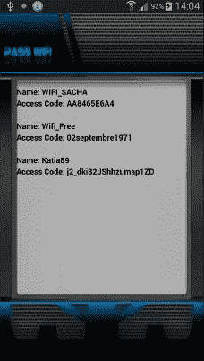
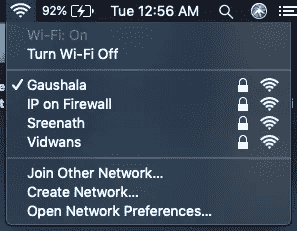
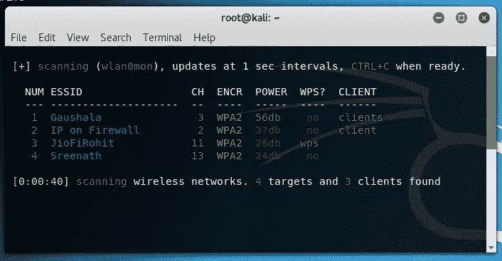
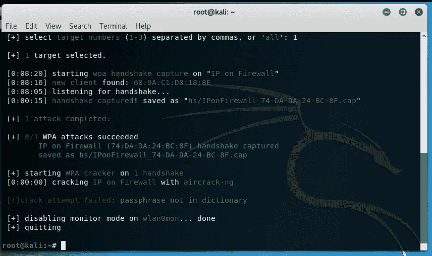
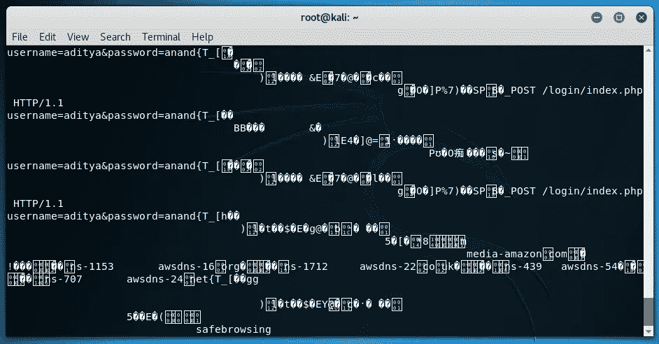
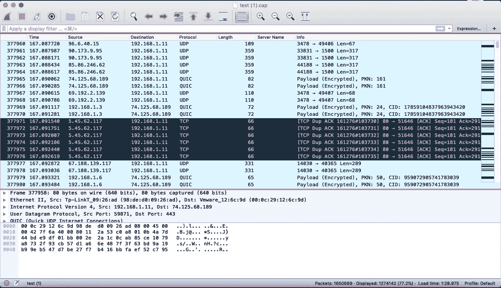

# 我是如何侵入邻居的 WiFi 并获取登录凭证的？

> 原文：<https://infosecwriteups.com/how-i-hacked-into-my-neighbours-wifi-and-harvested-credentials-487fab106bfc?source=collection_archive---------0----------------------->

距离我写上一篇吸引人的文章已经过去将近一周了。

> 我是如何利用 DNS 欺骗捉弄我的朋友的？

从那以后，我一直在玩网络嗅探工具，相信我，当你嗅探网络流量时，会有一种不同的快感。问题是，当你嗅探自己的网络时，这并不有趣，你知道流量会是多少。当你在别人的社交网络上时，乐趣就开始了，那就是刺激开始的时候。您仔细检查每一个 Wireshark 数据包，希望找到登录凭证或某种有价值的东西。就在那时，我决定入侵附近的无线网络，嗅出数据包。

> **赞助帖:**用 PASS WIFI 黑无线网络！

*PASS WIFI 应用帮你黑进无线网络，获取密码。它可以从电脑、平板电脑或智能手机上解码 WEP、WPA、WPA2 以及 WPA3 密码。它非常容易使用，只需打开应用程序扫描可用的网络&一旦这些网络被黑客攻击，他们的密码将显示给你。点击这里下载 PASS WIFI:*[*passwordrevelator.net/en/passwifi.php*](https://www.passwordrevelator.net/en/passwifi.php)

# 我们开始吧！

所以，从黑客开始，首先我必须在附近地区搜索不同的 WiFi 信号，有几个。

WiFi 网络

有一次，我检查 WiFi 网络，然后我打开我的 Kali 机器侵入其中一个网络。我打开终端，输入

> 威菲特

Wifite 是最友好的用户工具之一，你可以用它来入侵 WiFi(这只是我的观点)。弹出如下信息。

WiFi 网络

现在，如果你是一个黑客，那么你已经知道我会尝试侵入哪个网络。是的，“防火墙上的 IP”。我的意思是，如果你把你的 WiFi 命名为防火墙，那就像是让附近的黑客来找你麻烦，所以我选择了它。

WiFite 数据包捕获

一旦选定了目标,“wifite”就运行“防火墙上的 IP”的数据包捕获，它会发现连接到它的主机，并在设备断开连接之前的一段时间内发送去授权数据包。一旦设备断开连接，设备就会尝试重新连接到 WiFi 路由器，在此过程中,“wifite”会以加密形式捕获带有 WiFi 密码的数据包。

现在，一旦捕获文件出现在我面前。我使用 aircrack-ng 对 [rockyou.txt](https://www.scrapmaker.com/download/data/wordlists/dictionaries/rockyou.txt) wordlist 文件运行了它，命令如下。

> aircrack-ng-w rock you . txt-b<bssid><capture file="" name=""></capture></bssid>

我让它最多运行几分钟，当我找到密码时。

空中破解密码

一旦我获得了密码，接下来的事情就是继续嗅出他们的流量，寻找有趣的东西。

# 嗅探数据包

当我弄清楚防火墙上 IP 的密码时，我欣喜若狂。原因是，如果他们没有使用 rockyou.txt 文件中的这么简单的密码，那么整个过程就会陷入困境，我想这是我的幸运日。

一旦我进入网络，我就启动 ettercap(最好的嗅探数据包的工具之一)。我想捕获他们网络上的每一个数据包，所以我打开终端，输入以下命令。

> etter cap-T-M ARP-I eth 0///-w test . cap

(要参考 ettercap 教程，请访问此处: [Ettercap 数据包嗅探](https://www.youtube.com/watch?v=NmYzFuwSAPk))

我一启动 ettercap，就有成千上万的流量在我的终端屏幕上通过。我将其全部保存到 test.cap 中，以便以后可以使用 Wireshark 仔细检查设备上的每个数据包。

如果您想通过 Kali 机器上的流量，那么您可以使用以下命令

> cat test.cap | grep -a

使用上面的命令你可以搜索你想要搜索的关键字，下面的命令给了我下面的输出

> cat test . cap | grep-密码

从 test.cap 文档中捕获

有一次，我把文件转移到我的笔记本电脑上做进一步的检查，我发现了许多其他的登录凭证，这些凭证是在 HTTP 网站上输入的。用户访问的网站和许多其他有趣的信息。

wireshark 上的 test.cap

所以，现在你知道为什么有这么高的关于拦截别人的流量。

# 道德的

从这种黑客攻击中最大的收获是永远不要使用 HTTP 网站，最重要的是永远不要使用你的凭证登录这些网站。您可能永远不知道还有谁可能在嗅探网络，他们会通过查看网络流量来获取您的登录凭证。如果可行的话，那么使用你的 VPN 服务来加密你的流量，无论你在哪里，它们都能为你提供安全保障。所以下次你遇到不是 https 的网站，就赶紧跑，或者非常小心不要泄露任何个人信息。

如果你喜欢，请鼓掌让我们合作。获取、设置、破解！

网址:[aditya12anand.com](https://www.aditya12anand.com/)|捐赠:[paypal.me/aditya12anand](https://paypal.me/aditya12anand)

电报:[https://t.me/aditya12anand](https://t.me/aditya12anand)

推特:[twitter.com/aditya12anand](https://twitter.com/aditya12anand?source=post_page---------------------------)

领英:【linkedin.com/in/aditya12anand/ 

电子邮件:aditya12anand@protonmail.com