# 我是如何黑进印度最大的网上书店之一(RCE 和更多)

> 原文：<https://infosecwriteups.com/how-i-hacked-into-one-of-indias-biggest-online-book-stores-rce-and-more-887ef6460935?source=collection_archive---------0----------------------->

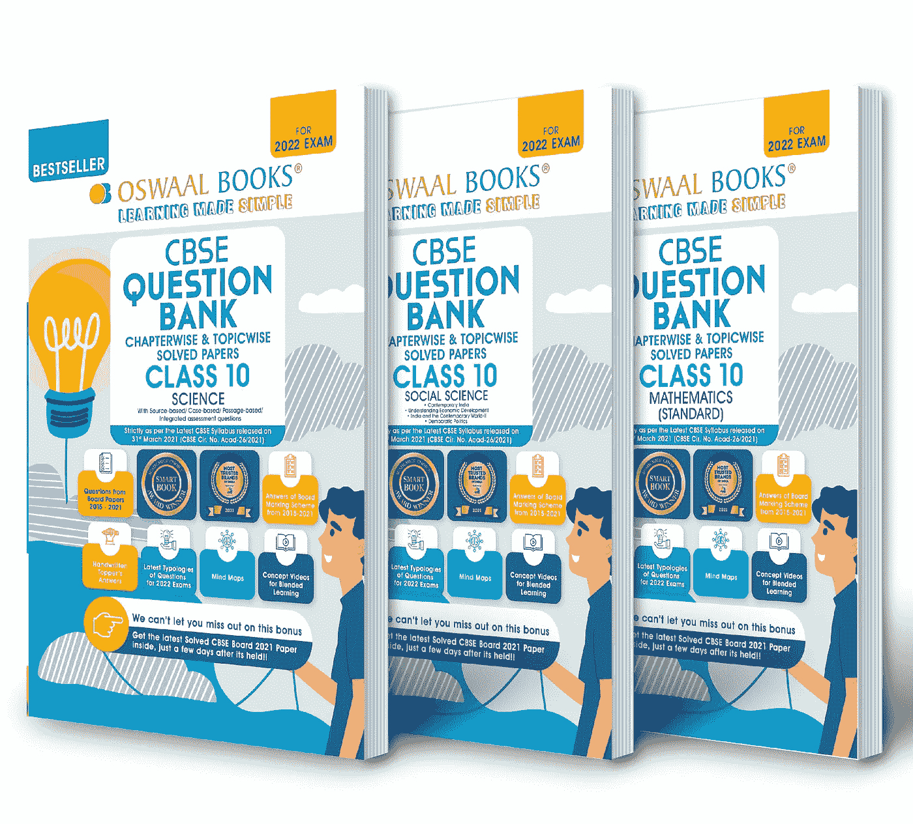

Oswaal Books(oswaalbooks.com)

这篇文章将讲述我是如何在印度最大的电子商务网站之一找到我的第一个 RCE 的。

Oswaal Books 是一家非常受欢迎的公司，在印度的高中生和像 JEE、NEET 等竞争考试的学生中很受欢迎。他们制作指南、样卷、题库等。故事从一个简单的 XSS 臭虫开始。有一天，当我试图登录我的帐户时，我不小心输入了错误的密码，它显示了一条错误信息，说密码无效。我注意到的奇怪的事情是，错误消息与 URL 中给' errmsg '参数的输入相同。

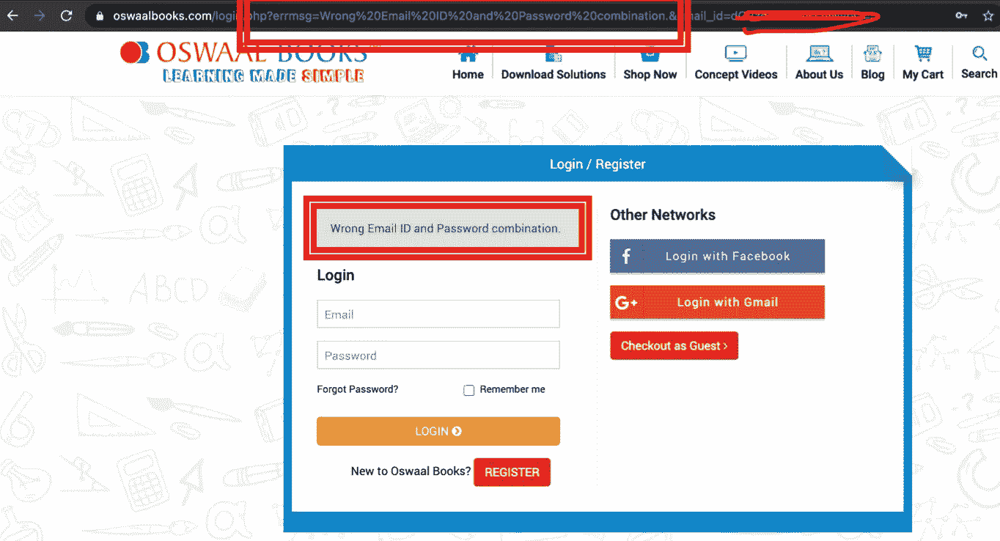

对于那些刚刚读过《网络黑客手册》中 XSS 章节前几页的人来说，他们知道该怎么做。我只是用我的 XSS 有效载荷替换了错误消息，并发现了另一个 XSS 错误。

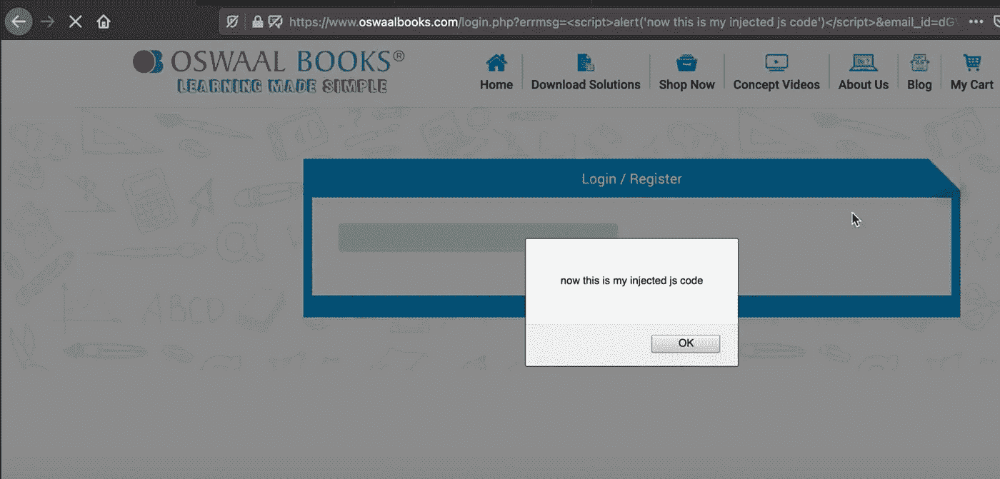

几个月后，当我再次在网站上闲逛时，我决定回到这里。这个错误现在已经修复，我编辑了我的个人资料，看到有一个成功的消息，但这也是来自“errmsg”参数。在这里做了 XSS 测试，得到了一个。我意识到“errmsg”参数在很多地方都有使用。我在域上运行了 waybackurls，过滤了所有带有“errmsg”参数的查询。

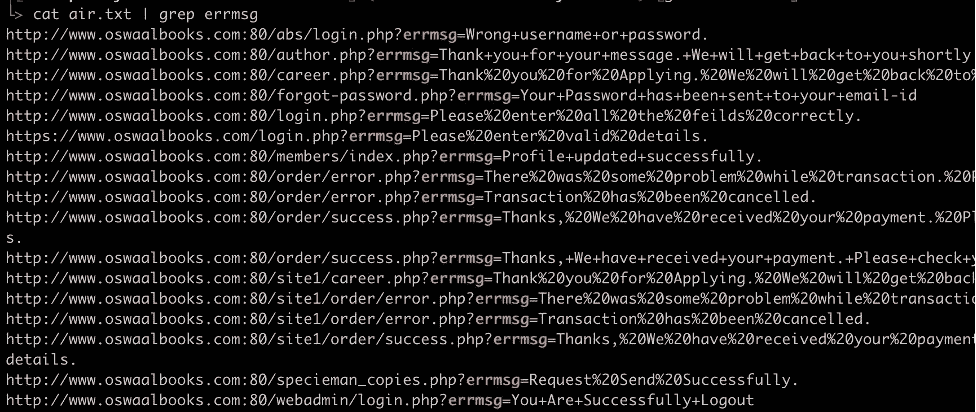

如果你仔细观察这些链接，你会发现我不仅发现了多个易受 XSS 攻击的链接，我还发现了一个秘密登录页面，这是我使用目录暴力无法找到的(URL 1)。

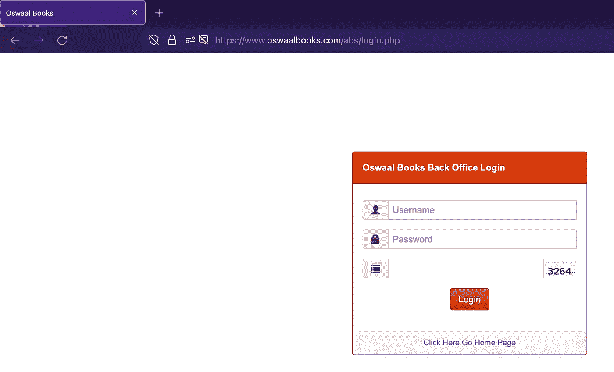

后端管理面板

我非常兴奋地看着这个页面，并尝试了所有基本的教科书方法，如试图绕过验证码(失败)，响应代码操作(失败)，默认凭证(失败)。最后一个选择是尝试 SQLi，但这是一个漫长的尝试，因为它在主网站的任何地方都不工作。我还意识到我只尝试过基于 GET 的 SQLi，所以我决定使用基于 POST 的 SQLi。

```
Try 1:
user = admin’
pass = test
```

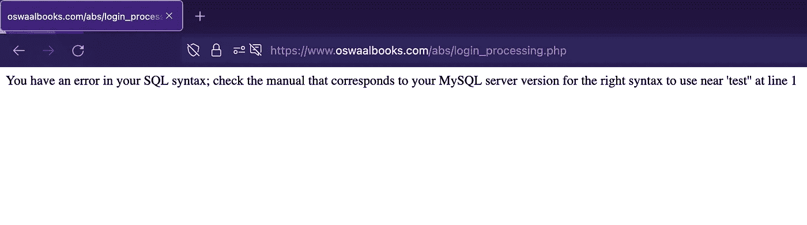

而错误被触发了！

```
Try 2:
user = admin’ OR 1=1 -- 
pass = test
```

还有…..我是网站管理员！！！

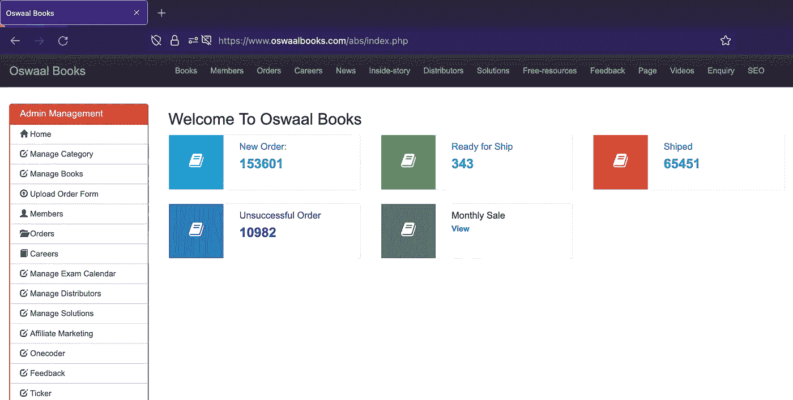

仪表盘

权限:
1)更改密码
2)编辑会员详细信息
3)查看订单并篡改其设置(取消订单、发起退款等)
4)编辑书籍详细信息(甚至价格)
5)编辑博客、新闻等
6)在主站点上查看从门户网站上传的简历。
7)编辑 SEO 设置
8)查看私人客户信息(地址、电话号码等)

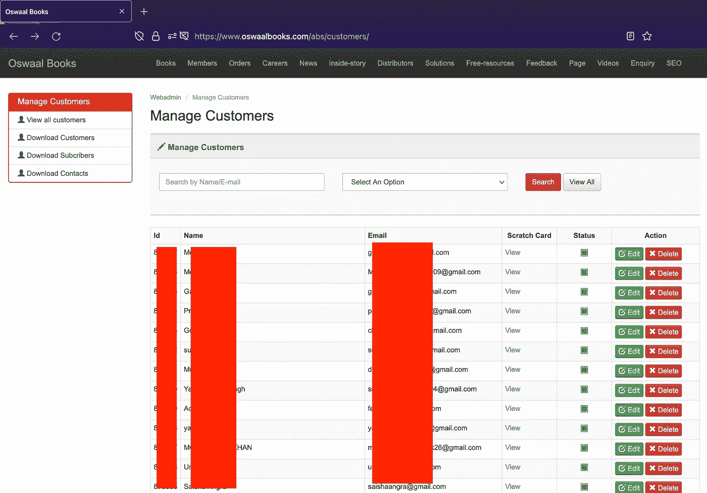

客户详细信息

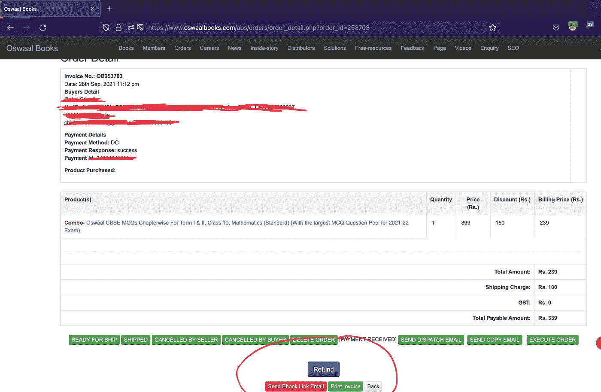

篡改订单的能力

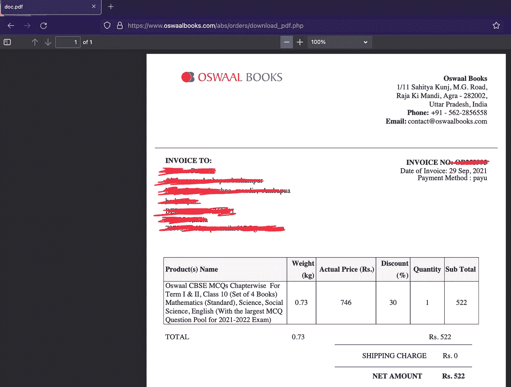

客户发票

继续前进，进入管理面板是可以的，但我想看看我是否能做得更多。有了所有的新功能，我现在有更大的机会去做像 RCE 这样的大事。我浏览了面板并导航到管理博客部分。我选择了一个旧的和有缺陷的博客进行测试。我去了编辑区，试图篡改照片上传部分。

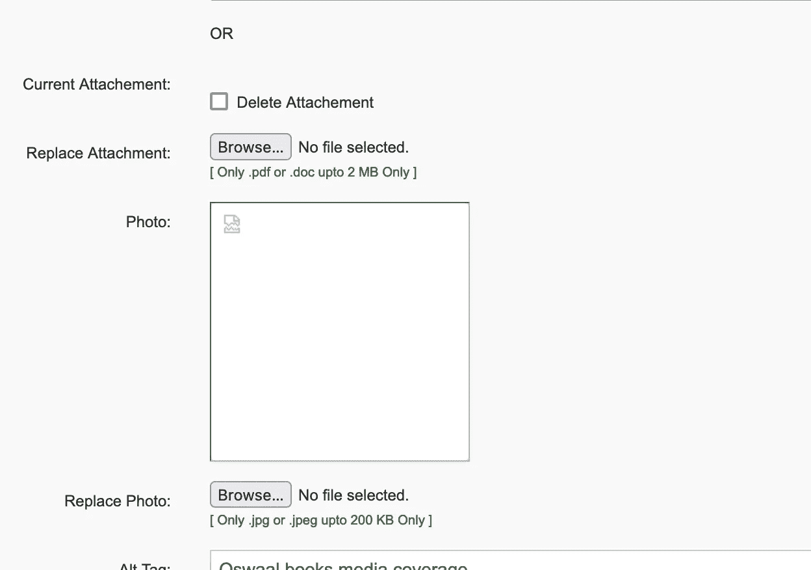

方法:

1.  我首先尝试上传一张样本照片，看看文件是否被重命名，但没有(win 1)
2.  尝试查看它接受哪些扩展名(。php、. php5、. php4、.phtml，. php.jpg 没起作用)
3.  已尝试查看 mime 类型是否会触发任何警报。
4.  最后将扩展名改为。“PhP”完成了这项工作

开始了…

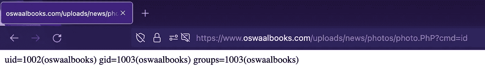

**Bug 2:价格操纵【P2】**

这个 bug 的灵感来自 Infosec 评论页面上的另一篇文章(现在找不到链接，如果你知道的话，请在评论中提到它)。所有产品都与产品 ID 相关联，因此我无法通过编辑请求来更改价格。然而，我可以编辑数量，所以我决定在那里放一个负整数，这是错误 2…

```
**Case 1:**
Price: Rs 1000
Quantity: 1
Subtotal: 1000 x 1 = Rs 1000**Case 2:**
Price: Rs 1000
Quantity: 2
Subtotal: 1000 x 2 = Rs 2000**Case 3:**
Price: Rs 1000
Quantity: 3
Subtotal: 1000 x -2 = Rs -2000
```

如果购物车价值为负(例如:2000 卢比)，我将无法逆转交易过程，也无法从购物车价值为负的客户账户中提取金额，就像我有一张优惠券一样。所以我可以把我的购物车装满我想要的所有产品，直到我达到最小购物车值。


3 本书和总额 Rs。0(这可能不适用于所有情况，您可能需要满足最小购物车值才能继续)。

**Bug 3:跨站请求伪造【P3】**

这里不需要太多的解释。事实是，CSRF 代币没有被用于任何地方，甚至是敏感的行动。

**Bug 4:通过响应代码操作绕过认证【P3】**

此漏洞存在于主登录页面上。输入我的号码后，我选择用我的 OTP 登录。

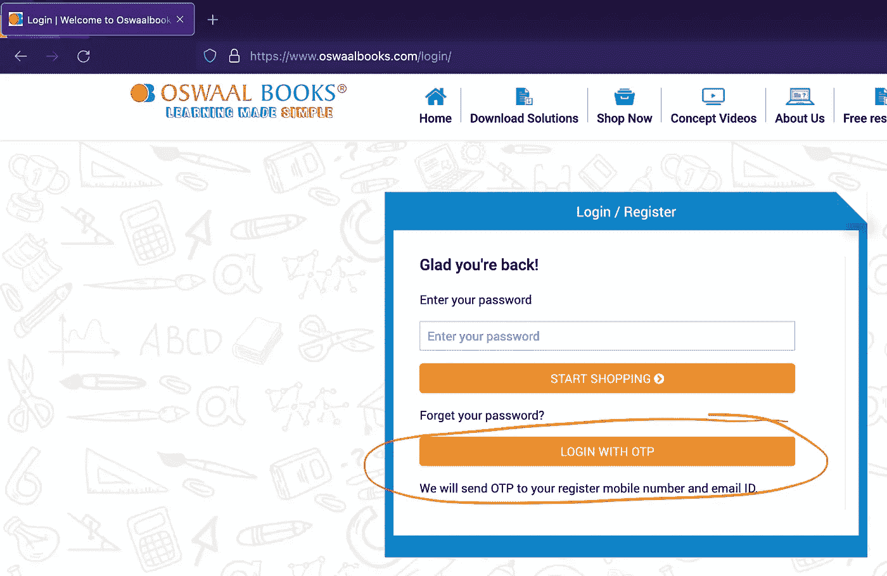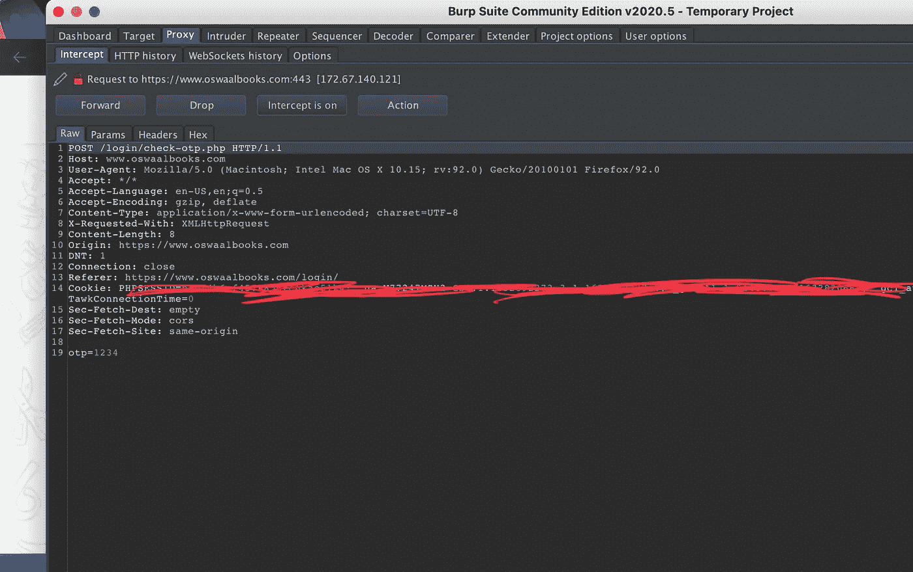

然后我输入一个测试 OTP 并截取响应。我得到的回答是“2”。

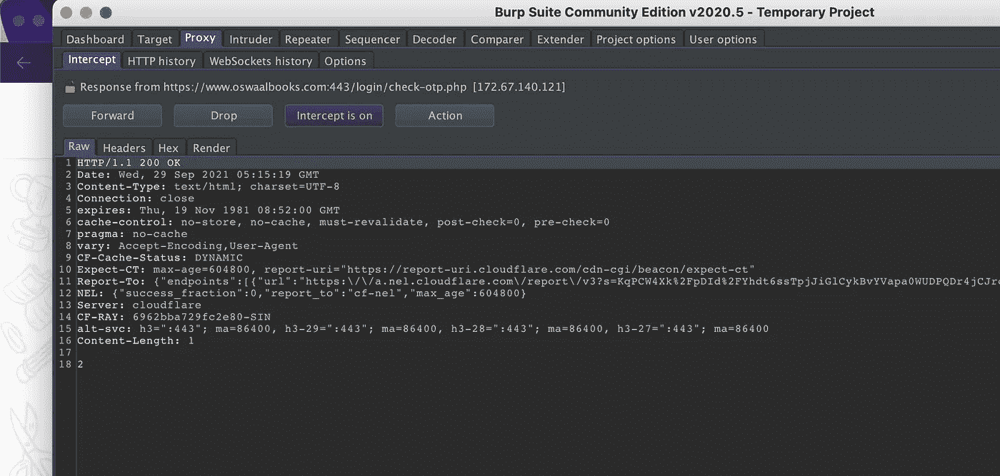

这里我只是猜测(通常您会添加正确的 OTP 并查看正确的响应，然后尝试用错误的 OTP 复制它，以查看是否可以绕过身份验证)，并决定将响应更改为“1”。

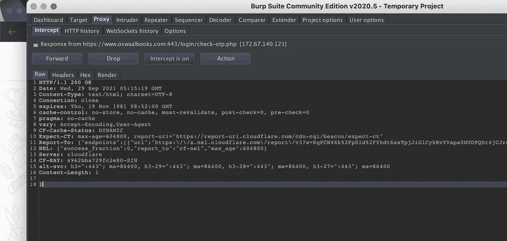

这是第四个错误…


(在没有正确 OTP 的情况下登录到测试帐户)

**超越捕虫**

公司，尤其是拥有大量用户的公司，需要理解安全性的重要性。上述方法是用于笔测试(我会说这就像玩 CTF)和 bug 搜索的一些最基本的方法。我只需要几个步骤就能进入网站。敏感的细节可能会被泄露，有害的事情，如网站污损也是可能的。这不仅会影响公司或其品牌价值，还会影响信任它的用户。这就是为什么权力越大，责任越大。公司需要对客户信任的数据负责。

> 网络安全服务可能很昂贵，但你的用户的信任和安全值得每一分钱。

报道日期:2021 年 9 月 29 日

修补日期:2021 年 12 月 17 日

如果你也是/曾经是一名印度高中生，使用过他们的产品并喜欢这篇文章，请随时鼓掌，在 Medium 和 Twitter 上关注我。

推特:[https://twitter.com/vikaran101](https://twitter.com/vikaran101)

谢谢你。