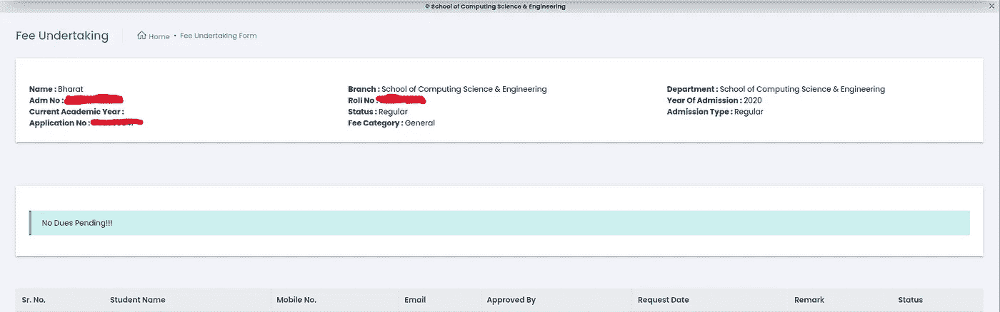
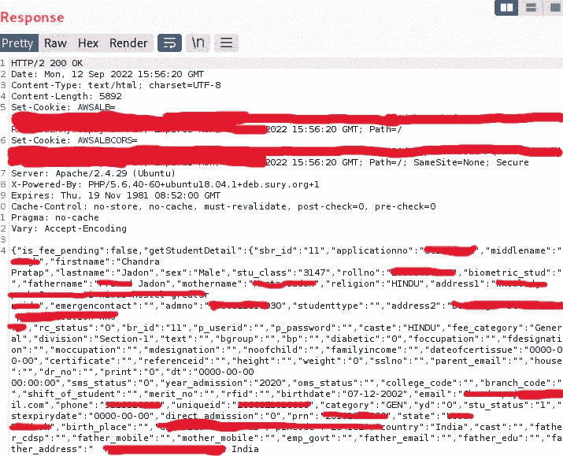

# 我是如何黑进我大学的学生门户网站的

> 原文：<https://infosecwriteups.com/how-i-hacked-my-colleges-student-portal-f51775d75a3d?source=collection_archive---------0----------------------->

嘿，伙计们，我又回来了，写了一篇关于我如何在我大学的学生门户网站中发现一个服务漏洞，导致我大学每个学生的数据泄露的文章。基本上，它是一个为学生提供的第三方门户网站，学生可以在其中查看他们的时间表、出席率、个人资料、费用和许多其他东西。

这是一个简单的 IDOR 错误，但影响巨大。现在，没有任何延迟，让我们开始吧。

## 臭虫的故事:

在过去的两周里，我一直在努力寻找 vdp 和 bug bounty 程序上的任何有效 Bug，所以有一天我放纵自己与我的大脑进行了一次对话，它是这样的:

**我:**该死！！！我没有得到任何有效的错误，我厌倦了这狗屎。

**我的大脑:**😂😂😂嗯…松的

**我:**我应该挑一个简单的目标，那会很有趣。

我的大脑:是啊…

我:我们学院的学生门户怎么样😏

我的大脑:对我来说，那将是大量的多巴胺。多巴胺多巴胺多巴胺多巴胺多巴胺…..

**我:**我真的应该做吗？？？

**我的大脑:**

所以，在听取了我大脑的认可后，我继续用我的全部潜力去测试我的目标。

我开始搜索目录和文件，但没有找到任何感兴趣的东西，所以我开始做一些手动操作，并检查了 web 应用程序的每个功能。然后我的眼睛捕捉到一个用于检查费用的选项，我点击了这个选项，并开始分析我的 burp 代理中的请求。费用状态页面的界面是这样的:

费用状态页面

这个要求对我来说很有趣，就像是:

那个请求

正如你们所看到的，主体中有 3 个参数:

**方法，入场号，br_id**

我不知道 br_id 是什么鬼东西。因此，我再次点击费用状态选项，截取它，并将录取编号参数从**blah blah 26**更改为 **blah blah blah30** ，我可以清楚地看到该学生的费用状态页面，包括他的一些基本信息。

我非常确定这个请求还有其他内容，所以我把这个请求发送到了 repeater 选项卡，并再次把录取编号改为**blah blah 30**。

反应

从字面上看，这个回复泄露了学生的大量数据，包括他们的电子邮件、电话号码和地址。泄露的数据也有 10 级和 12 级标记😉。

**现在我觉得自己像个黑客……**

在那之后，我对下一步有点困惑，我应该报告公司还是让它去，但作为一个负责任的网络安全研究员和漏洞猎人，我决定向公司报告漏洞。

我给公司的支持邮箱写了一封漂亮的邮件，里面有一份很好的报告，期待他们的回复，但是这些家伙没有回复我的任何邮件。我不知道这些家伙到底怎么了，为什么他们不认真对待这个安全问题。对我来说没什么新鲜的，我过去也曾面对过这种类型的人。

**结尾**

这就是这篇文章的全部内容，希望你喜欢这篇文章。请随时与我联系，我的 DM 随时欢迎任何建议或帮助。请在 twitter 上关注我关于网络安全和 bug 赏金的定期更新。一会儿见，有新的报道。

## **来自 Infosec 的报道:Infosec 每天都有很多内容，很难跟上。[加入我们的每周简讯](https://weekly.infosecwriteups.com/)以 5 篇文章、4 个线程、3 个视频、2 个 Github Repos 和工具以及 1 个工作提醒的形式免费获取所有最新的 Infosec 趋势！**