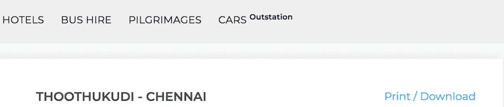
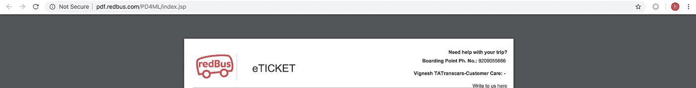
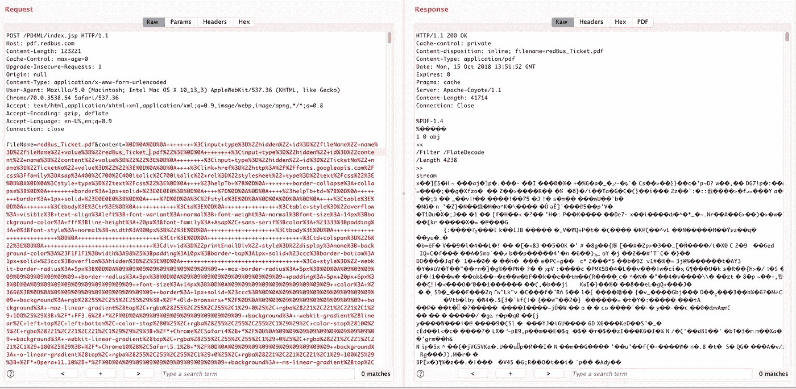
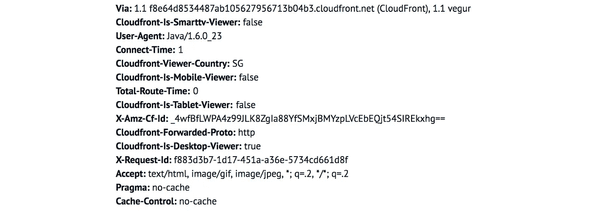
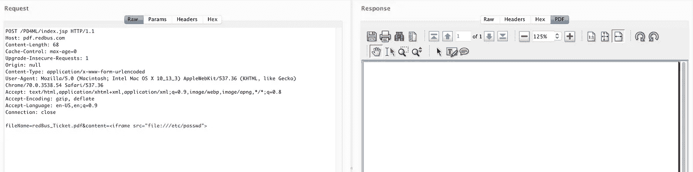
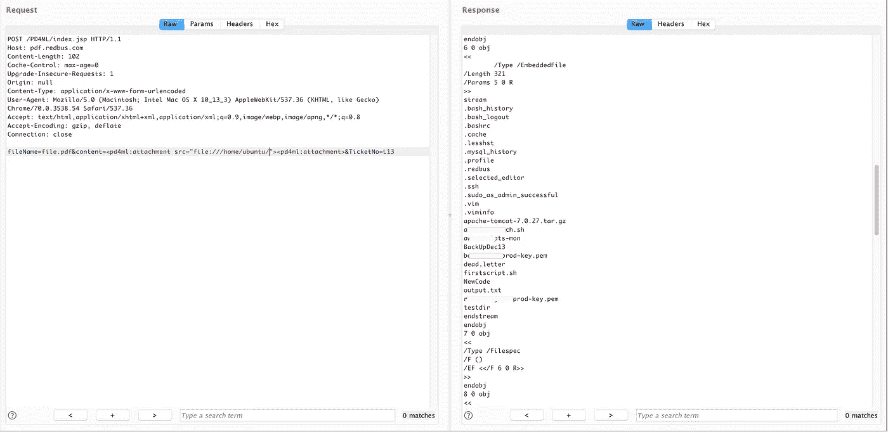
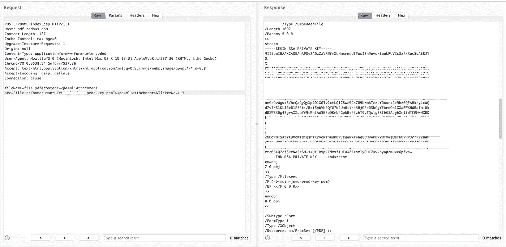
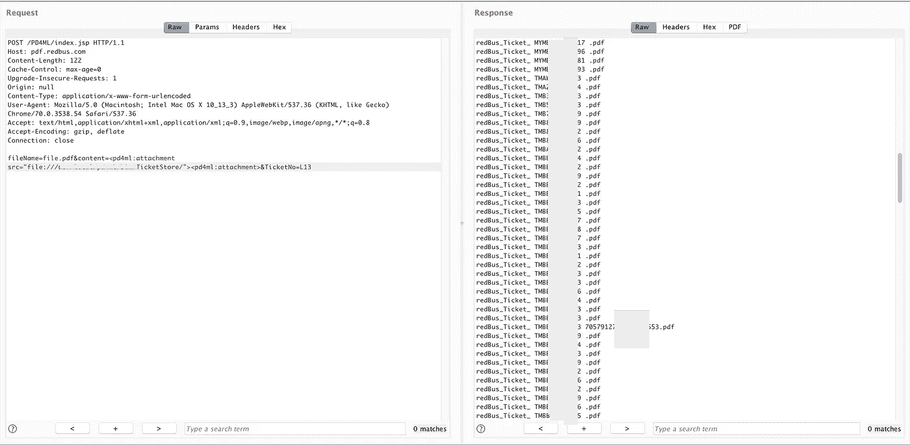
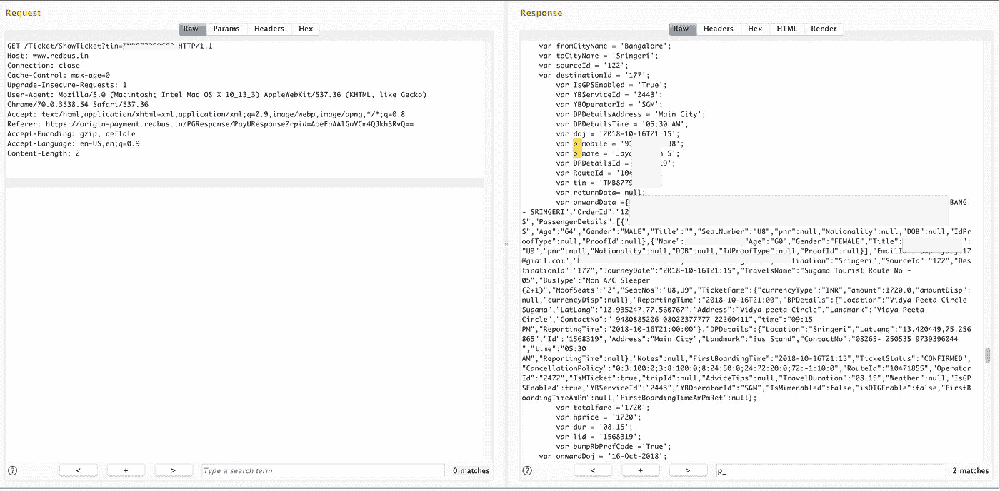

# 我是如何黑掉 redbus(一个在线公交售票应用程序)的

> 原文：<https://infosecwriteups.com/how-i-hacked-redbus-an-online-bus-ticketing-application-24ef5bb083cd?source=collection_archive---------0----------------------->

我两年前起草了这篇文章。因为补丁花了很长时间，现在贴上来]

这是一个平常的清新而又困倦的星期一早晨。我走到办公桌前查看邮件。

😴几分钟过去了..

☎️我的电话响了..

我以为那是客户服务部打来的电话。不，是我妈妈(仅有的两个每天给我打电话的人😅).她打电话给我，提醒我周末订票的事。一切就是这样开始的。

我订了票，最后到达确认页面，点击了一些我从来没有做过的事情。“**打印/下载**链接。



点击链接后，我被重定向到另一个子域“pdf.redbus.com ”,那里显示了我的门票的 pdf 版本。



引起我注意的一件重要的事情是“PD4ML”。这个名字
(PD-4-ML)本身就说明了它是某个东西的库。最明显的情况是它应该是 pdf 生成库。但是等等。为什么它显示 pdf 时没有任何票证 ID 或任何等效的标识符作为参数🤔。所以我只是回到上一页，监控所有点击“下载”链接后触发的请求。

这是我得到的，



这就是他们生成 pdf 的方式。从 html 内容到 pdf。首先，为了验证服务器在转换过程中是否进行了外部调用，我尝试了下面的标记，


Woot。😃我收到一个 java 代理的请求。显然这是来自 redbus pdf 服务器。



接下来，我尝试使用 iframe 标签来检查它是否在框架上加载了本地文件。我得到的只是一个空白的回答。😐



Googled 了一下 pd4ml——是否支持 javascript(针对动态页面)。答案是否定的！
没有放弃，我开始看 [pd4ml](http://pd4ml.com/html.htm) 的文档。我发现 pd4ml 不支持 iframe 标签，也不支持 object、applet 等其他标签。

现在该怎么办😕。向下滚动文档页面。并且发现了这个有趣的东西叫做“专有标签”。

开始试验这个 **< pd4ml:附件>** 标签。根据文档，它用于在 pdf 中嵌入附件。这听起来很有趣😉。标签要求附件链接具有“src”属性。

像这样简单地修改了标签，

**< pd4ml:附件 src = " file:///etc/passwd "><pd4ml:附件>**

瞧😲。


此时，我确认了任意文件就绪漏洞。但是我对 passwd 文件不是很满意。进一步挖掘。幸运的是，我也能看到目录名。所以很容易跳转到目录。



部分修订的私钥文件

现在看起来像一些真正的东西👻。 **SSH 私有密钥、带有数据库密码的配置文件以及包含一些有趣信息的 MySQL _ history**😜。

其他用户的 pdf 预订单应该在这里的某个地方🤔。

手头有了读取的任意文件，我检查了 index.jsp 的源代码，并找到了 pdf 文件的确切存储位置。

去查了一下目录，终于找到了这个。😍



这与 pdf 无关。这是关于你的机票 id😉

有了 ticketID，任何经过认证的用户都可以提取个人信息，如电子邮件、手机号码、年龄、出生日期(如果有的话)等。,



部分编辑的回复

**外卖:**

对于 Bug 猎人来说，
一旦你用侦察推断出后端库，总是要看文档。

对于开发者来说，

下面是您需要添加到白名单中的本地目录或远程资源的配置

```
 Map m = new HashMap(); 
 m.put(PD4Constants.PD4ML_ALLOWED_RESOURCE_LOCATION, “[http://server/webapp,file:/my/safe/file/folder](http://server/webapp,file:/my/safe/file/folder)"); 
 pd4ml.setDynamicParams(m);
```

**时间线:**

*   【2018 . 10 . 15】问题上报给 redbus。
*   [2018 年 10 月 15 日] Redbus 团队在承认该问题后，立即删除了 SSH 私钥，作为即时修复措施。
*   [2018 年 10 月 16 日]报告了额外的信息，即它也泄露了用户的 PII，这被认为是重复的，因为他们已经作为一个单独的问题跟踪它。
*   [2018 年 10 月 16 日]获得丰厚赏金🤥
*   [2018 年 12 月 6 日] Redbus 安全团队要求我将其报告给 pd4ml，以获得针对此问题分配的 CVE，如果它在最新版本中可重现的话。
*   【2018 . 12 . 14】发邮件给 pd4ml 举报问题。
*   [2018 年 12 月 19 日]与此同时，我收到 redbus security 的一封邮件，称他们计划删除该功能
*   [2019 年 1 月 4 日]在与 pd4ml 的连续电子邮件之后，我了解到他们已经有了可选的控制措施来避免这个问题，并将其转发给了 rebus 团队。
*   【2019 . 2 . 26】有更新吗？—不，还没有。
*   【2019 . 9 . 20】有更新吗？—补丁将在一周内发布
*   [2019 年 12 月 18 日] Redbus 团队通知我，他们为 pdf 生成实施了新的工作流程。但是 pdf.redbus.com 仍然是可以接近的，所以这个问题。
*   [2019 年 12 月 20 日]在挖掘了新的实现后，发现他们正在使用 **PhantomJS** 来生成 pdf。不允许读取本地文件，因为他们正在加载关于:空白页中的自定义 html。iframe 内部不允许加载 file:///协议，但允许 http。最终去了 SSRF😬并报告了同样的情况。
*   [2020 年 2 月 3 日] Redbus 通过将 pdf 生成模块作为内部微服务进行移动，修复了该问题。(这个没有赏金😅。没关系！)
*   [2020 年 7 月 16 日]但是 pdf.redbus.com 仍然是公开的，有什么更新吗？
*   [2020 年 9 月 11 日]pdf.rebus.com 被禁止公开访问。

在整个过程中，我注意到处理这个案子的人被提升为高级安全工程师。恭喜伙计！😃。那是一个漫长的旅程！