# 我在 Yandex 和我的 SSRF 上打猎时的心态

> 原文：<https://infosecwriteups.com/how-i-hacked-yandex-with-ssrf-vulnerability-e19af20ed4d?source=collection_archive---------0----------------------->


嘿猎人们！

另一篇关于我在另一个大程序中寻找一个有新漏洞的程序时的心态的文章。在我们开始之前，让我们看看我们将在这篇文章中讨论什么:

*   我在 Yandex 打猎时的心态
*   动态思考
*   一些谷歌呆子
*   SSRF 介绍
*   代码审查
*   基于 HTTP 头的 SSRF
*   HTTP 交互

> 注意:我得到了 Yandex 团队的许可来写这篇文章，所以它是完全合法的:

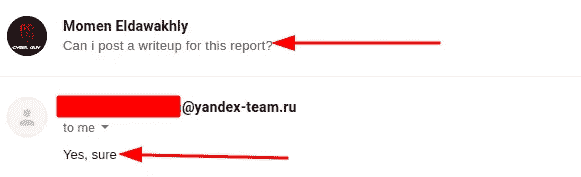

所以让我们开始…

渗透测试领域的固定思维让你思考得更少，因为你总是需要创新，例如每个目标都应该有自己的侦察、测试等方法。因为每个目标都有自己的功能、服务和工作流程。我的目标是 Yandex，首先我开始收集相关信息，根据我的研究，我发现 Yandex 提供以下服务:

*   搜索引擎
*   云服务
*   邮件服务
*   电子商务
*   广告
*   以及其他与互联网相关的产品和服务

所以这不是一个普通的目标，这是一个非常大的目标，现在在执行我的侦察后——我在以前的文章和我的 [Github Repo](https://github.com/Cyber-Guy1/theCyberGuy_Recon_V1.0) 中提到过它——所以我从 GHDB 开始，以便找到一些秘密，但因为这个目标提供的巨大服务，如果我键入一些像这样的呆子:

```
site:*.yandex.* intext:"access_token"
```

首先这个呆子做什么？这个傻瓜会给我 Yandex 的所有子域和 Tob 级域(TLD)的完整结果，以便使我的搜索范围更广，所以在键入这个傻瓜后，你会得到以下结果:

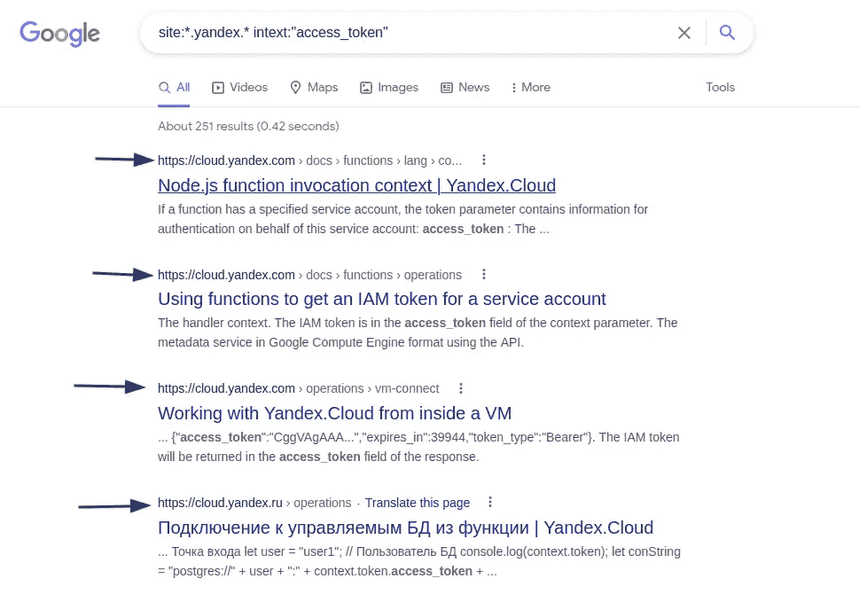

第一次，你会非常高兴，因为你认为你找到了一个访问令牌，但请记住，这只是一个文档，因为正如我所说，Yandex 提供云服务。


那么，如果你面对这样的事情，如果你有一个固定的想法，你应该搜索另一个秘密，但这是错误的，你应该制作一个呆子，以便从搜索结果中排除云子域，所以我制作了以下呆子:

```
site:*.yandex.* intext:"access_token" -site:cloud.*
```

这个呆子将排除云服务的任何子域，所以你不会在任何地方看到任何云服务子域:

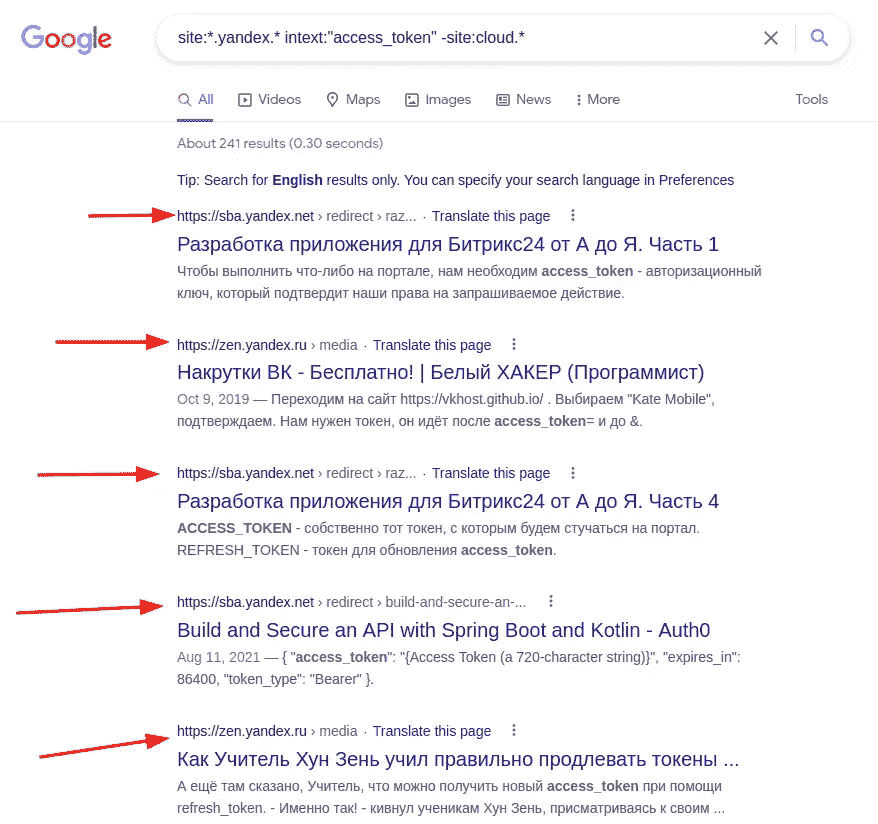

你也可以只从 URL 中排除`cloud`短语，方法是使用我编写的 dork:

```
site:*.yandex.* intext:"access_token" -inurl:cloud
```

所以我认为这也很好，但是你可以看到另一个文档和文档！所以我现在能做什么？


我有一个想法，如果我开始搜索一个暴露的服务器索引，这样我就可以开始挖掘任何新的秘密，所以我制作了这个呆子:

```
site:*.yandex.* intitle:"index of"
```

我得到的结果是:

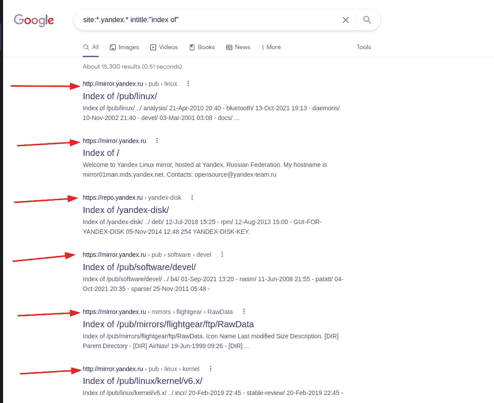

所以在谈论这个之前，如果你熟悉像脸书这样的一些 bug 公司，那么你知道每个公司都有它的镜像来存储它的软件，他们使用的操作系统和其他文件可能不敏感，但有时我们可以收集一些关于这家公司内部基础设施的信息，所以在我的情况下，所有的结果都像一个镜像，所以我试图使用 dork 搜索更高级的内容:

```
site:*.yandex.* intitle:"index of" intext:"passwd"
```

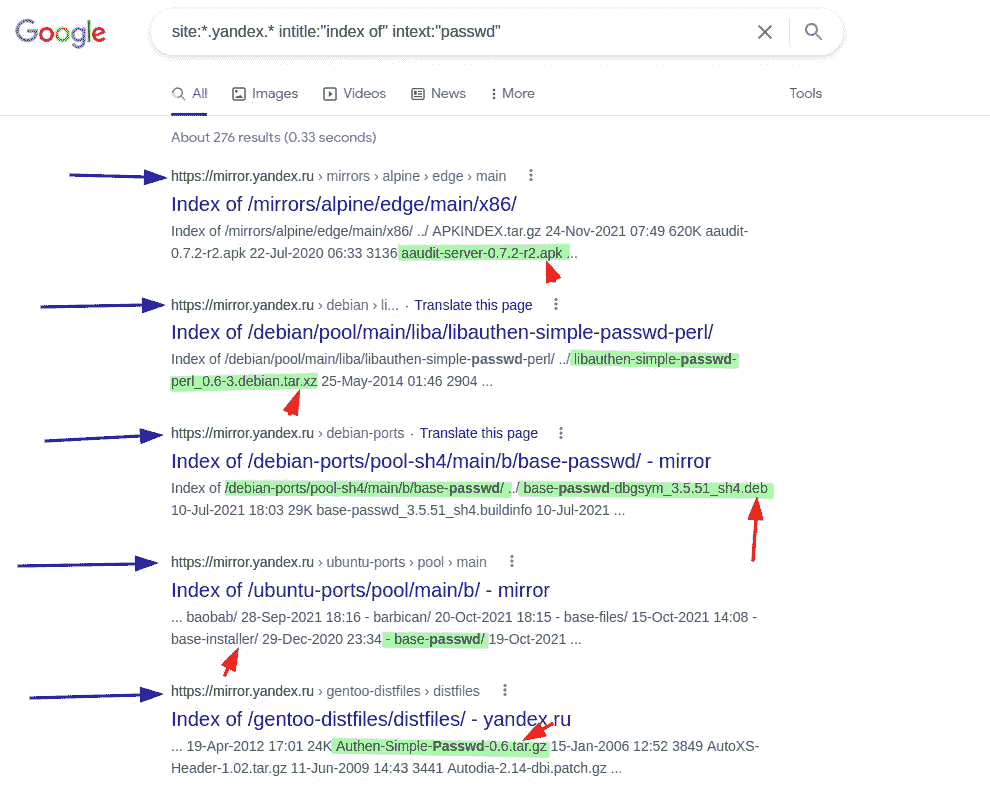

现在让我解释一下，在输入结果之前分析结果是非常重要的，因为您可以了解他们托管了什么句柄的背景，所以在这里您可以看到所有的扩展是这样的:

*   `tar.xz` =压缩文件
*   `deb` = Debian 包
*   `apk` =安卓包

另外，如果你看一下这些路径，它们会是这样的:

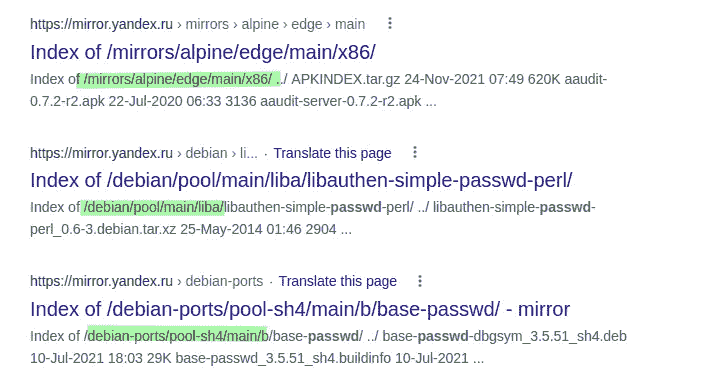

所有这些路径都存储了发行版或 Linux 库的基本文件，但是让我们输入这些目标中的任何一个:

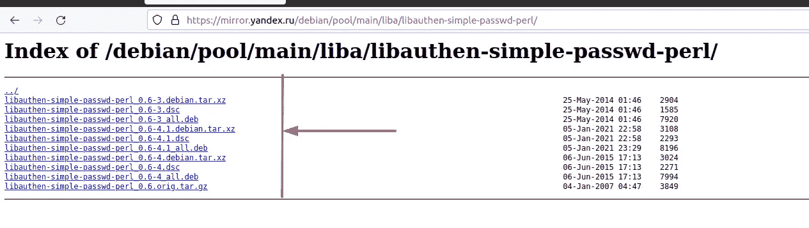

让我们试着下载任何文件，比如说文件:

```
[libauthen-simple-passwd-perl_0.6-4.1.dsc](https://mirror.yandex.ru/debian/pool/main/liba/libauthen-simple-passwd-perl/libauthen-simple-passwd-perl_0.6-4.1.dsc)
```

开始我们的分析:

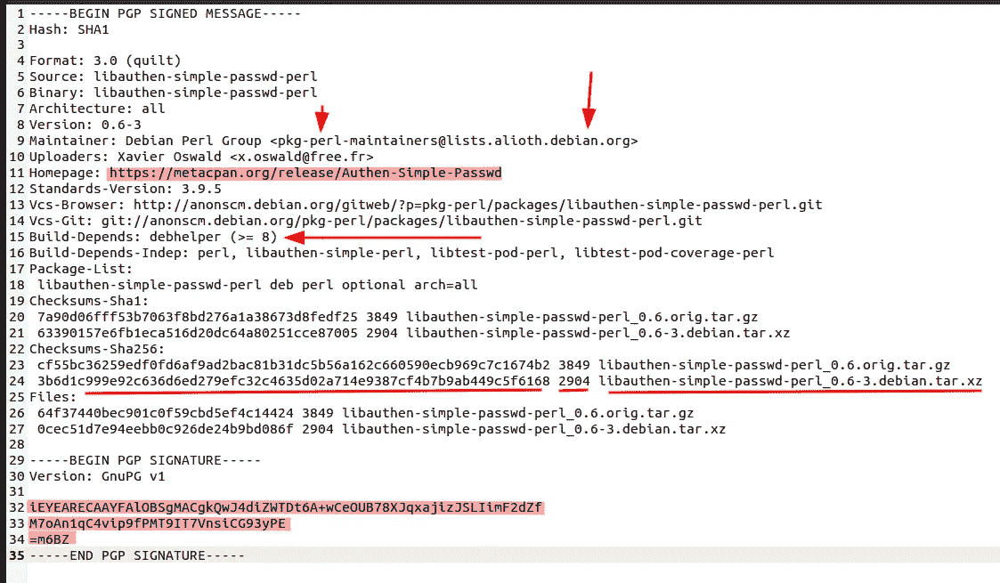

因此，这只是一个用于验证每个 lib 文件签名的文件，在我们的例子中，我们得到了 lib: `libauthen`，正如我们可以看到的，他们的 web 应用程序是:

```
[https://metacpan.org/dist/Authen-Simple-Passwd](https://metacpan.org/dist/Authen-Simple-Passwd)
```

查看这个库之后，它只是一个用于验证 passwd 文件的库:

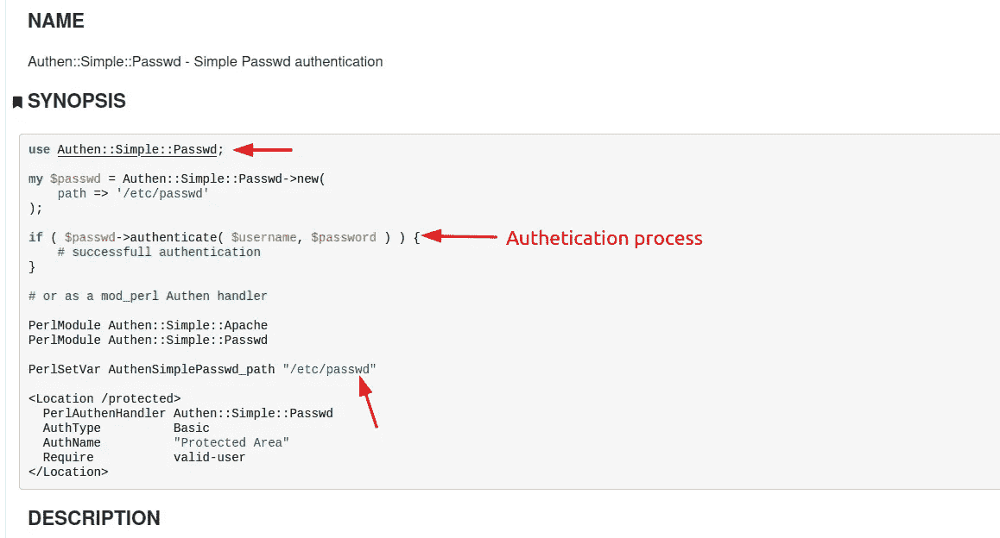

我认为这对我们没什么好处，因为这些只是镜像，只是存储一些库和 Linux 发行版供公众使用，现在让我们跳回来，开始通过制作一个新的呆子来指定我们的结果:

```
site:*.yandex.* intext:"id_rsa" -inurl:cloud|mirror AND intitle:"index of"
```

这将搜索任何`id_rsa`文件，并从 URL 中排除和`cloud`或`mirror`，最后搜索任何 HTTP 标题，得到单词`index of`，有人会问为什么我在搜索`id_rsa`时将云排除在外？原因很简单，因为这将出现在每个云域/服务中，因为当您要创建一个主机，例如使用 SSH 连接以控制服务器时，您应该有两个文件:

*   `id_rsa.pub` = >用于加密的公钥
*   `id_rsa` = >用于解密的私钥

在大多数情况下，这在文档中会出现很多，注意:`id_rsa`可能不存在，但是你可以根据你的目标使用的加密来搜索`id_dsa`，所以在创建我的呆子之后，我得到了结果:

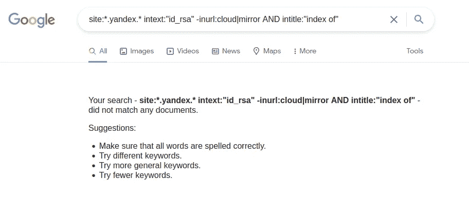

所以我决定现在停止欺骗，并在我知道这个目标的基础设施是什么之后，自动进行欺骗过程，这样我就知道我应该制作什么样的欺骗，并进入下一步，在开始下一步之前，即利用和发现，让我们来谈谈 SSRF，即服务器端请求伪造，看看下面的代码:

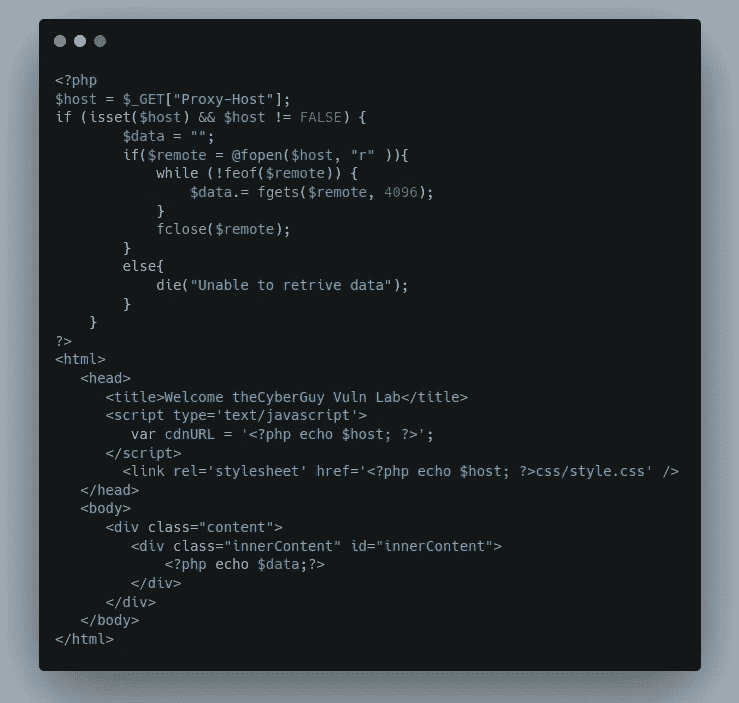

现在，为了解释 SSRF 是如何发生的，我已经编写了这个简单的网页，现在让我们来看看每个代码块:

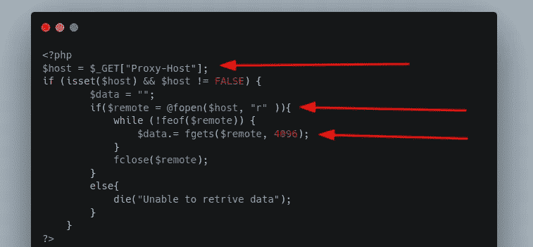

首先，这是一个简单的 PHP 代码，在后端系统中执行以下操作:

*   它将 GET 参数`Proxy-Host`存储在变量名`host`中
*   然后它检查参数:`Proxy-Host`是否存在于请求中，以及这个参数是否没有一个`False`值。
*   在这之后，它读取一个远程主机，并开始使用`While`循环抓取它的内容，以便继续抓取它的内容，直到传输结束。
*   最后，fopen 会议结束。

现在第二部分:

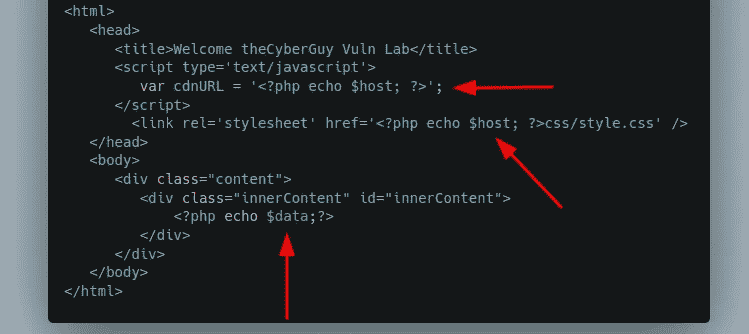

最后，因为我的全局变量在我的 PHP 代码中，现在这个 HTML 代码将从远程主机导入 CSS 表和 JS 脚本，请求主机的响应将显示在`innerContent` div 中。

现在让我们看看服务器将如何执行此操作:

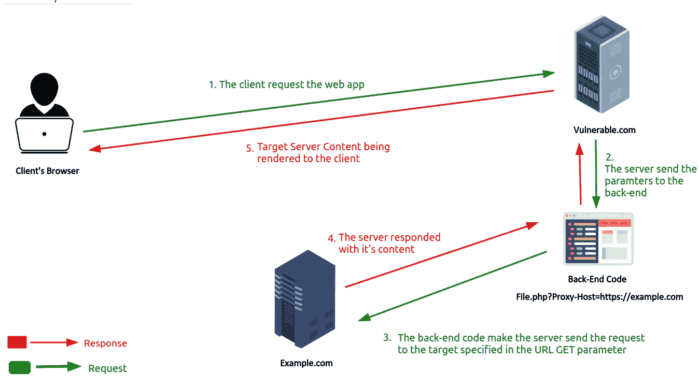

如您所见，当客户端访问类似于:`[https://vulnerable](https://vulnerable).com/File.php?Proxy-Host=https://example.com`的 URL 时，服务器将接受此请求，后端编码将使服务器向`Proxy-Host`参数中指定的主机发送请求，因此现在易受攻击的服务器向另一个请求发送请求。

现在让我们看看攻击者如何攻击该功能:

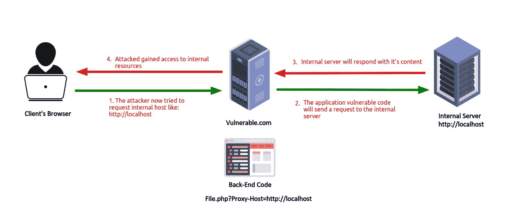

现在，攻击者知道服务器用它自己进行请求操作，所以他想到请求内部资源，如:`http://localhost`如果服务器易受攻击，它会用内部服务器内容给你一个响应。

> 提示:有些时候当你输入一些常见的东西，比如: [http://localhost，](http://localhost,)服务器会阻止它，因为它在服务器黑名单中，所以你可以在搜索的时候寻找任何一个指向 localhost 或 endpoint 的主机。例如，在我的一次狩猎之旅中，我在本地设备中打开了 apache2 服务器，所以当我要访问远程目标 URL 时，例如:[http://target.com，](http://target.com,)我看到我的本地主机正在被查看。这意味着这个主机是指本地主机，然后保存它，以便在这个目标或另一个目标中查找 SSRF 时使用。

现在还有 SSRF，因为注入了 HTTP 头，比如:`X-Forwarded-Host`和`X-Forwarded-Host`，所以在我的例子中，SSRF 在 HTTP 头中，那么我怎么能找到它呢？有两种自动化方式来执行此操作:

1.  使用带有良好的 HTTP 头列表的 burp 入侵者，并通过 Burp Collaborator 或服务器为该头赋予一个值，以获得检查 SSRF 的请求。
2.  使用`Nuclei`模板扫描仪来执行此操作，使用模板:`~/nuclei-templates/extra_templates/header-blind-ssrf.yaml`，如您所见，模板显示这个 SSRF 是一个`blind` SSRF，但这并不总是如此，因为在我的例子中，它是一个基本的 SSRF，在使用此模板之前，让我们确定它是如何工作的:

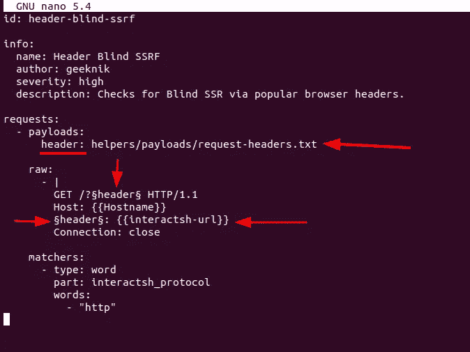

让我们试着分析一下:

1.  有效载荷部分:

*   `header:`这里是 HTTP 头单词表，它被用于强制 HTTP 请求。

2.原始部分:

*   `/?&header&`它在 GET 请求中设置 HTTP 头，以便让用户知道现在使用的是什么 HTTP 头。
*   `&header&`它设置了请求中正在使用的报头
*   `{{interactsh-url}}`用于标识交互的 URL

最后，在使用 nuclei 完成自动化后，我能够使用以下请求在 Yandex 中找到 SSRF:

```
GET / HTTP/1.1
Host: example.vulnYandex.tld
User-Agent: someDevice
Accept: text/html
Accept-Encoding: gzip, deflate
Proxy-Host: burpcollaporator-url.net
Connection: close
```

如你所见，漏洞在标题:`Proxy-Host`中，我得到一个 HTTP 交互，如下所示:

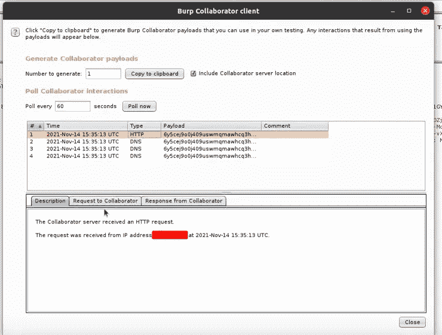

然后我想确保这种交互发生在 Yandex 服务器上，所以我使用命令做了一个`Reverse DNS`:

```
host -t PTR 1.1.1.1
```

代替`1.1.1.1`放置由合作者识别的 IP，然后我设置结果:

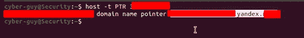

我考虑过利用内部资源来扩大影响，但当我查看 Yandex 的政策时，我发现:

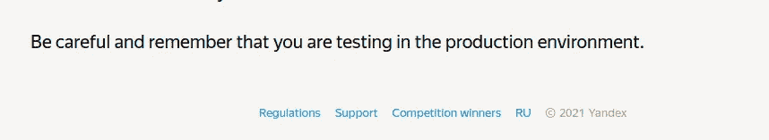

> 注意:我能够执行内部端口扫描，但由于 Yandex 政策，我应该在访问内部数据之前询问他们，所以我发送了报告，然后要求他们让我升级影响，但他们确认了 SSRF，并将在内部这样做:

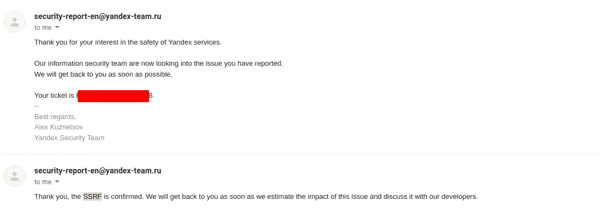

因此，我报告了这个漏洞，并等待团队，等待他们是否希望我继续利用它，或者他们将在内部审查它，他们确实在内部继续。

最后:

