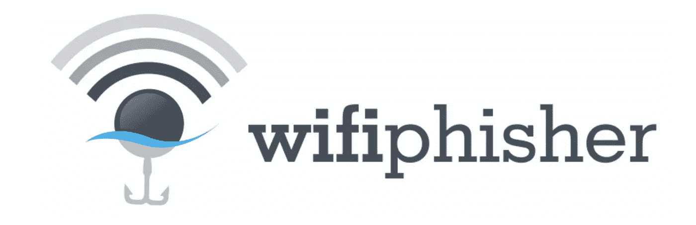
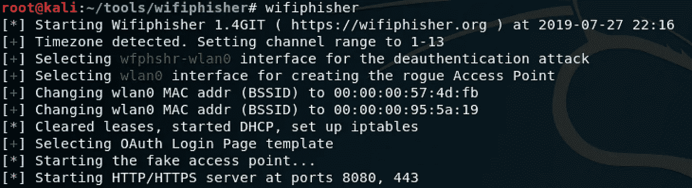
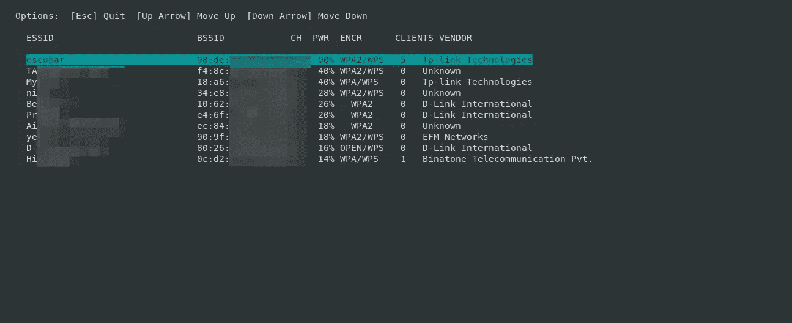
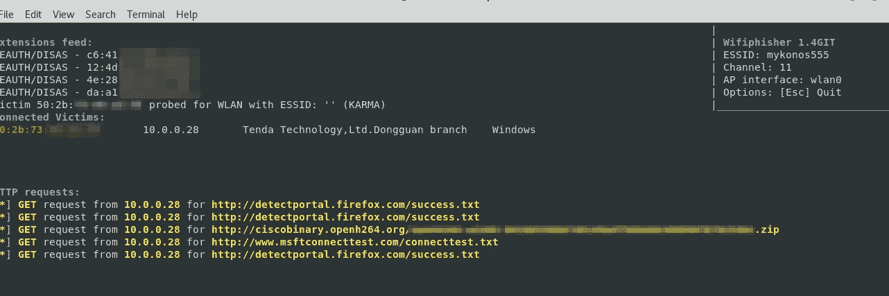
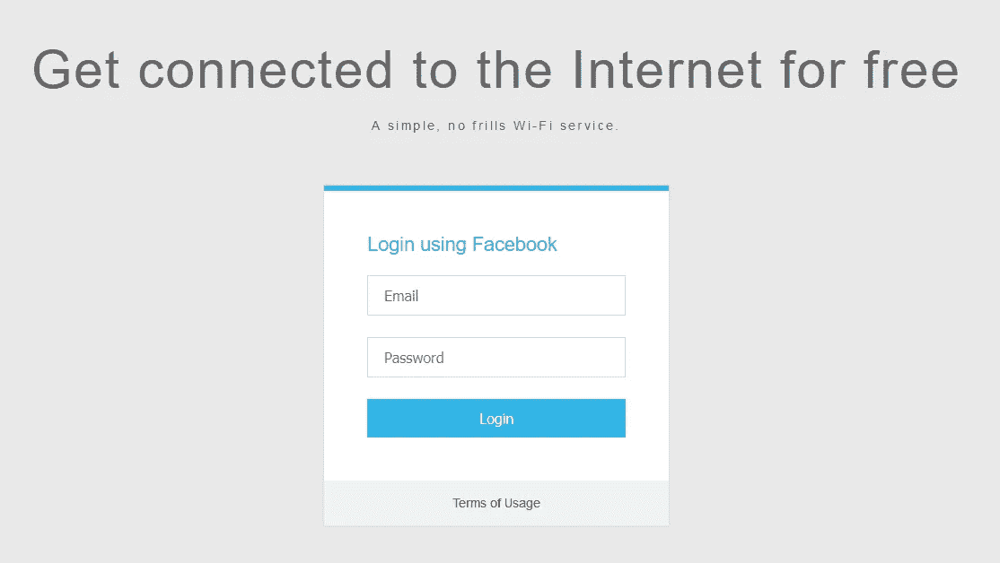
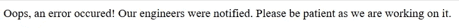
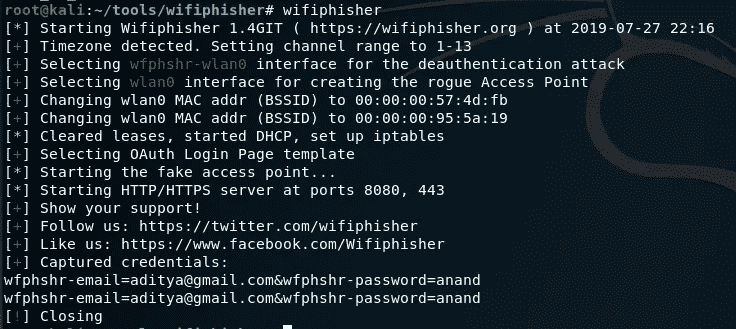

# 我是如何通过免费 wifi 获得脸书证书的？

> 原文：<https://infosecwriteups.com/how-i-harvested-facebook-credentials-via-free-wifi-5da6bdcae049?source=collection_archive---------0----------------------->



“免费无线上网”听起来很不错，不是吗？我的意思是，如今大多数咖啡馆之所以吸引人，不仅仅是因为它们提供的咖啡，还因为它们为顾客提供的免费 Wifi。大多数人都为能免费上网而自豪，我的一个朋友甚至吹嘘说“我用他们的网络的钱肯定比我买咖啡的钱还多”。

几代人以来，免费赠品一直吸引着人类，但如果你能找到一种方法将它武器化会怎样？这次攻击准确地展示了免费 wifi 是如何被用来对试图获得这些免费东西的人进行几种不同的攻击的。在这篇文章中，我将展示该工具的功能之一，即收获 facebook 登录凭证。

在我们开始之前，你可以阅读我以前的文章，关于 wifi 黑客。

> [我是如何侵入邻居的 WiFi 并获取登录凭证的？](https://medium.com/bugbountywriteup/how-i-hacked-into-my-neighbours-wifi-and-harvested-credentials-487fab106bfc)

# 我们开始吧！

今天，数据比石油更有价值，所以让我们来展示你如何访问他人的数据。因此，我将用来演示这种攻击的工具是[*wifi physer*](https://github.com/wifiphisher/wifiphisher)*，您需要在您的 [Kali 机器](https://www.kali.org)上运行这种攻击。你需要的硬件是一个无线 USB 适配器，最好是 Alfa networks 的产品，或者是 TP-Link 的产品。手动克隆 [rougehostapd](https://github.com/wifiphisher/roguehostapd) 的库，因为我在一开始就有错误。*

*所以，现在我们已经准备好了一切，让我们开始实际的黑客攻击，并获得一些 facebook 的信用。你可以继续安装 wifiphisher*

```
*git clone https://github.com/wifiphisher/wifiphisher.git #Download
cd wifiphisher                                # Go to the directory
sudo python setup.py install                  # Install dependencies*
```

*一旦这些步骤都完成了，你就可以在终端中输入下面的命令开始黑客攻击了*

> *wifiphisher*

*一旦你在终端输入命令，第一次可能会失败，只要再输入一次，然后就可以正常运行了。你应该得到这样的东西。*

**

*您将暂时看到以下输出。屏幕会迅速切换，然后会提示您附近有 WiFi 信号。从你周围的 WiFi 信号中，你可以选择你想在哪个特定的 WiFi 网络上进行黑客攻击。*

**

*WiFi 热点*

*一旦你知道你想要哪个特定的 WiFi 热点，你就可以通过按回车键来选择它。一旦你这样做，你将被重定向到攻击将开始的页面，看起来像这样*

**

*这些有三种不同的结果输出。第一个是 Extensions feed，它维护一个已经连接到该网络的客户端列表，然后它向这些客户端发送 de-auth 数据包。执行该特定步骤，使得客户端系统将从网络断开，并且这些设备将尝试发起到 WiFi 路由器的新连接。第二个是连接的受害者，让您了解实际上有多少人连接到您的 WiFi 热点，第三个是 HTTP 请求，显示您的 rouge 接入点发送到受害者 web 浏览器的请求。*

*当取消认证发生并且机器尝试重新连接时，它们将主要连接到存在相同名称的开放 WiFi。这是这次攻击的主要思想，一旦人们连接到这个 WiFi 点，他们就会得到类似这样的提示。*

**

*登录页面*

*在这里，试图连接的用户被提示输入他们的脸书登录凭证，以获得对 WiFi 服务的访问。他们所要做的就是输入他们的登录凭证，这些凭证将被我们截获并与攻击者一起存储。现在，一旦他们输入了自己的详细信息，就会得到以下输出的提示。*

**

*客户端将此视为输出，但实际上攻击者以纯文本形式保存了他们的登录凭据。攻击者的控制台看起来会像这样。*

**

*脸书证书*

*瞧啊。你有受害者的 facebook 凭证，现在你可以登录他们的账户，做任何你想做的事情。*

# *道德的*

*从这种黑客攻击中最大的收获是永远不要连接开放的免费 WiFi 热点。只访问 HTTPS 网站，最重要的是永远不要使用你的证书登录 HTTP 网站。您可能永远不知道还有谁可能在嗅探网络，他们会通过查看网络流量来获取您的登录凭证。如果可行的话，那么使用你的 VPN 服务来加密你的流量，无论你在哪里，它们都能为你提供安全保障。所以下次你遇到不是 https 的网站，就赶紧跑，或者非常小心不要泄露任何个人信息。*

*如果你喜欢，请鼓掌&让我们合作吧。获取、设置、破解！*

*网址:[aditya12anand.com](https://www.aditya12anand.com/)|捐赠:[paypal.me/aditya12anand](https://paypal.me/aditya12anand)*

*电报:【https://t.me/aditya12anand *

*推特:[twitter.com/aditya12anand](https://twitter.com/aditya12anand?source=post_page---------------------------)*

*领英:[linkedin.com/in/aditya12anand/](https://www.linkedin.com/in/aditya12anand/?source=post_page---------------------------)*

*电子邮件:aditya12anand@protonmail.com*

**关注* [*Infosec 报道*](https://medium.com/bugbountywriteup) *获取更多此类精彩报道。**

*[](https://medium.com/bugbountywriteup) [## 信息安全报道

### 收集了世界上最好的黑客的文章，主题从 bug 奖金和 CTF 到 vulnhub…

medium.com](https://medium.com/bugbountywriteup)*