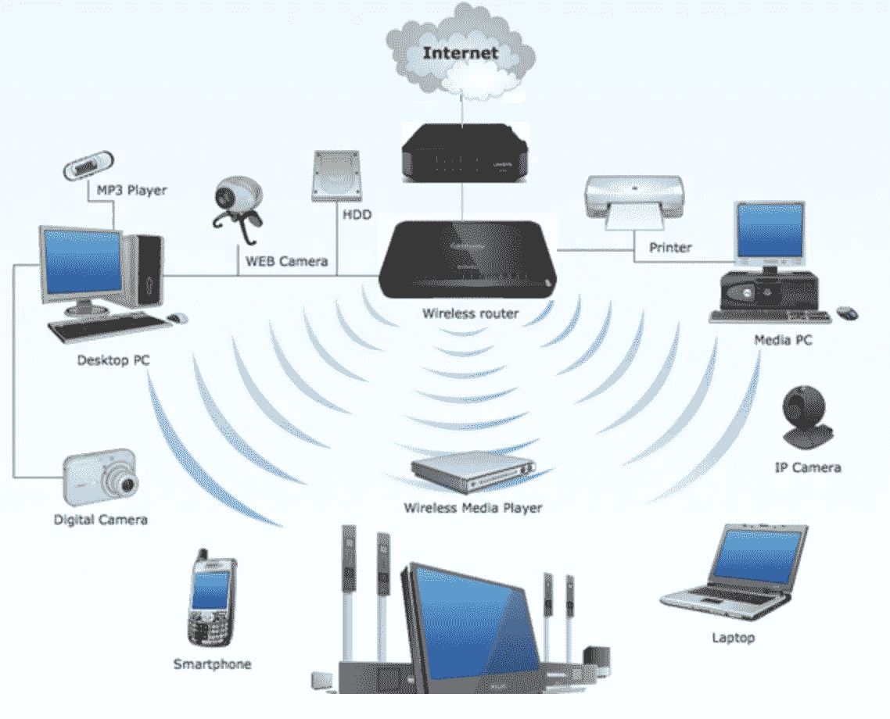
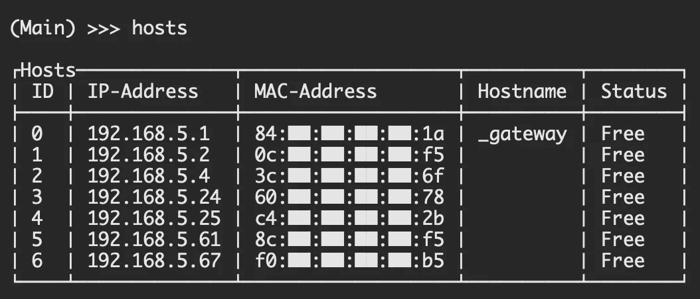
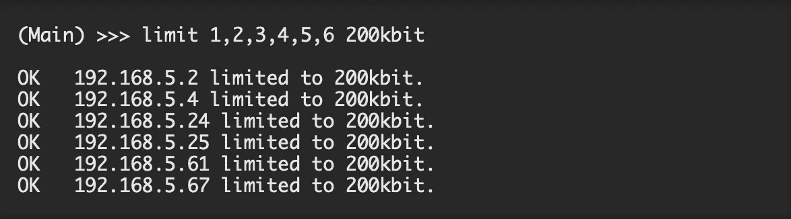
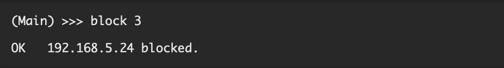
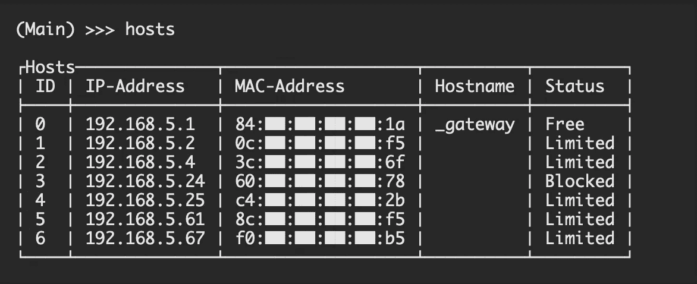
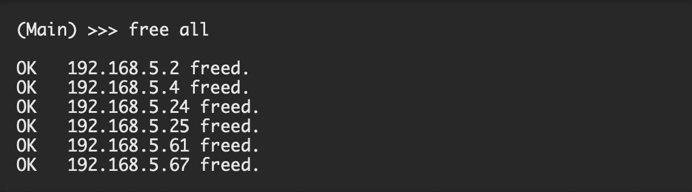

# 我是如何把人们从我的 WiFi 网络中踢出去以提高我的网速的？

> 原文：<https://infosecwriteups.com/how-i-kicked-off-people-from-my-wifi-network-to-boost-my-internet-speed-93b5488b7af?source=collection_archive---------0----------------------->

快速互联网是当代人的梦想。无论你在哪里，这都是你越来越需要的东西之一，在这个世界上，我们越来越依赖互联网来完成我们的工作。快速的网速现在是更快完成工作的代名词。



唯一的问题是，作为一个社会，我们越来越依赖互联网来完成工作，从而导致更慢的网速。原因是，现在有大量的设备连接到我们的家庭网络，确实降低了互联网速度。如果你能限制这些设备的最大速度并释放带宽，这样你就可以获得更好的互联网速度。

在这里，我描述了我是如何做这样的事情，以及我是如何成功的？

# 我们开始吧！

因此，当多个人连接到同一个网络，导致网速下降时，这种需求就出现了。我能给你的最好的例子是，所有学生都连接到 Wi-Fi 路由器的大学网络大大降低了速度。因此，通常从您正在使用的网络中删除人员的唯一方法是获得路由器的管理员权限，然后使用白名单或黑名单方法根据 MAC 地址标记设备，然后从网络中删除，但不幸的是，大多数时候我们没有管理员权限。

我的意思是，如果我们一开始就有管理员权限，我们应该以这样的方式配置它，这样这样的问题就不会在第一时间发生。因此，现在我们的目标是阻止我们网络上的用户，或者至少限制他们的网速，而不需要对该特定路由器拥有管理权限。

# 开球


邪恶限制器

我用来执行特定任务的工具是 Evil Limiter，该工具已被各种安全人员广泛使用。因此，首先让我们检查一下在您的 linux 机器上安装该工具的方法。

```
$ git clone [https://github.com/bitbrute/evillimiter.git](https://github.com/bitbrute/evillimiter.git)
```

一旦我们从 github 获得了这个文件，我们就可以进入 Evil Limiter 文件夹并安装 setup.py 文件。您需要在系统上安装 python 3 才能在系统上安装它。

```
$ cd evillimiter$ sudo python3 setup.py install
```

现在我们已经安装了 Evil Limiter，是时候熟悉这个工具本身了。


邪恶限制器的命令

命令本身是不言自明的，所以现在让我告诉你一步一步的方法把其他用户从你的网络中踢出去。

默认情况下，我们会看到路由器的 MAC 地址、路由器的 IP 地址和子网掩码。这些在一开始就提供给我们，让我们了解哪些机器应该攻击，哪些不应该干预。

我们将执行的第一步是扫描整个网络，找出连接到网络的设备。扫描完成后，我们可以通过“host”命令继续检查主机。这将为我们提供连接到我们网络的所有系统的 MAC 地址以及它们的 IP 地址。



主机-邪恶限制器(空字节)

现在，我们有了连接到网络的设备的 IP 地址和 MAC 地址。这里要注意的另一件事是，它们由相对的 ID 号标记，因此我们需要执行的任何特定命令都可以通过这些 ID 号的帮助来完成。



极限-邪恶限制器(空字节)

要么我们需要在这些设备上网时限制它们的速度，要么我们想要完全阻止它们，我们可以通过这些方法做到这一点。



块邪恶限制器(空字节)

一旦我们限制并阻止了设备，我们就可以再次检查主机，并确定配置是否设置正确。



主机-邪恶限制器(空字节)

这样，我们可以阻止和限制我们不想访问网络的用户，并以这种方式提高我们的网速和享受。最后，当我们离开网络时，我们需要释放其他所有人，以便他们现在可以在该网络上正常访问互联网，并且所有限制都将被取消。为此，我们运行“全部释放”命令



自由邪恶限制器(空字节)

现在黑客攻击已经完成，所以当你加入一个已经有大量用户登录的网络时，你完全不用担心，运行这个就可以了。

# 准备，就位，安全！

有一种方法可以保护你免受黑客攻击，那就是使用 MAC 欺骗。这种黑客通过阻止或限制特定 MAC 地址上的互联网速度来工作，但如果你假冒你的 MAC 地址，那么攻击者将无法限制你的互联网速度，你可以像往常一样访问互联网。你可以找到各种各样的工具来帮助你伪造你的 MAC 地址，然后像这样的黑客攻击就不会影响到你了。

如果你喜欢，请鼓掌让我们合作吧。获取、设置、破解！

网址:【aditya12anand.com】T2|捐赠:【paypal.me/aditya12anand】T4

电报:[https://t.me/aditya12anand](https://t.me/aditya12anand)

推特:[twitter.com/aditya12anand](https://twitter.com/aditya12anand?source=post_page---------------------------)

领英:[linkedin.com/in/aditya12anand/](https://www.linkedin.com/in/aditya12anand/?source=post_page---------------------------)

电子邮件:aditya12anand@protonmail.com