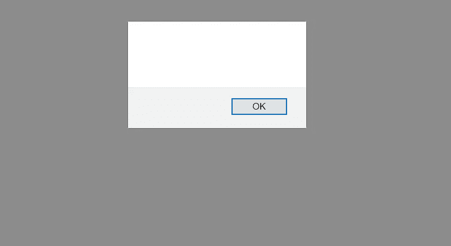

# 我是如何利用一个有趣的 CSRF 漏洞将赛尔夫·XSS 变成持续攻击的？

> 原文：<https://infosecwriteups.com/how-i-leveraged-an-interesting-csrf-vulnerability-to-turn-self-xss-into-a-persistent-attack-b780824042d2?source=collection_archive---------0----------------------->

大家好，今天我将讲述我如何利用一个有趣的 CSRF 漏洞将赛尔夫 XSS 变成一个持续攻击。

在试图寻找这个应用程序的缺陷时，我登陆了编辑个人资料页面。我测试了 name 字段中的 XSS，发现应用程序正在对尖括号进行编码。

但是 name 参数也反映了同一个页面上的 JS 上下文，所以我尝试这样做。

```
Akash'-alert()-
```

这将在不破坏上下文的情况下连接 alert 方法。



而且成功了。

但这只是一个无害的自我 XSS 漏洞，对不对？嗯，有一个邀请其他用户加入项目的功能。如果攻击者邀请某人参加他的项目，应用程序将发送一封电子邮件，提及邀请并提供项目链接。即使那个人决定忽略加入请求，他仍然会看到攻击者的姓名和电子邮件。

现在，这个想法是在一个帐户的名称字段中注入一个有效载荷，然后邀请受害者加入这个项目。当他搜索邀请他的人时，他的帐户中会触发 XSS 有效载荷，攻击者最终会通过向他控制的服务器发送 cookies 或通过编程更改他帐户的电子邮件来接管他的帐户。

我继续将此付诸实践，但结果是名称字段仅在攻击者的配置文件中易受攻击。在受害者端，应用程序安全地显示攻击者的名字，所以攻击者没有办法接管一个帐户，除非他发现并链接到另一个漏洞。

我真的想升级这个问题，所以我想检查应用程序是否容易受到登录和注销 CSRF 攻击。这个想法是将两个漏洞链接在一起，让受害者注销他的帐户，然后让他登录攻击者的帐户。一旦攻击者的账户登录，XSS 就会触发。

我继续测试 CSRF 漏洞。注销端点易受攻击，但我无法将其用于登录端点。经过仔细观察，我意识到令牌是在 cookies 和 POST 请求正文中发送的。根据我以前的知识，我知道有时候开发人员会忘记同步两个令牌。我检查了它们是否同步。幸运的是，他们没有，但我仍然不能利用它，因为应用程序期望令牌是一个实际的(有效的)令牌。

同样，根据我以前的知识，我知道有时应用程序有一个全局令牌池，并且会接受任何有效的令牌。简而言之，这意味着任何用户的令牌都可以用来策划一次成功的 CSRF 攻击。我想到的第一件事是检查未经身份验证的(用户没有登录任何帐户的阶段)用户的令牌是否有效以及它是否工作。

考虑到这一点，我编写了一个 PoC 代码，其中 *img* tag 会向注销端点发送一个 GET 请求，注销端点会将用户从其帐户中注销，然后使用 JS，登录表单会自动提交攻击者的凭据。一旦攻击者的帐户登录 XSS 有效载荷将触发，我们将成功地将两个漏洞链接在一起，以创造更大的影响。

```
<!DOCTYPE html>
<html>
<head>
    <title>PoC</title>
</head>
<body>

<form method="POST" id="csrfForm" action=LOGIN-ENDPOINT>
    <input type="hidden" name="csrf" value=OLD-CSRF>
    <input type="hidden" name="email" value=ATTACKER-EMAIL>
    <input type="hidden" name="password" value="ATTACKER-PASSWORD>
    <input type="submit" value="Submit">
</form>
<script type="text/javascript">
    document.getElementById("csrfForm").submit()
</script>
</body>
</html>
```

我希望你喜欢读这篇文章。如有任何问题，欢迎联系 [@0xAkash](http://twitter.com/0xAkash) 。你也可以在 twitter 上关注我，我会继续发布这些有趣的文章。