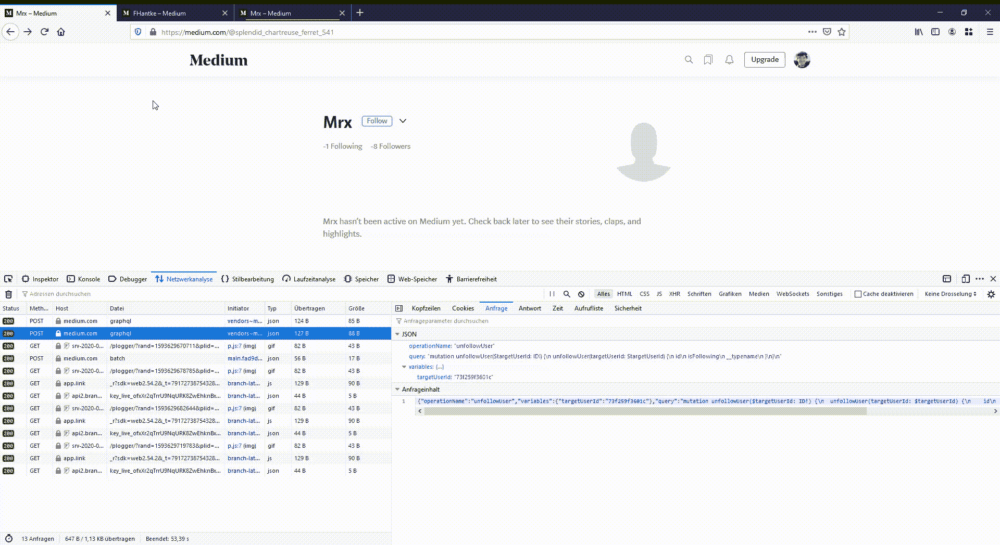

# 我如何在媒体上失去了我的追随者

> 原文：<https://infosecwriteups.com/how-i-lost-my-followers-on-medium-9fe10e9862aa?source=collection_archive---------2----------------------->

## 一份臭虫悬赏报告


我正在写一篇关于 Medium 的新文章，这时我开始拖延时间，看着这个网站产生的流量。我知道 Medium 上有一个 bug bounty 项目，我以前就被奖励过，我想也许我又一次幸运了，决定玩玩下面的和不下面的电话。

## GraphQL API

Medium 使用最初由脸书开发的 GraphQL 与他们的部分 API 进行通信，并向数据库通知 follow 和 unfollow 请求。为此，只需要目标 user-id，通过 auth cookies 验证用户身份。作为对请求的回答，服务器会用一个 JSON 对象作为结果进行回复，包括键“ *isFollowing* ”设置为 true 或 false。下面我们看到两个请求和响应:

```
Request:
POST /_/graphql HTTP/1.1
{
 "operationName":"followUser",
 "variables":{"targetUserId":"abc123"},
 "query":"mutation followUser($targetUserId: ID!) {\n followUser(targetUserId: $targetUserId) {\n id\n isFollowing\n __typename\n }\n}\n"
}Response:
HTTP/1.1 200 OK
{
 "data":{
  "followUser":{
   "id":"abc123",
   "isFollowing":true,
   "__typename":"User"
  }
 }
}Request:
POST /_/graphql HTTP/1.1
{
 "operationName":"unfollowUser",
 "variables":{"targetUserId":"abc123"},
 "query":"mutation unfollowUser($targetUserId: ID!) {\n unfollowUser(targetUserId: $targetUserId) {\n id\n isFollowing\n __typename\n }\n}\n"
}Response:
HTTP/1.1 200 OK
{
 "data":{
  "unfollowUser":{
   "id":"abc123",
   "isFollowing":false,
   "__typename":"User"
  }
 }
}
```

## 虫子

我的标准程序的一部分是重复 API 调用，看看会发生什么。我对上述操作做了同样的操作，并在我的测试帐户上进行了尝试。不幸的是，通过重新发送“followUser”操作来增加我的关注者数量并不奏效，然而，我很幸运有了“unfollowUser”。我可以重新发送这个命令，我的另一个帐户的关注者数量每次都会减少，即使我没有关注另一个帐户。另一方面，这也影响了我在个人资料中关注的账户数量。以下示例显示了此过程。它首先显示 Mrx 的跟随者号，然后是 [FHantke](https://medium.com/u/46ad409a9c9f?source=post_page-----9fe10e9862aa--------------------------------) 的跟随者号。在 DevTools 中重新发送数据包后，两个数字都会相应地改变。



bug 演示(点击放大)

## 影响

给这个 bug，这里有什么影响？我检查了真正的追随者是否受到影响，然而我所有的追随者保持不变，只有我的个人资料中显示的数字发生了变化。这意味着恶意用户可以操纵个人资料中显示的数字，甚至是负数，但这不会导致任何严重问题，如真正的追随者流失。尽管如此，虚假的追随者数量可能会产生误导，这样的 API 行为必须被报告。

## 报告

我在 2020 年 7 月 1 日发现了这个错误，并在当天晚上提交了它。08.07.2020 我收到他们的回复，确认了这个漏洞，并告诉我他们正在调查。两天后，也就是 10 号，我接到通知，漏洞已经修复，我得到了一笔可观的奖金。

再次感谢[中](https://medium.com/u/504c7870fdb6?source=post_page-----9fe10e9862aa--------------------------------)，有一个优秀的工作 Bug 赏金程序总是好的！