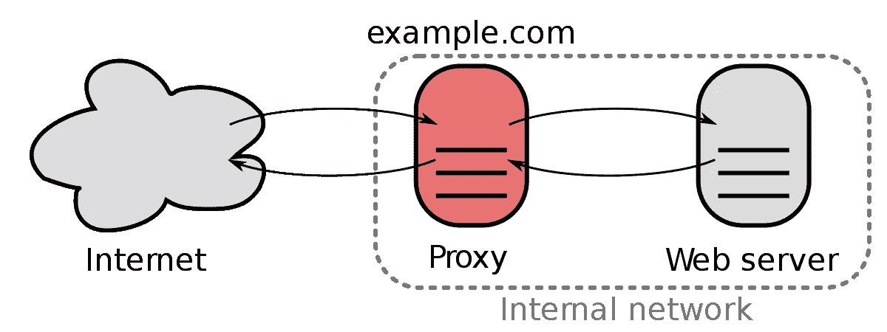
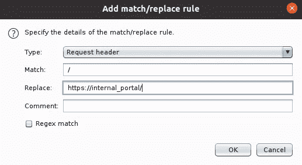
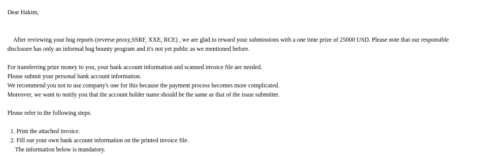

# 我如何用反向代理赚了 25000 美元

> 原文：<https://infosecwriteups.com/how-i-made-25000-usd-in-bug-bounties-with-reverse-proxy-d29dba4570d7?source=collection_archive---------0----------------------->

代理服务器是一种中介服务器，它将来自多个客户端的内容请求通过 Internet 转发到不同的服务器。**反向代理服务器**是一种代理服务器，通常位于私有网络的防火墙后面，将客户端请求定向到适当的后端服务器。反向代理提供了额外的抽象和控制级别，以确保客户端和服务器之间网络流量的平稳流动。

基本反向代理

为什么用？

*   **负载平衡** —反向代理服务器可以充当“交通警察”，位于后端服务器的前面，以最大化速度和容量利用率的方式将客户端请求分布在一组服务器上，同时确保没有一台服务器过载，从而降低性能。如果一台服务器出现故障，[负载均衡器](https://www.nginx.com/solutions/adc/)会将流量重定向到剩余的在线服务器。
*   **Web 加速** —反向代理可以压缩入站和出站数据，并缓存通常请求的内容，这两者都可以加快客户端和服务器之间的流量流动。他们还可以执行额外的任务，如 SSL 加密，以减轻您的 web 服务器的负载，从而提升他们的性能。
*   **安全性和匿名性** —通过拦截发往后端服务器的请求，反向代理服务器可以保护它们的身份，并作为抵御安全攻击的额外防御手段。它还确保可以从单个记录定位器或 URL 访问多个服务器，而不管您的局域网的结构如何。

所以基本上我升级了一个反向代理到内部服务器上的 2 个 SQLi 和 3 个 RCE，还有一些其他的问题。发现存在信息披露等问题。

要找到反向代理，您可以更好地使用 Burp 或 DNSBIN 来捕获 DNS 请求。

您需要像这样修改请求

GET/HTTP/1.1
Content-Length:95
Content-Type:application/x-www-form-urlencoded

到

GET[HTTP://burpcollaborator _ URL](http://burpcollaborator_url)HTTP/1.1
Content-Length:95
Content-Type:application/x-www-form-urlencoded

然后你需要检查 DNS 响应，但是要过滤掉你得到的大量 WAF 和手动 pingbacks，因为大多数时候是假阳性的

如果你只得到一个 DNS 响应而不是 HTTP 响应，不要放弃。这意味着同一内部门户上的其他端口可能是可访问的，只是不是 80 或 443。或者一些内部站点不能被反向代理显示。您可能需要添加一个假装有效的 url 或子域。

一旦您访问了内部资产，您需要使用反向代理，并像测试外部网站一样测试它

打嗝技巧，能够从浏览器浏览内部网站

当然是一个大的探索和许多旁路组合尝试喜欢:

获取[https://external _ site . com @ internal _ site:4566](https://external_site.com@internal_site:4566)http 1/1 等

我相信这还没有被完全探索，即使这种类型的错误并不新。可能会发现类似的问题与另一个名称或攻击工作与其他技术。像反向代理也可以通过另一个 url 解析器问题等被利用。但是我鼓励大家多看看这里。

攻击者只需要创建一个特殊的 URL ( `/img/..%2faccount/attacker/`)，因此 Nuster 应用了一个“主动缓存”规则，尽管如此，web app 还是会返回一个自身 XSS 的响应(它看到了'/account/attack/`)。具有 XSS 有效负载的响应将被 Nuster 缓存(使用 key: Host + `/img/..%2faccount/attacker/`)，因此攻击者将能够滥用该缓存来 XSS 攻击 web 应用程序的其他用户。从自我 XSS，我们有一个通常的 XSS。