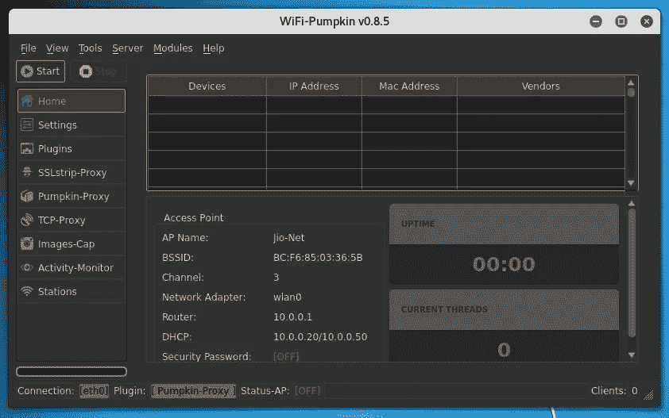
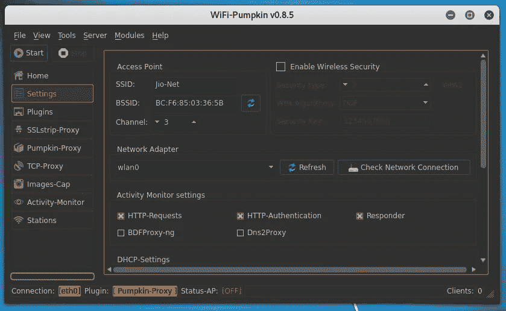
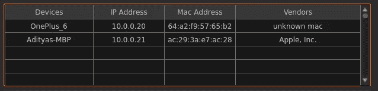
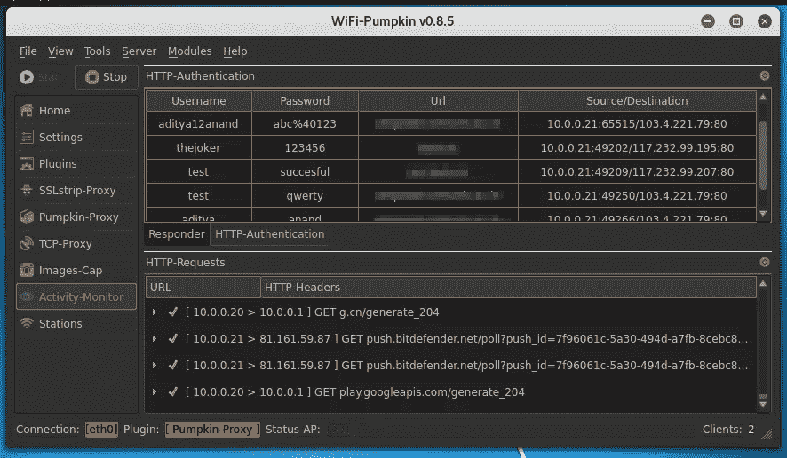

# 我如何制造一个假的接入点来获取登录凭证？

> 原文：<https://infosecwriteups.com/how-i-made-a-fake-access-point-to-harvest-login-credentials-6898efb96b3b?source=collection_archive---------0----------------------->

这篇文章是我上一篇文章的延续。

> [我是如何侵入邻居的 WiFi 并获取登录凭证的？](https://medium.com/bugbountywriteup/how-i-hacked-into-my-neighbours-wifi-and-harvested-credentials-487fab106bfc)

你过一遍更好，但还是让我简单给你解释一下。我通过字典攻击破解密码，侵入了一个 wifi 网络，然后监控流量。这种攻击的唯一问题是它不能保证一直有效，因为字典攻击不会有效。其中一位读者提出了这个问题。

其中一条评论

这让我想到了其他可能的情况，我可以获得人们的流量，而不必依靠运气，比如他们使用简单的密码或 WEP 连接等。这时候，我突然想到，如果我创建一个假的接入点，并使用它来获取登录凭证。

# 让我们开始吧！

整个想法是创建一个免费的 wifi 点，没有任何密码。授予任何与它有联系的人访问权限。现在它不需要任何密码，任何打开 wifi 的人都会自动连接到这个假的 wifi 点，所有的赠品肯定会被它吸引。

所以，我要做的第一件事就是创建一个假的接入点。为此，我使用了名为 [wifi 南瓜](https://github.com/P0cL4bs/WiFi-Pumpkin)的工具。这个工具最好的一点是，它让你以难以置信的简单性设置一个假的接入点。一旦你将工具从 Github 仓库克隆到你的 Kali 机器上，只要确保你已经在你的 Kali 机器上安装了 hostapd，因为它需要这样做。

主页选项卡

WiFi-Pumpkin 的 GUI 版本看起来有点像侧图。您可以根据需要轻松设置整个网络功能。

设置假接入点所需的一切都可以在“设置”标签下找到。

在这里，您可以配置 wifi 的名称，为其提供 BSSID，您希望它在哪个频道上工作，选择网络适配器和许多其他功能。您可以继续并分配 IP 范围，活动，你想监测等。

设置选项卡

因此，在所有的配置完成后，你可以继续启动假 wifi。最好用一个普通的名字来设置假 wifi 点，如“免费 Wifi”或“Jio-Net”或附近商店的名称或类似的名称。它有助于与用户建立信任，这样他们就会毫不犹豫地使用你的假 wifi 点。一旦你启动你的 wifi 点，设备开始连接，所有的设备都会列在“主页”标签中。

设备列表

你可以在“Activity-Monitor”选项卡中查看所有日志，它有用户在任何 http 网站上的所有登录，它有用户在连接到你的假接入点时访问的每个网站的日志。

网站日志和登录凭证

你可以通过在“插件”标签下使用不同的插件来提高黑客的水平，它有许多先进的工具，其中之一是键盘记录器。在“Images-Cap”下，您可以查看用户正在访问的网站上加载的所有图像。

这使您可以完全访问使用您的 WiFi 点的用户的所有详细信息。你不可能在一个网络上进行比这更好的攻击(这是我的观点)。

# 道德的

所以，这里最基本的事情是永远不要使用免费 wifi 点，除非你完全信任它。网络上的任何人都可能嗅探你的流量，而你永远不会知道，直到为时已晚。

无论何时登录银行网站或你的社交网络账户，都要确保你使用的是可信的网络，或者更好地使用你手机上的数据。这将在很大程度上保证您的安全，不会发生不必要的数据泄露。

如果你喜欢，请鼓掌让我们合作吧。获取、设置、破解！

网址:【aditya12anand.com】T2|捐赠:【paypal.me/aditya12anand】T4

电报:[https://t.me/aditya12anand](https://t.me/aditya12anand)

推特:[twitter.com/aditya12anand](https://twitter.com/aditya12anand?source=post_page---------------------------)

领英:[linkedin.com/in/aditya12anand/](https://www.linkedin.com/in/aditya12anand/?source=post_page---------------------------)

电子邮件:aditya12anand@protonmail.com