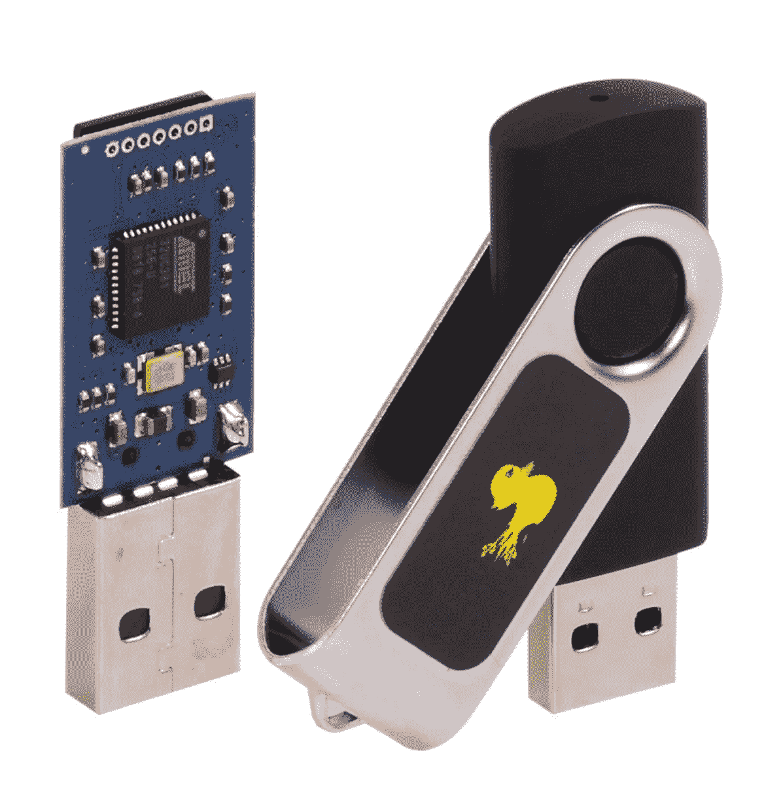
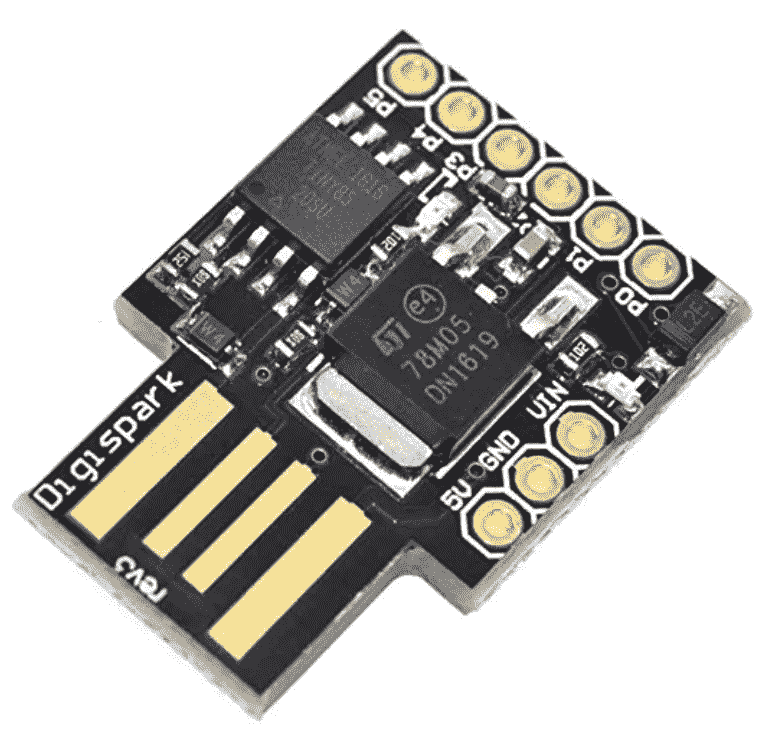
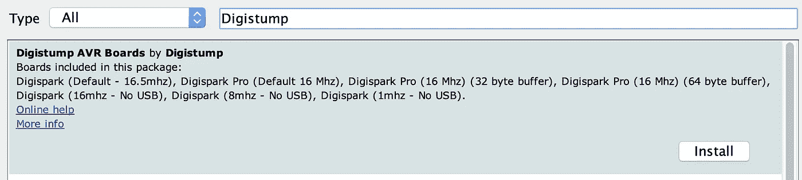
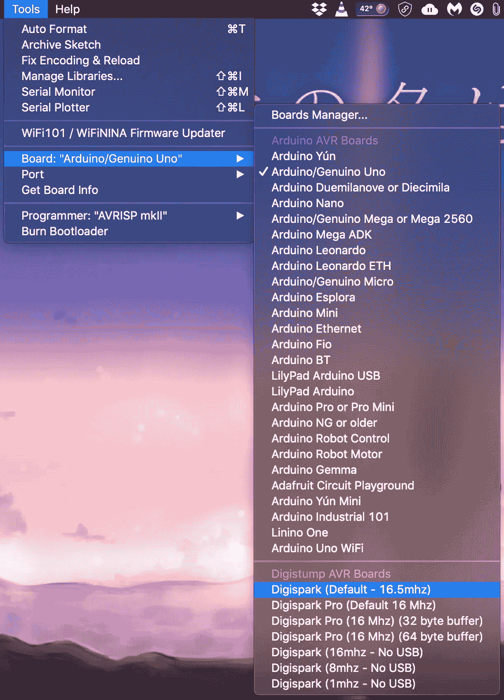

# 我如何制作一个可编程的黑客 USB 设备来渗透电脑？

> 原文：<https://infosecwriteups.com/how-i-made-a-programmable-hacking-usb-device-to-infiltrate-pcs-449726c5b23d?source=collection_archive---------0----------------------->

> 所以我在那里，这是一个极其关键的时刻。我就站在系统旁边，但什么也做不了，因为房间里还有其他人。获得这台机器的访问权限可以改变我的一切，我希望我可以只插入一个 usb 设备或可以在 10 秒内完成工作的东西，然后我可以不留痕迹地删除它。

你是否曾经有过我上面描述的那种感觉，当你在短时间内访问一个系统，想要执行一组特定的命令，但是在这种情况下却做不到。那么这篇文章是你的必读之作。

# 什么是 BadUSB？

BadUSB 只不过是一个芯片组，它被配置为充当键盘，具有一组预编程的击键，一旦插入系统，这些击键就会激活。这是关于 BadUSB 的最简单的定义之一。现实可能比这要复杂一点。



橡胶鸭子

HAK5 网站上的橡皮鸭是最著名的 BadUSB 产品之一，需求量很大。它们被设计成一个键盘，所以系统马上识别它，然后运行预编程的击键，可以超过 1000 字/分钟的打字速度。

但是，任何一直关注我的文章的人都知道，像我这样一贫如洗的人不会买这个。所以，我试图找出一种方法来创造这样的东西，不是那么有效，但足够接近。

# 让我们开始吧！

因此，为了了解背景发生了什么，我读了几篇文章，意识到芯片组 [Digispark ATTINY85](https://www.amazon.in/CIRCUIT-SYSTEMS-Digispark-Kickstarter-Development/dp/B07FYZQLQR?tag=googinhydr18418-21&tag=googinkenshoo-21&ascsubtag=_k_EAIaIQobChMI4oex2o6H4AIV17WWCh2qzAdVEAQYAiABEgK52_D_BwE_k_&gclid=EAIaIQobChMI4oex2o6H4AIV17WWCh2qzAdVEAQYAiABEgK52_D_BwE) 可以用来复制橡胶鸭子执行的行为，并可以被当作键盘来执行某些命令。

该芯片组可以使用 Arduino IDE 进行编程，然后当它插入 PC 时，可以执行这些命令。

第一步:

我们必须下载并安装 Digispark ATTINY85 芯片组所需的驱动程序。点击这个[链接](https://github.com/digistump/DigistumpArduino/releases/download/1.6.7/Digistump.Drivers.zip)，下载你需要的 32 位或 64 位版本的文件。



Digispark ATTINY85

第二步:

下载最新版本的 Arduino IDE，您将在其中编写芯片组编程代码，请访问此[链接](https://www.arduino.cc/en/main/software)。根据您使用的操作系统下载 IDE。

第三步:

一旦下载了 Arduino IDE，打开它，然后进入**文件**->-**首选项**。在名为“附加 Boards Manager URLs”的输入字段中，输入以下 URL。

> [http://digistump.com/package_digistump_index.json](http://digistump.com/package_digistump_index.json)


第四步:

完成以下操作后，进入**工具**->-**电路板**->-**电路板管理器**。在这里点击搜索过滤器并输入 **Digistump AVR Boards** 软件包将出现在下面，然后点击右上角的 install。



安装这个可能需要一点时间，取决于你的网速。



第五步:

这是你开始编程前需要执行的最后一步，进入**工具** - > **板。**向下滚动直到看到 **Digispark(默认-16.5 MHz)**选项，然后点击选择它。

当您在 Arduino IDE 上编码时，您需要执行这些步骤来正确地设置您的系统，以便相应地工作。这种设置可能需要一点时间，但它可以用来在非常短的时间内自动完成许多设置，节省大量宝贵的时间，您可能不想在笔式测试或类似的事情中失去这些时间。

第六步: (编程)

现在，所有的步骤都已经正确执行了，接下来打开 Arduino IDE，输入你希望芯片执行的程序。ATTINY85 芯片组的程序与橡皮鸭的程序稍有不同。

这里有一个脚本，可以帮助你在当前的 windows 10 上用管理员权限打开 cmd。

```
#include "DigiKeyboard.h"
void setup() 
{ 
 // leave it empty
}void loop()
{
 DigiKeyboard.delay(5000); // time is measured in milliseconds
 DigiKeyboard.sendKeyStroke(0, MOD_GUI_LEFT); // open windows menu
 DigiKeyboard.delay(1000);
 DigiKeyboard.print(“cmd”); // to search for command prompt
 DigiKeyboard.delay(1000);
 DigiKeyboard.sendKeyStroke(KEY_ENTER, MOD_CONTROL_LEFT | MOD_SHIFT_LEFT);
 DigiKeyboard.delay(1000);
 DigiKeyboard.sendKeyStroke(KEY_ARROW_LEFT);
 DigiKeyboard.sendKeyStroke(KEY_ENTER);
 for(;;) { } // to stop executing the loop
}
```

一旦上述代码被放入 Arduino IDE，然后编译它，不要插入芯片组，直到它提示一条消息，这应该需要几秒钟你第一次运行脚本。当它提示插入芯片组的消息时，继续插入。让魔法开始吧！

# 道德的

要防止上述攻击，请遵循以下规则:

a)密切监视您的设备，禁止不受信任的人实际接触您的机器。

b)您可以使用这些端口拦截器来阻止刚刚经过的人将 usb 设备插入您的系统，要购买请点击此[链接](https://www.amazon.in/Lindy-USB-Port-Blocker-Green/dp/B000I2JWJ0)。

c)你可以使用 [duckhunt](https://github.com/pmsosa/duckhunt) ，根据自动脚本输入命令的速度来检测它，然后完全停止它。

还有其他的技巧和窍门来阻止对你的设备的攻击，查看一下[这里](https://www.youtube.com/watch?v=Vq0kUxslp80)。

如果你不明白上面的解释，想要一个视频教程来指导你，请访问[这里](https://www.youtube.com/watch?v=fGmGBa-4cYQ)。

如果你喜欢，请鼓掌让我们合作。获取、设置、破解！

网址:[aditya12anand.com](https://www.aditya12anand.com/)|捐赠:[paypal.me/aditya12anand](https://paypal.me/aditya12anand)

电报:[https://t.me/aditya12anand](https://t.me/aditya12anand)

推特:[twitter.com/aditya12anand](https://twitter.com/aditya12anand?source=post_page---------------------------)

领英:[linkedin.com/in/aditya12anand/](https://www.linkedin.com/in/aditya12anand/?source=post_page---------------------------)

电子邮件:aditya12anand@protonmail.com