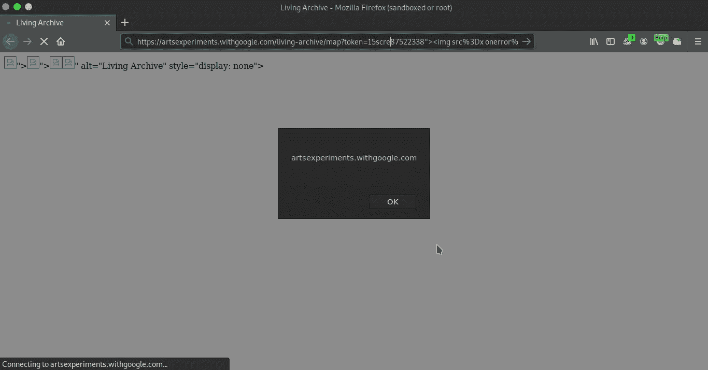
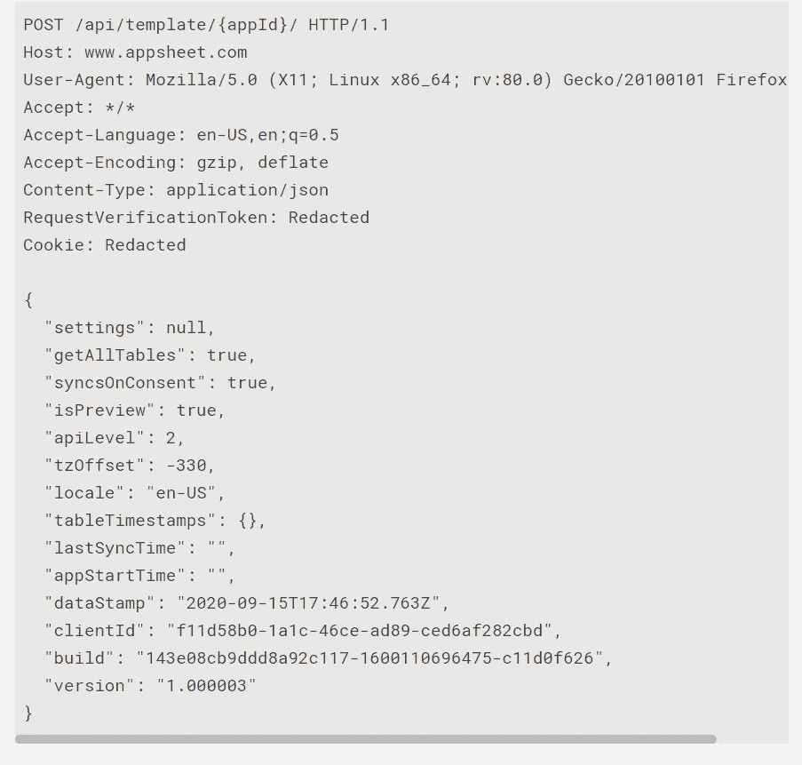
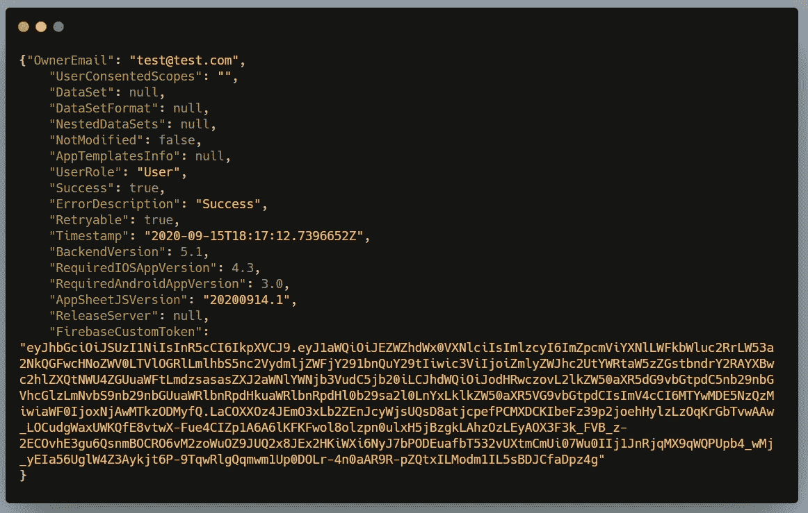
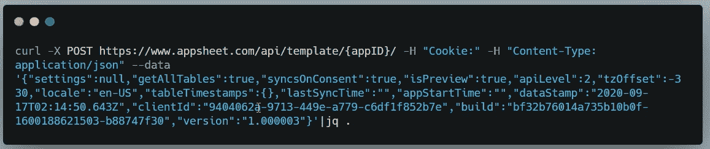

# 我是如何到达 Google HOF 的？

> 原文：<https://infosecwriteups.com/how-i-made-it-to-google-hof-f1cec85fdb1b?source=collection_archive---------0----------------------->

嘿，大家好，

我知道我已经很久没有分享我的发现了，很抱歉，我现在回来了，不要担心:)

在这篇文章中，我将谈论我提交给谷歌 VRP 的一些有效的错误，因为它们已经被修复，现在我可以分享细节了。

一个 bug 是 withgoogle.com 子域中的一个简单的反射 xss，我可以使用简单的自动化找到它，另外两个是我在 appsheet.com 找到的 IDORs，这是谷歌的收购。

不浪费任何时间，让我们开始吧！

# artsexperiments.withgoogle.com 的 XSS

过去我一直使用这个简单的脚本来寻找一些简单的 xss，我在这里使用了两个工具，一个是 Paramspider，另一个是 kxss。

作为输入，我为脚本提供一个包含子域列表的文件名，然后使用 for 循环逐个遍历子域列表，并查找其中包含参数的任何 URL。然后，它将输出通过管道传输到 kxss 工具，该工具会查找某些字符的反射，如“，>，

[](https://github.com/devanshbatham/ParamSpider) [## devanshbatham/ParamSpider

### Finds parameters from web archives of the entered domain. Finds parameters from subdomains as well. Gives support to…

github.com](https://github.com/devanshbatham/ParamSpider) [](https://github.com/tomnomnom/hacks/tree/master/kxss) [## tomnomnom/hacks

### A collection of hacks and one-off scripts. Contribute to tomnomnom/hacks development by creating an account on GitHub.

github.com](https://github.com/tomnomnom/hacks/tree/master/kxss) 

I just collected the list of subdomains of withgoogle.com and then passed it to this script and found that “,>，

Here is the url: [https://artsexperiments.withgoogle.com/living-archive/?token=158753034](https://www.google.com/url?q=https://artsexperiments.withgoogle.com/living-archive/?token%3D158753034&sa=D&usg=AFQjCNEQz64Oasdzq64DAeTLO3G42aLyMw)

您可以在这里使用任何常见的有效负载，例如:

```
“>
```



现在转到伊多尔

# appsheet.com 的伊多

我正在读这篇文章:[https://medium . com/bugbountywriteup/the-short-tale-of-two-bugs-on-Google-cloud-product-Google-VRP-resolved-47c 913 DCA 8 fc](https://medium.com/bugbountywriteup/the-short-tale-of-two-bugs-on-google-cloud-product-google-vrp-resolved-47c913dca8fc)(遗憾的是作者已经删除了他的文章)

从这篇文章中，我了解了谷歌 VRP 范围内的 Appsheet，作者在那里分享了 IDOR 的细节。

所以我决定找同样的，你可能听过 [Zseano](https://twitter.com/zseano) 说:“ ***如果有一个 IDOR…就会有更多的*** ”

我没想到我会这么容易就找到一个和其他黑客在他的文章中提到的相似或相同的 id，这没花我一个多小时。

端点相同，参数也相同，唯一不同的是请求方法。

这是 https://www.appsheet.com/api/template/{appId}/的端点，我发现 IDOR 在 GET 方法中是固定的，但是相同的 IDOR 仍然存在于 POST 方法中，在请求的主体中也有一些数据。

这是我找到 IDOR 的完整请求:



在回应中，你将获得该应用程序的所有细节，包括所有者的电子邮件，firebase 令牌等。



截断响应

我很快提交了报告，我收到了团队的回复，他们不能为他们复制 IDOR，因为当他们在此请求中使用其他用户的 appId 时，会出现禁止的错误。

然后，我提供了额外的信息，并且为了帮助他们容易地重现 bug，我给了他们一个 appId 列表以及一个 curl 请求，其中包含我的 cookies。



最后，我的报告被接受了，第二天他们就支付了 500 美元的奖金，这真是太快了。

故事还没有结束，等待高潮。

4 个月后，我收到了谷歌团队的回复，称:

```
This might not be actually a bug , they told me to look at my app settings to verify few things like which users are allowed to view my app(whether it's set to public or not),etc
```

我回答说我使用默认设置，没有做任何改变。

他们又回答说:

```
It seems that what you reported might be working as intended and that there is **no security vulnerability** and we were just confused.
```

因为我也很困惑，不知道事情会怎样发展，所以我回答他们:

```
Hey XXXX,Can you provide me with an appId which I shouldn't have access to?If I am able to get the information related to that appId than this is indeed a bug which should be fixed or else if that's not the case you can close this report as intended behaviour.RegardsSudhanshu
```

我把它作为一个挑战，谷歌团队提供了一个 appId，启动了我的 burpsuite，我得出结论，我也得到同样的错误

```
Your account sudi***@gmail.com id 2342347 does not have access to XXXX-1422495.
```

我告诉他们，是的，他们是对的，这不是一个错误，因为我无法查看任何与他们的应用程序相关的信息。在知道这实际上不是一个 bug 之后，我感觉不太好，他们仍然错误地给了我奖金。

第二天，我决定再次查看 appsheet.com，这次是为了找到一个有效的 bug。我创建了一个新的应用程序，在体验了它的功能之后，不知道为什么我决定再次检查这个 IDOR。

我拿了谷歌团队成员给我的 appId 并发送了请求，这次成功了！我可以看到他们申请的细节。

呜！！但是我不知道它是如何工作的

我再次回答他们:

```
Kindly ignore the previous message where I told that I wasn't able to get the information for your app.Today I tried again and I was able to get information for your app.
Well well I am pretty sure this is your email only lastName[.firstName@gmail.com](mailto:straka.martin@gmail.com) :)
```

仔细查看请求体参数值后，与之前相比，唯一不同的是版本。

当我在帖子正文中第一次确认这个 IDOR 时，*版本*参数值被设置为`1.00003`

而第二天我用新的 app 尝试的时候，*版本*参数值是`1.000010`

```
{
  "settings": null,
  "getAllTables": true,
  "syncsOnConsent": true,
  "isPreview": true,
  "apiLevel": 2,
  "tzOffset": -330,
  "locale": "en-US",
  "tableTimestamps": {},
  "lastSyncTime": "",
  "appStartTime": "",
  "dataStamp": "2021-01-17T11:32:42.705Z",
  "clientId": "4d9ef5e1-5cb0-400f-b432-660adcd24739",
  "build": "edf35e60c1c1fcaaa72a-1610841603810-bd06078",
  "version": "1.000010"
}
```

在注意到这个小小的差异后，我得出结论，为了让这个 IDOR 工作，我们需要提供与应用程序相关的特定版本。

也就是说，我的应用程序的版本是`1.00003`，而谷歌员工的应用程序的版本是`1.000010`

由于版本的差异，我们都不能正确地重现错误，因为现在一切都很清楚了，我再次向他们解释了一切。

这是我给他们解释后收到的回复:

```
Hi Sudhanshu,

Nice, that's my testing application! Definitely a bug - thanks!

Regards,
XXXX, Google Security Team------------------------------------------------------------------- Hi Sudhanshu,

Thanks again for your report. I can confirm that this is indeed a valid bug. I've also sent this report again to the VRP panel so they can have a look again.

Regards,
XXXXX, Google Security Team
```

这之后我真的很高兴，因为我证明了我的 bug 是有效的。

几个星期后，错误被修复，令人惊讶的是，他们还奖励了 500 美元(这是我完全没有想到的)。

我谈到的另一个例子是在这个终点:[https://www.appsheet.com/api/loadApp/{appId}/?检查一致性=真](https://www.google.com/url?q=https://www.appsheet.com/api/loadApp/%7BappId%7D/?checkConsistency%3Dtrue&sa=D&usg=AFQjCNGKcIjIPJyAKHvEtyQDLmaVloiocQ)

这里的回复中披露的信息没有任何敏感信息，如所有者的电子邮件等，所以尽管他们解决了这个问题，但没有奖励第二个 IDOR。

故事到此结束。

非常感谢，如果你一直读到最后，真的很感谢你的时间。

Syaa 每个人