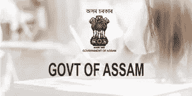
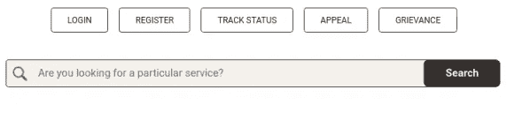
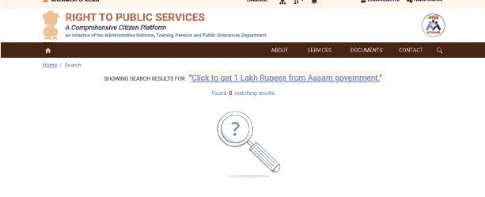

# 我如何通过政府网站免费提供 10 万卢比？

> 原文：<https://infosecwriteups.com/how-i-offered-free-1-lakh-rupees-through-government-website-6c10e16130fc?source=collection_archive---------2----------------------->

嘿，黑客们，我是克里希纳德夫·P·梅勒维拉，一名 19 岁的自学成才的网络安全研究员。

今天我要写一篇关于我在阿萨姆网站上发现的一个导致社会工程范围的 bug 的报告。



所以让我们开始吧，

该网站名为[https://rtps.assam.gov.in/](https://rtps.assam.gov.in/)，由国家信息中心维护。

从攻击者的角度再现的步骤:

1.  前往 https://rtps.assam.gov.in/[的](https://rtps.assam.gov.in/)，在那里你可以看到如下的搜索表单



2.输入要搜索代码，然后单击搜索:

```
<a href="https://krishnadevpmelevila.com/Vulnerablity-Proof">Click to get Rs.100000/- from Assam government.</a>
```

3.现在我们将得到如下所示的窗口。那就是我们已经成功地注入了一个到网站的链接



4.现在复制页面的网址:【https://rtps.assam.gov.in/site/search? service _ name = % 3Ca+href % 3D % 22 https % 3A % 2F % 2fkrishnadevpmelevila . com % 2fvulnerability-Proof % 22% 3e click+to+get+1+Lakh+卢比+from+Assam+政府。%3C%2Fa%3E

5.这些都是成功进行社会工程所需要的。但是，为了增加受害者的信任，攻击者可以使用类似 Bitly 的链接缩短服务，并缩短链接，如下所示:[https://bit.ly/3iXplds](https://bit.ly/3iXplds)

6.现在，当受害者点击该链接时，它首先进入阿萨姆邦政府网站，受害者将看到类似“点击这里从阿萨姆邦政府获得 10 万卢比”(或根据攻击者所写的)的提议，一旦受害者点击该链接，受害者将被重定向到钓鱼页面或任何其他恶意页面。

通过这种方式，攻击者可以诋毁阿萨姆邦政府网站，并将用户重定向到任何恶意网站。

根据我在 2021 年 10 月 13 日的报告，国家信息中心正在修补这个漏洞，现在 HTML 注入是不可能的。

***别忘了在 medium 等社交媒体上关注我。***

*我的 Instagram 手柄:*[*https://instagram.com/krishnadev_p_melevila*](https://instagram.com/krishnadev_p_melevila)

*我的推特句柄:*[【https://twitter.com/Krishnadev_P_M】T21](https://twitter.com/Krishnadev_P_M)

*我的 LinkedIn 手柄:*[*【https://www.linkedin.com/in/krishnadevpmelevila/】*](https://www.linkedin.com/in/krishnadevpmelevila/)

*我的网络安全课程售卖网站:*[*https://learn.nodeista.com/*](https://learn.nodeista.com/)

*我的人事网站:*[*http://krishnadevpmelevila.com/*](http://krishnadevpmelevila.com/)

推特—[https://twitter.com/InfoSecComm](https://twitter.com/InfoSecComm)

中型-[https://infosecwriteups.com/](https://infosecwriteups.com/)