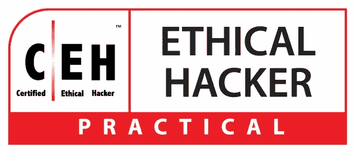
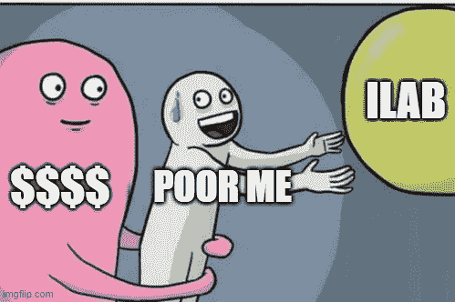
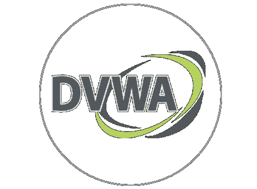
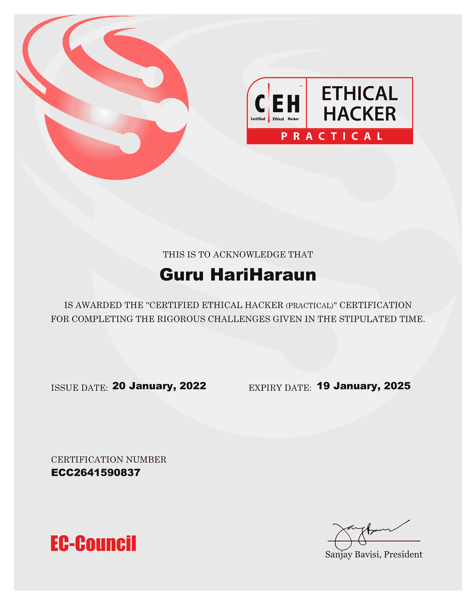
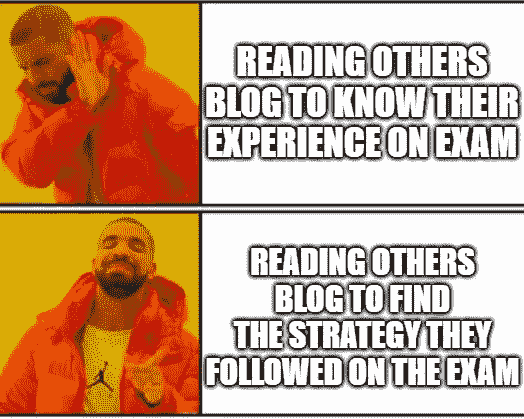
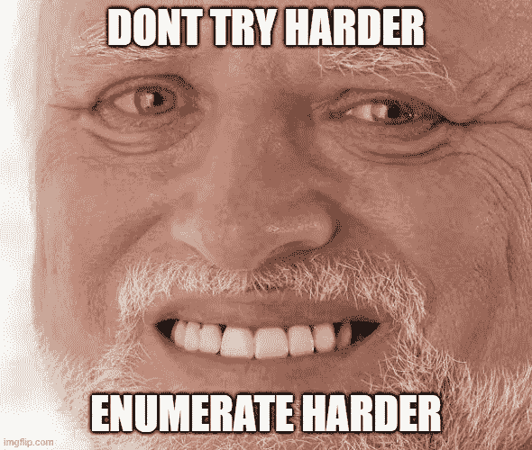
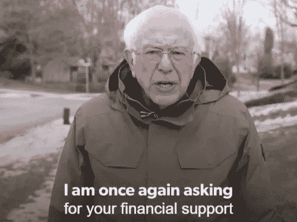

# 我是如何在第一次尝试中通过 CEH(实用)的

> 原文：<https://infosecwriteups.com/how-i-passed-ceh-practical-in-my-first-attempt-647926a3a0ac?source=collection_archive---------1----------------------->

认证|道德黑客的标志(实用)

大家好。我是 [Guru HariHaraun](https://thegurusec.com/) ，21 岁。在这个博客中，我将与你分享我在 4 小时内通过 CEH 考试的秘密策略。在接下来的 8 分钟里，你将会了解什么是 CEH(实用)，谁可以面对这场考试，你如何才能在这场考试中获得高分，以及我的秘密考试策略。

> **注意:**我创建了自己的笔记，因为它会用我在准备和考试中使用的所有工具、技巧和程序笔记来指导你。一定要去看看！因为所有的技术术语都可以在笔记中找到。[https://book . the gurusec . com/certificates/certified-ethical-hacker-practical](https://book.thegurusec.com/certifications/certified-ethical-hacker-practical)

 [## 认证道德黑客(C|EH)(实用)

### 这篇笔记将指导你我在准备和整个考试过程中使用的所有方法、技巧和策略…

book.thegurusec.com](https://book.thegurusec.com/certifications/certified-ethical-hacker-practical) 

# 认证道德黑客(实用)| C|EH(实用)

认证道德黑客(实践)是一个六小时的严格考试，要求展示道德黑客技术的应用，并在给定的有限时间内解决安全审计挑战，就像在现实世界中一样。该考试由一个经验丰富的 SME 小组开发，其中包括 20 个真实场景，问题旨在验证 C|EH 计划中概述的道德黑客领域所需的基本技能。它不是模拟考试，而是通过使用真实的虚拟机、网络和应用程序来模拟真实世界的企业网络，旨在测试道德黑客技能。

# CEH 实践考试信息:

*   **考试名称**:认证道德黑客(实用)
*   **挑战数量:** 20
*   **考试基础设施:** iLabs(基于浏览器)
*   **测试交付**:在线和在你舒适的地方
*   **及格分数:**70%(20 次挑战中的 14 次)
*   **测试时间:** 6 小时(有 15 分钟的休息时间)

# CEH 实践考试详情:

*   考试由监考人使用 [GoToMeeting](https://www.goto.com/meeting) (网络会议&在线会议软件)进行全程监督，网络摄像头、麦克风、屏幕流应在整个考试期间打开并记录。
*   考试完全在 iLab 上进行，这是一个基于浏览器的环境。因此，您无需担心拍摄虚拟机快照。
*   2 个虚拟机提供给用户使用: **Parrot OS** (是的你听到了，没有更多的 Kali😓)& **Windows 7。**
*   这是一个完全开放的考试，所以我们可以在网上搜索资料，做笔记，可以看教程，阅读博客，但不要做的是，不允许手写笔记，不应该联系别人和打电话。
*   您的计算机将无法访问互联网。你必须使用你的浏览器来访问它。

# 先决条件:

1.  基本的 Linux 知识。
2.  愿意学习东西。
3.  谷歌是我的朋友，基本的谷歌知识。
4.  做笔记。Manh，我无法表达做笔记有多重要。这个习惯会在你生活的每一个场景中帮助你。

# 准备天数:

有趣的是，我以前有信息安全行业的经验和知识，这不会让你失望，因为这个考试部分从头开始。

如果你有💰你可以负担得起 iLab，因为考试中可能出现的挑战是基于实验活动的。由于我买不起 iLab，我拿着工具列表，在 TryHackMe & HackTheBox 上练习它们。这个考试是关于你对工具有多少了解。Pablo Gallardo 在下面的链接中提供了 iLab 中使用的工具

 [## 按黑客阶段列出的 CEH iLabs 中的工具列表

### 根据一些人进行了认证道德黑客(CEH)实践考试，他们说，大多数的…

diarium.usal.es](https://diarium.usal.es/pmgallardo/2020/12/13/tools-for-ceh-practical/) 

# 该死的易受攻击的 Web 应用程序(DVWA)

该死的易受攻击的 Web 应用程序(DVWA) —徽标

该死的易受攻击的 Web 应用程序(DVWA)是一个 PHP/MySQL web 应用程序，非常容易受到攻击。DVWA 旨在练习一些最常见的网络漏洞，难度各不相同。DVWA 是 C|EH(实践)考试中的主要角色之一。建议破解 DVWA 并习惯这个盒子，因为挑战可能基于这个盒子上的可用挑战而出现。

> **注:**我所遵循的工具、方法、过程都记录在 GitBook 中。可以在这里查看:[https://book . the gurusec . com/certificates/certified-ethical-hacker-practical](https://book.thegurusec.com/certifications/certified-ethical-hacker-practical)

 [## 认证道德黑客(C|EH)(实用)

### 这篇笔记将指导你我在准备和整个考试过程中使用的所有方法、技巧和策略…

book.thegurusec.com](https://book.thegurusec.com/certifications/certified-ethical-hacker-practical) 

# 考试经历:

啊！我猜，我希望你们都在等这一节！

我通过他们的客户支持仪表板将我的考试安排在 2022 年 1 月 20 日美国东部时间凌晨 01:30，因为他们的考试安排程序出现了问题。希望现在他们已经解决了这个问题。

所以，在考试那天，我登录我的电脑，等待他们告诉我他们将在考试开始前 15 分钟发送的会议链接。正如他们所说，我获得了 GoToMeeting 的链接，监考人开始了他们的过程，她告诉我考试期间不允许使用**双显示器**😮。我发疯了，因为它完全影响了我工作流程的速度，最终我习惯了。然后，她验证了我的身份，现在考试开始。

首先，我开始了我的扫描阶段，因为它可能需要一些时间，因为扫描整个 IP 子网可能需要几分钟。在那段时间里，我开始经历所有的挑战。

> “从外行的角度解读你的挑战目标”

分析完挑战后，我开始了我的黑客生涯。我花了 4 个小时破解了所有 19 个问题。自从我因为误解挑战而穿过一些兔子洞。在解决了所有的挑战后，我去了最后一个挑战，我没能拿到旗子。由于我的注意力不集中，几乎花了 45 分钟才找到旗子，并在 4 小时 45 分钟内完成了考试。

在我完成考试后，监考人把我带到我的考试分数面板，惊讶地看到我解决了所有的挑战并拿到了我的证书🎉🥳

# 我的证书副本

认证道德黑客结业证书(实用)

# 我的秘密策略

哦嘿嗨！欢迎来到博客最令人期待的部分😁。是的，当我准备考试的时候，我在别人的博客上搜索这个部分，最终，一些人帮助了我。在这一部分，我将揭示我遵循的秘密策略，它最终加速了你的过程。

> **注意:**我不能把考试问题作为秘密给你，但我可以用复活节彩蛋来帮助你，它可以帮助你更快更有效地破解。

*   首先在 parrot os 上开始 **Nmap 扫描**转移到 windows 机器并启动**Zenmap(Nmap 的 GUI 版本)**。原因是在 Parrot OS 中，你可能会发现很难解析所有的 IP，因为终端的绿色可能会淹没你。相反，Zenmap 图形用户界面将有助于找出服务，操作系统运行在一个可爱的用户界面的 IP。相信我，这将会是你考试的一个重大转折点。我知道作为一名渗透测试人员在终端上工作很酷，但在最激烈的时刻，基于浏览器的虚拟机会让你紧张。
*   此外，扫描 IPs 中的所有端口，因为人们比转储默认脚本更聪明。
*   您不必使用工具中可用的单词列表。他们为你提供了他们的**自定义单词列表**，分别对应于你正在执行攻击的模块。

*   对于暴力破解服务，我强烈推荐"**九头蛇&美杜莎"**
*   尝试解决基于安卓系统的 HTB 盒子，因为课程中有一整个模块是基于手机黑客的。
*   如果你不能解决这个挑战，或者这是一个耗时的挑战，那就进入下一个挑战。完成一些挑战后，回到你可能能够解决的错过的或耗时的挑战。
*   在你的学习阶段，不要跳过密码学和隐写术的模块。如果错过了那些模块，你可能会后悔。至少学会如何使用工具。

为什么只有越位？每个证书都基于此

*   我不能强调侦察和计数。这是为你的挑战找到旗帜的关键。尽可能多地收集细节。
*   提交答案，因为他们要求你提交答案是预先填充在他们的数据库中，所以如果你拼写错误或以错误的格式提交你的答案，那么你不能得到你想要的分数。
*   谷歌是你最好的朋友。想问什么就问什么，但不要问你所爱的人现在在做什么。

**我的资源:**

*   **我的数字笔记:**[https://book . the gurusec . com/certificates/certified-ethical-hacker-practical](https://book.thegurusec.com/certifications/certified-ethical-hacker-practical)

 [## 认证道德黑客(C|EH)(实用)

### 这篇笔记将指导你我在准备和整个考试过程中使用的所有方法、技巧和策略…

book.thegurusec.com](https://book.thegurusec.com/certifications/certified-ethical-hacker-practical) 

**其他行程及准备资源:**

*   [https://light Kun-yagami . medium . com/passed-EC-councils-certified-ethical-hacker-practical-20634 b 6 f0f 2](https://lightkun-yagami.medium.com/passed-ec-councils-certified-ethical-hacker-practical-20634b6f0f2)
*   [https://anontuttuvenus . medium . com/ceh-practical-exam-review-185 ea 4 cef 82 a](https://anontuttuvenus.medium.com/ceh-practical-exam-review-185ea4cef82a)
*   [https://veeppiaar . medium . com/EC-Council-ceh-v10-实践-考试-复习-1b6c75dafbe6](https://veeppiaar.medium.com/ec-council-ceh-v10-practical-exam-review-1b6c75dafbe6)
*   这个子编辑帮助你[https://www.reddit.com/r/CEH/](https://www.reddit.com/r/CEH/)
*   [https://scottymcraig.github.io/CEHv10StudyGuide/](https://scottymcraig.github.io/CEHv10StudyGuide/)
*   [https://diarium . usal . es/pm Gallardo/2020/12/13/tools-for-ceh-practical/](https://diarium.usal.es/pmgallardo/2020/12/13/tools-for-ceh-practical/)
*   这个 Github 库就是上帝！👇🏻

 [## GitHub -网络安全/指南-CEH-实用-大师

### 考试标题:认证道德黑客(实践)实践挑战数量:20 持续时间:6 小时可用性…

github.com](https://github.com/CyberSecurityUP/Guide-CEH-Practical-Master) 

> 如果你一直读到现在，那么你对你的考试是认真的！我非常相信你💪🏻。你可以毫无问题地通过这次考试。

# 验证我的徽章:

 [## 验证徽章|阿斯彭

### 认证细节:一个认证的道德黑客(实践)精通道德黑客技术，并已…

aspen.eccouncil.org](https://aspen.eccouncil.org/VerifyBadge?type=certification&a=BBDTKAK7dcB7IqnCSdTJc3kMsy5qYBLPzNgp9mAL4mM=) 

# 支持我:

> 你可以帮助这个花了几天时间建立这个博客的人& CEH 公共实用电子图书💝🥰

我花了很多精力写了这篇**认证道德黑客(实用)笔记&博客**，尽管他们不会给我任何报酬，但是如果有人愿意为我做贡献，我会更感激我自己，因为我可以用它来托管和维护服务器。

XD！

所以，如果你觉得我的资源有用，请一定在这里投稿😊🙏🏻🫂

 [## 古鲁·哈里哈伦

### 嘿👋🏻！我是一个咖啡迷。如果你能给我一个就太好了😁

www.buymeacoffee.com](https://www.buymeacoffee.com/guruhariharaun) 

> 如果你觉得这个博客值得一读，那就点击吧👏🏻你知道你最多能鼓掌 50 分😜

# 🔈 🔈Infosec Writeups 正在组织其首次虚拟会议和网络活动。如果你对信息安全感兴趣，这是最酷的地方，有 16 个令人难以置信的演讲者和 10 多个小时充满力量的讨论会议。[查看更多详情并在此注册。](https://iwcon.live/)

 [## IWCon2022 - Infosec 书面报告虚拟会议

### 与世界上最优秀的信息安全专家建立联系。了解网络安全专家如何取得成功。将新技能添加到您的…

iwcon.live](https://iwcon.live/)