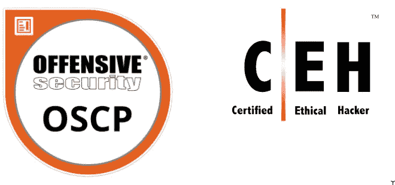
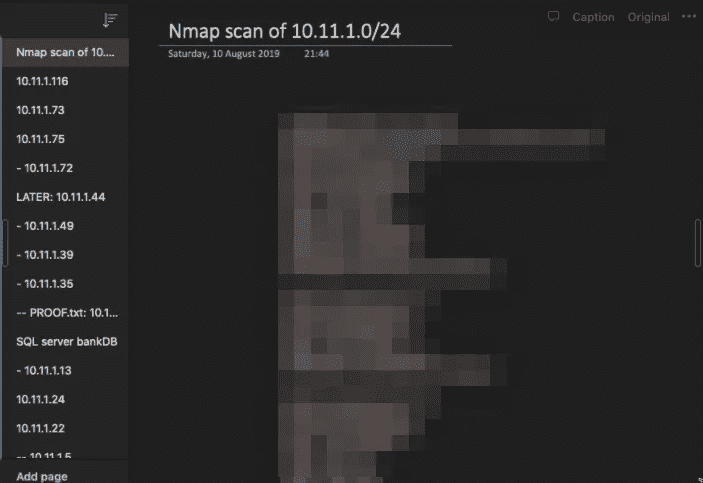
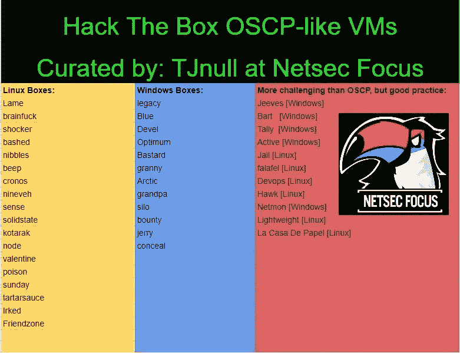

# 我是如何在没有黑客经验的情况下第一次通过 OSCP 考试的

> 原文：<https://infosecwriteups.com/how-i-passed-my-oscp-exam-first-try-with-no-prior-hacking-experience-19029432e7b9?source=collection_archive---------0----------------------->

# 介绍

你好了不起的黑客们！我真的很高兴在这里看到你，因为我害怕写这篇文章。我不想自吹自擂，当我这样说的时候感觉就像是自吹自擂，但是我第一次通过了 OSCP 考试，除了一面旗帜之外，我没有任何黑客实践经验。我是这样做的！

# OSCP 还是 CEH？

我想以说没有证书是我的偏好开始，我认为它们都有一个有效的适用领域。

我一直想进入网络安全领域，有一天在浏览互联网时，我看到了一个关于网络安全书籍的独立包。对于那些不知道的人来说，独立捆绑包是你为捆绑包支付你想要的东西，并根据你支付的多少获得一定金额的地方。还有更多的复杂性，但不是本文要讨论的。我买了这个包，得到了大约 25 本关于网络黑客之类的网络安全书籍，比如《网络应用黑客手册》,我很喜欢读这本书，但我不明白他们在说什么。这个包里还有 CEH v9 电子书，对我来说是塞翁失马，焉知非福。

当时我在一家银行工作，我们定期雇佣一名圣灵降临者。我问他，要进入黑客领域，我必须做些什么，我是否应该去 CEH，因为那里看起来不错，也是入门级别的，但他告诉我，对于我想去的地方，OSCP 会是一个更好的解决方案。他告诉我，你必须在一场紧张的 24 小时考试中证明自己，你必须黑掉 5 台机器。在接下来的课程中，考试的事情一直困扰着我。这看起来像是一堵巨大的墙，我不得不在看不到梯子的情况下攀爬，但我不是一只轻易放弃的老鼠。

# 就是 OSCP 了！

我是那种能把事情做好的人，如果我做得不够好，我就会停止做。如果我做了什么事情，我会全力以赴，所以我去找我的老板，问他是否有可能参加这个培训，并争取获得认证。然而，我的老板不喜欢我的想法。他喜欢它！他完全支持自我发展，他知道我有多喜欢学习新东西和新学科，所以我们预订了 90 天的课程，然后就开始了。

我决定不为它做任何准备，因为我在这一点上有好几年的一般 it 经验，而且我不是一个能看学习问题不止一次的人。如果我看到一些新的东西，并且我是在网上学习的，我就没有动力在课程中好好学习。这可能是个好主意，也可能不是，你最了解自己。你想准备还是让它来找你？这取决于你，但如果你通过或失败，你也是唯一要感谢的人。这是我的一个沉重的情绪，我们负责学习是一个全新的世界。除非我们有一个非常具体的目标，否则我们自己学不好，当然 OSCP 是一个具体的目标，这取决于你来确定这个目标在你生活中的价值以及你想如何实现它。我只能告诉你我的故事。

我完全盲目地去上这门课，我之前看了教学大纲，它看起来不错，但是你永远不知道，直到你真正开始。开始时很平静，但我注意到他们在许多不同的方面都有一种“更加努力”的心态。我自己查找了很多信息，这很好，因为我们需要学习如何谷歌，但另一方面，我认为他们会包括我们在课程中必须了解的所有信息。

在最初的几天里，我学到了很多东西，在我想真正尝试之前，我先浏览了视频，得到了大约 10 个视频，我不是一个很有耐心的人。我想马上开始行动，但当然我第一次尝试就失败了。我对整个网络进行了 nmap 扫描，并将结果记录在 oneNote 笔记本中。

我非常努力地做了这件事，但是我找不到任何关于这一点的问题类型，所以我回到了视频中，我做了很多笔记，我再也没有使用过。

这一次我学到了更多的东西，我又看了一遍关于网络的笔记。我发现了他们在课程中谈论的一些有趣的事情，比如 smb 和匿名 ftp 服务器访问。我甚至能够滥用它们中的一些来获得一个反向外壳，比如我滥用匿名 ftp 来上传一个反向外壳，然后我通过 web 浏览器打开它，因为它们也有一个网站在运行。这像疯了一样刺激了我的自尊心，我觉得自己像一个真正的黑客，成功地侵入了 EvilCorp，摧毁了他们邪恶的商业方式！

你可以想象，我很快就碰壁了。开放的 FTP 服务器毕竟只能让你到此为止。我不得不回到课程上，学习更多的东西，但我是那种很容易厌倦的人。我每天花 8 小时工作，之后花 4 小时学习 OSCP。在周末，我总共花了 8 个小时学习，我有 10 天的假期可以用来学习。所有这些看起来时间很长，但我真的非常需要。经过一段时间的学习，我想做更多的黑客工作，但是我知道我还没有达到目标。我只是需要一点小小的推动。

# 不要看论坛！

在这一点上，我想提出论坛。它们包含了社区在实验室机器上发布的提示，但是除了一台由 OffSec 提供的机器之外，它们从来没有完整的解释。许多人告诉你要避开这些论坛，但我不会那样做。我广泛地使用它们，这就是我学习的方式，但是我确实要求你从一个局外人的角度批判性地审视自己，诚实地定义你是如何学习的。我说的是诚实，因为欺骗自己真的很容易。

我看了很多论坛，他们给了我一点我需要的动力。我花了 40 天的剩余时间在实验室里尝试破解和根机器，同时我疯狂地搜索，并把这门课程作为一种迷你谷歌来搜索。我最终没有根很多机器，但这没关系，因为我学到了很多，我需要自己再学一点。

接下来是 W0lfP@ck，如果你们看到这封信，我会很同情你们！当我正在寻找可以一起更多了解 OSCP 的人时，这些人收留了我，我们联手对付 HTB 机器。我们这样做了几个星期，全身心投入。我强烈建议找一个黑客伙伴一起黑客。不知道怎么样？你可以到处问问！对我来说，我在 OSCP 的 subreddit 上找到了我的小组，所以那可能是一个好的开始。

# 24 小时的疯狂

现在稍微说一下我的备考情况吧。很多人问我如何准备我的考试，我只是想看看我是否能在 24 小时内有 5 台机器，所以我订阅了 hack the box VIP 一个月，并开始从 TJnull 的 OSCP 播放列表中编写一个类似 OSCP 配置的列表。2 台中型机器，1 台硬机器，1 台简单机器，我没有提到 BoF 机器，因为我应该很容易搞定。

由于这些机器都是旧的，你很容易发现它们在线有多难。

我只是尽我最大的努力在 24 小时的考试中入侵所有的机器，并测试我的策略来微调它。我悲惨地失败了，但我学到了很多我的复制品中所缺少的东西，并开始为此而努力。我的弱点过去是，现在仍然是 windows priv-esc 和我想得太多的事实。然而，我的开始仍然有效，所以我又做了同样的事情。这一次，我的技能得到了更好的调整，所以我可以完全专注于如何应对考试。

我已经谈了很多关于我的策略，现在就在这里。我从中等的 20 个点的盒子开始，一直到我卡住为止，在这一点上，我移动到下一个我想研究的东西。请记住，offsec 不能要求太复杂的利用，因为他们仍然必须使每个人都可以在 24 小时内黑 5 台机器。考虑到这一点，你应该能够避免过于复杂而看似有效的兔子洞。当我拿到一面旗子或者遇到困难的时候，我会休息一下，有很多次休息。我需要让我的潜意识处理我发现的信息。也就是说，列举一切是很重要的。我是说一切。每个端口，不仅仅是 nmap 默认扫描的前 1000 个端口，也不仅仅是 TCP 端口。你的黄金可能藏在一个非常规的 UDP 端口上。

如果我真的陷入困境，又没有其他途径可以调查，我会开始感到沮丧。这就是为什么我保存了 BoF 和 10 点箱，以备不时之需。你知道当你终于有了立足之地和一面旗帜时的那种感觉。那种感觉让你思考得更好。我认为 OSCP 与其说是对技巧的考验，不如说是对性格的考验。同样，由于时间的限制，不能太难，所以我认为你是自己最大的敌人。你决定你是通过还是失败，但是你必须相信自己。你能解决几台 HTB 机器吗？你可能资历过高，但你需要停止怀疑自己。我已经注意到，怀疑是成功的敌人，你需要说服自己，你足够优秀。如果可以的话，找一个黑客伙伴，我的黑客伙伴 cybertuna 帮助我度过了一些艰难的时光，我时常怀念和他一起做黑客的日子。我们每晚的会议对我的成功做出了巨大的贡献，这是毫无疑问的。

我把我的 25 点机器保存到最后，因为我认为我可以使用 metasploit 一次。有趣的是，我完全忘记了学习 metasploit，所以这对我的考试没什么用。以前的机器给了我足够的信心，让我能够在这台机器上站稳脚跟，这一次我在脑海中思考这台机器的扫描结果，所以我觉得我已经为考试做好了准备。

# 离 24 小时的折磨还剩 24 小时

我预约了考试，随着时间的临近，我对自己的技能越来越没有信心。我是一个非常情绪化的人，在考试前 24 小时，我决定不做任何与 OSCP 有关的事情，这样我可以清醒一下头脑，我认为这有点帮助。我花了一天时间做我的日常工作，直到考试前大约 10 个小时，我平静地走进我的车，像个小婴儿一样哭了起来。如果我不把这些感觉发泄出来，我知道它们会回来咬我。

老实说，考试本身很糟糕。我不是一个聪明人，考试前几天我丢了我的身份证，当然你在考试时需要它。我从警方那里拿到了一份替代文件，但那只有荷兰语版本，而越位团队无法很好地阅读它。他们翻译了它，所以我必须全力支持我的监考老师和越位组，因为他们不遗余力地让我参加考试。他们核实了文件，我可以浪费一个小时的时间开始考试。

我像练习时一样展开了我的例行程序，虽然我几次怀疑自己，但我提醒自己，几天前我在 HTB 直播机上和我的朋友比赛旗帜，他们不能问太复杂的事情，我通过了考试，除了扎根 25 分机器。当我站稳脚跟的时候，我已经 20 个小时了，我知道我已经有足够的分数了，所以我告诉监考老师我想结束考试，当我的头一碰到枕头我就睡着了。第二天，我写了报告并把它寄出去了。等待开始了。

在提交报告后，我每小时检查一次邮箱，收到的每封邮件都让我吓了一跳。几天后，我终于得到了让我摆脱焦虑的消息。

我更加努力了。

# 结论

非常感谢您阅读这位了不起的黑客！从一个早已被遗忘的地方写下并找回那些记忆是一种爆炸。我的记忆力不是最好的，所以每当我想起过去，我都不会错过机会。OSCP 是一段经历，它让我可以把自己塑造成我想成为的样子，我认为这正是它应该被对待的样子。这是技巧的展示，时间管理的展示，但最重要的是性格的展示。我希望能很快见到你，❤.