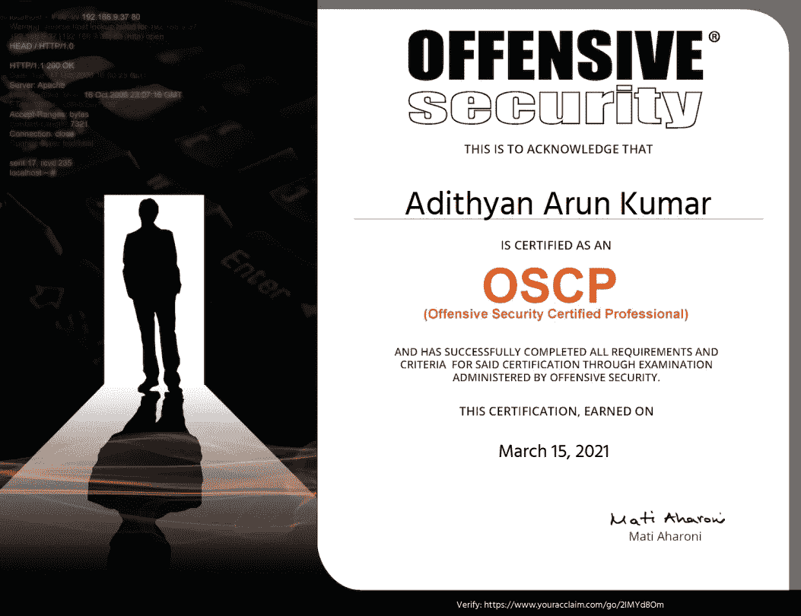
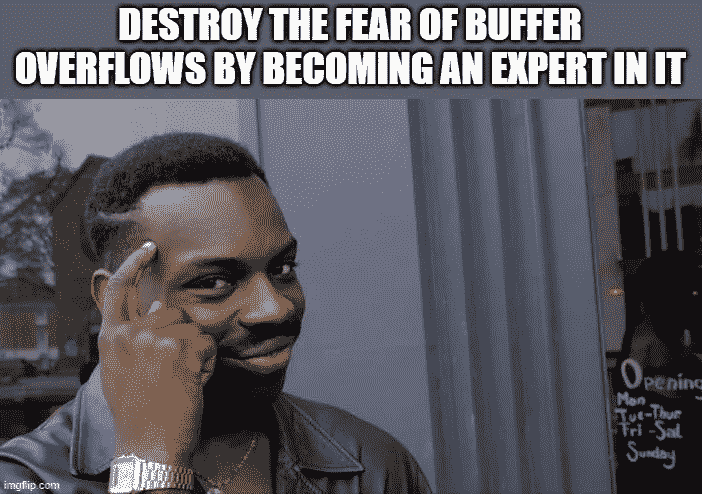
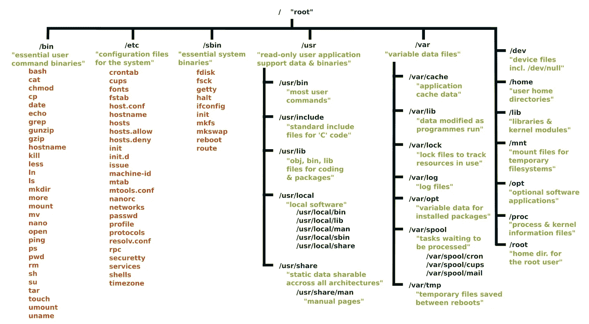
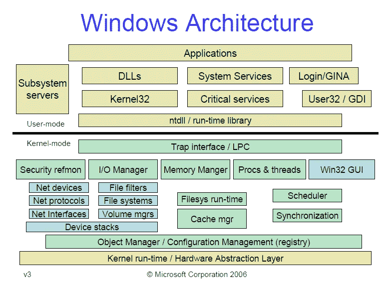
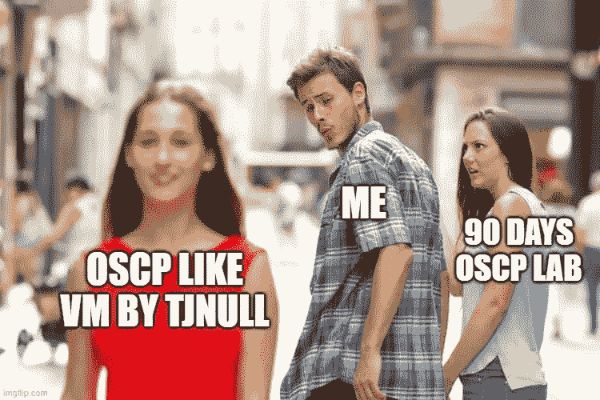
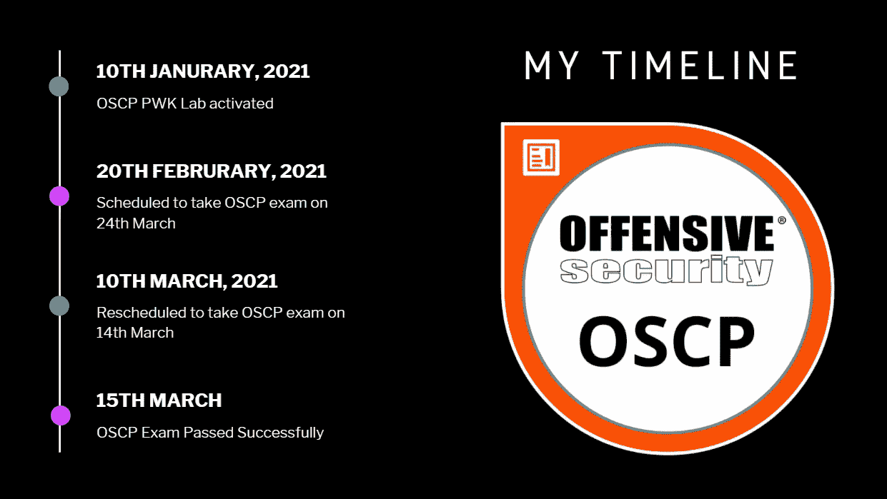
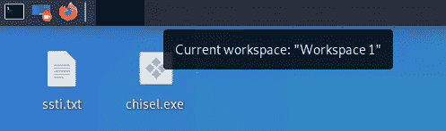
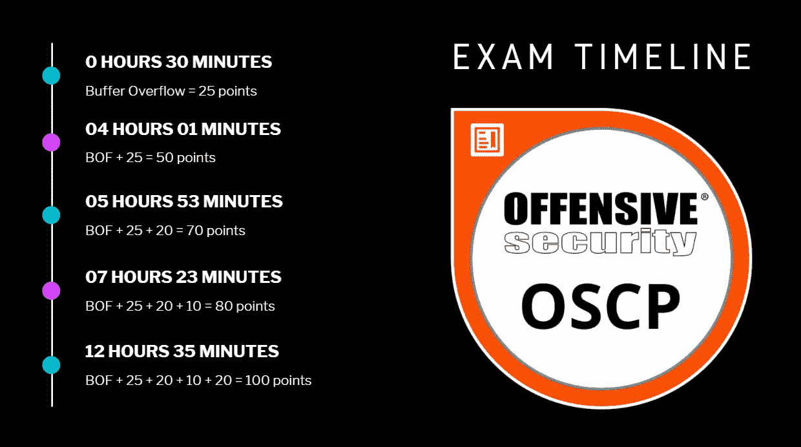
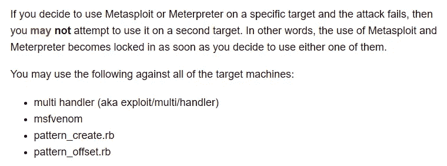
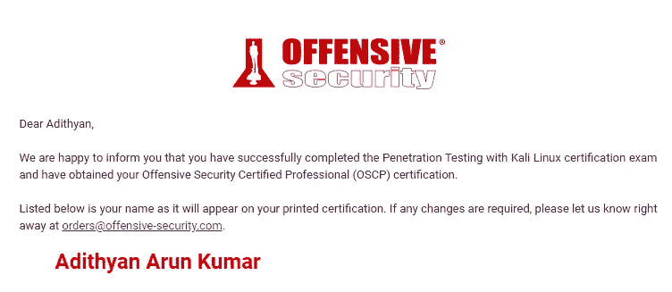

# 我是如何在 12 小时内以 100 分的成绩通过 OSCP 的考试，而没有使用 Metasploit

> 原文：<https://infosecwriteups.com/how-i-passed-oscp-with-100-points-in-12-hours-without-metasploit-in-my-first-attempt-dc8d03366f33?source=collection_archive---------0----------------------->

OSCP 数字证书

这篇文章的免费替代链接:[https://blog.adithyanak.com/oscp-preparation-guide](https://blog.adithyanak.com/oscp-preparation-guide)

我的 OSCP 笔记全集:[https://blog . adityanak . com/oscp-preparation-guide/enumeration](https://blog.adithyanak.com/oscp-preparation-guide/enumeration)

这是我关于 OSCP 终极准备指南的网上研讨会。

2021 年 OSCP 准备指南

我今年 21 岁，两年前 19 岁的时候决定考 OSCP**T5。我不得不等了一年半，直到我免费赢得了一张 OSCP 代金券。不仅仅是普通的 30 天实验代金券，而是价值约 1349 美元的复杂的 90 天实验代金券。下面是我如何破解 Secarmy 的 OSCP 挑战并免费赢得 OSCP 实验室代金券的。**

**2 年前被动准备:**

每当有人在 OSCP 去世后发表评论，我都会阅读并记下他们的评论。这在我的考试经历中派上了用场。

在 OSCP 的教学大纲中，如果有什么东西是我两年前不知道的，那么它肯定是缓冲区溢出。我知道这是达到及格分数的关键。所以我遵循了亚伯拉罕·林肯的方法。

> 摆脱敌人的最好方法是让他们成为你的朋友
> 
> 亚伯拉罕·林肯

尽管我不知道什么时候去 OSCP，也不知道我是否能负担得起，但我刚刚开始学习缓冲区溢出，希望在我生命中的某一天，我能负担得起考试费用。哈哈…疯狂的是，这一切都始于一个信念。

**1 年前被动准备:**

为胜利而黑盒子。整整一年前(2020 年)，我在新 CTF 2019 年赢得 HTB VIP 订阅后，开始了 HackTheBox。我练习 OSCP 就像 TJNull 的 [VM list。因为我从参与的 bug bounty 计划中获得了几年的应用程序安全经验，所以我能够在 HTB 机器中毫不费力地获得最初的立足点。但这不是特权升级的情况。](https://docs.google.com/spreadsheets/d/1dwSMIAPIam0PuRBkCiDI88pU3yzrqqHkDtBngUHNCw8/edit#gid=0)

所以，我想重温一下我的权限提升技能。你可以在这篇文章的结尾找到我使用的所有资源。熟悉 Linux 和 Windows 文件系统对于权限提升至关重要。这将帮助您找到位于奇怪位置的奇怪脚本。花几个小时查看特权提升枚举脚本的输出，以了解哪些是常见文件，哪些不是。

Linux 文件系统体系结构

Windows 架构

**积极准备 45 天:**

我的 PWK 实验室于 2021 年 1 月 10 日启用。我的实验室经历令人失望。我觉得没有新的知识。我想，在头 20 天里，我只玩了大约 30 台机器，但是我觉得我在重复。因此，我暂停了我的实验室，回到 TJ null 最近的 OSCP 类虚拟机列表。pwned 50–100 vulnhub 机器。我真诚地为浪费了他们 90 天的实验室向 Secarmy 道歉😩

每当我着手处理新机器时，我都像参加 OSCP 考试一样。我总是试图在不使用 Metasploit 的情况下，在最多 2 个半小时内完成机器。当然，当我一年前开始加工机器时，事情并没有完全按照我的计划进行。我花了一天多的时间来解决一个简单的机器，并且经常被卡住。但是我把我学到的都记了下来。因此，当我遇到困难时，我会参考我的笔记，如果我复制了笔记中的所有内容，但仍然无法 pwn 机器，那么我会毫无愧疚地看到演练:)

> 随意使用演练，但要确保每次使用时都能学到新的东西

我从来没有因为使用走查来解决一台机器而感到内疚。如果你只是不停地复制现有的技能，新技能**是学不来的**。演练是为了教会你。这并不是说如果你继续努力，你最终会黑掉这台机器。你不是来找零天的。使用演练，但要做好记录，这样如果几天后您不得不 pwn 相同的机器，就不必参考演练。

二月中旬，在 OSCP 实验室呆了 30 天后，我觉得我可以做到了。没有明确的迹象表明你什么时候可以接受。但是我决定把考试安排在这之后。

**我怎么知道我准备好了？**

每当我启动一台机器，我总是担心我是否能解决这台机器。在连续 40 天没有休息的情况下，连续 pwning 100+台机器 OSCP 实验室和 vulnhub 之后，我的焦虑开始消退，我的心态就像“ ***扔掉它，我在这个过程中学到了很多。这只是一次考试。即使我*** 不及格，重考也是值得的”。

在达到这一点后，我毫无畏惧地面对接下来的几台机器，并能够完全妥协。2 月 20 日，我安排在 3 月 24 日参加考试。经过调度，我的时间开始慢动作运行。我不想再玩更多的机器了，因为我几乎已经完成了 TJNull 的列表。我担心我会缺席训练，所以我把时间改到了 3 月 14 日。从 2 月 20 日到 3 月 14 日(考试前 22 天)，我一台机器都没有。我只是不停地看视频，读文章，如果我遇到我的笔记中没有的新技术，我会更新我的笔记。

**时间线:**

我穿越 OSCP 的时间表

**考试设置:**

我在 Kali Linux 之间分割了 7 个工作空间。每台机器 5 个桌面，一个用于 misc，最后一个用于 VPN。考试前一天晚上拍了一张虚拟机快照，以防万一出现问题，我可以恢复到快照状态。还在我的主机窗口中创建了一个恢复点。我用 OneNote 做笔记，因为如果我的主机崩溃，它会与云同步。简而言之，我为各种最坏的情况做好了准备，因为老实说，我已经做好了最坏的打算。我甚至有红牛作为备用，以防太多的咖啡出了问题😆感谢上帝，它没有，我从来没有使用红牛。

OSCP 的工作空间

**考试经历:**

我把考试安排在早上 5:30 开始，因为我想在 24 小时内完成考试，而不浪费时间睡觉(尽管人们说睡眠至关重要，但我想一口气做完，然后安心睡觉)。睡眠并不能帮你解决机器。它会帮助你休息一下。但是 24 小时工作对我来说没问题。这样，即使事情出错，我也只需要保持清醒到凌晨 2-3 点就能知道我是否能通过，而不是整个晚上。如果我安排在上午晚些时候或下午的任何时候，那么我可能不得不通宵工作，我的大脑会自动让我觉得我有点过头了，让我打个盹。所以，早上 5 点对我来说再合适不过了。4 点醒来，洗了个澡，喝了点咖啡。5.15 登录监考门户，完成身份验证。

尊重你的父母。问候他们。与他们相处融洽。一定要记住他们是人类，不是机器人 lol。我的监考老师超级友好，甚至在我很少遇到网络问题和屏幕共享问题时，他们也能应付我。除此之外，我没有遇到任何麻烦，一切都非常顺利。

**我的过关策略:**

1.  碱性氧气转炉
2.  25 指针
3.  20 指针

谢天谢地，事情按照我的策略进行，我很幸运。

> 运气与你努力工作的月数成正比

创建了一个 targetst.txt 文件。将 4 个 IP(不包括 BOF)粘贴到 targets.txt 中，并从

> *autorecon-t targets . txt—only-scans-dir*

**缓冲区溢出— 25 分:**

在运行的时候，我像一个典型的 OSCP 考生一样从缓冲区溢出开始。我对缓冲区溢出非常熟悉，因为我有将近两年的经验。我必须在 30 分钟内完成它，天啊，我做到了。尽管有一些我不能透露的令人惊讶的因素，但我并不惊慌。因为各种各样的人写的关于 OSCP 经历的文章总是教会我一个共同的事情

> 祈祷最好的，准备最坏的，期待意想不到的

就在为缓冲区溢出机器提交 proof.txt 之后休息了 20 分钟。

**硬 25 分机:**

三个小时得到一个初始的外壳。在那 3 个小时里休息了两次，但是有些事情阻止了我继续下一台机器。当枚举脚本运行时，暂停有助于阻止您盯着屏幕。我在 OSCP 面临的唯一障碍就是我们在黑客盒子上面临的同样的问题。VPN 很慢，我不能保持我的枚举线程高，因为它经常破坏工具，我不得不从头开始。因此，我不得不在减少线程的情况下运行所有工具。因此，枚举比在本地 vulnhub 机器上花费的时间多 50 倍。但我从未放弃枚举。因为，在 OSCP 的一篇文章中，一位智者曾经说过

我没哭，你哭了

一旦我得到了最初的外壳，特权升级就开始了！你唯一需要的就是经验，知道哪个是腥的，哪个不是。这种体验是随着时间的推移而来的，在 pwning 100 台机器和花费无数个小时从 **linpeas/winpeas** 输出开始之后。

经过 4 个小时的考试，我完成了缓冲区溢出和最难的 25 分机器，所以我总共有 50 分。如果我有一台 20 分的机器，我就通过了。没休息继续 20 分机。

**第一— 20 分机器:**

10 分钟获得初始 shell，因为所有的枚举脚本都已经完成，我有了一个清晰的路径。感谢上帝，我选择的第一条路不是兔子洞。如果我手头没有第一手的统计结果，那感觉就像一个兔子洞。因此，我强烈建议您枚举所有服务，然后执行所有测试。相信我，测试你所有的技术可能要花 30 分钟，如果你很精通的话，这几乎是不可能的，但是在那个缓慢的 VPN 中进行全面的枚举将会花费你几个小时。

还有，这台机器教会了我一件事。有时，来自 autorecon 的大量信息会把你引向兔子洞。这就是手动枚举派上用场的地方。我第一次看到 autorecon 的输出时就想，“该死，测试所有这些服务要花我一天的时间 ”。因此，我放弃了 autorecon 输出，进行了手动枚举。它给了我有限的信息，有助于我决定关注和忽略哪项服务。

于是，在最初的脱壳之后，休息了 20 分钟。回来了。30 分钟后权限升级。那一刻，当我得到根，我笑出声来，我感到肾上腺素激增，我的梦想正在实现。考试进行了 5 小时 53 分钟，我已经有了 70 分的及格分数。我休息了 30 分钟，吃了早餐。在这 6 个小时里，我只啜饮咖啡和水。

**简易 10 分机:**

不要低估这台机器！这是我见过的最狡猾的机器。部分原因是我从我读到的文章中低估了这台机器。这花了我一个小时去 pwn。因此，在考试开始 07:23 分钟后，我有 80 分，我在安全区😄但是我没有休息。我完成了第二台 20 点机器所需的所有手动枚举，并运行了所需的自动枚举脚本。休息了一个小时。

**秒— 20 分机器:**

我花了 4 个小时才初步站稳脚跟。是的，你不可能总是幸运地发现兔子洞。我又被骗进了兔子洞，部署了聪明人的**列举更难的**技巧。兄弟，我在 10 分钟内数完了一个壳😐在这一点上，我觉得我被越位球牢牢地拖住了。

权限提升是 17 分钟。呵呵。我不敢相信我的眼睛，我在 17 分钟内完成了它，我不得不多次重新检查和运行漏洞。即使在提交了 proof.txt lol 之后，我还是很困惑我所做的是否是预期的方式😆

所以，是的，我在 **12 小时 35 分钟内完成了所有 5 台机器并获得了 100 分(包括占 2.5 — 3 小时的所有 6 次休息)。**虽然看起来我在 **~9 小时 30 分钟**内完成了考试，但我不能忽视休息时间，因为枚举脚本在所有休息时间内一直在运行。我又花了一个小时复制所有的漏洞，重新截图，检查我是否有必要的截图，并结束了考试。我确保每台机器都有这种格式的输出截图。

> **Windows:***type proof . txt&&whoami&&hostname&&ipconfig*
> 
> **Linux:***cat proof . txt&&whoami&&主机名& & ip 地址*

**考试时间:**

OSCP 考试时间表

**Metasploit :**

我忘记了我安装了一个叫做 Metasploit 的工具，即使在我极度卡住的时候，因为我在准备期间从来没有使用过它。事实上，在我准备期间，我在搜索漏洞时忽略了 rapid7 的博客帖子 LMAO！

此外，请记住，您可以无限次地使用以下工具。

*   多处理器(又名漏洞利用/多处理器)
*   MSF 毒液
*   pattern_create.rb
*   pattern_offset.rb

所以，当你觉得正常的反向 shell 不起作用，需要使用编码器时，就使用 msfvenom 和 multi handler。更多详情请参考[考试指南](https://help.offensive-security.com/hc/en-us/articles/360040165632-OSCP-Exam-Guide)。

关于 Metasploit 使用的 Offsec 考试指南

**报道:**

我使用了 offsec 提供的标准报告模板。只是做了一些修改，并给出了一个详细的演练，我如何妥协所有的机器。我的报告长达 47 页。我写的尽量详细了。我对我利用的漏洞做了一些背景研究，包括 CVE 数字、CVSS 分数和针对这些漏洞推出的补丁。我甚至引用了 git 提交，其中已经提出了漏洞并部署了补丁。

**结果日期:**

我不得不等了 5 天才得到结果。对我来说，这可能是 OSCP 最难的部分。虽然我得了 100 分，但在那种情况下，我感觉不到满足。我见过有人因为在报告中犯了错误而失败的报道。我等了一年半才拿到 OSCP 代金券，但这 5 天感觉更长。

收到的结果

查看我的**验证成果**这里:[https://www . your acclaim . com/badges/0 DC 859 f 6-3369-48 F8-b78a-71895 C3 c 6787/public _ URL](https://www.youracclaim.com/badges/0dc859f6-3369-48f8-b78a-71895c3c6787/public_url)

**OSCP 准备计划:**

这是我个人的建议。不要购买 90 天的 OSCP 实验室订阅，购买 30 天的实验室代金券，但要准备 90 天。这是你可以做到的。

1.  前 30 天像 Vulnhub 虚拟机一样练习 OSCP
2.  购买 HackTheBox VIP & Offsec Proving Grounds 订阅一个月，然后在那里练习接下来的 30 天。最近，我听到很多人说，试验场有更多的 OSCP 像虚拟机比任何其他来源。
3.  最后，购买 30 天的实验室代金券，并尽可能多地 pwn 机器。

HackTheBox VIP 和 Offsec PG 将分别花费 15 美元和 20 美元。OSCP 30 天实验室 1000 美元。所以，总共要花费你 **1035 美元**。90 天的实验室将花费你 1350 美元。按照我的准备计划，你基本上可以省下 300 美元。

**备考提示:**

*   在时间用完之前，你会用尽所有的技巧。因此，尽可能多的学习一些技巧，这样，如果某些东西不能产生输出，你总会有一个备选方案。
*   更努力地尝试并不意味着你必须用 200 倍的线程数或一张愤怒的脸来尝试同样的利用。去，更努力地列举。

**考试提示:**

*   兄弟，你有无限的休息时间，利用它。你没有写学期考试。
*   24 个回复已经足够了。去用吧。
*   咖啡因是必须的。
*   你不能测试真实世界的机器。你将尝试侵入一台易受攻击的机器，该机器容易受到特定的攻击。在 24 小时内开发它是你唯一的目标。因此，OSCP 实际上比现实世界中的机器容易得多，在现实世界中，你不知道机器是否易受攻击。
*   [ippsec.rocks](https://ippsec.rocks/) 是一个很好的资源，如果你在开发特定服务时需要帮助的话

**枚举提示:**

‌Enumerate 更意味着:

*   扫描端口，扫描所有端口，使用不同的扫描技术进行扫描，
*   蛮力网络目录，蛮力网络目录使用不同的单词表和工具
*   检查文件权限，检查注册表项，检查可写文件夹，检查特权进程和服务，检查感兴趣的文件，
*   使用 searchsploit 寻找更合适的漏洞，在 google 上搜索有价值的信息等。
*   web 服务器版本、web 应用程序版本、CMS 版本、插件 versions‌

**落脚点提示:** ‌

*   密码重用
*   应用程序/ CMS 的默认密码
*   使用用户名猜测 LFI 的文件位置
*   机器内任何笔记的用户名可能对暴力有用
*   更努力地尝试并不意味着你必须用 200 倍的线程数或一张愤怒的脸来尝试同样的利用。去，更努力地列举。

**学分:**

我感谢我的家人支持我。我的父母非常兴奋，尽管他们一开始不知道 OSCP 是什么，但他们看到了我连续几个晚上醒着，明白这是一场艰苦的考试。我感谢 Secarmy(现已解散为[AXIAL](https://www.linkedin.com/company/ax1al/))[Umair Nehri](https://www.linkedin.com/in/umair-nehri-49699317a/)和 [Aravindha Hariharan](https://www.linkedin.com/in/aravindha1234u/) 。我永远感激我所有的信息安全前辈，他们在我需要的时候给了我精神上的支持和智慧。最后，我感谢所有我提到和没有提到的 infosec 博客的作者。

**社交手柄:** [LinkedIn](https://www.linkedin.com/in/akinfosec/) ， [Instagram](https://www.instagram.com/adithyan.ak/) ， [Twitter](https://twitter.com/adithyan_ak) ， [Github](https://github.com/adithyan-ak) ，[脸书](https://www.facebook.com/AkInfoSec)

**常见问题:**

***你有几年的工作经验？***

4 年的应用和网络安全经验。总的来说，我在 Infosec 已经被动学习了 7 年多。

你花了几个月的时间为 OSCP 做准备？

准确地说，是一年。整整一年前(2020 年)，我在 HTB 发明了我的第一台机器。从那时起，我积极参加 CTFs。

***你在学什么？***

我完成了信息技术的本科课程，并将于 2021 年秋季在卡内基梅隆大学攻读信息安全硕士学位。

**资源:**

*   我的个人笔记:[https://blog . adityanak . com/oscp-preparation-guide/enumeration](https://blog.adithyanak.com/oscp-preparation-guide/enumeration)
*   TJnull 的列表更新列表 2021:[https://docs . Google . com/spreadsheets/d/1 dwsmiapiam 0 purbkcidi 88 pu 3 yzrqhkdtbnguhncw 8/edit # GID = 0](https://docs.google.com/spreadsheets/d/1dwSMIAPIam0PuRBkCiDI88pU3yzrqqHkDtBngUHNCw8/edit#gid=0)

**OSCP 旅程和准备指南:**

*   [https://medium . com/@ parthdeshani/how-to-pass-oscp-like-boss-b 269 F2 ea 99d](https://medium.com/@parthdeshani/how-to-pass-oscp-like-boss-b269f2ea99d)
*   [https://www . netsecfocus . com/oscp/2019/03/29/The _ Journey _ to _ Try _ Harder-_ TJNulls _ Preparation _ Guide _ for _ PWK _ oscp . html](https://www.netsecfocus.com/oscp/2019/03/29/The_Journey_to_Try_Harder-_TJNulls_Preparation_Guide_for_PWK_OSCP.html)
*   [https://medium . com/@ calm 浩劫/oscp-the-pain-the-pleasure-a 506962 baad](https://medium.com/@calmhavoc/oscp-the-pain-the-pleasure-a506962baad)
*   [https://github.com/burntmybagel/OSCP-Prep](https://github.com/burntmybagel/OSCP-Prep)
*   【https://medium.com/@m4lv0id/and-i-did-oscp-589babbfea19 
*   [https://gr 0 sabi . github . io/security/oscp-insights-best-practices-resources/#笔记记录](https://gr0sabi.github.io/security/oscp-insights-best-practices-resources/#note-taking)
*   [https://satiex . net/2019/04/10/offensive-security-certified-professional/amp/？__twitter_impression=true](https://satiex.net/2019/04/10/offensive-security-certified-professional/amp/?__twitter_impression=true)
*   [https://hakin 9 . org/try-hard-my-penetration-testing-with-kali-Linux-oscp-review-and-course lab-experience-my-oscp-review-by-Jason-bernier/](https://hakin9.org/try-harder-my-penetration-testing-with-kali-linux-oscp-review-and-courselab-experience-my-oscp-review-by-jason-bernier/)
*   [https://theslickgeek.com/oscp/](https://theslickgeek.com/oscp/)
*   [http://dann . com . br/oscp-offensive-security-certification-pwk-course-review/](http://dann.com.br/oscp-offensive-security-certification-pwk-course-review/)
*   [https://h0mbre.github.io/OSCP/#](https://h0mbre.github.io/OSCP/#)
*   [https://prasannakumar . in/infosec/my-walk-against-cracking-oscp/](https://prasannakumar.in/infosec/my-walk-towards-cracking-oscp/)
*   [https://infosecuritygeek.com/my-oscp-journey/](https://infosecuritygeek.com/my-oscp-journey/)
*   [https://acknak.fr/en/articles/oscp-tools/](https://acknak.fr/en/articles/oscp-tools/)
*   [https://r3dg33k.com/2018-10-09-oscp-exp/](https://r3dg33k.com/2018-10-09-oscp-exp/)
*   [https://www.jimwilbur.com/oscp-links/](https://www.jimwilbur.com/oscp-links/)
*   [https://www . LinkedIn . com/pulse/road-oscp-oluwaseun-oye lude-oscp](https://www.linkedin.com/pulse/road-oscp-oluwaseun-oyelude-oscp)
*   [https://scund00r.com/all/oscp/2018/02/25/passing-oscp.html](https://scund00r.com/all/oscp/2018/02/25/passing-oscp.html)
*   [https://blog . vonhewitt . com/2018/08/oscp-exam-cram-log-aug-sept-oct-2018/](https://blog.vonhewitt.com/2018/08/oscp-exam-cram-log-aug-sept-oct-2018/)
*   [https://jhalon.github.io/OSCP-Review/](https://jhalon.github.io/OSCP-Review/)
*   [https://www . alien vault . com/blogs/security-essentials/how-to-prepare-to-take-the-oscp](https://www.alienvault.com/blogs/security-essentials/how-to-prepare-to-take-the-oscp)
*   [https://NII consulting . com/checkmate/2017/06/a-detail-guide-on-oscp-preparation-from-newbie-to-oscp/](https://niiconsulting.com/checkmate/2017/06/a-detail-guide-on-oscp-preparation-from-newbie-to-oscp/)
*   【https://thor-sec.com/review/oscp/oscp_review/ 

**备忘单:**

*   [https://github.com/P3t3rp4rk3r/OSCP-cheat-sheet-1?files=1](https://github.com/P3t3rp4rk3r/OSCP-cheat-sheet-1?files=1)
*   [https://github.com/crsftw/oscp?files=1](https://github.com/crsftw/oscp?files=1)
*   [https://github.com/crsftw](https://github.com/crsftw)
*   [https://h4ck.co/wp-content/uploads/2018/06/cheatsheet.txt](https://h4ck.co/wp-content/uploads/2018/06/cheatsheet.txt)
*   [https://sushant 747 . git books . io/total-oscp-guide/reverse-shell . html](https://sushant747.gitbooks.io/total-oscp-guide/reverse-shell.html)
*   [https://jok3rsecurity.com/cheat-sheet/](https://jok3rsecurity.com/cheat-sheet/)
*   [https://github.com/UserXGnu/OSCP-cheat-sheet-1?files=1](https://github.com/UserXGnu/OSCP-cheat-sheet-1?files=1)
*   [https://archive.is/IZLjv](https://archive.is/IZLjv)
*   [https://high on . coffee/blog/渗透测试-工具-备忘单/](https://highon.coffee/blog/penetration-testing-tools-cheat-sheet/)
*   [http://ramunix.blogspot.com/2016/10/oscp-cheat-sheet.html?m=1](http://ramunix.blogspot.com/2016/10/oscp-cheat-sheet.html?m=1)
*   [http://0xc0ffee.io/blog/OSCP-Goldmine](http://0xc0ffee.io/blog/OSCP-Goldmine)
*   [https://hausec.com/pentesting-cheatsheet/](https://hausec.com/pentesting-cheatsheet/)
*   [https://jordanpotti.com/oscp/](https://jordanpotti.com/oscp/)
*   [https://github.com/ucki/URP-T-v.01?files=1](https://github.com/ucki/URP-T-v.01?files=1)
*   [https://blog . propica USA . de/WP-content/uploads/2016/07/oscp _ notes . html](https://blog.propriacausa.de/wp-content/uploads/2016/07/oscp_notes.html)
*   【https://zsahi.wordpress.com/oscp-notes-collection/ 
*   [https://github . com/weak netlabs/Penetration-Testing-Grimoire？文件=1](https://github.com/weaknetlabs/Penetration-Testing-Grimoire?files=1)
*   [https://github.com/OlivierLaflamme/Cheatsheet-God?files=1](https://github.com/OlivierLaflamme/Cheatsheet-God?files=1)
*   [https://medium.com/@cymtrick/oscp-cheat-sheet-5b8aeae085ad](https://medium.com/@cymtrick/oscp-cheat-sheet-5b8aeae085ad)

**Linux 权限提升:** ‌

*   [https://adityanak . git book . io/oscp-2020/权限提升](https://adithyanak.gitbook.io/oscp-2020/privilege-escalation)
*   [https://sushant 747 . git books . io/total-oscp-guide/privilege _ escalation _-_ Linux . html](https://sushant747.gitbooks.io/total-oscp-guide/privilege_escalation_-_linux.html)
*   [https://github.com/Ignitetechnologies/Privilege-Escalation](https://github.com/Ignitetechnologies/Privilege-Escalation)
*   [https://gtfobins.github.io/](https://gtfobins.github.io/)
*   [https://blog . g 0 TMI 1k . com/2011/08/basic-Linux-privilege-escalation/](https://blog.g0tmi1k.com/2011/08/basic-linux-privilege-escalation/)

**Linux 特权工具:** ‌

*   Linux 漏洞利用建议者([https://github.com/mzet-/linux-exploit-suggester](https://github.com/mzet-/linux-exploit-suggester))
*   https://github.com/Anon-Exploiter/SUID3NUM
*   linenum . sh([https://github.com/rebootuser/LinEnum](https://github.com/rebootuser/LinEnum))
*   Lin peas . sh([https://github . com/Carlos polop/privilege-escalation-awesome-scripts-suite/tree/master/Lin peas](https://github.com/carlospolop/privilege-escalation-awesome-scripts-suite/tree/master/linPEAS))
*   linprivchecker([https://github.com/sleventyeleven/linuxprivchecker](https://github.com/sleventyeleven/linuxprivchecker))
*   pspy(【https://github.com/DominicBreuker/pspy】T2)(crontabs)

**Windows 权限提升:**

*   [https://adityanak . git book . io/oscp-2020/windows-privilege-escalation](https://adithyanak.gitbook.io/oscp-2020/windows-privilege-escalation)
*   [https://sushant747.gitbooks.io/total-oscp**-**指南/权限 _ 升级 _windows.html](https://sushant747.gitbooks.io/total-oscp-guide/privilege_escalation_windows.html)
*   [https://github . com/swisskyrepo/payloads all the things/blob/master/Methodology % 20 和% 20 resources/Windows % 20-% 20 privilege % 20 escalation . MD](https://github.com/swisskyrepo/PayloadsAllTheThings/blob/master/Methodology%20and%20Resources/Windows%20-%20Privilege%20Escalation.md)
*   [https://www . absolom . com/2018-01-26-Windows-Privilege-Escalation-Guide/](https://www.absolomb.com/2018-01-26-Windows-Privilege-Escalation-Guide/)
*   [http://www.fuzzysecurity.com/tutorials/16.html](http://www.fuzzysecurity.com/tutorials/16.html)
*   [https://book . hack tricks . XYZ/windows/check list-windows-privilege-escalation](https://book.hacktricks.xyz/windows/checklist-windows-privilege-escalation)(Win PrivEsc Checlist)
*   [https://pentest . blog/windows-privilege-escalation-methods-for-pentesters/](https://pentest.blog/windows-privilege-escalation-methods-for-pentesters/)