# 我是如何利用 DNS 欺骗来捉弄我的朋友的？

> 原文：<https://infosecwriteups.com/how-i-pranked-my-friend-using-dns-spoofing-6a65ff01da1?source=collection_archive---------0----------------------->

现在谁不喜欢一个伟大的恶作剧故事？你知道黑客的整个想法最初是由恶作剧者开始的，他们试图做一些疯狂的事情，并通过修补东西来让他们做一些奇怪的事情。这篇文章类似于我用 DNS 欺骗捉弄我朋友的那篇文章。

> DNS 欺骗是计算机安全黑客攻击的一种形式，它将损坏的[域名系统](https://en.wikipedia.org/wiki/Domain_Name_System)数据引入 [DNS 解析器](https://en.wikipedia.org/wiki/DNS_resolver)的[缓存](https://en.wikipedia.org/wiki/DNS_cache)，导致[域名服务器](https://en.wikipedia.org/wiki/Name_server)返回不正确的结果记录。这导致[流量被转移](https://en.wikipedia.org/wiki/Man-in-the-middle_attack)到攻击者的计算机(来源维基百科)

这种攻击的唯一要求是用户应该在您的网络上。所以，我和我的朋友使用同一个局域网连接。当他忙着看电影的时候，我给他留了这个戏法。我启动了我的 Kali 机器，并开始了 DNS 欺骗的过程。

# 我们开始吧！

算出你自己机器的 IP 地址和你连接到互联网的接口。

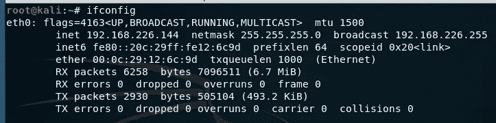

系统的 IP 地址

一旦知道了自己机器的 IP 地址和接口，算出网关 IP 地址。

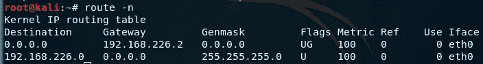

网关 IP 地址

然后，继续扫描网络上的系统。这将帮助您找到您想要定位的设备及其 IP 地址。

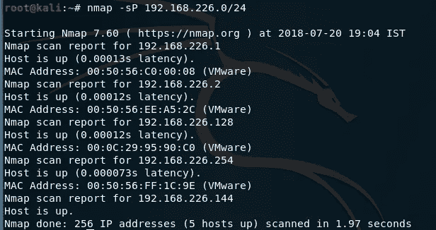

扫描您的网络

一旦扫描完成，你就会知道受害者的 IP 地址。

现在继续，在终端中输入这个。

> gedit /etc/ettercap/etter.conf

这将打开 [ettercap](https://www.ettercap-project.org/) 配置文件，我们将提前使用该工具来执行欺骗过程。打开配置文件后，继续将 ec_uid 和 ec_gid 的值从默认值更改为零。

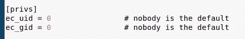

将默认值更改为零

一旦完成，继续往下走，直到你看到下图。默认情况下，iptables 下的 redir_command_on 和 redir_command_off 将使用#符号进行注释，请移除该符号以取消注释。

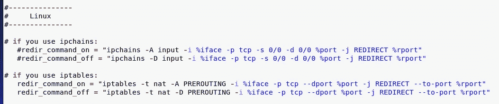

取消注释 redir _ command _ on & redir _ command _ off

一旦你做了上面的修改，继续保存它，然后关闭它。启动 ettercap ( GUI 版本)，点击嗅探，然后统一嗅探，这个下面的框会弹出去选择你的网络接口。

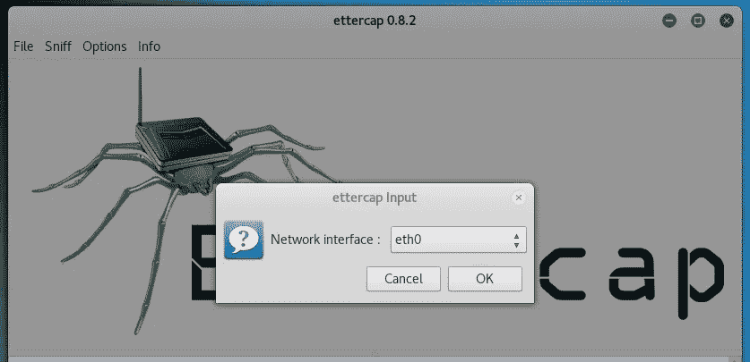

选择网络接口

一旦你点击“确定”，嗅探过程开始。你必须暂时停止它。

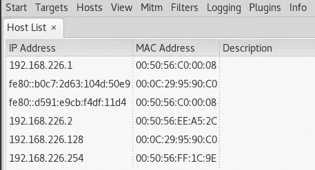

扫描您的网络

一旦你这样做，然后继续使用 ettercap 扫描主机，该选项出现在“主机”选项卡下。一旦扫描完成，检查“主机列表”以获得 ettercap 中的 IP 地址。现在我们需要分配目标 1 和目标 2。

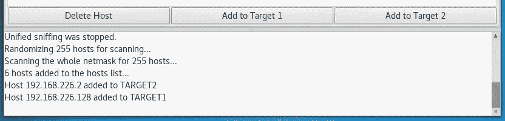

分配目标 1 和 2

受害者(我们攻击的系统)的 IP 地址是目标 1，而网关路由器的 IP 地址是目标 2。一旦这被分配，然后进行到“Mitm”标签下的“ARP 中毒”,并选择嗅探远程连接。

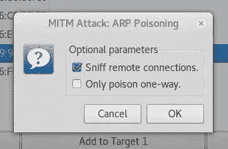

选择嗅探远程连接

完成上述步骤后，进入插件，双击“dns_spoof”插件将其激活。

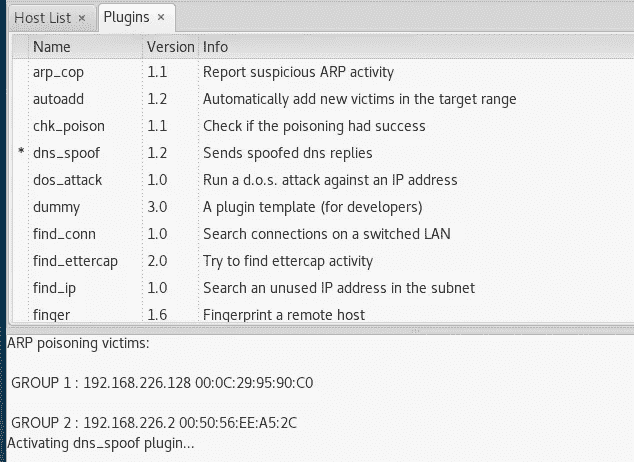

dns_spoof 插件

现在到最后一个过程，这是最重要的。在这一步中，我们需要设置特定网站的重定向，我们需要将流量重定向到我们在机器上设置的页面。继续在终端中键入以下内容。

> gedit /etc/ettercap/etter.dns

这将允许我们操纵 dns 表，使我们能够将流量从受害者的系统重新路由到我们本地托管的网站。在这里，我添加了 facebook.com、*.facebook.com、twitter.com 等网站，这些网站将被重定向到我在自己机器上托管的页面。

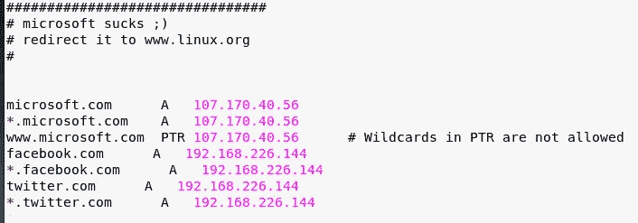

DNS 表

现在这个过程已经完成了，更改给定位置/var/www/html/index.html 中的 html 代码并插入您想要的内容。完成所有这些后，在终端中键入以下内容。

> 服务 apache2 启动

apache 服务一启动，就返回 ettercap 并启动嗅探过程。现在，您的攻击已经完成，受害者所要做的就是访问您在 DNS 表中包含的网站。

# 愚弄你！

现在，在我的朋友完成了他的电影并打开了一个网站后，这个特别的通知在那里迎接他。

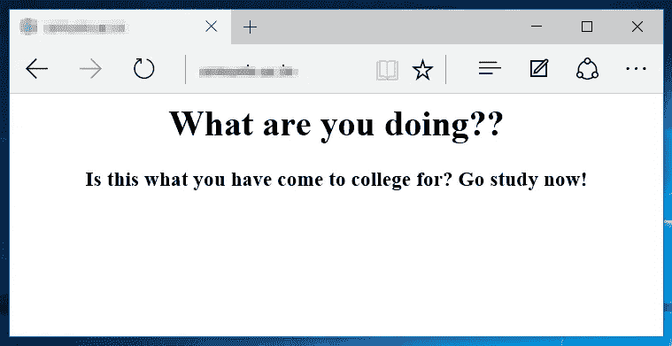

哈哈哈！

我的朋友震惊了一会儿，然后意识到我对他恶作剧。

# 道德的

像这样的攻击可以在更大的规模上进行，如果精心构建，它们可能是致命的，因为它可能是任何银行网站登录页面或您的社交网站登录凭据。攻击者可以通过将你重定向到他们自己的网站来获取你的数据，这可能是致命的。

如果你喜欢，请鼓掌让我们合作吧。获取、设置、破解！

网址:【aditya12anand.com】T2|捐赠:【paypal.me/aditya12anand】T4

电报:[https://t.me/aditya12anand](https://t.me/aditya12anand)

推特:[twitter.com/aditya12anand](https://twitter.com/aditya12anand?source=post_page---------------------------)

领英:[linkedin.com/in/aditya12anand/](https://www.linkedin.com/in/aditya12anand/?source=post_page---------------------------)

电子邮件:aditya12anand@protonmail.com

> 注:由于缺乏适当的证书，这种攻击在 HTTPS 网站上不起作用。它抛出了如下所示的错误。我确信有一种方法可以绕过它，只是想知道如何去做。如果你知道如何绕过它，请分享它。

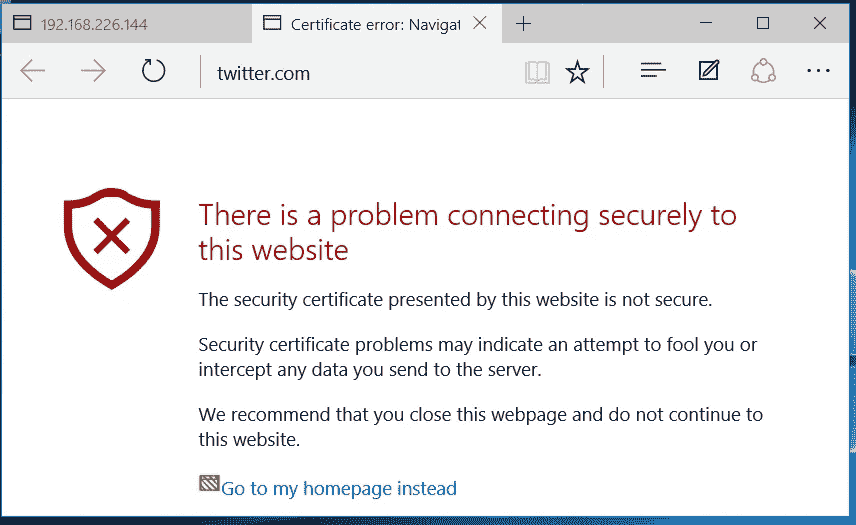

出错信息