# 我是如何拥有一家百万美元的公司的！

> 原文：<https://infosecwriteups.com/how-i-pwned-a-million-dollar-company-9fa5bfd234dd?source=collection_archive---------0----------------------->

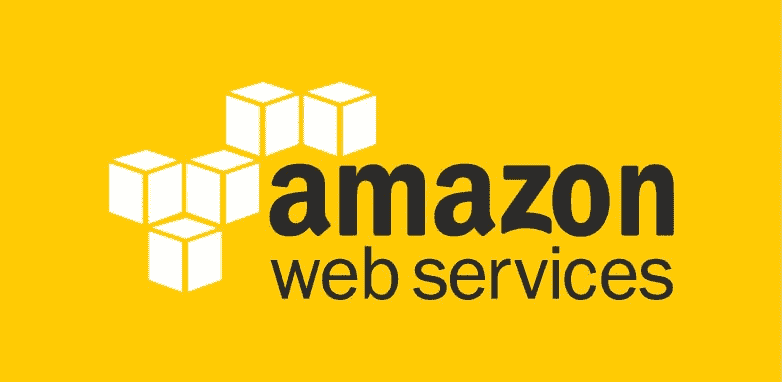

资料来源:Google.com

所以，我已经有一段时间没有写博客了。这是因为我在过去的 1 年里一直忙于我的网络安全初创公司[**【PrimeFort】**](https://www.google.co.in/search?q=primefort&oq=primefort&aqs=chrome..69i57j69i60l3j0l2.1067j0j4&sourceid=chrome&ie=UTF-8)【www.primefort.net】！

所以，就像所有的初创公司创始人一样，我在想我该如何获得客户，作为一名黑客，这是我试图通过黑掉一家百万美元的公司并接近他们成为我们的客户的第一步，因为没有他们，我几乎拥有了经营他们业务的一切:P！

出于隐私考虑，我不会透露网站名称。所以，姑且称之为**examplesite.com**

像所有人一样，我在网站上爬行。从 robots.txt ' www . example site . com/robots . txt '开始(如果你不知道 robots . txt 是什么，看看这个 [**文档**](http://www.robotstxt.org/robotstxt.html) )他们只把他们的产品目录放在那里，没有有趣的信息，然后我继续运行 [**dir buster**](https://www.owasp.org/index.php/Category:OWASP_DirBuster_Project) 几分钟，这次也没有任何有趣的结果

我看着下面的网站，对自己的存在提出质疑。

但是，最初，我认为他们会使用任何 [**CMS**](https://en.wikipedia.org/wiki/Content_management_system) 来开发他们的网站。但是，花了 30 分钟才意识到我是个傻瓜，即使我已经知道了！

失望了 30 分钟后，我出去喝了杯咖啡，阅读了他们网站上提到的任何东西，然后检查了他们的源代码，至少感觉自己像个黑客，然后我随意输入了 WordPress、Joomla、safe、security 等等。在我输入之后，我在他们的网站上发现了一行文字，上面写着，出于安全考虑，他们将文件存放在亚马逊 S3 桶中！

> 有一句名言“了解你的敌人比了解他自己还要多”，下面的事情就是一个例子，当你试图黑东西的时候也是一样！无红利

现在，得出了一个结论，他们把自己的文档和文件保存在 [AWS 云服务器](https://aws.amazon.com/s3/)中！但是，我不确定他们的 AWS s3 桶链接。

在此之前，亚马逊 s3 是什么？

> 亚马逊 S3 是互联网的云存储。上传您的数据(照片、视频、文档等)。)，首先在其中一个 AWS 区域中创建一个 bucket。然后你可以上传任意数量的对象到 bucket，每个文件都有一个唯一的链接，然后它们通过 Amazon CDN 传送。此外，您可以为每个帐户创建多达 100 个存储桶。每个存储桶可以包含无限数量的文件。存储桶不能嵌套，不能在存储桶中创建存储桶。此外，这些天许多网站使用亚马逊服务！

然后谷歌了几个小时，最终找到了一个用 ruby 写的叫做' **Bucket Finder** 的脚本！

> 脚本和安装手册链接:【https://digi.ninja/projects/bucket_finder.php 

那么，这个桶探测器实际上是做什么的呢？按照造物主说的！

> 这是一个运行起来相当简单的工具，它所需要的只是一个单词列表，它会检查每个单词，看看这个桶名是否存在于亚马逊的 S3 系统中。它发现任何东西都会检查这个桶是公共的、私有的还是重定向的。
> 
> 检查公共存储桶是否启用了目录索引，如果是，那么将使用 HEAD 检查列出的所有文件，看它们是公共的还是私有的。遵循重定向并检查最终目的地。所有这些都被记录下来，这样你以后就可以浏览和分析所发现的东西。

然后，我继续前进，键入所有与我想黑的这家公司有关的名称，并列出如下列表，以使用 bucket finder 脚本进行馈送。

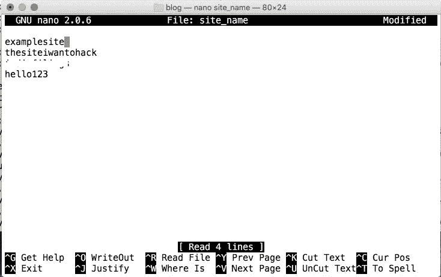

所以，现在我们有了一个猜测列表和脚本，现在如下执行它！

> 。/bucket_finder.rb 站点名称

这是它的输出。

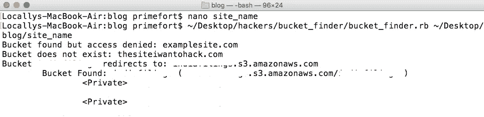

bucket_finder.rb 的输出

现在，你得想办法黑掉那些桶！要破解这样的桶，它必须是一个配置错误的桶。那么，怎么找呢？

bucket_finder 的输出类似于，

> 铲斗重定向至示例 site.com 重定向至 examplesite.s3.amazonaws.com

**s3 之前的任何东西都是桶的名称，为了连接这样的客户端，您必须安装 **aws-cli****

> **要安装它，请看下面的文档[http://docs . AWS . Amazon . com/CLI/latest/user guide/installing . html](http://docs.aws.amazon.com/cli/latest/userguide/installing.html)**

**一旦你完成了安装部分，你必须用一个访问密钥配置 amazon aws-cli(假设你已经在 amazon s3 中有一个帐户),你可以在下面的链接中找到你的**

**[https://aws.amazon.com/developers/access-keys/](https://aws.amazon.com/developers/access-keys/)**

> **为了**配置**，请看下面的文档**
> 
> **[http://docs . AWS . Amazon . com/CLI/latest/user guide/CLI-chap-getting-started . html](http://docs.aws.amazon.com/cli/latest/userguide/cli-chap-getting-started.html)**

**一旦您完成了配置部分，您就可以开始了！**

**要检查 bucket 是否易受攻击，在完成 aws-cli 的安装后，您必须在终端中执行如下命令！让我们看看如何做到这一点…**

**您必须像这样执行它，AWS S3 ls S3://bucket name(bucket name 是. s3.amazonaws.com 之前的名称)**

**在我们的例子中，它是'**AWS S3 ls S3://example site【T3]'，输出如下。****

**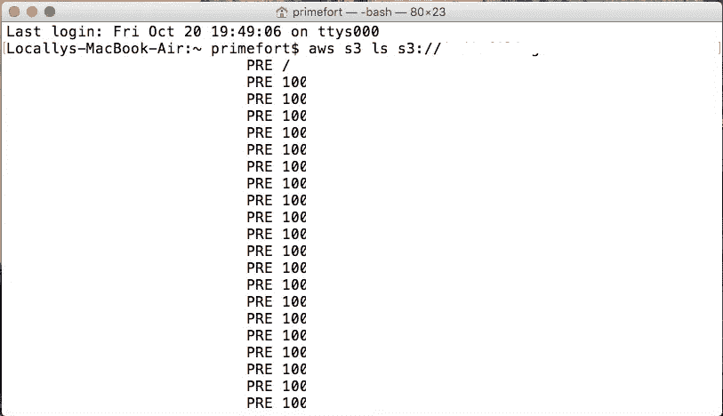**

**让我们继续，看看服务器中是否有什么有趣的东西，并且让我们尝试将一个文件放入他们的服务器中，您也可以执行 ls、mv、cp 等命令。**

**首先，让我们试着上传一个文件。**

**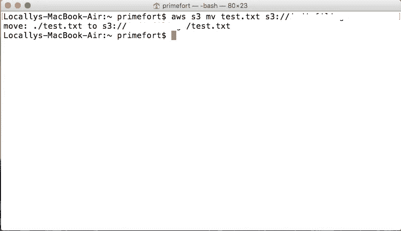**

**它已经成功上传，现在我们来分析一下这个命令。**

> **aws s3:提及 s3 服务器**
> 
> **mv:移动文件**
> 
> **测试:您要上传的文件**
> 
> **s3://examplesite:您要上传文件的站点！**
> 
> **完整命令:AWS S3 mv test . txt S3://example site**

**一旦成功，您将得到类似 move:的输出。/文件名及其路径。**

**现在，是时候在服务器中发现一些有趣的东西了！**

**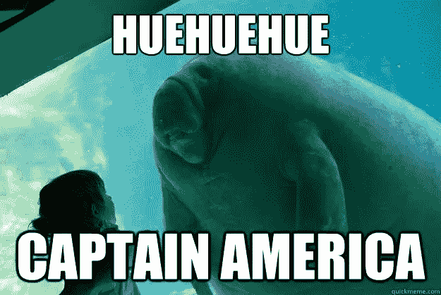**

**找到一个文件名，“电子邮件”迅速打开文件夹，看看里面有什么，用命令“ls”发现它们都是用户文件，数字签名，出生证明，aadhar！我尝试下载，但它给了我一个错误，如，**‘访问被拒绝’。****

**此外，我试图打开我上传的文件，但它给我一个错误，如下所示**

**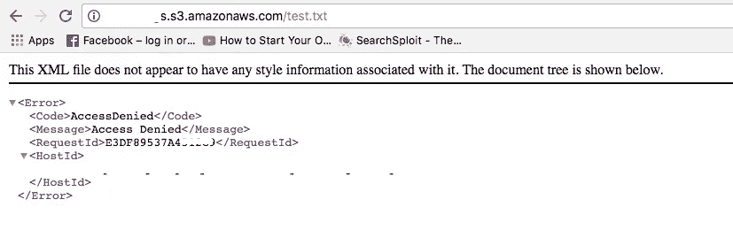**

**我就想，为什么总是我！？:(**

****

**然后，我继续谷歌了一遍，因为我不想听到任何 haawkers 的“谷歌 It 兄弟”！**

**然后在几个博客里找到了结果，说我们必须在你上传文件的时候用下面的命令改变文件的权限**

**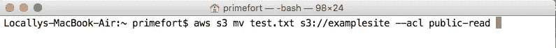**

**但是，网站上已经存在的敏感文件怎么办？又在谷歌搜了一下。找到了一堆结果，其中大部分都在说，我们对现有的文件无能为力！但是，幸运的是，在一个博客中提到，通过同步或更改现有文件夹的名称，您可以更改权限。命令如下:**

**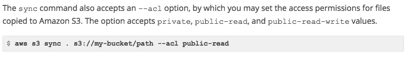**

**来源:[http://docs . AWS . Amazon . com/CLI/latest/user guide/using-S3-commands . html](http://docs.aws.amazon.com/cli/latest/userguide/using-s3-commands.html)**

**然后从那个网站下载我自己的文档，因为我是他们的客户之一，最后我可以下载客户的所有电子邮件 id、他们提交的文档以及他们的客户提供给他们的几乎所有东西。但是，我没有停止，我不想破坏任何东西，但是，我想做一些邪恶的事情，但它不应该伤害**

****

**所以，我继续寻找公司标志的路径，并替换为我的 SVG 图像*XSS*不要告诉任何人？它显示如下！:P**

> **参考:[https://www.grepular.com/Scalable_Vector_Graphics_and_XSS](https://www.grepular.com/Scalable_Vector_Graphics_and_XSS)**

**我的 SVG 图像内容如下！**

**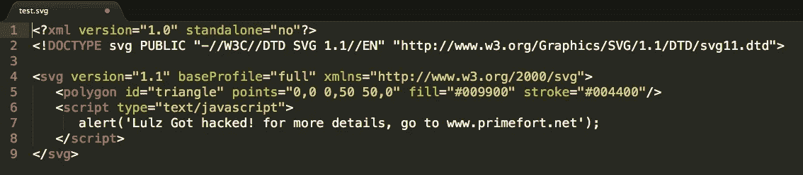**

**test.svg 内容！**

**用 ACL 公共读取权限上传它**

**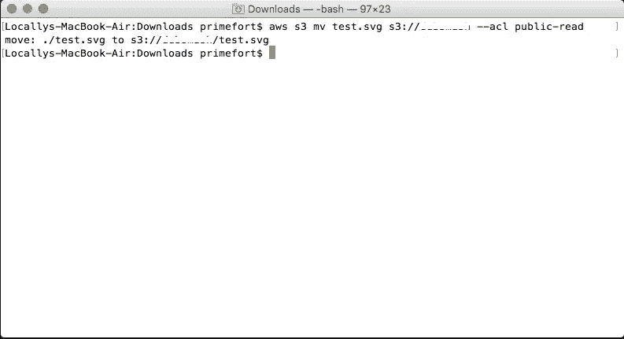**

**正在错误配置的服务器上上传文件。**

**还把他们原来的 logo 换成了这个 SVG 和 Booom！:D 被处决**

**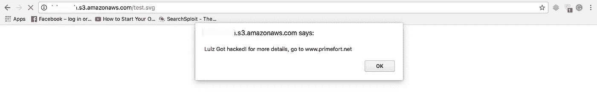**

****SVG XSS！****

**一旦我处理完我的事情，我马上去了他们的办公室，见到了首席技术官，我告诉他这一切，他感到震惊，这就是“**我如何得到我的第一个客户**”的故事**

**要修补它，确保亚马逊 S3 ACL 配置正确，这就是现在的全部。**

**希望你喜欢阅读它，并学到了一些东西！:)哥哥哥哥哥哥！**

****

**给初学者的一个建议！请不要要求某人阅读某个特定的博客，因为这种知识来自一个人是非常狭隘的。**

> **永远记住——博客链接=单人=视角单一=知识少！不要失去希望，重要的是不要在死亡之前死去！**

**如果有任何疑问，给我发邮件到**sriram@primefort.net**！干杯！**

# ****免责声明****

**博客内容仅用于信息和教育目的。**

**对于因使用博客内容而直接或间接导致的任何直接、间接、暗示、惩罚性、特殊、附带或其他后果性损害，我特此声明不对任何一方承担任何及所有责任，由读者自行负责**

****