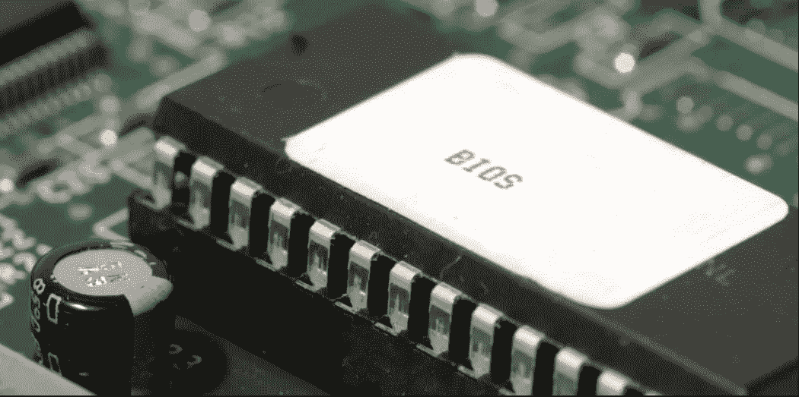
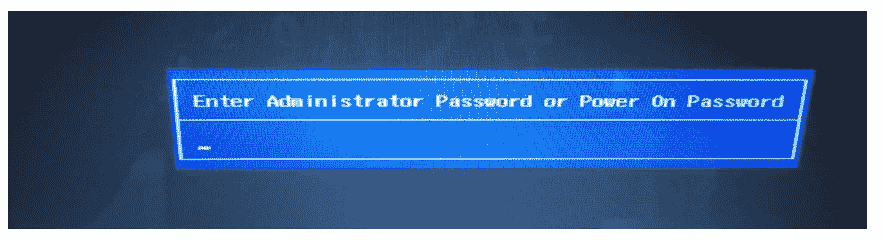
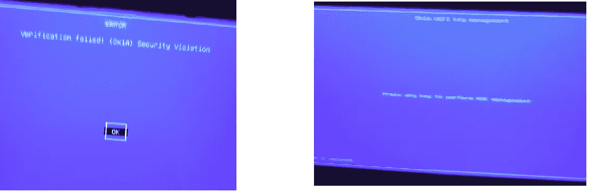
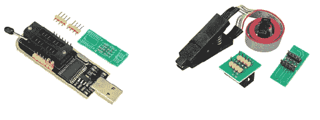
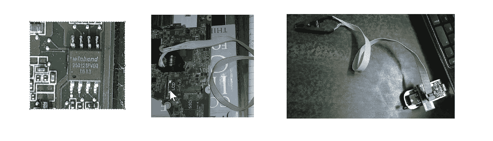
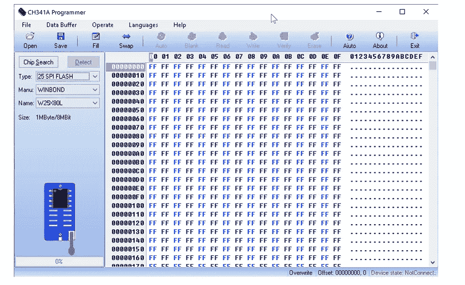

# 我如何删除我忘记的 BIOS 管理员密码？

> 原文：<https://infosecwriteups.com/how-i-removed-my-forgotten-bios-administrator-password-8dca33844023?source=collection_archive---------0----------------------->

> **免责声明:**本文中使用的所有方法都是在我的设备上执行的，我仅出于教育目的分享这些方法。我对因滥用以下信息而造成的任何形式的知识产权、资产或其他损失不负任何责任。

[图片来源](https://resize.hswstatic.com/w_907/gif/bios-chip.jpg)

大家好…这是我在 Medium 上的第一篇文章，我希望你们会觉得有用。我想分享我的这个故事，因为我认为有些人在这个问题上卡住了。所以不浪费时间了，让我们开始吧。

# BIOS 是什么？

BIOS 是一种非易失性(一种在断电状态后保留存储数据的存储器)固件，用于在调用引导加载程序启动操作系统之前执行硬件初始化。它就像一个计算机硬件设置，允许我们查看或修改设置，如更改启动顺序或虚拟化。

## 什么是 BIOS 密码？

在 BIOS 中，您可以设置两种类型的密码:

1.  **管理员密码**:只有当你试图进入 BIOS 时，电脑才会提示此密码。它用于防止他人更改 BIOS 设置。
2.  **系统密码:**操作系统启动前会提示。它可以阻止别人打开你的电脑。

BIOS 密码提示

# 故事:

我一直很重视安全之类的东西。所以，为了避免未经授权访问我的笔记本电脑(我不能提及我的笔记本电脑名称，但它是一个高级系列笔记本电脑)，我在 2019 年设置了这个 BIOS 管理员密码。2020 年 3 月，我对笔记本电脑的硬件感到好奇，从背后打开它看了一眼。但是，当我把所有的东西放在一起，启动笔记本电脑时，期望出现 grub 屏幕(我的笔记本电脑是 Linux 和 Windows 10 的双重启动)，但我却看到了蓝屏，一些安全违规错误和 Shim UEFI 管理屏幕(我不知道它是什么)弹出。不过，我还是能够启动我的 Windows 10。

抱歉模糊的图像

在谷歌上搜索了一番后，我知道这是因为我的安全开机了。所以，我试着进入 BIOS，但是我不记得我的密码了。然后为了一些工作，我决定访问一个虚拟机，但它也不工作，在这里我知道不知何故我的 BIOS 进入默认设置意味着安全启动和虚拟化技术关闭(**否** **Linux** )。这意味着我不能使用虚拟机，docker，WSL-2。我不能在我的系统上使用 Linux(在本地，我不喜欢 WSL-1)。

# 失败的方法:

1.  我在谷歌上搜索了一些重置 BIOS 密码的技巧，但大多数都是现在已经行不通的老技巧，比如移除 CMOS 电池或缩短主板跳线，或者使用 CmosPwd 之类的工具。我发现了一个可行的解决方案，在输入三次错误的密码后，你会得到一个 ***系统禁用代码，*** ，它可以用来生成后门 BIOS 密码，但它只适用于消费者笔记本电脑(中档笔记本电脑)。对于高级笔记本电脑而不是系统禁用代码，使用 SpareKey 恢复，这是一种基于 USB 的解决方案。

(I)系统禁用代码& (ii) HP SpareKey 恢复(错误示例)

**2。服务中心:**现在从一些公司支持论坛上得知，公司提供了 smc.bin 文件来重置 BIOS 的密码。于是，我打电话给服务中心，他们告诉我，公司在 2019 年改变了政策，他们现在只能通过更换主板(价格在 450 美元+左右)来解决这个问题。我不会花那么多钱。

**3。逆向工程:**惠普提供给系统管理员的软件，只需在系统中执行一个脚本就可以配置 BIOS，即惠普 BIOS 配置实用程序(BCU)。这是一个命令行工具，可以改变 BIOS 密码和其他配置。所以，我想看看能不能做点什么。我拆开了 BCU.exe 的文件，试图理解代码，花了几天时间才明白它的工作原理。我偶然发现了一些 windows 的 WMI 命名空间，它有某种功能，可以输入当前密码和新密码。对我来说这是个死胡同。我只是尝试通过 windows 访问 BIOS 内存，但是失败了(我完全是逆向工程的初学者)。

# 工作方法:

在网上拼命搜索，找到了一些解决这类问题的论坛。我遇到了两个解决方案:

1.  用预编程的 BIOS 芯片替换主板上的 BIOS 芯片。(我在台湾的易贝上找到一个，仅售 24 美元)
2.  用没有密码的 BIOS 的正确转储重新编程当前的 BIOS。(如果使用了错误的转储，可能会烧坏主板)

我选择了第二个选项，因为由于新冠肺炎的原因，国际交付不可用，而且成本也很高，因为我不得不在更换 BIOS 芯片的技术人员身上花更多的钱(也包括拆焊等)。所以这不是一个选择。

第二个选项很好，因为他们(论坛的家伙)所需要的是带有管理员密码的 BIOS 转储，他们只需删除其中的密码，然后将转储发送回来。我们只需要从那个垃圾堆里重新编程 BIOS 芯片(这项服务的报酬是 15 美元)。

## 现在，如何采取 BIOS 芯片的转储？

要转储 BIOS 芯片，我们需要两个设备:

1.  CH341A EEPROM USB 编程器(7 美元)
2.  SOIC8 夹片(6 美元)

CH341a USB 编程器和 SOIC8 夹子

我等了一个月(直到六月)才收到设备，多亏了新冠肺炎，亚马逊服务不可用。在此期间，我想看看其他笔记本电脑的 BIOS 转储，看看如何从 BIOS 转储中删除密码。我在每个平台上搜索 BIOS 转储，我在 Telegram 和脸书组上找到了许多转储。这些转储被解锁并放在那里以帮助技术人员解决与 BIOS 相关的问题。我在笔记本电脑的 BIOS 转储中寻找我的运气，但没有找到正确的版本。

## 创建 BIOS 转储的过程:

> **注意:-** 开始之前，请使用 BCU 实用程序复制您笔记本电脑的 BIOS 配置，因为它将在未来使用，之后请确保您的电池与主板断开连接，并且您的笔记本电脑没有连接到电源线。

**第一步:**连接设备:

(i) BIOS 芯片& (ii)连接到芯片的夹子& (iii)连接到 ch341a USB 编程器的夹子

小心地将夹子连接到 BIOS 芯片上(粉色电线应该夹在 BIOS 芯片的圆点一侧)。现在，将夹子的另一端连接到 ch341a USB 编程器(25 系列)。将 USB 编程器连接到另一台笔记本电脑(如果 BIOS 芯片已正确夹住芯片，则左侧的红灯将会亮起。否则右侧灯会发光)。

**第二步:**在另一台笔记本电脑上从谷歌下载 ch341a 编程器软件及其驱动程序。

1.  现在在这里，点击检测。所有细节，如类型，Manu，名称将被自动提取。
2.  之后，点击阅读并等待几分钟。所有的十六进制字段将被 BIOS 的数据填充。
3.  将文件保存为 bin 文件。

**步骤 3:** 现在，将数据写入 BIOS 芯片:

1.  点击清除
2.  打开要写入的 BIOS 转储文件。
3.  单击“验证”检查完整性。

现在这是一个令人印象深刻的转变，当我创建 BIOS 芯片的转储时，我想测试 BIOS 更新，这可以在公司的支持页面(驱动程序和固件页面)上找到。我下载了最新的更新(exe 文件)并解压了 bin 文件。现在提取的 bin 文件和转储文件的大小是相同的(16mb)。所以，我决定把那个 bin 文件写在 BIOS 芯片里，重启之后……**轰！！！！！！！！！！**

我的 Linux 机器启动了(随后是一些随机消息)，但是没有 grub 选项可以在 Windows 和 Linux 之间选择。所以当我重新启动它时，显示了一个错误，即**制造模式开启，**但在一些提示后，我只能启动 Windows 10。我试着进入 BIOS，而**没有密码。I** t 表示现在 BIOS 是新的，但是 BIOS 中没有写序列号和产品号。为此，我在开始这个过程之前使用了我创建的配置文件，通过 BCU 实用程序来修改 BIOS 设置。

感谢大家的阅读:)

【我的 LinkedIn:-[*https://www.linkedin.com/in/namantamboli/*](https://www.linkedin.com/in/namantamboli/)