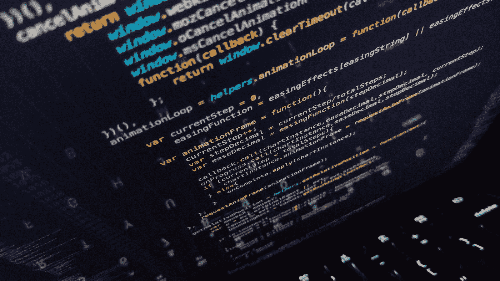
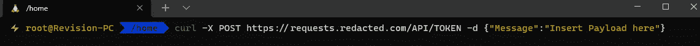
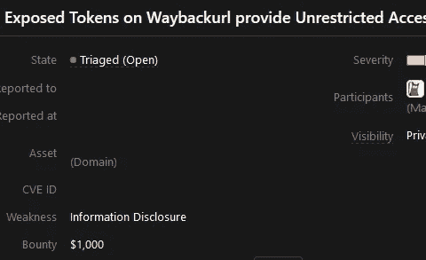

# 我如何使用 Waybackurls 获得 1K 奖金

> 原文：<https://infosecwriteups.com/how-i-scored-1k-bounty-using-waybackurls-717d9673ca52?source=collection_archive---------0----------------------->

从各个角度接近目标

欧文·史密斯在 [Unsplash](https://unsplash.com?utm_source=medium&utm_medium=referral) 上的照片

## 安全研究人员、黑客们，你们好

在这篇文章中，我想与你分享我在一个公开的 bug 赏金项目中发现的一个发现，这个项目最终只需要在终端上使用一个命令就可以支付我 1K

我不能透露该程序的名称，因为泄漏是巨大的，他们仍在将所有以前使用的算法合并到一个新的算法中，被否决的 API 仍可访问

该程序在 **Hackerone** 中存在了十多年，上面有很多大名鼎鼎的名字，我很熟悉他们提供的服务，因为我是一个用户，所以我开始列举子域，在那里我注意到一个奇怪的链接，实际上可能包含敏感数据，因为他们正在解析 **URL 路径**中的所有内容，所以我的第一个方法是检查 [WaybackURLS](https://web.archive.org) ，因为 [TomNomNom](https://medium.com/u/6dadd1681332?source=post_page-----717d9673ca52--------------------------------) 有一个非常独特的工具，我如下使用它
***wayback URLs requests.redacted.com***

我很惊讶有这么多的 URL 是属于有令牌的用户的，我觉得它们不可能是有效的，对吗？！

我想我错了，我去了 API 页面，它看起来像一个简单的 **POST** 请求，链接泄露了，一个简单的数据通过 curl 可以使用这样的东西做概念证明

我在我自己的 env 中进行了测试，并立即发送了报告
不到几天就收到了回报，团队开始了修复工作

# 走小路

永远不要说这个程序有很多知名黑客，我什么也找不到
每个人都有自己独特的攻击目标的方法，你可能会看到别人看不到的东西