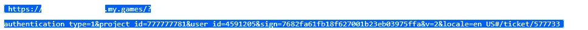
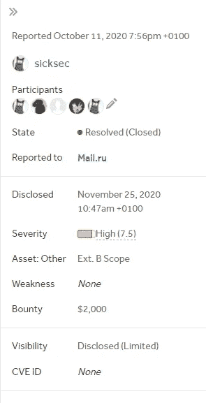

# 我如何通过 IDOR 获得 2K 奖金

> 原文：<https://infosecwriteups.com/how-i-scored-2k-bounty-via-an-idor-32eb2fa8aa1e?source=collection_archive---------0----------------------->

## 有史以来最简单的 IDOR？！

[本杰明·达达](https://unsplash.com/@dadaben_?utm_source=medium&utm_medium=referral)在 [Unsplash](https://unsplash.com?utm_source=medium&utm_medium=referral) 上的照片

**你好安全人员**

在这篇文章中，我将讲述我是如何在俄罗斯最大的公司之一找到一个 IDOR 的，除了 Mail.ru 之外什么都没有
所以接近大范围的目标有时会令人沮丧，因为你不知道从哪里开始
对我来说，我开始在 Mail.ru 游戏的主要范围中寻找

1.  我打了个嗝
2.  创建一个帐户
3.  在我的购物车中添加物品
4.  查看博客
5.  创建支持票证

在测试任何东西之前，门票链接看起来有点可疑，因为它有`/ticket/INTEGER`
和完整的 **URL** 看起来像这样

让我们来分析一下这里可能会出现什么问题
我们有几个参数`project_id` `user_id` `sign`和票号
我做的第一件事是删除签名的`sign`，看看我是否可以从未经授权的浏览器
访问它，这看起来很容易，但却行不通，对吗？！！

由[视觉效果](https://unsplash.com/@visuals?utm_source=medium&utm_medium=referral)在 [Unsplash](https://unsplash.com?utm_source=medium&utm_medium=referral) 上拍摄

你错了，它起作用了，我可以看到我的机票和与代理的对话以及任何附加文件，我也可以以匿名用户的身份在对话中发言:)
进一步的测试表明，更改`ticket number`可以允许查看其他人的机票，更改`user_id`可以允许查看其他匹配的机票`ID`
与我的[朋友](https://twitter.com/wld_basha)一起完成了一份良好的报告，并在几分钟内得到审核，几天后付款

# 外卖食品

*   不要害怕潜入主应用程序，所有有趣的东西都在那里
*   永远不要低估自己，因为每个人对目标都有独特的看法
*   如果你今天没有发现错误，不要气馁，明天你会发现的

我希望你喜欢读这篇文章，我会在下一篇文章中看到你

**❤保持好奇**