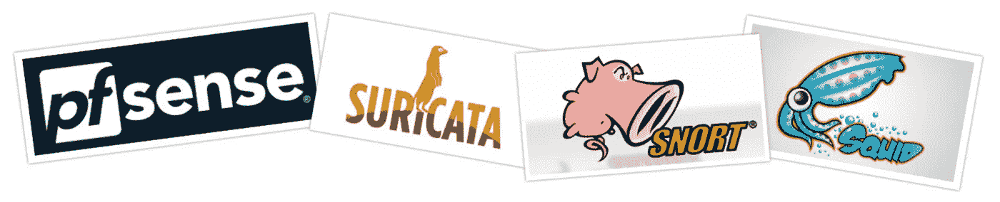
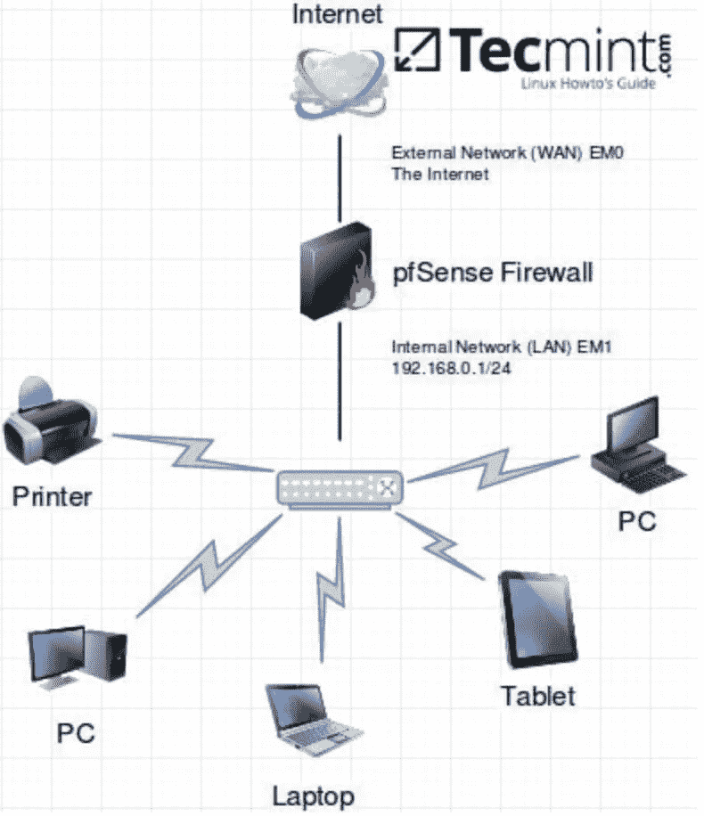
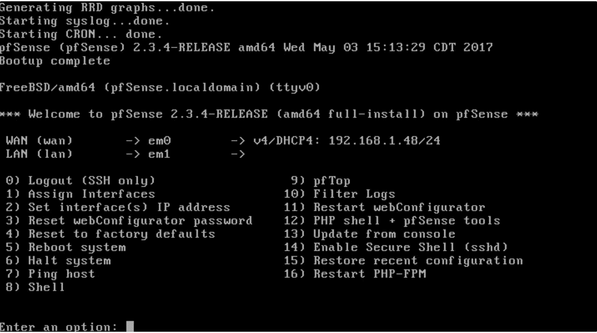
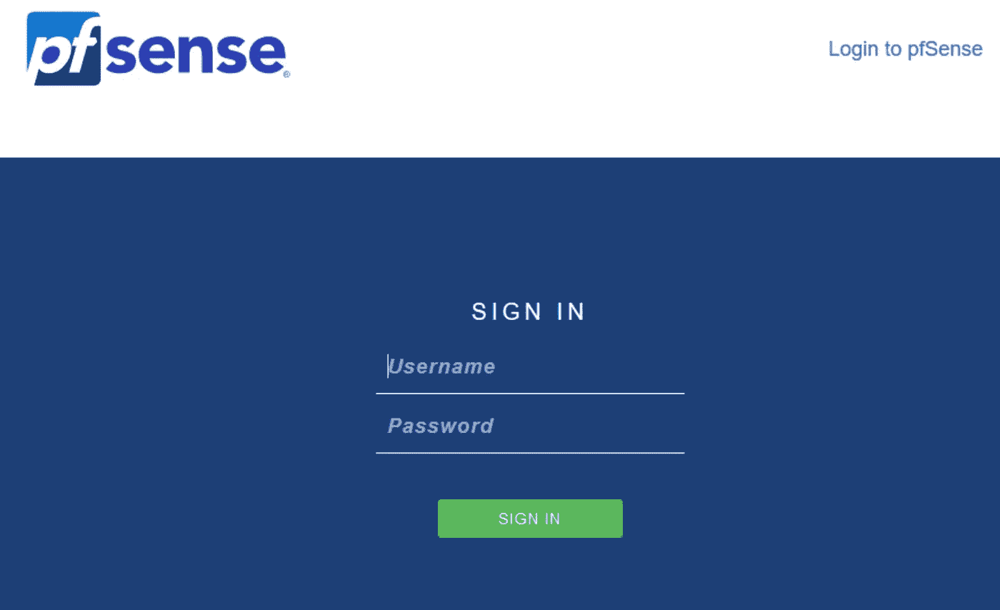

# 如何在我的家庭网络上设置行业级防火墙？

> 原文：<https://infosecwriteups.com/how-i-setup-an-industry-grade-firewall-on-my-home-network-8631eaeebd7a?source=collection_archive---------0----------------------->

## Pfsense 与 Suricata、Snort 和 Squid 的集成增强了网络安全性！

> 在一家能帮助你成长、让你自由摆弄你想学习和应用的技术的公司工作，是你所能要求的最好的工作环境。我想我不可能要求一份更好的工作作为我的第一份工作。好了，我今天的咆哮到此为止，现在让我们来谈谈技术吧！

# 背景

我刚刚加入了一个新组织，在那里，我第一次认真地为蓝队工作，制定安全措施，同时找出找到漏洞的方法，并在此过程中修复它。前一周，我在研究 OSquery 和 ELK stack 的组合，以增强日志功能。

> 阅读此处- [我如何使用 ELK Stack 开发一个成熟的安全运营中心？](https://medium.com/bugbountywriteup/how-i-developed-a-full-fledged-security-operations-centre-using-elk-stack-8dfaec821e23)

这个项目完成后，我开始着手其他项目，配置防火墙是我想尝试的下一件事。我想到的最好的解决方案涉及 pfSense，所以我想为什么不在我家里安装它，然后在实际环境中部署它之前对它进行实验。因为任何使用过防火墙的人都知道，所使用的规则集和工具必须精心配置，否则要么会产生太多的误报，要么会让几乎所有的流量通过，而这些条件实际上对我们都没有用。

# 我们开始吧！

所以，现在已经决定我将在 pfSense 上工作，现在是在我的虚拟盒子环境上设置它并看看它是否正常工作的时候了。下一个计划是，一旦设置正确，查看 pfSense 默认提供的功能。

## 设置 pfSense

我已经在我的系统上下载并安装了 [VirtualBox](https://www.virtualbox.org) 。现在，在 YouTube 上浏览了几个关于 pfSense 的视频后，我继续从他们的网站下载了 [pfsense.iso](https://www.pfsense.org/download/) 文件。下载文件后，我为 64 位 FreeBSD 机器创建了一个空白的 Virtualbox 环境，然后加载到。iso 文件。现在要记住的是，pfSense 需要两个网络适配器才能工作，现在的问题是为什么？pfSense 需要这两个不同的网络适配器，因为它充当您的 [LAN](https://en.wikipedia.org/wiki/Local_area_network) 和 [WAN](https://en.wikipedia.org/wiki/Wide_area_network) 之间的网关。为了更好地理解，请看下图。

位于 pfSense 防火墙下的所有设备都是您本地网络上的设备，可以是您的办公室计算机、家庭设备等。而 pfSense 防火墙之上的一切都是广域网(互联网)。防火墙需要充当您的本地网络和互联网上的设备的网关，只有这样它才能监控您的互联网流量并正确保护您的网络。所以现在。iso 文件已加载，我为我的虚拟机创建了两个不同的网络适配器，其中一个我放在 NAT 中，一个面向 WAN，另一个面向 LAN，我将它作为内部网络。现在，pfSense 的硬件设置已经完成，让我们启动它。

一旦 pfSense 第一次启动，我们不需要做很多事情，基本上接受并按 ok 基本的东西。现在，在第二次启动时，我们会看到这些选项，如下所示。

现在，我们应该进行软件配置，以正确设置 pfSense 并使其正常工作。我们需要做的基本配置是设置 IP 地址。完成后，我们可以利用 web gui 界面来完成其余的设置。因此，您可以在这里将 WAN 配置为 DHCP，即 IP 地址将动态提供给它，但对于又蓝，需要将其配置为静态 IP 地址，因为我们使用的是内部网络，所以我们将其分配为 192.168.0.1/24。现在，一旦您为它分配了相应的 IP 地址，我们就需要设置另一个具有 GUI 的虚拟机，无论您的需求是什么，它都可以是 Ubuntu、Windows。关于这个我就不细说了，你可以在这里看视频[。请记住更改该机器的网络设置，并将其保持在分配给 pfSense 的同一内部网络中。](https://www.youtube.com/watch?v=QbmRXJJKsvs)

## 配置 pfSense

一旦虚拟机启动并运行 ping 192.168.0.1，它应该会 ping 通而不会出现问题，如果没有，则您需要重新配置 pfSense，因为它可能配置错误。现在，考虑到一切正常，我们需要打开浏览器，浏览到这个 IP 地址。我们将会看到一个类似这样的登录页面。

默认的登录凭据是用户名:admin 和密码:pfsense。登录后，您可以查看 pfSense 的整个仪表板。在我们开始在 pfSense 上安装特定的包之前，请随意探索并寻找 pfSense 默认提供的特性。

## 软件包的安装

pfSense 本身可以非常有效，但为此您需要正确配置规则。pfSense 是一个防火墙，但我想在此基础上构建一个入侵检测和入侵防御解决方案，为此我使用了 Suricata & Snort。然后使用 squid 代理监控流量，只允许访问我们列入白名单的网站。要安装软件包，你只需点击“系统”,然后点击下拉菜单中的“软件包管理器”,然后搜索你想在 pfSense 上安装的软件包。

*   放风&苏里卡塔

它们都是为了做同样的事情，也就是说，它们都是 IPS/IDS 解决方案，而且都非常出色。因为所有的工具都比另一个做得更好，所以我把它们都安装在了我的 pfSense 上。

*   **鱿鱼**

> **Squid** 是一个[缓存](https://en.wikipedia.org/wiki/Web_cache)和转发 HTTP [的 web 代理](https://en.wikipedia.org/wiki/Web_proxy)。它有各种各样的用途，包括通过缓存重复的请求来加速一个 [web 服务器](https://en.wikipedia.org/wiki/Web_server)，缓存 [web](https://en.wikipedia.org/wiki/World_Wide_Web) 、 [DNS](https://en.wikipedia.org/wiki/Domain_Name_System) 和其他[计算机网络](https://en.wikipedia.org/wiki/Computer_network)为一群共享网络资源的人查找，以及通过过滤流量来帮助安全。

维基百科对它的效用做了最好的描述，因为它的功能性，我将它包含在 pfSense 中，特别是过滤流量，阻止我们认为不必要的网站，不允许用户通过使用 IPs 绕过防火墙规则浏览网页等。

*   **带宽 d**

我将它添加到 pfSense 中，它还可以帮助我准确地监控网络上的哪个系统消耗了多少带宽，以及它们使用了什么类型的协议 http、ftp 等。它给出了所用带宽的图形表示，从而更容易指出任何违约者。

根据我们的需要，我们可以将许多不同的工具与 pfSense 集成。

# 发展自己的！

如果读完之后，你发现为自己做一个这样的设置真的很酷，相信我，你一定要试试。您需要理解防火墙规则是它们提供的所有安全性的关键要素，并且在编写它们时需要牢记您要配置它的组织的需求。

> *附:如果你需要任何帮助来为你自己的家或你的组织设置这个，请随时联系我，让我们合作吧！*

**如果你喜欢，请鼓掌让我们合作吧。获取、设置、破解！**

网址:【aditya12anand.com】T4|捐赠:[paypal.me/aditya12anand](https://paypal.me/aditya12anand)

电报:[https://t.me/aditya12anand](https://t.me/aditya12anand)

推特:[twitter.com/aditya12anand](https://twitter.com/aditya12anand?source=post_page---------------------------)

领英:[linkedin.com/in/aditya12anand/](https://www.linkedin.com/in/aditya12anand/?source=post_page---------------------------)

电子邮件:aditya12anand@protonmail.com

*关注* [*Infosec 报道*](https://medium.com/bugbountywriteup) *获取更多此类精彩报道。*

 [## 信息安全报道

### 收集了世界上最好的黑客的文章，主题从 bug 奖金和 CTF 到 vulnhub…

medium.com](https://medium.com/bugbountywriteup)