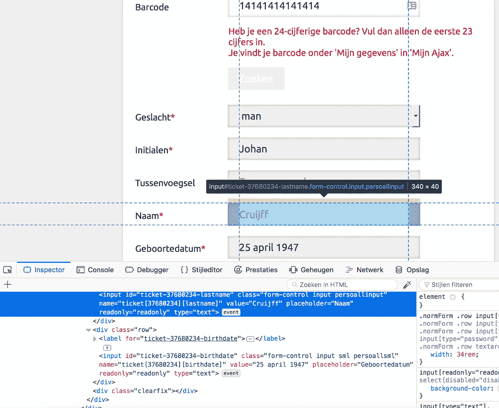
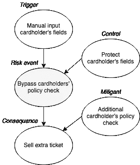
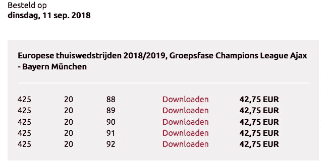
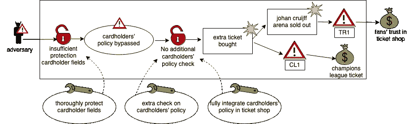

# 我是如何在购买欧冠门票时欺骗亚足联阿贾克斯的

> 原文：<https://infosecwriteups.com/how-i-tricked-afc-ajax-while-buying-champions-league-tickets-c5357cfdb1b5?source=collection_archive---------1----------------------->

## 售票处的网络安全风险分析

我的足球队亚足联阿贾克斯队享受了成功的几年，因此门票的需求很高。我坚信这些座位应该是真正的球迷买得起的。亚足联阿贾克斯通过其网站根据政策出售门票，这是一个越来越复杂的系统组合。在 2018-2019 欧洲冠军联赛比赛之前，我决定测试一下这家售票店的安全性。随着成功，我能够买到比允许的更多的票。与各种云架构设计相关的漏洞的安全风险分析。

# 方法

AFC Ajax 使用 Eventim 的通用系统作为其票务商店。但它希望根据持卡人的政策出售门票。这需要一个额外的系统，可能不会完全集成到这个网站。两个系统的相互依赖是机会和风险之间的平衡([芬顿&尼尔，2012](http://bayesianrisk.com/sample_chapters/Chapter%202%20The%20need%20for%20causal%20explanatory%20models%20in%20risk%20assessment.pdf) )，正如桑德斯( [2014](https://ieeexplore.ieee.org/abstract/document/6798561) )所说:*“对于大多数系统来说，完美的安全性是难以捉摸的”*。风险的定义是事件发生的可能性和影响。在这种情况下，奖励是一张冠军联赛门票，监护人是持卡人的保单支票，效用是奖励减去通过监护人的成本。Pieters ( [2013](https://ieeexplore.ieee.org/abstract/document/6735393) )将信息安全中的*‘最薄弱环节’*定义为诱导风险最高(效用最大)的守护者。不同的工具有多种可能的攻击途径。一开始我是想着监控网站流量。或者搜索隐藏字段或布尔值。实际上，编辑受保护的输入字段是最薄弱的环节。

通过浏览器检查器在只读字段中插入值

# 方法

对于冠军联赛小组赛的个人比赛，亚足联阿贾克斯限制所有持卡人(季票、球迷协会卡和俱乐部卡)每人[一张门票](https://www.ajax.nl/streams/actueel/informatie-losse-verkoop-groepsfase-champions-league.htm)。包括一周前发售的门票。该限制在售票过程中得到验证。在选择比赛和座位后，所有的门票都需要个性化。这意味着把票和持卡人联系起来。Javascript 代码验证持卡人是否仍有资格购买机票。当 Ajax 服务成功响应 jQuery 时，相同的脚本用持卡人的详细信息填充输入字段。该功能是一个漏洞，因为它有两个目的:验证持卡人的限额和检索持卡人的详细信息。关注点没有分离。

风险的因果观

我没有从 AFC Ajax 的数据库中检索信息，而是自己填写了表格。因为我知道我的卡号和相应的性别、名、姓和出生日期。这些字段被配置为只读，但是使用浏览器检查器，可以编辑 HTML 代码。幸运的是，没有隐藏字段或布尔值。提交后，表单的处理器脚本不再验证持卡人的限额。它只是验证持卡人的详细信息。唯一剩下的事情就是付门票。几秒钟之内，我就把票放进了邮箱。信息安全是关于机密性、完整性和可用性，即 [CIA-triad](https://en.wikipedia.org/wiki/Information_security#Key_concepts) 。这种方法损害了输入字段和持卡人对完整性的策略管理，因为具有持卡人详细信息的输入字段未被检测到被修改，并且不能确保管理的完整性。

# 结果

用这个方法，我可以多买五张 SL 本菲卡比赛的欧冠门票。都在同一个季票上，而且我已经买了一张票。为了测试多种浏览器，我从 Firefox 切换到 Chrome。我遵循同样的程序。产生了另一套拜仁慕尼黑比赛的五张门票。随后，我直接通知了亚足联阿贾克斯。几个小时后，我们联系上了。在他们的要求下，我又买了 5 张拜仁的门票来展示我是怎么做到的。一张季票卡的总奖励，而这 16 张中只有一张是允许的:

*   1 张小组赛通行证-部分出局(已购买)
*   10 张亚足联阿贾克斯—拜仁慕尼黑的门票
*   5 张阿贾克斯—本菲卡的门票

成功购买额外的冠军联赛门票

亚足联阿贾克斯的售票店并没有自动注意到我的诡计。Van den Berg 等人( [2014](https://www.csacademy.nl/images/MP-IST-122-12-paper-published.pdf) )将网络空间概念化为技术层和社会技术层，它们由治理层进行治理。信息泄露发生在技术层(输入字段)，影响了社会技术层的活动(售票)。AFC Ajax 票务商店的治理层应该包括对这些事件的监控。相反，我联系了 AFC Ajax，分享了这种方法，并返回了所有的单程票，很明显。他们在我的要求下确认，只有我一个人用了这一招。然而，*“没有攻击并不意味着安全”* ( [赫利&皮耶特斯，2015](https://dl.acm.org/doi/abs/10.1145/2841113.2841122) )。他们的售票处发现了这个问题，并对售票处进行了修复。后来，他们[取代了](https://streams.ajax.nl/streams/actueel/nieuwe-ajax-ticketshop.htm)售票店。我很高兴，这样一来，这种方法就不再可能了。

# 分析

为了分析这个案例，我从利益相关者 AFC Ajax 的角度设计了一个 CORAS 图。CORAS 是一种安全风险分析方法([登布拉伯等人，2007](https://link.springer.com/content/pdf/10.1007/s10550-007-0013-9.pdf) )。左边是对手的蓄意威胁。根据 Rosenquist 的例子( [2009](https://itpeernetwork.intel.com/whitepaper-prioritizing-information-security-risks-with-threat-agent-risk-assessment/#gs.a1qshd) )，威胁代理的目标可能是盗窃，但也可能是运营影响或尴尬。右边是两项资产及其风险:球迷对售票店的信任(TR1)和一张欧冠门票(CL1)。正如芬顿&尼尔 [(2012](http://bayesianrisk.com/sample_chapters/Chapter%202%20The%20need%20for%20causal%20explanatory%20models%20in%20risk%20assessment.pdf) )所提到的，这些风险并不是独立的。威胁代理和资产通过漏洞、威胁场景、有害事件和风险联系在一起。让我担心的是，如果我能做到这一点，其他亚足联阿贾克斯球迷也能做到。在[公平分类法](https://en.wikipedia.org/wiki/Factor_analysis_of_information_risk)中定义的控制力度在检索和检查持卡人信息方面较低。考虑到这个漏洞的风险，可能性是中等的:一个普通的浏览器和一点 HTML 知识是唯一的要求。这种影响是严重的，因为大量的攻击可能会导致体育场意外售罄，并降低球迷对售票处的信任。

柯拉斯图

关于预防和将风险抑制在可接受水平的风险管理。有三种治疗方案可以预防这些风险:

*   彻底规划持卡人字段作为快速解决方案(已应用)。
*   在持卡人保单上添加额外检查(已应用)。
*   票店全面整合持卡人政策(未知)。

镇压事件始于治理。度量对于获得系统设计和操作的安全决策的洞察力是必要的( [Sanders，2014](https://ieeexplore.ieee.org/abstract/document/6798561) )。不仅仅是控制解决方案的积极效果，还有不正确阻止票证的成本( [Cavusoglu 等人，2004](https://dl.acm.org/doi/pdf/10.1145/1005817.1005828?casa_token=SOj9-X2xAT4AAAAA:Jg5wEWtf2TAdWMsRgFn_qg4ur9YDFjPBmp_y4bBXg0DGbFtQwqORPEQRAugdPaWVxyk_VGpQ27_P) )。由于信息安全计划经常关注技术问题，所以 AFC Ajax 的治理错过了这个窍门并不奇怪。多名研究人员主张在云架构中进行整体风险管理。需要一种多学科的方法，在风险管理中具有更具战略性和战术性的观点，并伴之以组织、技术和运营安全指标。

# 结论

亚足联阿贾克斯在哪些方面可以做得更好？其他组织能从中学到什么？组合多个系统并非没有安全风险。普通票务商店与持卡人保单的结合没有得到很好的整合和保护。首先，在设计组合系统时没有完全应用关注点分离。其次，该系统的治理过于有限。售票过程中没有检查可能的误用，后来也没有发现内部警报。对正确使用系统的信任度太高。这个博客揭示了监督你的粉丝的必要性，以确保真正的粉丝能买到买得起的票。虽然没有完美的安全性，但开放的文化遵循[莱纳斯定律](https://en.wikipedia.org/wiki/Linus%27s_law) : *“只要有足够的眼球，所有的错误都是肤浅的”。考虑到这一点，我强烈鼓励每个人发现系统中的错误，向所有者报告，然后写出来让公众知晓。在这种情况下，在体育场内外支持你的足球队。*

不用说，我是以个人名义行事的。关于混淆语言，AFC Ajax 在其票务店使用 Ajax。在这篇博客中，前者指的是 Amsterdamsche 足球俱乐部 Ajax，后者指的是异步 JavaScript 和 XML。代尔夫特理工大学是网络风险管理理论的宝贵资源。