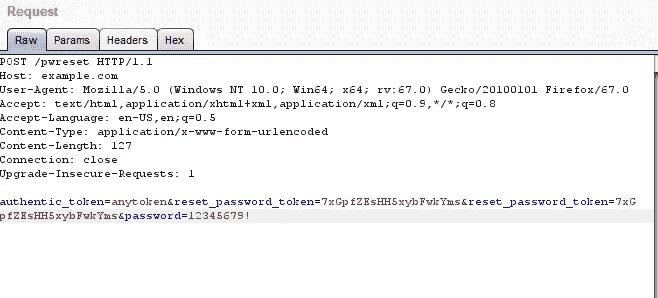

# 我如何解锁被封锁的帐户？

> 原文：<https://infosecwriteups.com/how-i-unlocked-the-blocked-accounts-545e9b7d7be1?source=collection_archive---------1----------------------->

欢迎大家！！！。这是我的第一篇文章:)希望你喜欢。

# **背景**

漏洞是在一个漏洞奖励计划中发现的。让我们对这个名字保密。

于是我开始暴力破解自己的密码，用于检查暴力破解漏洞。尝试了 4-5 次后，我被阻止了。该公司收取了大量的解锁你的帐户。

哦！！！！！！！！！！！！！！！！！！！！！！！！！！！！

现在我真的想要回我的账户。于是我开始寻找任何可以让我找回账号访问权限的漏洞。

我开始测试他们的密码重置功能。即使您被阻止，密码休息链接仍然会被发送。但是当我点击链接时，我在他们的网页上收到了这样的信息:-

“抱歉，由于安全原因，您的帐户已被封锁”。

我想骗过系统。因此，我从被阻止的帐户链接中复制了密码重置令牌，并在有效帐户的密码请求中，将令牌替换为 Burp Suite 中的被阻止帐户令牌。

&哇！！！

密码重置成功。我拿回了我的账户。我报告了漏洞，赏金也付了。

故事并没有到此结束。

几个月后，我再次测试了这个漏洞。上述技术每次都被拒绝。意味着它是固定的！

我所做的是:对于原始请求，我只是在 burp 请求中添加了另一个参数(例如 password _ rest _ token = blockedaccounttoken ),如下所示。

哇哦！！！又成功了。我拿回了我被封的账户。:)和一个好的赏金:D

感谢阅读:)玛丽亚·佐勒菲卡尔！

希望你喜欢。

*关注* [*Infosec 报道*](https://medium.com/bugbountywriteup) *获取更多此类精彩报道。*

 [## 信息安全报道

### 收集了世界上最好的黑客的文章，主题从 bug 奖金和 CTF 到 vulnhub…

medium.com](https://medium.com/bugbountywriteup)