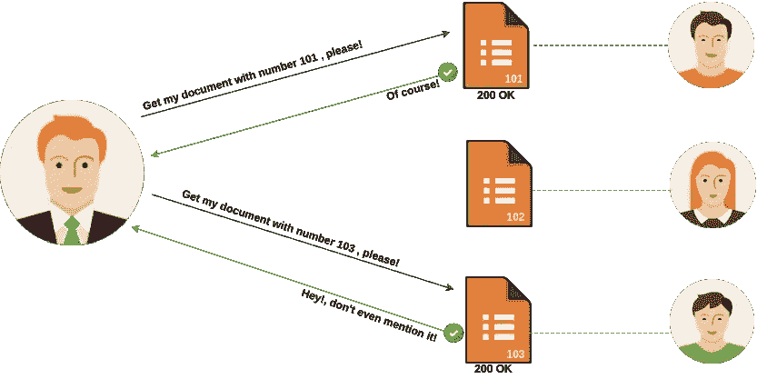
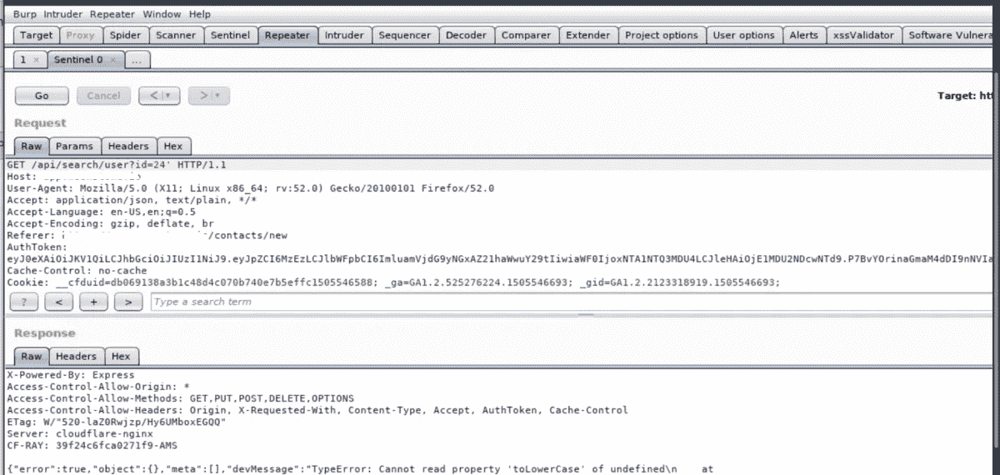
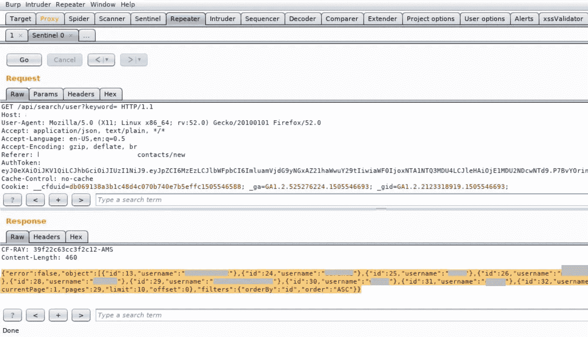
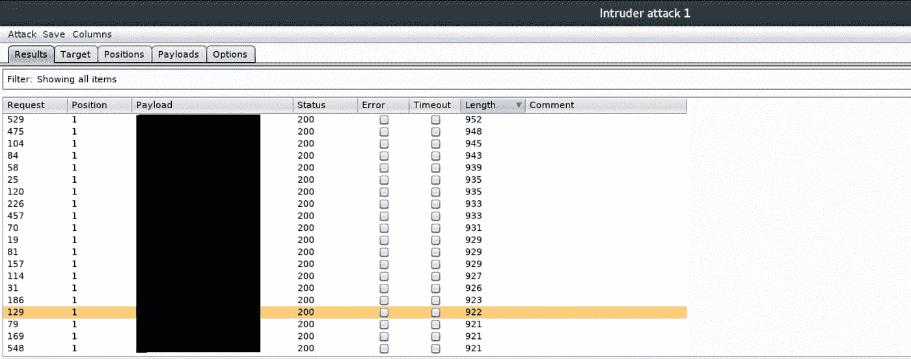
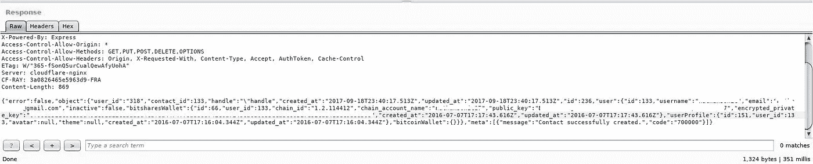

# 在区块链网站中访问公钥和私钥

> 原文：<https://infosecwriteups.com/how-i-was-able-to-access-any-public-private-keys-in-a-blockchain-website-ae0346da91bb?source=collection_archive---------2----------------------->

大家好，我叫 Meridian Miftari，是一名来自科索沃的安全研究员。
今天，我将分享我在一个区块链网站上发现 IDOR 漏洞的第一篇文章，该漏洞允许我查看任何用户数据，如包括公共&私有密钥&名称等。

> 当应用程序公开对内部实现对象的引用时，就会出现不安全的直接对象引用(这里称为 IDOR)。这意味着由于暴露的引用，它允许我们访问未授权的数据。

我在下图中说明了一个 IDOR 漏洞，在用户和服务器之间。
为了保密，我不会透露这个项目的名字。

要做的主要事情是为 web 应用程序结构获取尽可能多的信息。我开始映射应用程序，并找到尽可能多的端点。
所以得到了一个看起来有希望的，尝试了("，')和其他不同的 Sql 注入负载，但它只是出现了相同的错误，没有敏感的响应！

下一个，我建立了一个端点:？关键字={}。
所以我说让我们试一试。
首先，我试图用不同的参数、数字等模糊端点，但什么也没发生。
休息了一会儿来提神，所以回来了，心想要不要试着离开一下？keyword={}空白突然有趣的事情出现了！！

我把这个直接发给入侵者进行模糊化，指定参数？然后我随机使用了不同的有效载荷，比如:a，b，c，d。

请求:

不知道应用程序是如何处理随机负载的，但是突然之间，web 应用程序开始显示更敏感的数据，不仅我可以查看用户名，还可以查看他们钱包的公钥和私钥！

回应:

//希望你在阅读这篇文章的过程中过得愉快，并且学到了新的东西。
//非常感谢。