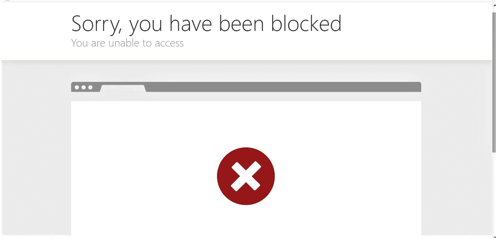
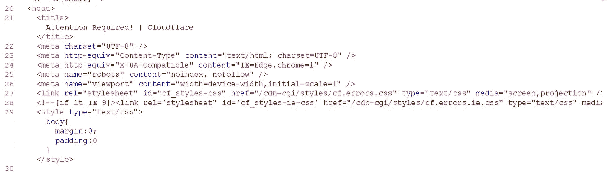
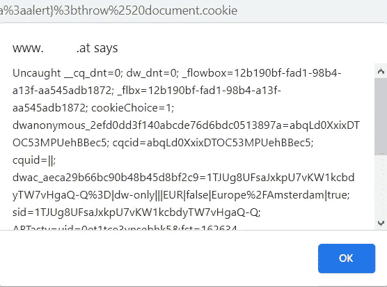

# 我是如何绕过 Cloudflare 去 XSS 的！

> 原文：<https://infosecwriteups.com/how-i-was-able-to-bypass-cloudflare-for-xss-e94cd827a5d6?source=collection_archive---------0----------------------->

以上帝的名义。

嗨，研究者们，

这是我的第二篇文章，如果你读过我的上一篇文章，那是关于绕过 cloudflare 实现 ssrf 的，但这次我们将绕过 cloudflare 实现 XSS！

# 故事:

我正在做一个程序，在登录页面有一个参数是“rurl”，所以完全是关于重定向用户到其他位置。

我尝试打开重定向，我得到了成功的结果！但它被标记为重复:'(

:’(

众所周知，当存在开放重定向漏洞时，我们可以尝试 xss，因为它已被插入到“a”标记内的“href”属性中。

因此，我尝试了我的 xss 有效负载“javascript:alert(1)”，再次得到了这样的响应:

到处都是云闪。:@

# **旁路时间**

我最喜欢的处理这种情况的方法之一是逐一尝试我所有的假设。

所以我试着用“javascript:”来寻找这些:

*   整个 JavaScript 关键字被剥离了吗？
*   “:”部分是否被剥离？

我得到了 200 个回复，我进一步转向了“javascript:alert”:

*   alert 关键字被剥离了吗？
*   如果有警示(1)括号剥离？

因此，正如我们看到的，我们的主要问题是在括号中，所以我试图用“alert`1”绕过括号，但仍然没有成功。但是还有其他技术，比如投掷。

> 许多过滤器阻塞圆括号，因为它们对于调用函数和传递参数是必不可少的，如果过滤器在我们的注入向量中删除圆括号，有几种方法可以绕过它，让我们来看看一种传统的方法，Gareth Heyes 发现了一种方法，通过使用 throw 技术将参数传递给函数而不使用圆括号，throw 技术滥用 onerror 事件处理程序来分配一旦触发错误的函数调用。

带投掷的 XSS 有效载荷是这样的:

" JavaScript:window . on error = alert；抛出 1“我尝试了这个有效载荷，但再次 cloudflare 抓住了我。！

因此，我在这里跳过我所有的努力工作，尝试不同的有效载荷和其他编码技术，如“base64”，“UrlEncoding”，“Htmlencoding”，我给你我发现的钻石。

最后，这是我的有效载荷:

" JavaScript % 3a var { a % 3a on error } % 3d { a % 3a alert } % 3b throw % 2520 document . cookie "

云闪？

我再次:

^_^

这是结束，感谢您阅读我的文章希望你学到了一些东西，并希望我找到更多这样的错误与你分享！❤

我的推特:【https://twitter.com/HoseinVita 