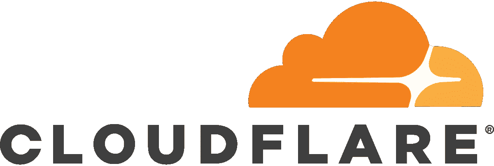
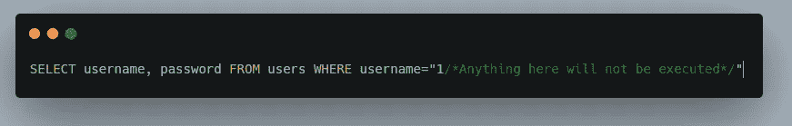
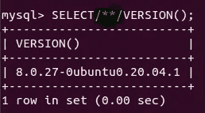
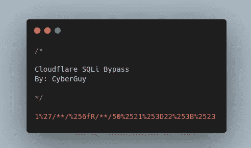

# 我是如何绕过 Cloudflare WAF 实现 SQLi 有效负载的

> 原文：<https://infosecwriteups.com/how-i-was-able-to-bypass-cloudflare-waf-for-sqli-payload-b9e7a4260026?source=collection_archive---------1----------------------->



嗨，黑客和猎人们！

对于许多人来说，Cloudflare 是一个错误，他们希望获得关键漏洞，如:`SQL injection`但不幸的是，它阻止了大多数/所有的有效载荷。所以我在寻找一个目标，我用我的思维方式来绕过并打破这个怪物！

首先，我想注入一个基于布尔的 SQL 注入负载，在绕过你应该知道，最重要的阶段是当你要检测 WAF(网络应用防火墙)阻止坏字符的阶段。

因此，在我的案例中，经过大量尝试后，我发现防火墙阻止了以下内容:

*   间隔
*   `OR` / `AND` 在所有情况下
*   `-- comment`
*   `# comment`
*   `;`
*   `=`

因此，让我们思考一下，如何通过将这篇文章分成几个部分来绕过它们:

> **绕过—空格—**

为了绕过空格，我想绕过使用 URL 编码，比如使用:`%20`但这不起作用，我也试图使用:`+`而不是空格，但也不起作用，所以我试图通过添加多行注释而不是像这样的空格来进行创造性的思考:`/**/`所以现在当 WAF 将它作为普通字符串传递时，但当它到达后端 DBMS 时，它将被解析为注释，如下所示:



这是一个带有多行注释的查询中的普通`SELECT`语句，这也是一个活生生的例子:



> **绕过布尔限制**

现在 WAF 阻止了所有的布尔操作符，即使它是大写或小写，所以在我的技术中，我使用了多种情况操作符来绕过它，比如:`oR` / `aNd`..等等。但不幸的是，在我的例子中，WAF 也阻止了所有这些操作，所以我想到了标准的 URL 编码，所以被阻止的操作符应该是这样的:

`oR -> %6fR`

但不幸的是，防火墙阻止了它，所以想想非标准编码，它在大多数情况下不会被 WAF 捕获，最后，结果是:

```
oR -> %256fR
```

现在我面临一个新的挑战`=`字符被阻止，所以现在我知道了这个 WAF 的弱点，那就是非标准编码，所以我做了一个非标准编码，所以有效载荷是这样的:

```
= -> %253d
```

但不幸的是，如果你在它后面加上任何值，你就会被屏蔽，所以我想:

*   现在我们想使用基于布尔的 SQL 注入来实现**真正的**数据类型，防火墙会阻止非标准编码`=`之后的任何内容
*   但是我想了一会儿，为什么我没有通过另一种方法实现**真的**数据类型，例如，如果我说:`50!=22`那么这里肯定会返回一个**真的**值，因为`50`不等于 22

所以我对`!=`做了一个非标准的编码，就像这样:

```
!= -> %2521%253D
```

> **绕过有效载荷末端**

最后，我想绕过有效载荷的结尾字符，例如，引用注释的`#`或`--`，以及结束查询的`;`，因为我知道我的情况中的弱点，所以我对之前的有效载荷使用了相同的编码类型，它将是:

```
;# -> %253B%2523
```

> **有效载荷的最终结果:**

