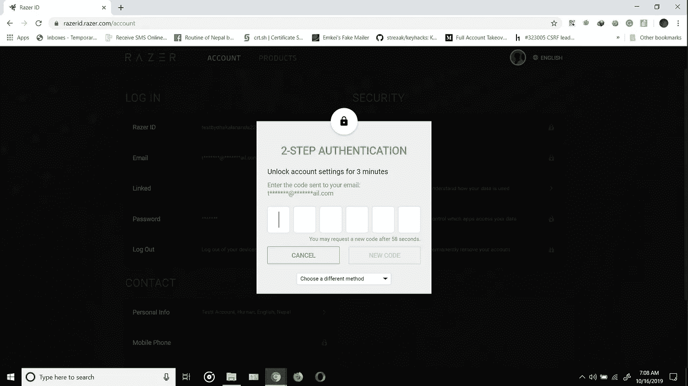
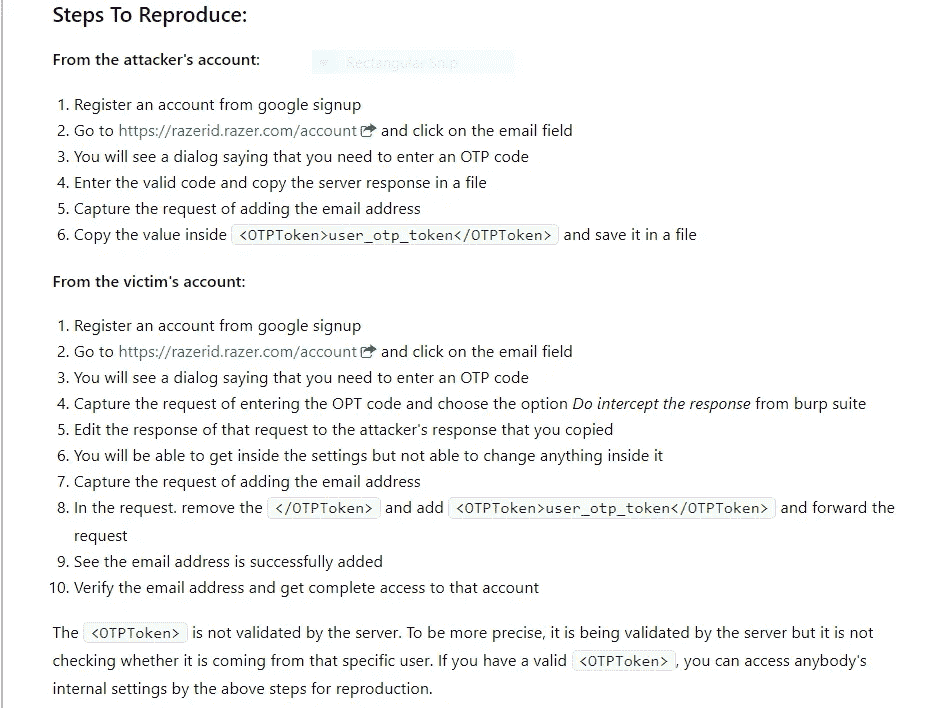
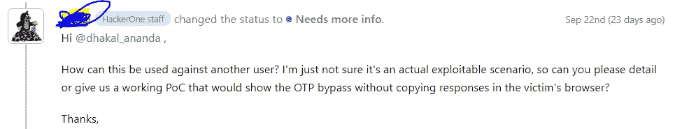
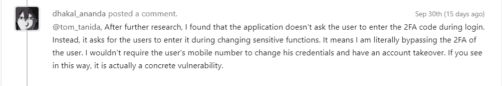

# 我是如何在 Razer 中绕过 OTP 代码要求的

> 原文：<https://infosecwriteups.com/how-i-was-able-to-bypass-otp-token-requirement-in-razer-the-story-of-a-critical-bug-fc63a94ad572?source=collection_archive---------0----------------------->

这是来自尼泊尔的@dhakal_ananda，这是我的第一篇博文。事不宜迟，让我们继续讨论 bug。

所以这个故事很长。在 Razer 在 Hackerone 上公开之前，它是一个私人项目，如果你们大多数人在它公开的时候看过的话，就会知道，我也被邀请参加这个私人项目。但是我不知道为什么我没有黑进程序，只是拒绝了邀请。过了一段时间，它公开了，当我看到它时，它引起了我的注意。我对这个程序非常感兴趣，并立即开始了黑客活动。

由于我对绕过安全功能更感兴趣，而不是搜索 XSS 和 SQLi，所以我开始绕过 OTP 令牌，因为它在第一眼就引起了我的注意。



我困惑了几次，发现应用程序使用了一个长令牌来验证是否输入了 OTP 代码。仅在输入有效的 OTP 代码后才提供 OTP 令牌。

那么我们怎么做才能绕过代码呢？？我不知道你的 ***黑客头脑*** 是否想到了这一点，但没错，这是**使用攻击者的令牌来验证受害者的令牌**。我试过那种方法，它奏效了。

## 以下是重现该问题的方法:

1.  登录到攻击者的帐户
2.  转到[https://razerid.razer.com/account](https://hackerone.com/redirect?signature=f932cf1f285dd2c9c3206ddde9ecb8cd5d9988d0&url=https%3A%2F%2Frazerid.razer.com%2Faccount)并点击电子邮件字段
3.  您将看到一个对话框，提示您需要输入 OTP 代码
4.  输入有效代码并拦截更改电子邮件的请求
5.  将请求发送到中继器
6.  假设您有受害者的凭据，登录受害者的帐户
7.  拦截更改名称的请求
8.  复制用户 id 和用户令牌，并将其保存在一个文件中
9.  根据发送到中继器的请求，将受害者的用户 id 和用户令牌粘贴到攻击者的用户 id 和用户令牌字段中
10.  提交请求，看到电子邮件地址被添加到受害者的帐户中，而不需要 OTP 令牌

```
POST /api/emily/7/user-security/post HTTP/1.1
Host: razerid.razer.com
Connection: close
Content-Length: 260
Accept: application/json, text/plain, */*
Origin: [https://razerid.razer.com](https://razerid.razer.com)
User-Agent: Mozilla/5.0 (Windows NT 10.0; Win64; x64) AppleWebKit/537.36 (KHTML, like Gecko) Chrome/77.0.3865.120 Safari/537.36
DNT: 1
Sec-Fetch-Mode: cors
Content-Type: application/json;charset=UTF-8
Sec-Fetch-Site: same-origin
Referer: [https://razerid.razer.com/account/email](https://razerid.razer.com/account/email)
Accept-Encoding: gzip, deflate
Accept-Language: en-GB,en-US;q=0.9,en;q=0.8
Cookie: ...{"data":"<COP><User><ID>user_id</ID><Token>user_token</Token><OTPToken>otp_token_value_here</OTPToken><login><email>attacker-email@example.com</email><method>add</method><primary>1</primary></login></User><ServiceCode>0060</ServiceCode></COP>"}
```

*注意:这个复制的步骤与我提交的报告不一样。这是使用可开发的 POC 进行复制的简化和实际步骤。*

我这样做是因为应用程序没有验证 cookies 和其他东西。它验证的只是用户标识、用户令牌和动态口令令牌。但是 OTP_token 只有在有效时才有效。未验证它是否属于特定用户。这意味着我可以在受害者的请求中粘贴攻击者的令牌，绕过受害者帐户的 OTP 验证。

***你知道吗？？这个过程最终并不顺利。这是真实的故事。***

我提交了报告，复制步骤如下。下面的复制步骤和上面的复制步骤最后是一样的。只是下面的复制步骤很复杂，不容易理解。



是的，你可以按照这些步骤复制访问受害者的设置，这也是我一开始发现的。这是通过改变反应和做事情和事情和事情，但是，从上述复制步骤，团队成员认为，这将需要物理访问受害者的设备/浏览器。我已经模糊了这么多，以获得这些繁殖的最后步骤，但 Hackerone triage 团队成员要求更多关于它的信息，说了这样的话:



我当时就想"*搞什么鬼？*

我确实在做那件事。我回答了一些没有答案的狗屎问题，如果我现在看到它。在我回复后，该成员以**信息丰富为由关闭了报告。**我让他让内部团队评估这个问题。内部团队成员说这不是一个有效的问题，也就是说，他也不清楚我想说什么。我请他打开问题，以便我可以自行关闭，因为他们似乎根本不理解它。*更明确的说，我也没有像现在这样理解*。然后他打开报告让我自我关闭，因为这对我的信号没有负面影响。

*# bugbounty 提示:在你提交这样的 bug 之前，确保你有清晰的复制步骤。尽可能简化步骤。你能理解的 bug 不能被团队成员理解，你可能会像我一样，最终得到一个 N/A 或信息。*

我完全放下了报告，继续前进。在继续前进 3 天后，我回到了报告上，因为我意识到了一件事。大多数应用程序要求你在登录时输入 2FA 代码，但当我试图更改敏感信息时，它会询问。因此，我在报告中评论说，我绕过了 2FA 的要求，所以它一定是一个有效的漏洞。



过了一天，我收到了一个回复，大概是这样的:

> 如果你有一个 PoC，你只能访问受害者用户的 Razer ID 帐户和密码，然后可以访问或更改个人资料信息，这将是一个有效的报告。

而我就像**挑战接受了！！**

该团队成员向我提供了一个测试帐户的电子邮件地址和密码，以更改电子邮件地址。我在没有访问 OTP 令牌的情况下更改了该帐户的电子邮件地址，并删除了之前的电子邮件。之后，我说我已经更改了电子邮件地址，你不能使用以前的电子邮件访问该帐户。

*在这次黑客攻击中，我和我的兄弟以及我的表弟在一起，在我一大早完全利用了这个漏洞之后，我们真的在大喊大叫*

一天后，他重新打开了报告，并将状态更改为**triaded**，严重性设置为 **Critical。**我真的很高兴，因为我能够展示一个概念验证并利用这个漏洞。

*两天后，我想我应该写一篇关于这个问题的文章，并为它保存一个视频。但在我创建视频概念验证之前，它就被修复了。*

我为此获得了总计 1000 美元的奖金。赏金是 750 美元，奖金是 250 美元，因为这个误会非常非常长。

*# bugbounty 提示:确保模糊参数，并在另一个用户的会话中使用一个用户的令牌。有时，可能存在令牌验证，但缺少用户令牌验证。*

经过几天的分流，我发现了另一个 OTP 旁路，这个问题已经解决了。这是一个非常快速有效的解决方案，奖金还在等待中。

我希望你们喜欢这篇很长的博文。请随意发送一些反馈，我会非常感激。下一篇文章再见。

*哈克罗尼简介:https://hackerone.com/dhakal_ananda*

*推特简介:*[*https://twitter.com/dhakal_ananda*](https://twitter.com/dhakal_ananda)

*关注* [*Infosec 报道*](https://medium.com/bugbountywriteup) *获取更多此类精彩报道。*

[](https://medium.com/bugbountywriteup) [## 信息安全报道

### 收集了世界上最好的黑客的文章，主题从 bug 奖金和 CTF 到 vulnhub…

medium.com](https://medium.com/bugbountywriteup)