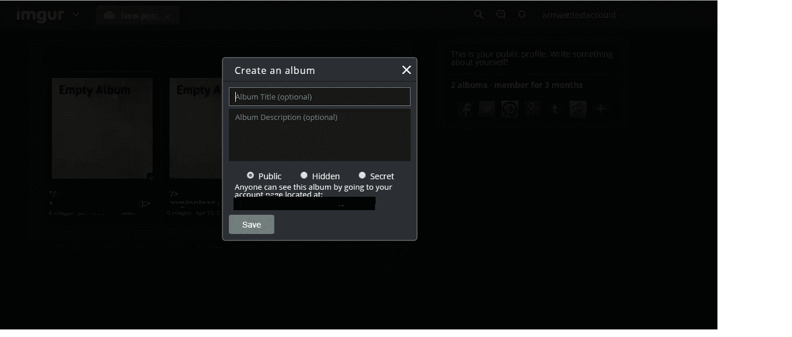
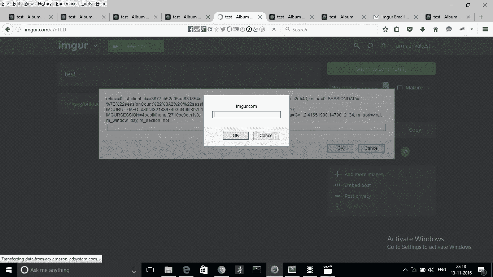
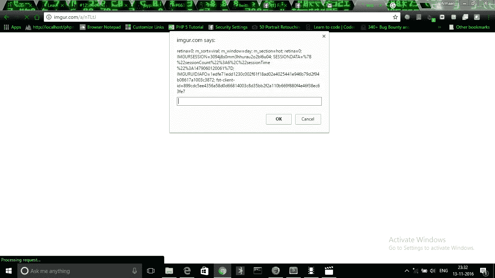
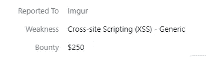

# 我是如何在知名网站中绕过强大的 xss 保护的。(imgur.com)

> 原文：<https://infosecwriteups.com/how-i-was-able-to-bypass-strong-xss-protection-in-well-known-website-imgur-com-8a247c527975?source=collection_archive---------0----------------------->

完成期末考试后，我决定花一段时间专门研究 bug bounty，不是为了赚钱，而是为了学习，所以我选择了我的目标。

所以我选择了我的领域是 imgur.com。

一旦我选择了目标，我就开始浏览网站&在那里我发现有一个选项

相册描述

我决定找出专辑描述是否容易受到跨站脚本漏洞的攻击。

所以我先输入了"/>我注意到它在显示 alert(1)的时候已经把

然后，我决定使用事件处理程序有效负载来检查我是否得到了弹出窗口。所以我尝试了"/> <svg>&现在我注意到它已经从专辑描述中删除了 onload 标签，只显示了<svg>标签。</svg></svg>

这里我注意到了应用程序的行为，它去掉了

在我最终决定使用

和

我绕过了那里的 XSS 保护，能够存储恶意脚本。

报道后，它被修补和奖励甜蜜的赏金:)

