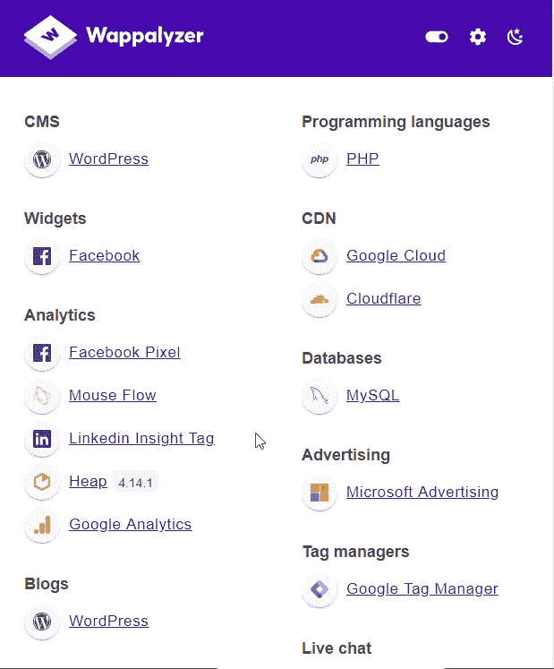
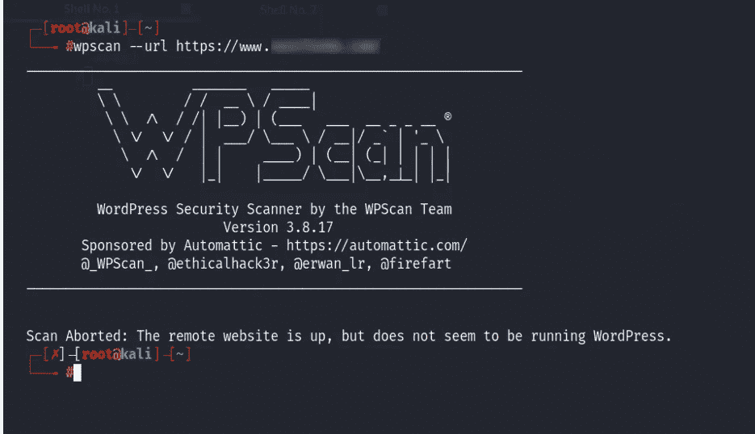
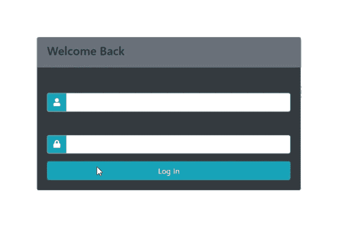
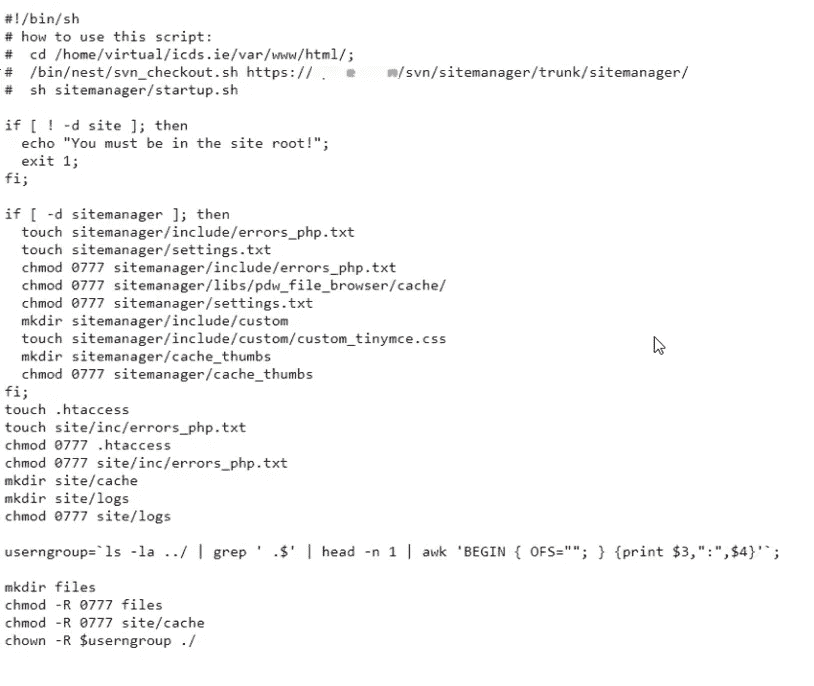

# 我是如何在没有凭证的情况下绕过管理面板的。

> 原文：<https://infosecwriteups.com/how-i-was-able-to-bypass-the-admin-panel-without-the-credentials-d65f90e0e1e4?source=collection_archive---------0----------------------->

这是我的第一篇文章，我希望你们一定会学到一些新东西。因为我不被允许透露关于公司的信息，让我们假设它是 example.com。主域是测试漏洞的唯一范围。现在让我们进入 bug………。

每当我们访问一个网站时，我们都试图首先了解所使用的技术，为此，我使用了一个名为 [wappalyzer](https://www.wappalyzer.com/) 的扩展。

你一定在想，是的，有一个 CMS(内容管理系统),它是 WordPress，让我们绕过/wp-admin。但事实并非如此，这个结果可以说是假阳性。因此，为了验证这一点，我们可以使用 Kali Linux 中预装的名为 Wpscan 的工具。

所以这是一个很好的例子，说明 wappalyzer 如何向您显示假阳性结果。这让我想到，如果 WordPress 是一个假阳性结果，那么这个网站的 CMS 会是什么。现在，让我们从侦察过程开始。

**现在好戏开始了……**

1)目录暴力

有多种工具可以暴力破解目录。下面给出其中的几个。

i) [FFUF](https://github.com/ffuf/ffuf)

ii) [GoBuster](https://github.com/OJ/gobuster)

三)[迪达尔](https://github.com/M4DM0e/DirDar)

有太多的列表可用于暴力破解目录。下面给出其中的几个。

i) [Seclist:](https://github.com/danielmiessler/SecList)

ii ) [目录搜索:](https://github.com/maurosoria/dirsearch/blob/master/db/dicc.txt)

iii) [资产说明](https://wordlists.assetnote.io/)

我使用了 ffuf 工具和 assetnote 文件，所以命令看起来像这样

命令:ffuf-c-w/word list-u/URL/FUZZ-MC 200，301，302 -t 500

在使用了单词表之后，我能够进入其中一个目录，这个目录是“**site manager”**。我打开目录，我得到了该公司的 CMS 登录页面。

**管理门户**

现在，我尝试使用默认凭证，但仍然无法进入管理门户。

这个网站看起来有点像这个 https://www.example.com/sitemanager/login.php?位置= % 2fs item manager % 2F

为了不浪费任何时间，我尝试重新构建/sitemanager/FUZZ 目录，结果我得到了这么多端点(所有这些都是假阳性，显示 200 OK，大小为“0”)，但是单词列表中只有一个有效，那就是/s **tartup.sh**

**启动。sh**

这让我感到高兴，是的，我得到了一些端点，通过它们我可以升级到管理门户，但仍然有一些机会在“settings.txt”或“errors_php.txt”中暴露凭据，我可以通过它们进入管理门户。

现在打开 errors_php.txt 和 settings.txt 后

1.  **错误 _php.txt**

— — — — — — — — — — — — — — — — — — — — — — — — — —

出现错误:02.11.2020 10:02:32
用户:admin，script:/site manager/admin . PHP
IP:77。**.**.**| ISP 信息:host-77–236–201–15 |会话:emdcjngeinl81f9kl5c9hjlp31|代理:Mozilla/5.0(Windows NT 6.1；WOW64RV:16.0)Gecko/2010 01 01 Firefox/16.0
8、未定义变量:edit_profile_page_pid、/home/text/www/site/modrw.php、42

出现错误:02.11.2020 10:56:16
用户:管理员，脚本:/site manager/admin . PHP
IP:77。**.**.**| ISP 信息:host-77–236–201–15 |会话:emdcjngeinl81f9kl5c9hjlp31|代理:Mozilla/5.0(Windows NT 6.1；WOW64RV:16.0)Gecko/2010 01 01 Firefox/16.0
8、未定义变量:edit_profile_page_pid、/home/text/www/site/modrw.php、42

出现错误:05.11.2020 11:41:46
用户:管理员，脚本:/site manager/admin . PHP
IP:77。**.**.**| ISP 信息:host-77–236–201–15 | Session:i6f 928 p 13 qcd 1 bpoinlkljj 31 |代理:Mozilla/5.0(Windows NT 6.1；WOW64RV:16.0)Gecko/2010 01 01 Firefox/16.0
8、未定义变量:edit_profile_page_pid、/home/text/www/site/modrw.php、45

— — — — — — — — — — — — — — — — — — — — — — — — — — — — — — —

这是我觉得我可以使用这个错误文件升级到管理门户的一点。但不幸的是，我没能做到。因此，从道德上讲，我单独报告了这份文件，并得到了。

2. **settings.txt**

再次打开这个文件后，我得到了一些 HTTP burp 请求文件，但这次它们有 cookies。这些请求响应是管理员和 cookie 的，也是多个用户和 cookie 的。现在，admin 的 HTTP 请求如下所示:

— — — — — — — — — — — — — — — — — — — — — — — — — — — — — — —

日期:2020–11–20 15:19:41
设置
头:GET
主机:www.example.com
连接:keep-alive
编译指示:无缓存
缓存控制:无缓存
升级-不安全-请求:1
用户代理:Mozilla/5.0(Windows NT 10.0；Win64x64) AppleWebKit/537.36 (KHTML，像壁虎一样)Chrome/70 . 0 . 3538 . 102 Safari/537.36
接受:text/html，application/xhtml+xml，application/XML；q=0.9，image/webp，image/apng，*/*；q=0.8
推荐人:https://www.example.com/sitemanager/admin.php
接受-编码:gzip，deflate，br
接受-语言:cs，en-GB；q=0.9，en；q=0.8，sk；q = 0.7
Cookie:_ _ stripe _ mid = b1a 624 a 3-b1da-45aa-9aca-6236 DD 8 # # #；_ ga = ga 1.2 . 805574655.149725 # # # #；_ _ at uvc = 0% 7c 41% 2c 0% 7c 42% 2c 0% 7c 43% 2c 0% 7c 44% 2c 1% 7c 45；语言= csPHPSESSID = lqcp 890 ff 17 r 02 erb # # # # #；_ GID = ga 1.2 . 1643979482.1542716 # #；login _ config = u % 3admin_gat=1
IP 信息:
脚本:/site manager/settings . PHP
IP:213。**.**.**
ISP 信息:213。**.**.**
会话:lqcp890ff17r02erbkot5u###
代理:Mozilla/5.0(Windows NT 10.0；Win64x64) AppleWebKit/537.36 (KHTML，像壁虎一样)Chrome/70 . 0 . 3538 . 102 Safari/537.36

— — — — — — — — — — — — — — — — — — — — — — — — — — — — — —

将它粘贴到 burpsuite 的 repeater 中，并根据 repeater 做了一些基本的修改&添加了目标部分，我得到了 200 OK。我就像……

> **现在我们回到了正题上**

我添加了“ **/dashboard.php** ”目录，然后我获得了管理员权限，可以使用这个门户了。

# 奖励/赏金

这被报告给了安全团队，他们删除了 sitemanager 门户。

我因为这个 bug 获得了 500€。

# 拿走

始终寻找可用于将 bug 从低级升级到严重/高级的端点。

> 感谢你阅读这篇文章。欢迎评论和反馈。