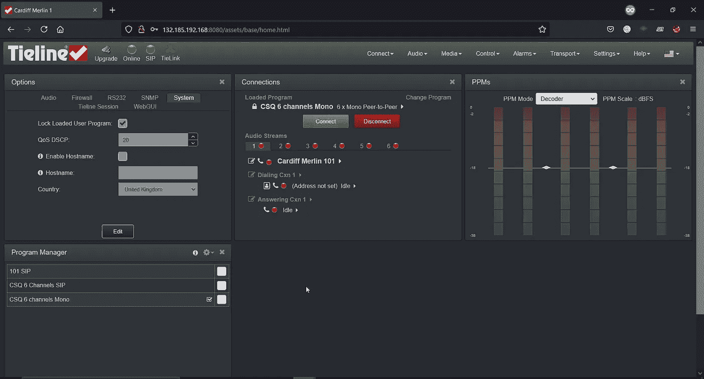
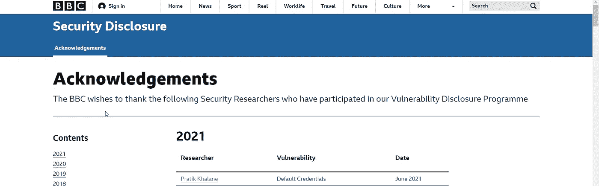

# 我是如何通过使用 BBC Corporation 的默认凭证绕过管理门户的。

> 原文：<https://infosecwriteups.com/how-i-was-able-to-bypass-the-admin-portal-by-using-the-default-credentials-52bfb13e6f3?source=collection_archive---------3----------------------->

大家好，今天我将谈论我在 BBC 网站上发现的一个严重错误，它使用默认凭证绕过管理门户。现在，让我们从侦察过程开始

**第一步:**

1)有多种工具可以让你得到子域，下面给出了其中的一些…

I)[find domain](https://github.com/Findomain/Findomain)

ii) [**子指针**](https://github.com/projectdiscovery/subfinder)

iii)[knock . py](https://github.com/guelfoweb/knock)

2)要从子域名列表中获取活动主机，我们可以使用以下工具

I)[**http probe**](https://github.com/tomnomnom/httprobe)

ii)[**httpx**](https://github.com/projectdiscovery/httpx)

现在我更喜欢使用 findomain 来快速获得我的结果。所以这个命令看起来会像这样…

命令:find domain-t bbc.com | httpx | tee BBC . txt

你可以使用多种工具来寻找子域，然后将它们保存在一个文件中…..

**第二步:**

现在我们已经从所有三个工具中获得了所有的子域，所以我们可以使用名为“**”的工具。该工具将扫描文件中保存的子域可能打开的所有端口。**

**要用这个工具测试一个文件，你可以使用命令。**

**命令:naabu-iL BBC . txt | tee bbcportscan . txt**

****第三步:****

**扫描完所有的子域后，我发现有一个网站的端口是 8080。**

**网站不能直接打开，所以我把 DNS 改成 IP 来验证它是否能正常工作。但实际上，它起作用了。**

****第四步:****

**当我打开网站时，它看起来像这样**

****

****管理员登录页面****

****第五步:****

**这一部分非常简单，因为我认为使用 admin : admin 或 root : password 或 administrator : password 可能适用于默认设置，但我错了。然后我试着输入用户名和密码“ **admin : password** ”，结果成功了。**

**当我看到管理页面仍然使用默认凭据，并且我能够完全访问管理面板时，我感到非常震惊。**

****

****管理页面****

**在向 BBC 安全团队报告这个问题后，我很荣幸登上了他们的名人堂页面，并将获得一件限量版的 bug-finder BBC T 恤。**

****

****https://www . BBC . com/back stage/security-disclosure-policy/鸣谢****

**他们移除了整个网站，并封锁了对管理面板的所有访问。**

****时间线****

1.  **报道:6 月 10 日**
2.  **缓解日期:6 月 13 日**
3.  **名人堂承认:6 月 14 日**

**我又报告了一个 FTP 服务器，它的登录默认凭证是“匿名的”…所以在我去拿酷礼物的路上又多了一个 bug:)**

# **拿走**

**如果你觉得这样会危及整个系统的安全，那么就尽量在每个页面上使用默认的凭证。**

**请继续关注更多报道。**

> **感谢你阅读这篇文章。欢迎评论和反馈。**