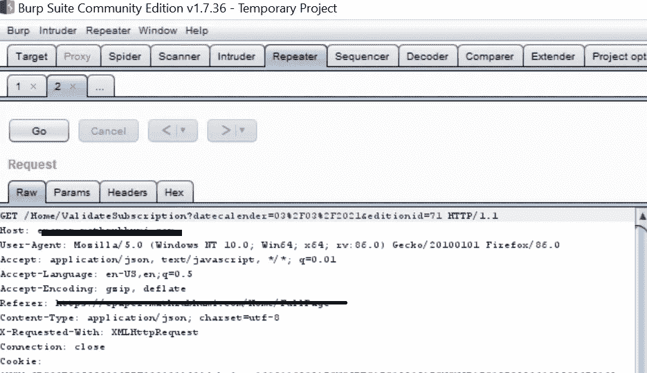
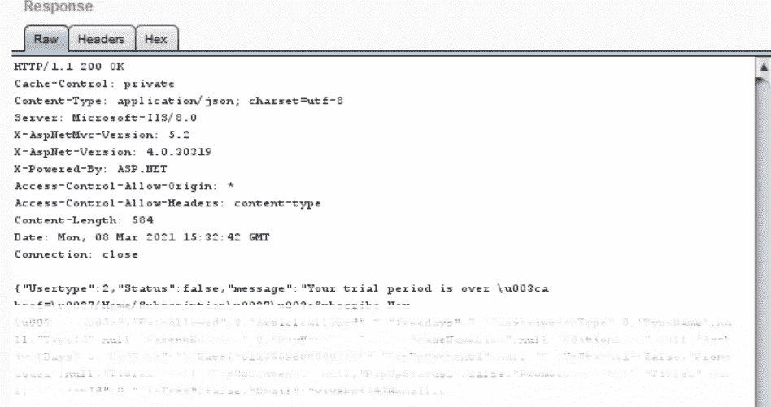

# 我是如何通过响应操作绕过一个著名的区域性电子报纸 web 应用程序的订阅计划的。

> 原文：<https://infosecwriteups.com/how-i-was-able-to-bypass-the-subscription-plan-of-a-famous-regional-e-paper-web-application-by-b14bb5d82c5f?source=collection_archive---------0----------------------->

我妻子正在找一份教师的工作。一天，她告诉我，她每周四都需要这份报纸，因为上面刊登了很多就业机会。她让我从办公室回来时把报纸带来。但这让我很头疼，因为在那些日子里，我通常都是晚上 9 点以后才离开办公室。我妻子认为我工作负担很重(这是我告诉她的)。但实际上晚上 7 点以后，我们在工作的时候玩纸牌。所以我认为访问他们的电子文件而不是购买硬拷贝会很好。当检查他们的网站时，我可以发现他们已经开始了订阅计划，我们需要付费。幸运的是，有 7 天免费试用，我很快就注册了。试用期不允许我们浏览旧内容。所以如果我需要特定日期的内容(例如去年)，我应该付费订阅。所以我决定测试这个应用程序，主要有三个原因

*   我想给我妻子留下深刻印象(是的，这是真的，我告诉她我可以用 HTML 黑掉 NASA，她相信了):|
*   我不想为了买这份报纸而提前离开办公室，放弃游戏和乐趣
*   我对这份地区性新闻报纸的安全实现很好奇。

所以 7 天后，我开始收到一个错误，说我的订阅期结束了。我可以很容易地使用另一个电子邮件地址注册，然后再使用 7 天。但我对此不感兴趣，因为它不允许我访问旧的内容。

像往常一样，我开始检查网络流量。该应用程序是使用 ASP.NET 网络框架构建的。我注意到，每次尝试加载电子报纸的任何页面时，应用程序都会发送一个请求来检查我的订阅计划和我的身份验证 cookie。我把这个请求转发给了打嗝中继器，以便进一步调查。请求如下

由于我的试用期已经结束，对上述请求的回应是

当我收到这个回复时，我收到了一个错误，上面写着“你的试用期已经结束”。但是你可能已经注意到了回答中的重要部分。是的，响应中有一个状态字段，其值为“false”。因此，我再次尝试访问另一个页面，请求被转发到 burp，这一次我选中了拦截该请求响应的选项。当在 burp 中收到响应时，我将状态值更改为“Yes ”,并将其转发给浏览器。

不出所料，我绕过了他们的验证，电子纸被加载了。一旦收到验证请求的“真”状态，应用程序就向另一个端点发送请求，该端点将加载内容。有一个选项可以选择电子纸的日期、版本和页码。更改任何该值都将伴随一个验证请求。所以我在 burp suite 里写了一个规则，这样每一个内容为 *"* ***{"Usertype":2，" Status":false，" message ":"你的试用期结束了\u003ca"*** 将被替换为{ ***"Usertype":2，" Status":true，" message ":"你的试用期结束了\u003ca。*** 这样我就可以不受订阅和日期的限制访问内容了。

他们没有漏洞奖励计划，但我决定向他们的客户支持报告这个问题。但是他们还没有修复它，也没有在第一次确认后回复。