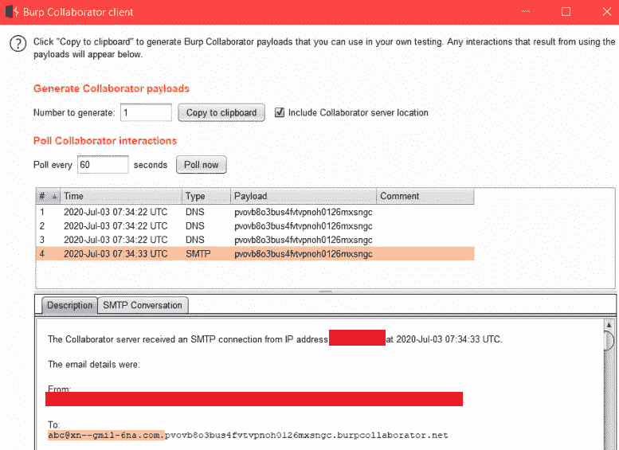
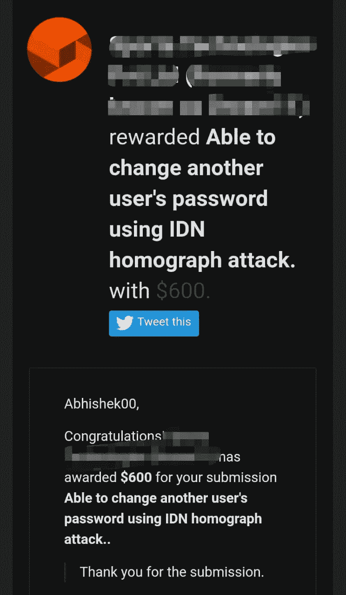

# 我如何能够改变受害者的密码使用 IDN 同形异义词攻击

> 原文：<https://infosecwriteups.com/how-i-was-able-to-change-victims-password-using-idn-homograph-attack-587111843aff?source=collection_archive---------1----------------------->

嘿，伙计们，往这边走。这是我的第一篇文章。这篇文章是关于我在 BugCrowd 私有程序中发现的一个漏洞。

什么是 IDN 同形异义攻击？

[**国际化域名**](https://en.wikipedia.org/wiki/Internationalized_domain_name) ( **IDN** ) **同形异义词攻击**是一种恶意方可能欺骗计算机用户关于他们正在与什么远程系统通信的方式，通过利用许多不同的[字符](https://en.wikipedia.org/wiki/Grapheme)看起来相似的事实(即，它们是同形异义词，因此是攻击的术语，尽管从技术上讲[同形异义词](https://en.wikipedia.org/wiki/Homoglyph)是不同的看起来相似的字符的更准确术语)。例如，[example.com](https://en.wikipedia.org/wiki/Example.com)的普通用户可能会被引诱点击一个链接，在该链接中[拉丁文](https://en.wikipedia.org/wiki/Latin_alphabet)字符[“a”](https://en.wikipedia.org/wiki/A)被替换为[西里尔文](https://en.wikipedia.org/wiki/Cyrillic_script)字符[“а”](https://en.wikipedia.org/wiki/A_(Cyrillic))。

有一天在 twitter 上看到有趣的#bugbountytips 帖子[https://Twitter . com/musicloudermll/status/1276987908340232193？s=19](https://twitter.com/musiclouderlml/status/1276987908340232193?s=19)

然后我想为什么不试一试。我开始在 Bugcrowd 私人程序上寻找这个 bug。让我们打电话给 target.com。

网络应用"https://target.com/forgot-password？email= "无法正确验证“email”的值，该值用于通过使用 IDN 同形异义词攻击更改用户的密码来接管用户的帐户。

IDN 同形异义词攻击利用了这样一个事实，即许多不同的字符看起来像 a 不同于á，因为我们使用了看起来完全像 a 的重音符号，假设受害者的帐户是 abc@gmail.com，攻击者要求 abc@gmáil.com 的密码重置链接，target.com 的邮件系统将受害者-abc@gmail.com 的密码重置链接发送到 attacler mail-ABC @ xn-gmil-6na.com，要执行此攻击，攻击者必须购买域名 xn-gmil-6na.com

不买域名怎么测试？

*   答案是使用 burp collaborator 客户端。

我们必须在 target.com 创建一个帐户，电子邮件-abc@gmail.com.burpcollaboratorpayloadhere

因此，当我们询问 abc@gmáil.com.burpcollaboratorpayloadhere 的密码重置链接时，target.com 会将用户 abc@gmail.com.burpcollaboratorpayloadhere 的密码重置链接发送到邮箱 ABC @ xn-gmil-6na.com.burpcollaboratorpayloadhere，这是在 Burp collaborator 客户端收到的密码重置链接。请务必在 burp collaborator 客户端查看收到的电子邮件详情:To-ABC @ xn-gmil-6na.com.burpcollaboratorpayloadhere。

复制的步骤-

1.  打开 burp collaborator 客户端>生成 collaborator 有效负载。
2.  转到 target.com 的注册页面，创建一个新的电子邮件帐户-abc@gmail.com.burpcollaboratorpayloadhere
3.  现在，如果 target.com 有电子邮件确认>功能，您将在 burp collaborator 客户端>验证电子邮件中收到电子邮件确认链接。
4.  进入 target.com 的密码重置页面>输入 abc@gmáil.com.burpcollaboratorpayloadhere 的电子邮件
5.  如果 target.com 存在漏洞，它会将密码重置链接发送到邮箱 ABC @ xn-gmil-6na.com.burpcollaboratorpayloadhere，您将在 burp collaborator 客户端收到密码重置链接。请务必查看 burp collaborator 客户收到的电子邮件详情:To-ABC @ xn-gmil-6na.com.burpcollaboratorpayloadhere。
6.  现在你可以更改密码，进入受害者的账户。

结果-

特别感谢[https://twitter.com/musiclouderlml](https://twitter.com/musiclouderlml/status/1276987908340232193?s=19)分享#bugbountytips。

希望你们喜欢。感谢阅读。