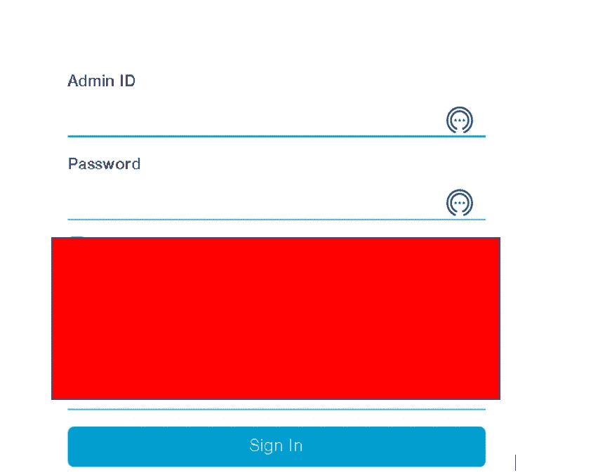
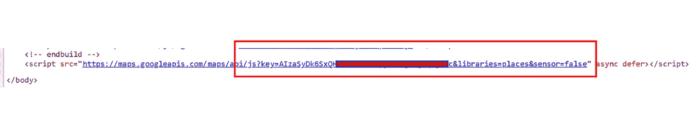
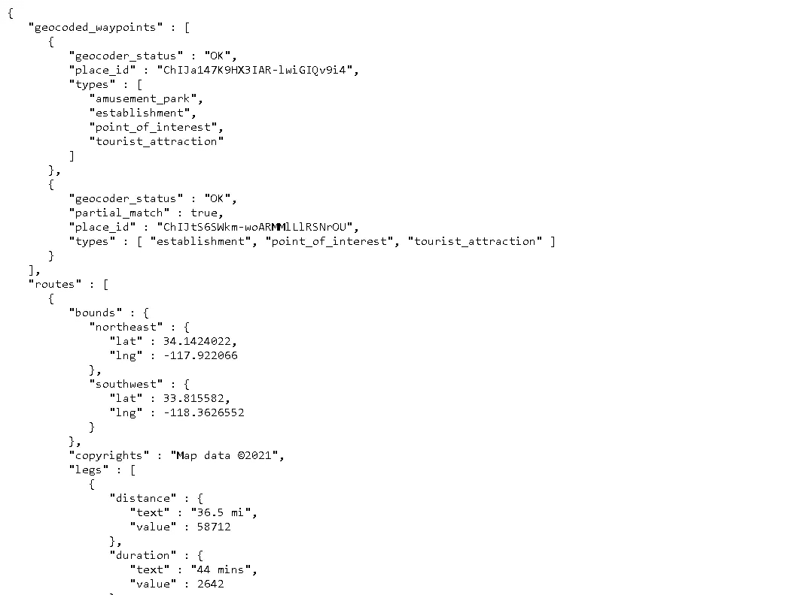

# 我如何能够找到并利用目标的谷歌地图 API 密钥，你也可以这样做

> 原文：<https://infosecwriteups.com/how-i-was-able-to-find-and-exploit-the-google-maps-api-key-of-a-target-and-you-can-do-it-too-8142ba0453cb?source=collection_archive---------1----------------------->

嘿，你好吗，黑客和专业的 bug 赏金猎人们希望你过得很好，保持安全，全力狩猎，逃避在线课程(每个人都做 xD)。所以今天我要分享一个有趣的故事，关于我在一个项目中的一个有趣的发现。出于显而易见的原因，我不会透露这一点，所以让我们假设它是 redacted.com。你准备好了吗？如果没有，那就喝杯咖啡，然后我们开始吧

所以这只是我们在疫情度过的普通的一天，我选择了一个目标，在[子文件夹](https://github.com/projectdiscovery/subfinder)的帮助下列举了它的所有子域，并使用[http probe](https://github.com/tomnomnom/httprobe)探测它们。现在我正在访问所有活子域列表中的每一个子域，我建议你也一样，不要依赖工具。花了几乎 3 个多小时没有发现任何有趣的东西，几乎所有的都是静态网页。休息了一会儿，再次继续，然后一个子域引起了我的注意。因为这是一个管理员登录页面。

但没什么新的。起初，我也很兴奋，尝试了每个人都做的所有事情(默认凭证、枚举、SQLi 等等)，但没有成功。在我最后一次尝试 Google Dorking 后，我想放弃。但是当我试着复制 URL 进行 dorking 时，我误按了 CTRL+U 而不是 CTRL+C，然后源代码加载了，我看到了一些让我高兴和震惊的事情。

是啊是啊。你猜对了，是 Google Maps API key 在源代码中被泄露(经常在源代码中发现)。我很高兴，因为我几乎想放弃，但突然我的打字错误得到了一些东西。

源代码中的 API 键

然后我很快冲向[**Key hacks**](https://github.com/streaak/keyhacks)**Github Repo(非常有用)，然后选择 Google Maps API Key，复制静态地图 URL 端点，复制我的 Key 并粘贴在那里**。但是发生的事情出乎我的意料，我很难过。**密钥被限制******

****

**当时我还是一个初学者，所以我不知道我们需要在所有端点上测试密钥，因为它可能并不局限于所有端点，所以我做了一些研究，了解了这一点，并在所有端点上尝试了密钥，如街景、嵌入、地理编码、方向和该报告中可用的所有端点。幸运的是，除了静态映射端点之外，所有端点都容易受到攻击:)**

****

**这意味着现在我能够借助 API 密钥进行未经授权的调用，这给公司造成了一些损失。你可以参考回购协议上的准确金额。同样，作为一名攻击者，如果没有配置或限制，我可以消耗公司的配额，如果计费服务没有正确配置，我可以导致 Dos 攻击。简而言之，这意味着公司将遭受巨大的财务损失。我很快向 POC 做了一份报告，仅在第二天就被接受了，我也被加入了名人堂。**

# ****外卖****

**手动检查每一个子域，在 JS 文件和源代码中寻找敏感的端点，你会发现一些有趣的东西，也避免每次都使用工具，因为记住**“自动化不能取代手动发现，因为它取决于你的思考方式和滥用功能”****

**页（page 的缩写）S: Bugcrowd 大多不会接受这个提交，或者可能会关闭它作为一个信息。我从很多人那里听说过这个，但是没有人知道原因。所以你最好不要浪费时间在 Bugcrowd 程序中寻找这个。如果你在其他地方寻找，比如 Hackerone、Intigrity 和 RDP，我相信这将被接受，如果不是一个副本的话。**

**这就是今天的全部内容，我希望你能学到一些有用的知识。如果是的话，别忘了鼓掌，并通过 [**Twitter**](https://twitter.com/ChiragSoni404) 与我联系(Dm 永远开放)。**

**结束！！！和平**

# ****参考文献****

** [## 未经授权的谷歌地图应用编程接口的关键使用案例，以及为什么你需要关心

### 对于那些不了解这项服务及其 API 密钥的人来说，谷歌地图 API 是一项付费服务…

ozguralp.medium.com](https://ozguralp.medium.com/unauthorized-google-maps-api-key-usage-cases-and-why-you-need-to-care-1ccb28bf21e)  [## 利用谷歌地图 API 密钥牟利

### 嗨，我的黑客伙伴们，我希望你们都喜欢 WFH 并学习新的技术。我在这里写一篇关于…

infosecwriteups.com](/exploiting-google-maps-api-keys-for-profit-3903dd2c829c) 

[https://blog . dixitaditya . com/bypassing-Google-maps-API-key-restrictions/](https://blog.dixitaditya.com/bypassing-google-maps-api-key-restrictions/)

 [## FetLife 在 HackerOne 上披露:谷歌 API 密钥泄露给公众

### 嗨，团队，我发现一堆终端泄漏你的谷歌 Api 密钥。我测试了密钥，发现它很脆弱…

hackerone.com](https://hackerone.com/reports/1065041)**