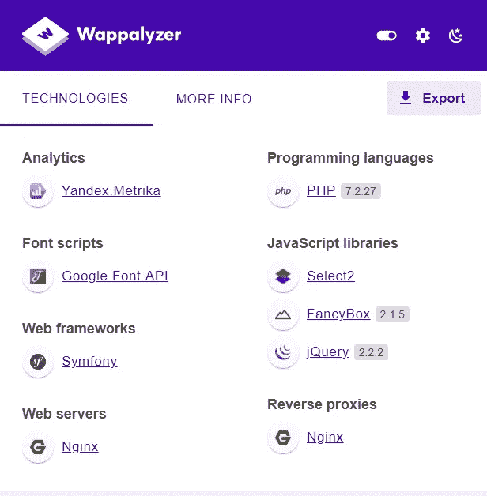
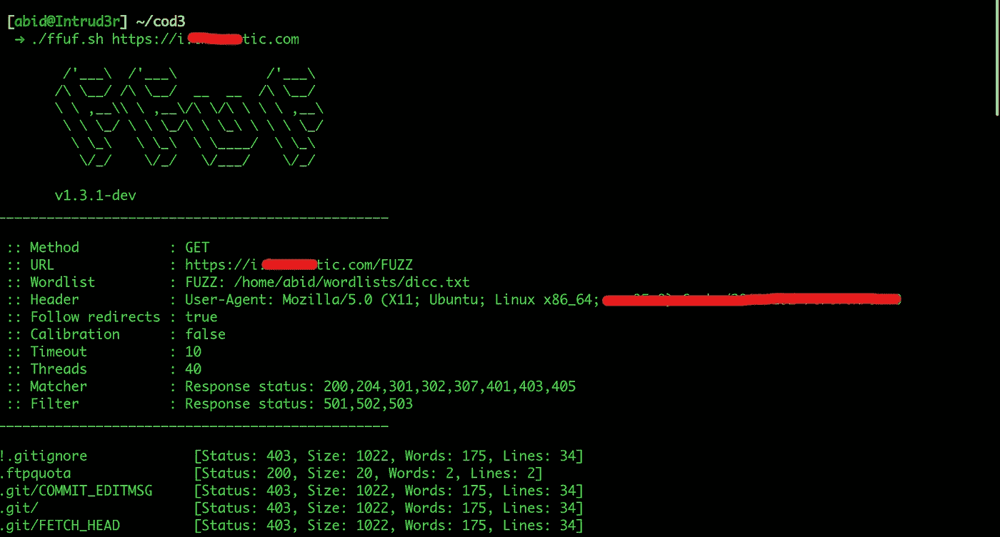
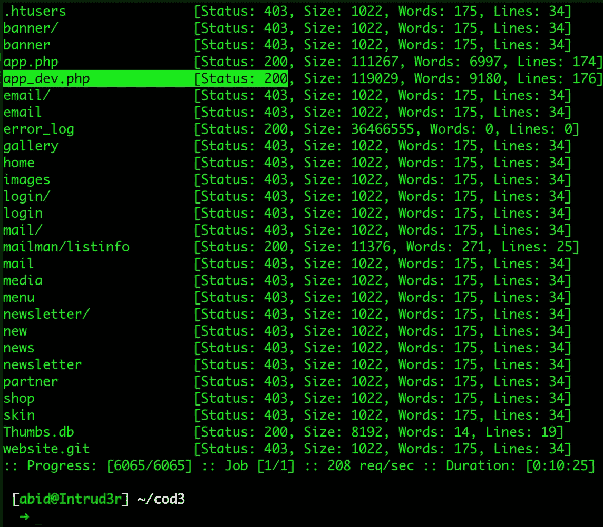
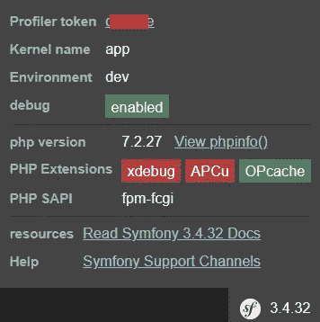
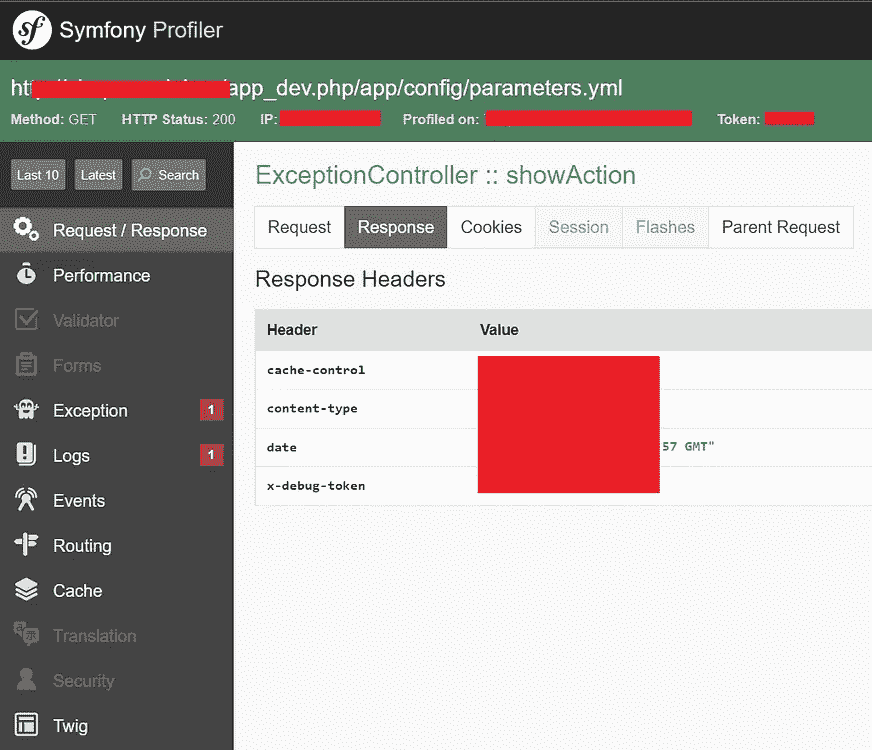
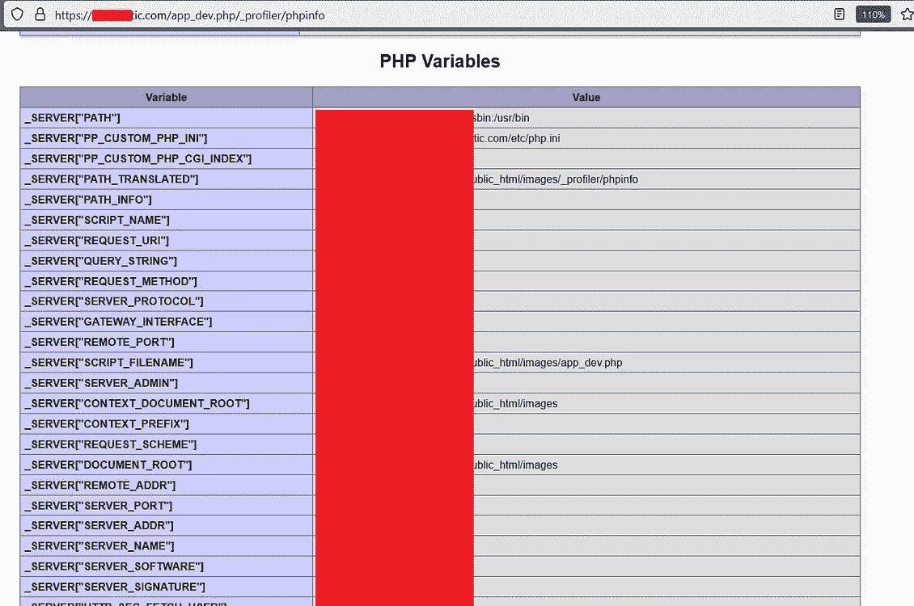
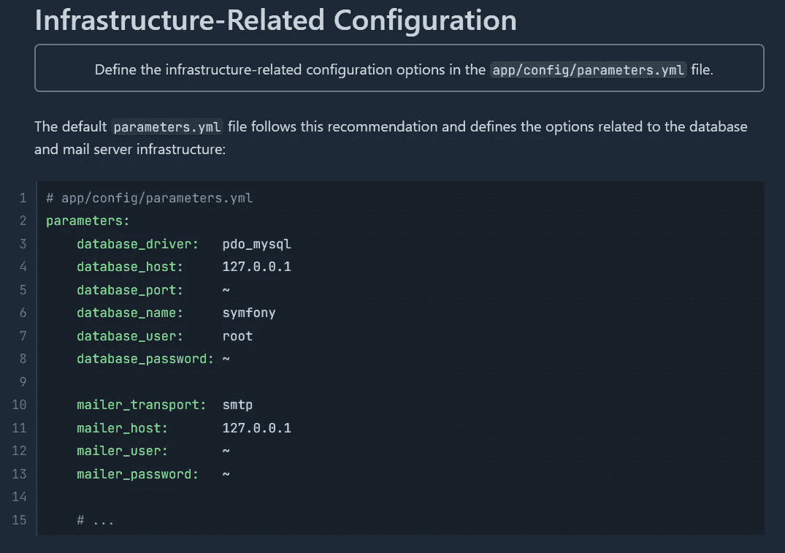
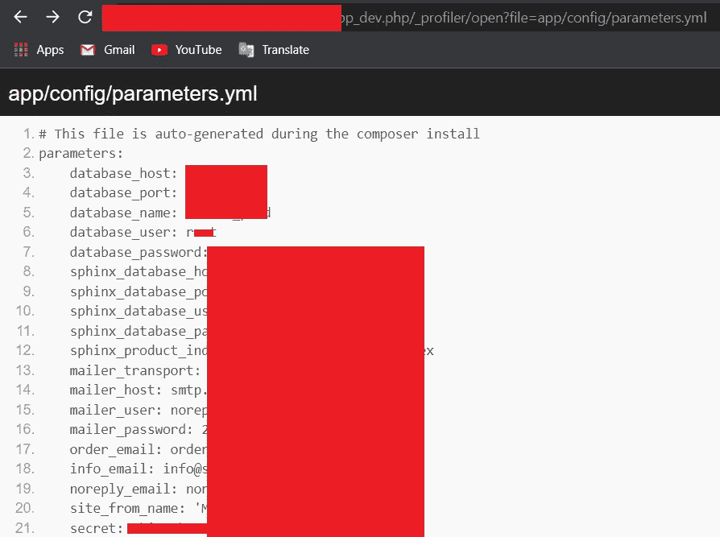

# 我是如何发现 Symfony Web Framework web 应用程序的多个漏洞的

> 原文：<https://infosecwriteups.com/how-i-was-able-to-find-multiple-vulnerabilities-of-a-symfony-web-framework-web-application-2b82cd5de144?source=collection_archive---------2----------------------->

## 仅通过侦察就在 5 分钟内发现了高严重性漏洞。在使用 Symfony web framework 的 web 应用程序上发现多个漏洞，启用了 Symfony profiler/debug 模式。

***【bi-SMI llāhi r-raḥmāni r-raḥīmi(奉真主之名)***

你好！漂亮的人，

我是阿比德·艾哈迈德，网络安全专业的学生和职业黑客。今天我将解释我是如何在一个使用 Symfony web 框架的 Web 应用程序上发现多个漏洞的，该框架启用了 Symfony profiler/debug 模式。

# 了解 Symfony Profiler 和调试组件

Symfony web 框架有一个特性叫做 Symfony Profiler。此探查器组件只能在启用调试模式时使用。这是一个转折。Symfony web 框架要安全得多，但是启用调试模式会使这个框架非常容易受到攻击。symfony web profiler 组件暴露了攻击者可能滥用的 web 应用程序的敏感信息。

## 那为什么开发者要启用调试组件呢？

调试组件提供了简化 PHP 代码调试的工具。它提供了几个工具来帮助调试 PHP 代码。这个组件在开发阶段对开发者帮助很大。默认情况下，Symfony 提供了三种环境，称为开发、测试和生产环境。Symfony 强烈建议在生产环境中禁用 profiler 工具。但有时，开发人员会忘记这一点，从而使 web 应用程序变得易受攻击。

# 我如何发现漏洞(一步一步)

【https://redacted.com】让我们假设目标站点是**。我在目标(*[*https://sub.redacted.com*](https://sub.redacted.com)*)的一个子域上发现了这个漏洞。**

*在首先，我浏览了子域，查看了使用了哪些 web 技术。使用 [Wappalyzer](https://chrome.google.com/webstore/detail/wappalyzer-technology-pro/gppongmhjkpfnbhagpmjfkannfbllamg) 插件，我发现[https://sub.redacted.com](https://sub.redacted.com)使用了“Symfony”网络框架。*

**

*‎*

*然后，我进入资产发现阶段。最初，我试图用 FFUF 模糊目录。我发现了一个有趣的文件“app_dev.php”。它表示 Symfony 可能启用了调试模式。*

****

*‎*

*让我们在浏览器上检查一下。每当我浏览*“https://sub . redated . com/app _ dev . PHP”时，*发现调试模式已启用，并获得一个 ***profiler 令牌*** 来访问 **Symfony Profiler** 。另外，我得到了 **phpinfo** 文件的位置。*

********

*‎*

*直到现在，我的发现的严重性是中等。我知道 Symfony 调试工具栏允许读取可能暴露敏感信息的文件。所以，我试着多挖一些来增加严重性。然后我研究了一些文章，阅读了 Symfony web 框架文档。我找到了 Symfony 版本数据库默认的配置文件位置，是***app/config/parameters . yml****

**

***Symfony 3.4 版配置文档(**[**)https://Symfony . com/doc/3.4/best _ practices/configuration . html**](https://symfony.com/doc/3.4/best_practices/configuration.html)**)***

*‎*

**

*所以我试着打开配置文件，嘣。我已经找到了数据库和邮件服务器凭证。*

## ***影响***

*暴露凭据的影响具有广泛的后果，因为这些凭据可用于数据泄露、系统破坏、品牌声誉损失以及财务损失。*

## *减轻*

*通过将 APP_DEBUG 设置为 false 来禁用调试模式。生产环境中应禁用调试模式。*

# *ffuf.sh*

**

# ***温馨提示:***

> *如果你找到了一个使用 Symfony web 框架的 web 应用程序，不要忘记检查调试模式和 profiler。这可能是开发人员忘记禁用它。*

*   *https://example.com/_profiler*
*   *https://example.com/app_dev.php/_profiler*
*   *https://example.com/app_dev.php*

# *阅读更多信息以了解:*

* [## 了解前端控制器、内核和环境如何协同工作(Symfony 4.4 文档)

### 配置环境部分解释了 Symfony 如何使用环境来运行应用程序的基础…

symfony.com](https://symfony.com/doc/4.4/configuration/front_controllers_and_kernel.html#debug-mode)* 

# *🔈 🔈Infosec Writeups 正在组织其首次虚拟会议和网络活动。如果你对信息安全感兴趣，这是最酷的地方，有 16 个令人难以置信的演讲者和 10 多个小时充满力量的讨论会议。查看更多详情并在此注册。*

* [## IWCon2022 - Infosec 书面报告虚拟会议

### 与世界上最优秀的信息安全专家建立联系。了解网络安全专家如何取得成功。将新技能添加到您的…

iwcon.live](https://iwcon.live/)*