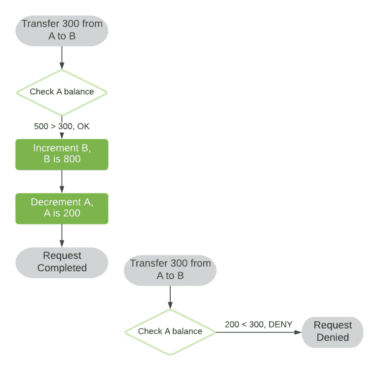
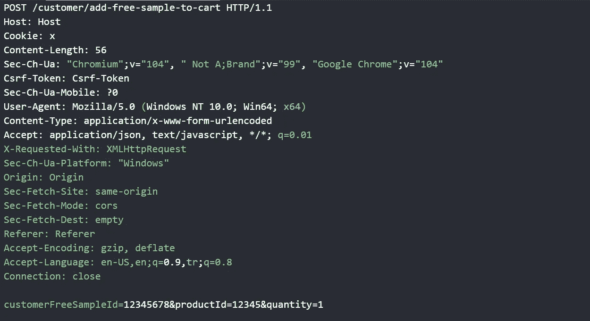

# 我是如何得到 29 个免费产品的。昆虫赏金

> 原文：<https://infosecwriteups.com/how-i-was-able-to-get-29-free-products-bug-bounty-845667ab4ad4?source=collection_archive---------2----------------------->

**首先，什么是竞态条件？**

当两个或多个线程可以访问共享数据，并且它们试图同时更改它时，就会发生争用情况。如果你很难理解理论上的东西，让我给你举个例子。假设一个用户有银行账户 A 和 B，A 和 B 都有 500 美元。

图片由 https://www.baeldung.com 的[提供](https://www.baeldung.com/wp-content/uploads/sites/4/2020/07/Race-Accounts-768x752.png)

如你所见，我们从 A 到 B 两次转移了 300 美元。而且没有问题。然而，如果这两个传输同时执行，我们可能会看到一些问题。

www.baeldung.com 图片由[提供](http://www.baeldung.com)

我们遇到了一个竞争条件，从 A 处转了 600 美元到 B 处，甚至银行账户 A 在开始时也有 300 美元。

**我的发现**

所以目标公司是一个饮料的市场，有包月。如果你订阅了这项服务，你每月可以得到一份免费样品。该产品显示在您的个人资料中，您可以将其添加到您的购物篮中。我点击添加购物篮并捕获请求，看看我能做什么。

请求的示例。

所以我一看到 id 就试着用 [*IDOR*](https://portswigger.net/web-security/access-control/idor) 但是没有 IDOR。所以我想改变数量，我的意思是这是一个免费的样品，所以数量可以是 10-15，价格仍然是 0。我把数量改成了 3 个并发出了请求，但是他们也认为是这个。所以我说为什么不试试竞争条件，向[涡轮入侵者](https://portswigger.net/bappstore/9abaa233088242e8be252cd4ff534988#:~:text=Turbo%20Intruder%20is%20a%20Burp,require%20extreme%20speed%20or%20complexity.)发送请求，在我看了所有 200 个并看了看回复后，我明白了存在竞争条件。

我喜欢竞争条件错误，因为它们很容易被利用，甚至非常有影响力。

如果你有问题要问我，可以在 [Twitter](https://twitter.com/CalloftheD) 上联系我。

中途 AI | Discord bot[https://www.midjourney.com/home/](https://www.midjourney.com/home/?callbackUrl=https%3A%2F%2Fwww.midjourney.com%2Faccount%2F%3FcallbackUrl%3D%252Fpub%252Ffeed%252F%253FcallbackUrl%253D%25252Fapp%25252F)创建的图像

来自 Infosec 的报道:Infosec 上每天都会出现很多难以跟上的内容。 [***加入我们的每周简讯***](https://weekly.infosecwriteups.com/) *以 5 篇文章、4 个线程、3 个视频、2 个 Github Repos 和工具以及 1 个工作提醒的形式免费获取所有最新的 Infosec 趋势！*