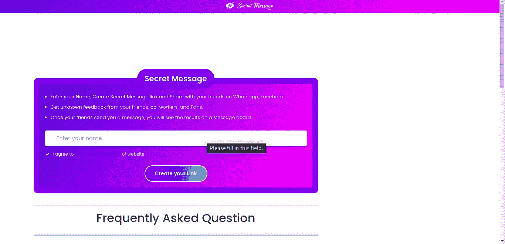
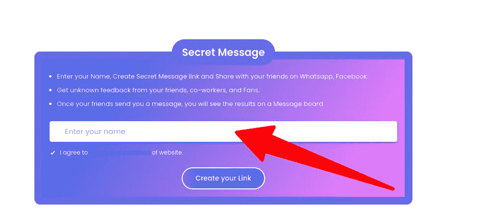
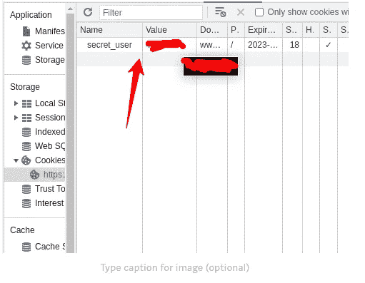
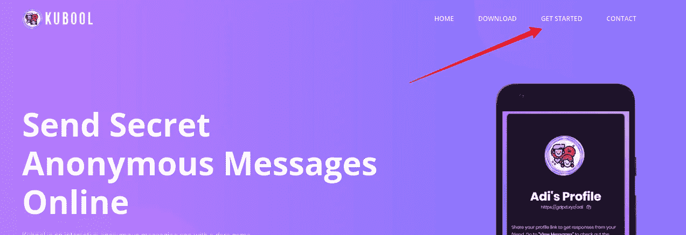
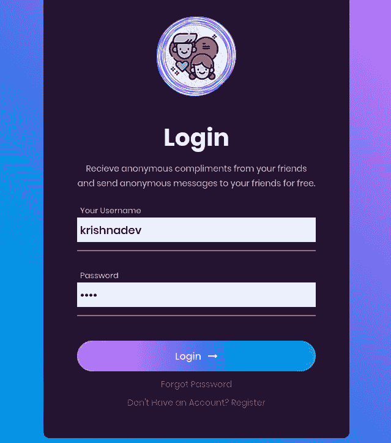
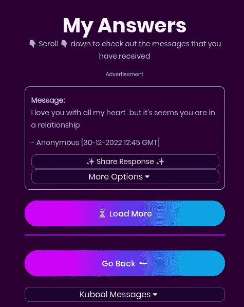
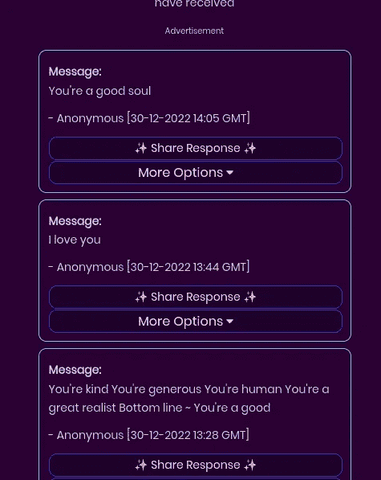

# 我是如何黑掉匿名短信服务的？

> 原文：<https://infosecwriteups.com/how-i-was-able-to-hack-anonymous-texting-services-a6ceab46aa40?source=collection_archive---------4----------------------->

嘿黑客们！！我的名字是 Krishnadev P Melevila，我是一名笔测试员、安全分析师和 bug 猎人。要了解我更多，在谷歌上搜索我的名字。

今天，我在这里公开披露！

我们都知道秘密匿名消息服务，它在 COVID 锁定期间变得非常流行。

有许多服务，如 Kubool，秘密信息，ngl.link 等。

这三个是我的主要目标，其中，Kubool 和 Secret Message 有 web 应用程序，而 ngl 致力于移动应用程序。

因此，作为一名 web 应用测试人员，我首先从 Secret message 开始。

> **我是如何破解秘密信息的？**

秘密消息

在秘密信息中，它是如何工作的…

1.  访问链接:【https://www.secretmessage.link/ 
2.  要求用户输入名称。

3.服务器为用户生成一个 cookie。

4.服务器也会创建一个链接

5.创建的链接可以与其他成员共享，用于接收消息/告白。

6.对接收者的进一步认证完全基于服务器先前创建的 cookie，使用该 cookie，任何攻击者都可以接管用户帐户并读取私人消息。

> **不，漏洞在哪里？？？？？？**

该漏洞存在于 cookie 中。

就像 4231，4232，4233，4234 等等。

所以如果我的 cookie 是 4231，你的可能是 4232…所以我们可以很容易地枚举每个用户的 cookie。

如果我得到了呢？—也就是我上面解释的— Cookie 是这个平台上唯一的认证因素，所以偷 cookie ===偷用户账号。

基本上是一个帐户接管漏洞。

> 现在，库布尔！

Kubool 也是一个类似的网络应用。但是他们要求更多的安全。但实际上，答案是否定的！

> **kubool 如何工作？**

Kubool 也以同样的方式处理秘密文本，但是这里有一个额外的认证(无用的)

步骤:

1.  参观 kubool.com
2.  点击“开始”，然后注册并登录

库布尔

3.现在用凭证登录。

4.现在，服务器生成了两个 cookie，PHPSESSIONID 和 XK。实际上，PHPSESSIONID cookies 用于验证目的，但是在生成 PHPSESSIONID 之后，服务器不会在任何后续请求中再次验证 cookie。这是一个主要的弱点。

除此之外，XK cookie 像前一个漏洞一样是一个序列号，很容易被列举出来。

因此，这里 PHPSESSIONID 没有任何作用，只需枚举 cookie，就可以接管帐户。

所以我可以阅读每个用户的信息，甚至可以改变密码…

校样:

还有更多……..

同样，NGL。链接也可能被黑，但由于它是 android 应用程序，我目前没有预装生态系统来测试它。但我有 60%的把握，它可能有类似的漏洞。

**特别提及:**

我需要感谢我的一个学长，Shahir。他不断地支持和引导我去发现这些漏洞，他的动力使我找到了这个漏洞。

我在 NIC 上的第一个漏洞:[https://medium . com/bugbountywriteup/exposure-million-of-critical-data-on-Kerala-civil-supplies-website-cc 3 a4 bed 5d 07](https://medium.com/bugbountywriteup/exposing-millions-of-critical-data-on-kerala-civil-supplies-website-cc3a4bed5d07)

我在 NIC 上的第二个漏洞:[https://medium . com/bugbountywriteup/API-authentic ation-bypass-on-national-informatics-centre-d 438 B3 BAE 085](https://medium.com/bugbountywriteup/api-authentication-bypass-on-national-informatics-centre-d438b3bae085)

我的其他错误报告:[https://medium.com/@krishnadevpmelevila](https://medium.com/@krishnadevpmelevila)

***别忘了在 medium 等社交媒体上关注我。也请为这篇文章鼓掌 50 次，这是我写更多的灵感！！***

我需要你的支持来写更多，请给我买杯咖啡吧:[https://www.buymeacoffee.com/krishnadevpm](https://www.buymeacoffee.com/krishnadevpm)

*我的 Instagram 手柄:*[*https://instagram.com/krishnadev_p_melevila*](https://instagram.com/krishnadev_p_melevila)

*我的推特手柄:【https://twitter.com/Krishnadev_P_M】*

**我的 LinkedIn 手柄:*[*https://www.linkedin.com/in/krishnadevpmelevila/*](https://www.linkedin.com/in/krishnadevpmelevila/)*