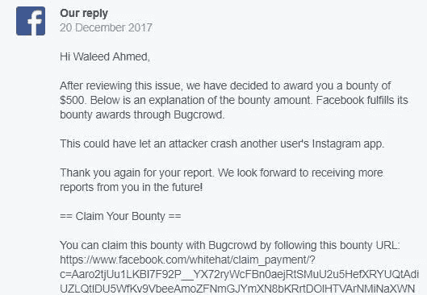
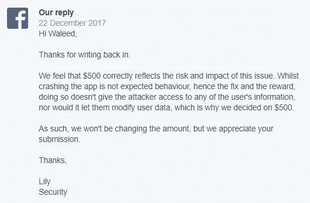

# 我是如何远程崩溃任何 android 用户的 Instagram 应用程序的

> 原文：<https://infosecwriteups.com/how-i-was-able-to-remotely-crash-any-android-users-instagram-app-and-was-paid-a-mere-500-for-it-d4420721290e?source=collection_archive---------0----------------------->

让我从自我介绍开始这篇文章，我是瓦利德·艾哈迈德，一个来自巴基斯坦的 16 岁男孩。因此，去年 12 月，我在 Instagram 的 android 应用程序中发现了一个漏洞，通过这个漏洞，我可以远程崩溃任何 Instagram android 用户的应用程序，只需发送一条简单的消息。这个漏洞甚至不需要受害者打开邮件。让我解释一下我是如何发现这个 bug 的。有一天，我在浏览 DM 文件夹中的一些旧资料。我发现在与一个人的聊天中，如果我试图在聊天中向上滚动，应用程序会立即崩溃。我发现一些信息导致了新版 android Instagram 应用程序崩溃。为了找到并查看这条消息，我下载了一个旧版本的 android instagram 应用程序。在这个版本上，我能够正常滚动并查看导致我的应用程序崩溃的消息。这条信息有 40 个表情符号，两个表情符号之间有一个空格。这是一个非常奇怪的应用程序行为。我试着从我的旧 instagram 应用程序向我控制的其他帐户发送这条消息，每次都是应用程序立即崩溃。我在多部安卓智能手机上试过，一直都很好用。此外，该漏洞还允许我做以下事情:
1:使攻击者和受害者之间以前的消息不可访问。当攻击者向受害者发送攻击消息时。攻击者和受害者之间的所有先前消息将变得对受害者不可访问，并且他将看不到这些消息。
2:通过向名人发送包含表情符号的消息请求，使名人或普通人的消息请求文件夹不可访问。当攻击者将此消息发送给没有跟踪他/她的任何用户时，该消息将进入受害者的 message requests 文件夹。当受害者试图打开他/她的信息请求文件夹时，信息请求文件夹会卡在加载图标上。
3:使用户的整个 DM 文件夹不可访问。当用户在攻击者发送消息后登录时，就会发生这种情况。这导致 instagram DM 文件夹永远无法加载，并且卡在加载图标上。

我亲自测试了所有这些东西，并在我的脸书错误报告中报告了它们。

# **时间线:**

11 月 28 日:初次报告

12 月 1 日:脸书的工作人员为我创建了一个 instagram 账户来演示这个 bug

12 月 6 日:确认 bug。

12 月 14 日:错误修复。

12 月 20 日:发放 500 美元的臭虫奖金。

12 月 20 日:我写了一篇后续文章，询问 bug 奖励是否正确反映了 bug 的影响。

12 月 22 日:脸书回复说，他们已经确定这是对这个 bug 的适当奖励

这是我与脸书的一名员工的对话，他为我创建了一个帐户来演示这个 bug。

想象一下，一些机器人向数百万 instagram 用户发送了数百万条这样的消息，扰乱了数百万用户对 instagram 应用的使用。对于 instagram 来说，这将是一个巨大的噩梦。