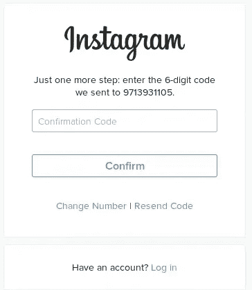
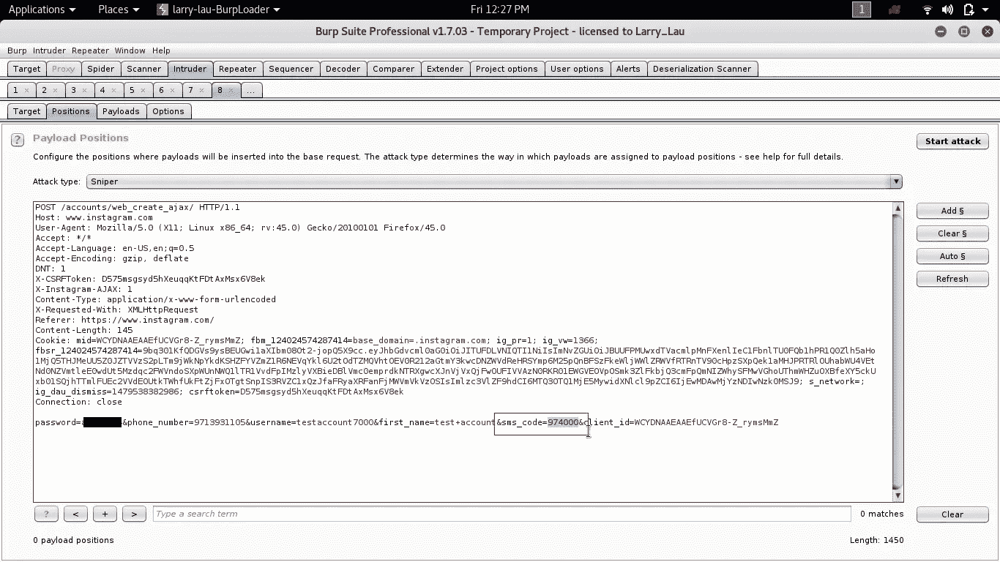
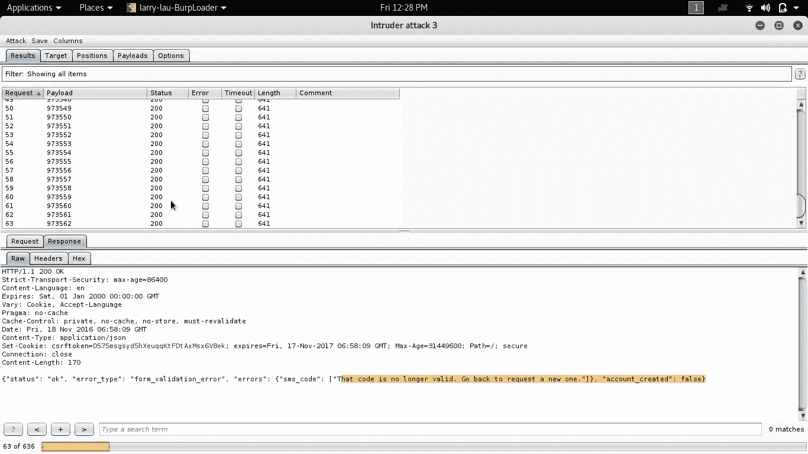
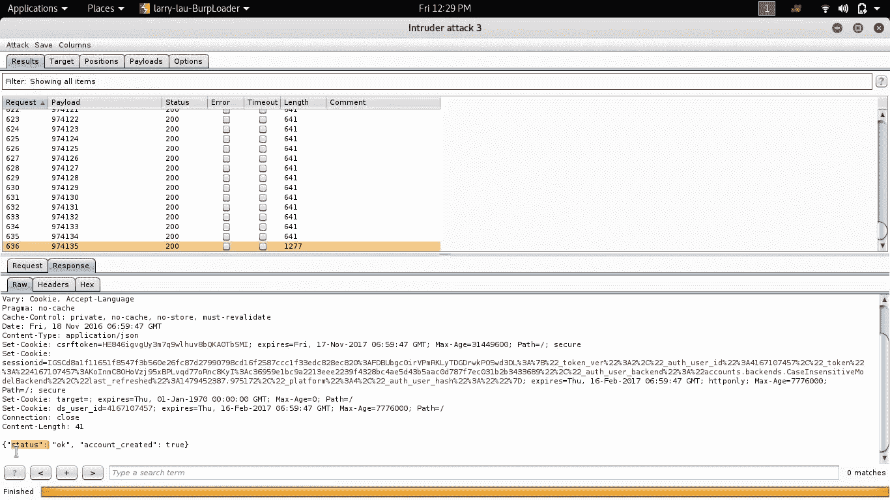
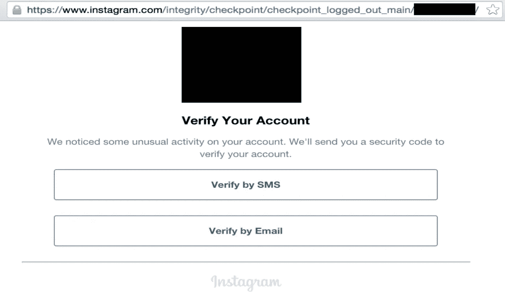
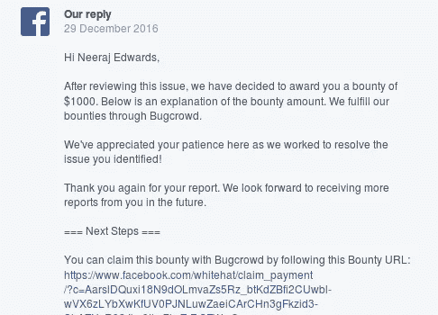

# 我是如何删除你的 Instagram 电话号码的

> 原文：<https://infosecwriteups.com/how-i-was-able-to-remove-your-instagram-phone-number-d346515e79c3?source=collection_archive---------0----------------------->

电话号码是网络和安全中最重要的带外功能，现在从电话号码开始一天我们就注册、登录一个帐户。

Instagram 具有通过手机号码登录和注册功能，在通过手机号码注册 instagram 后，我们必须通过发送到该手机号码的 OTP(一次性密码)来验证我们是真实的人。


但在 Instagram 中搜索漏洞时，我发现验证 OTP 端点没有限制，这意味着我们可以暴力破解发送到手机号码的 6 位代码。



另一件事是，即使你的手机号码在 instagram 上注册，你也可以在注册页面上再次使用该手机号码。



虽然我得到的 OTP 的回答很残忍:

动态口令错误时的响应:

```
**{“status”: “ok”, “error_type”: “form_validation_error”, “errors”: {“sms_code”: [“That code is no longer valid. Go back to request a new one.”]}, “account_created”: false}**
```



OTP 正确时的响应。：

```
**{“status”: “ok”, “account_created”: true}**
```



正如你在上面的截图中看到的，我发出了 636 个请求，没有锁定。

最后，我成功地用暴力破解了 OTP，并用那个手机号码创建了一个账户。

当我从该测试帐户注销，并登录到我的真实 Instagram 帐户时(最初是用我创建测试帐户的手机号码注册的)。

登录后得到了这个页面



从上面的照片中，我们可以确认手机号码已经从我的 Instagram 帐户中删除。

这是概念验证视频:

# **时间线:**

2016 年 11 月 8 日:提交报告
2016 年 11 月 16 日:脸书回应无法重现该问题
2016 年 11 月 18 日:我提供的 POC 视频。
2016 年 11 月 19 日:再次未被接受
2016 年 11 月 19 日:再次提供 POC 视频并注明时间和日期
2016 年 11 月 19 日:问题已审理
2016 年 12 月 27 日:问题已修补
2016 年 12 月 29 日:奖金 1000 美元。



感谢尼拉杰·爱德华兹