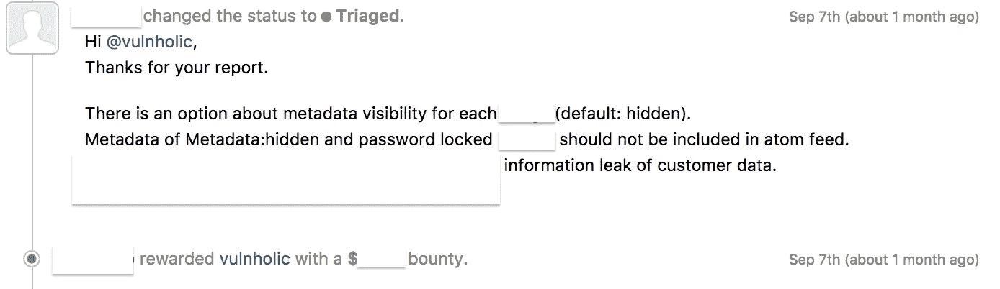
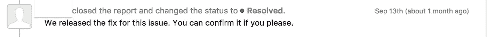
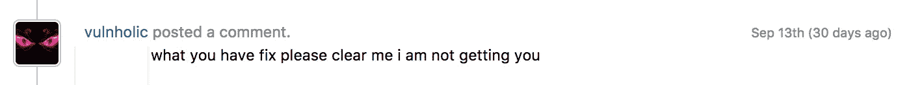
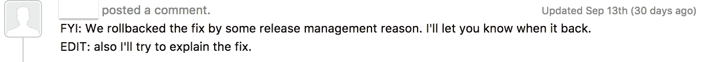
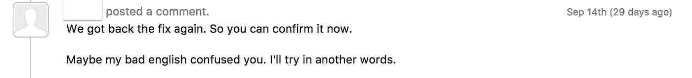
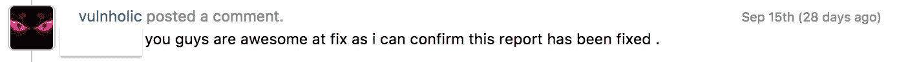
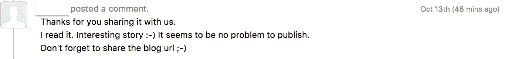

# 我如何能够通过 Atom feed 的一个文件共享链接看到某人的所有私人文件&永不放弃#togetherwehitharder HackerOne

> 原文：<https://infosecwriteups.com/how-i-was-able-to-see-someones-all-private-files-with-a-single-file-share-link-through-atom-feed-7cde46d7e84d?source=collection_archive---------1----------------------->

我已经等了好几天 HackerOne 的邀请了，但在漫长的等待之后，我决定寻找一些外部私人程序，并离开了 T2 HackerOne

所以我只是浏览@google.com，用一些傻瓜找到了一些程序，但我不想测试它们，然后我去 twitter 搜索#bugbounty #bounty，从@twitter 得到了一些程序，一个人发帖说他得到了一些💵$$$用于报告安全问题。

所以为了不浪费时间，我去搜索了那个网站，但是在我开始之前，我浏览了整个网站，看看它的功能(它是如何工作的),发现网站有很多客户，他的大部分客户都是[黑客，但是有两个程序对我来说很陌生。所以我决定去那里的网站寻找漏洞，并通过邮件联系他们。](https://medium.com/u/6f816e37be2c?source=post_page-----7cde46d7e84d--------------------------------)

第二天，我收到了他们的回复

“感谢您报告这个问题，您能通过 hackerone 提交漏洞吗，因为我们在那里运行私人程序。

我立刻回答道

“是的，我在 [HackerOne](https://medium.com/u/6f816e37be2c?source=post_page-----7cde46d7e84d--------------------------------) 上有个人资料，以下是我的邀请详情”

收到邀请后，我看到感谢页面上有 [HackerOne](https://medium.com/u/6f816e37be2c?source=post_page-----7cde46d7e84d--------------------------------) Top #100 研究人员，所以我认为没有更多的机会获得更多的漏洞。但是过了几个小时后，我没有再遇到更多的问题，于是我想放弃并继续前进，但是 HackerOne 提醒我要更加努力😉

所以我又开始打猎，这次我只是作为用户使用网站，几个小时后我回来打猎。

我得到了 1 **IDOR** (我喜欢:- woot woot，幸福😅超负荷，变得疯狂😍

第二天这份报告被标为“*”然后我就像是没救了😫*

*然后我说让我们看看概念验证图像(请求/响应)😉*

*作为回应，我得到了一些有趣的信息，包括图片的 URL 和扩展。原子🤔*

*我迅速打开这些网址，但所有的网页都没有找到。*

*然后我在谷歌上搜索“什么是 atom for files”

我得到了一个类似的[https://fileinfo.com/extension/atom](https://fileinfo.com/extension/atom)

在那上面我找到了对我有一点帮助的答案“基于 XML 的 atom”
再次我在谷歌上搜索基于 XML 的 atom 我得到了[https://validator.w3.org/feed/docs/atom.html](https://validator.w3.org/feed/docs/atom.html)*

*读完整篇文章后，我开始了解**“什么是 atom feed”***

# *什么是 Atom？*

*Atom 是基于 XML 的 Web 内容和元数据联合格式的名称，是一种应用程序级协议，用于发布和编辑属于定期更新的网站的 Web 资源。*

*所有的 Atom 提要都必须是格式良好的 XML 文档，并用媒体类型来标识。*

*然后我突然想到让我打开文件。原子延伸*

*例子:-[https://example.com/folder/image_token.atom](https://example.com/folder/image_token.atom)*

*打开网址后，我就像

“哇，呜哇”😂 😘*

*披露的信息:-内容、媒体；内容，媒体:缩略图*

*你可以得到很多信息，如文件缩略图，所以没有密码文件可以访问和元数据的文件不能被看到，如果图像是密码保护，这是默认情况下隐藏，但通过添加。atom 扩展在图片 url 中你可以看到所有有趣的信息*

*我立即向程序

报告了这个漏洞，第二天我得到了回报(悬赏)*

**

***时间线**

**2017 年 9 月 6 日**报道*

***2017 年 9 月 7 日**得到团队回应*

***2017 年 9 月 7 日**开审*

***2017 年 9 月 7 日**悬赏赏金(酷赏金)*

***九月十三日**已解决*

**

*“我们发布了针对此问题的修复程序。如果你愿意，你可以确认一下。*

*9 月 13 日但是他们还没有决定，所以我回复了*

**

*你所修理的请清除我我没得到你*

***九月十三日**团队回复道*

**

*仅供参考:由于一些发布管理原因，我们回滚了修复。当它回来的时候我会让你知道。编辑:我也会试着解释这个修正。*

*9 月 14 日团队再次回复并给了我一些关于补丁的“更多信息”。*

**

*我们又找回了定位。所以你现在可以确认了。也许我的糟糕英语让你困惑了。我试着换句话说*

**

*来自 [HackerOne](https://medium.com/u/6f816e37be2c?source=post_page-----7cde46d7e84d--------------------------------) 的 [Frans Rosén](https://medium.com/u/1979b6518264?source=post_page-----7cde46d7e84d--------------------------------) 的话如何赢得安全团队的信任并作为一名黑客获得影响力*

***九月十四日**固定*

***10 月 10 日**博客帖子请求*

***10 月 12 日**向团队提供博客内容*

***10 月 13 日**博客帖子获得许可*

**

*我要感谢 [HackerOne](https://medium.com/u/6f816e37be2c?source=post_page-----7cde46d7e84d--------------------------------) 令人敬畏的黑客平台(白帽)*

*我还要感谢[阿尔巴兹·侯赛因](https://medium.com/u/c66be62f5b6b?source=post_page-----7cde46d7e84d--------------------------------) & [Ak1T4](https://medium.com/u/c5b622272cd5?source=post_page-----7cde46d7e84d--------------------------------)*

*对于[https://medium . com/@ arbazhussain/10-rules-of-bug-bounty-65082473 ab 8 c](https://medium.com/@arbazhussain/10-rules-of-bug-bounty-65082473ab8c)这提醒我不要轻易放弃，多日给节目时间。*