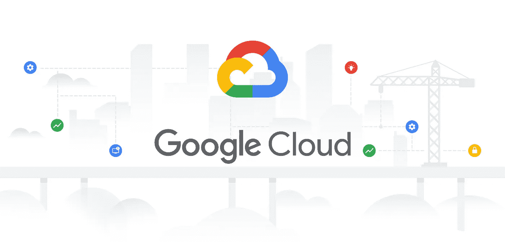
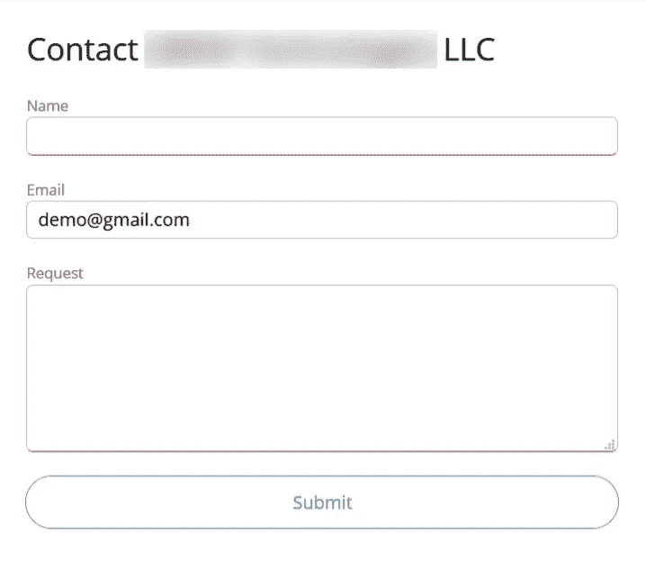
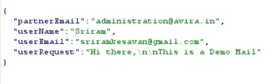
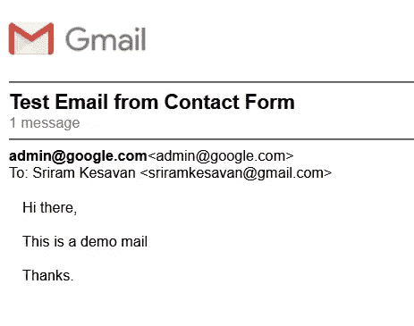
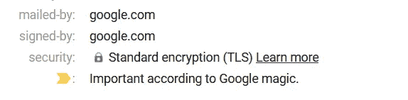

# 我如何能够像其他人一样发送真实的电子邮件——谷歌 VRP[已解决]

> 原文：<https://infosecwriteups.com/how-i-was-able-to-send-authentic-emails-as-others-google-vrp-resolved-2af94295f326?source=collection_archive---------1----------------------->

**报告 ID: 161777102 —谷歌 VRP**

三个月后，我回到谷歌 VRP，在名人堂上排名。谷歌云引起了我的注意，我决定在那里捕捉虫子。

*注意:这不是我通常写的复杂文章，但这是我在谷歌云产品上发现的一个简单明了的逻辑漏洞，我想在这里分享一下。*

我浏览了**谷歌云**，有一款产品引起了我的注意。是 [**Appsheet**](https://en.wikipedia.org/wiki/AppSheet) 成为我在整个谷歌云产品列表中最喜欢的目标。因为我花了几天时间来理解这个应用程序，这让我更容易找到更多的错误。

在理解了这个应用程序 20 分钟后，我在**https://www.appsheet.com/partners**上发现了一个有趣的页面

它有一个注册为合作伙伴的表单，带有一些输入字段，如 ***名称*** ， ***电子邮件*** 和 ***请求*** 向各自的组织发送邮件。

起初，这种联系方式并没有引起我的注意，相反，我在应用程序上发现了几个 IDOR，并报告给了谷歌 VRP 公司，得到了解决。你可以在这里找到[的报道](https://medium.com/bugbountywriteup/the-short-tale-of-two-bugs-on-google-cloud-product-google-vrp-resolved-47c913dca8fc)

然后，当我在请求中发现一些可疑之处时，联系表完全引起了我的注意。

我在请求中找到了四个参数，它们是

*"* ***合作伙伴邮件*** *":"目的地合作伙伴邮件"*

****用户名*** *【我的用户名】**

*****用户邮箱*** *【我的邮箱】***

******用户请求*** *【我的消息】****

**我在 ***userRequest*** 参数上尝试了服务器端注入，但是没有成功。但是它容易受到 HTML 注入的攻击。当我以**的身份发送 *userRequest* 时，图像在邮件中得到反映。**

**但谷歌不会接受 HTML 注入，直到它不能升级到 XSS。我无法启动 XSS 或测试 SSRF，因为它的后端有一个云状耀斑，几乎挡住了我所有的 XSS 有效载荷。**

**然后我尝试将合作伙伴的电子邮件替换为**“admin @ Google . com”**并转发请求。我不相信我会收到电子邮件，但令我惊讶的是，我收到了一封电子邮件。就像**“admin @ Google . com”**发了一封邮件把我的信息包含在表格里。**

****

**等等，什么？！**

****

**哇哦！！**

**没有阻止机制，通过了超级酷的谷歌垃圾邮件过滤器没有任何问题，最重要的是谷歌魔术自动标记为重要的电子邮件。我甚至可以像任何 gmail 用户一样发送电子邮件。**

*****userEmail*** 参数也可以替换为任何电子邮件，这意味着我可以以**唐纳德·川普**的身份向**金正恩**发送电子邮件，而不会暴露我的身份。**

**并且很快意识到它很容易受到**开放邮件中继**攻击，这种攻击最近在应用程序中确实发生了。**

****

**谷歌魔术添加了我的欺骗邮件的重要性**

**我可以以任何人的身份发送电子邮件，甚至解雇组织中的员工，甚至发送电子邮件进行网络钓鱼或其他可能的攻击。另一方面，它可以作为一个邮箱推出大量的电子邮件活动，没有任何问题，甚至没有花费一分钱。而且，不用担心邮件最终会变成垃圾邮件，因为它们来自**谷歌系统**，甚至由来自谷歌云**应用程序表**的**google.com**签名，而且由于消息参数容易受到 HTML 注入的攻击，所以通过添加图像和 href 标签，发送更具真实性的电子邮件更有可能。**

**攻击者只需在表单中填写所有细节，然后篡改请求，就可以像任何邮件用户一样发送这种真实的欺骗邮件。**

**我很快向 Google 报告了这个问题，问题在 48 小时内被接受并得到解决:)**

**一旦问题得到解决，我在 Google Cloud 上发现的 IDOR 漏洞的相关文章将会发布！敬请期待！！**

**好吧，如果你喜欢这个，写下来鼓掌👏，那我们来连线:**

****推特:**sriramoffcl**

****insta gram:**[Sri ram _ off cl](https://www.instagram.com/sriram_offcl/)**

****LinkedIn:**[sriramkesavan](https://www.linkedin.com/in/sriramkesavan/)**

**【https://paypal.me/sri123】捐:**

****和平** ✌️ **！！！****